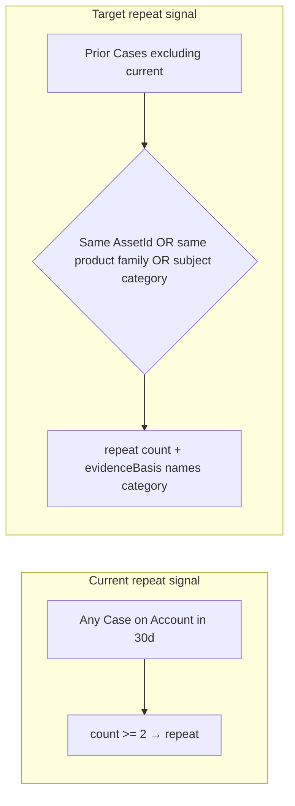

# Plan + fix — Triage demo signal gaps (customer history, KB, UI narrative)

You are fixing **operator-trust gaps** discovered during demo Case triage on org **AgentForce**. The stepped console shows correct execution traces in some runs but misleading or empty surfaces in others. Work in **two phases** unless `${input}` says otherwise:

1. **Plan** — gap analysis + implementation spec (no code unless user says `implement` or `both`)
2. **Fix** — thin, test-backed slices from the plan

## User-provided context

```text
${input}
```

Defaults when empty:

- Org: **AgentForce**
- Proof Case: **00001108** (Aptivance tech — display transfer; clean history)
- Contrast Case account: **University of Arizona** (~30 Web Cases inflate repeat counts for battery demo)
- Stepped console: `https://react-chat-window-production.up.railway.app/orchestration/stepped`
- Demo create: `https://react-chat-window-production.up.railway.app/demo/case-create`

---

## Problem statement (validated 2026-06-26)

### Gap 1 — Knowledge Base always skips on demo / SF-async triggers

**Symptom:** Node 3 trace shows `Status: skipped`, `Eligible: No`, reason **"Missing tenant ID for RAG context"**.

**Root cause:** `CaseTriageOrchestratorService.trigger()` and `triggerStepped()` invoke the graph with `tenantId: principal?.tenantId`. Demo create (`demo-case-create.service.ts`) and Salesforce async Case trigger pass **no principal**, so `state.tenantId` is undefined. `retrieveKnowledge()` fails closed when neither `principalForRag.tenantId` nor `state.tenantId` is set.

**Impact:** No KB citations, no approved guidance for Parts/Scheduling downstream on the primary demo path.

### Gap 2 — Repeat incident is account-level volume, not same asset / same problem

**Symptom:** University of Arizona battery demo shows inflated `repeatFailure` / high priority after many unrelated Web Cases.

**Root cause:** `SalesforceCustomerGateway.readServiceHistory()` counts **any** Case on the Account in `REPEAT_WINDOW_DAYS` (30). It does **not** filter by `AssetId`, product code, subject similarity, or spare-part codes. `repeat: true` when `count >= 2`. The triage LLM only receives aggregate `repeatCount` / `repeatFailure` — not per-case narratives.

**Impact:** Routine "replace battery today" demos look like chronic repeat failures.

### Gap 3 — Stepped Triage card under-reports customer context

**Symptom:** Execution trace shows `Installed assets 5`, `Prior cases 1`, warranty covered — but the Triage accordion fields omit **installed assets** and bury the **plain-English triage summary**.

**Root cause:** `buildTriage()` in `stepped-view-model.ts` folds tier/SLA/warranty/repeat/risk but not `installedAssets.totalAssets` or `primaryModel`. Card `output` is only `"${priority} priority"`.

**Impact:** Operators cannot understand the case without expanding execution trace.

### Gap 4 — Demo data hygiene (ops, not code)

**Symptom:** Cleaning Cases by one Salesforce username left **29** University of Arizona Cases from `chaudhary.keshav4u@gmail.com`.

**Impact:** Same-day battery fix scenario still sees ~30 prior Cases on account.

Use `.github/prompts/clean-demo-cases-fresh-start.prompt.md` for scoped delete; optionally document account-scoped cleanup in proof docs.

---

## Required reading (in order)

| #   | File                                                                 | Why                                                |
| --- | -------------------------------------------------------------------- | -------------------------------------------------- |
| 1   | `docs/orchestrator/triage-customer-history-merge-plan.md`            | Merged Triage = case + customer; channel contracts |
| 2   | `docs/orchestrator/node-2-customer-history-agent.md`                 | Evidence-first repeat / asset semantics            |
| 3   | `apps/ai-api/src/salesforce/salesforce-customer.gateway.ts`          | `readServiceHistory`, `readInstalledAssets`        |
| 4   | `apps/ai-api/src/agents/customer-history.service.ts`                 | `buildRepeatFinding`, `safeSignalPayload`          |
| 5   | `apps/ai-api/src/orchestrator/customer-context-to-triage-signals.ts` | What triage LLM actually sees                      |
| 6   | `apps/ai-api/src/agents/support-triage.service.ts`                   | Summary + priority prompt                          |
| 7   | `apps/ai-api/src/orchestrator/case-triage-orchestrator.service.ts`   | `trigger`, `triggerStepped`, `retrieveKnowledge`   |
| 8   | `apps/ai-api/src/demo/demo-case-create.service.ts`                   | Demo stepped bootstrap (no principal today)        |
| 9   | `apps/react-chat-window/lib/stepped-view-model.ts`                   | `buildTriage` operator fields                      |
| 10  | `docs/orchestrator/stepped-console-phase-plan.md`                    | Stepped UX contract                                |

Skills: `langgraph-case-triage-slice`, `langgraph-stepped-console`, `langchain-rag`

---

## Phase 1 — Plan (analysis deliverable)

Produce `docs/orchestrator/triage-demo-signal-gaps-plan.md` (or update an existing ADR/backlog section) with:

### 1.1 Current vs target data flow



### 1.2 Repeat-incident design options (pick one, justify)

| Option                       | Behavior                                                                  | Pros                  | Cons                       |
| ---------------------------- | ------------------------------------------------------------------------- | --------------------- | -------------------------- |
| **A — Asset-scoped**         | Count prior Cases with same `AssetId` in window                           | Matches "same laptop" | Misses account-level churn |
| **B — Product-scoped**       | Match `Asset.Product2.ProductCode` or description product code            | Good for fleet demos  | Needs asset link on Case   |
| **C — Subject category**     | Lightweight keyword buckets (battery, display, thermal)                   | Cheap                 | Heuristic                  |
| **D — Hybrid (recommended)** | Asset-scoped if Case has `AssetId`; else account-scoped with lower weight | Demo-realistic        | Slightly more code         |

Document: still **no full Case JSON to LLM** — only counts + category label in `evidenceBasis`.

### 1.3 tenantId remediation options (pick one, justify)

| Option                        | Where                                                                 | Notes                                                               |
| ----------------------------- | --------------------------------------------------------------------- | ------------------------------------------------------------------- |
| **A — Config default**        | `AppConfigService` → `orchestrator.defaultTenantId`                   | Used when principal lacks tenantId; must match RAG namespace tenant |
| **B — Demo create principal** | Pass synthetic `AuthPrincipal` with demo tenant into `triggerStepped` | Cleanest for demo path only                                         |
| **C — SF trigger mapping**    | Map org id / Named Credential to tenant in async trigger handler      | Production path                                                     |

**Security:** tenantId must not bypass RAG tenant isolation; use existing `resolveTrustedRagContext` patterns.

### 1.4 UI narrative spec

Define the **Triage card** must show (without opening execution trace):

- Plain-English `triage.summary` (primary, ≥2 lines visible)
- `suggestedNextStep`
- Installed assets: count + primary model
- Prior cases: count (window) + repeat yes/no with **human evidenceBasis** (e.g. "1 prior case on same asset in 30d")
- Tier / SLA / warranty / business risk (existing)

### 1.5 Test matrix

| Scenario         | Account            | Expected repeat                                     | Expected KB                 | Expected priority (battery) |
| ---------------- | ------------------ | --------------------------------------------------- | --------------------------- | --------------------------- |
| Clean battery    | UofA after cleanup | false, count 0–1                                    | eligible + chunks           | normal/medium               |
| Noisy battery    | UofA 30 Cases      | **today:** true — **after fix:** asset-scoped false | eligible                    | normal                      |
| Display transfer | Aptivance 00001108 | false, count 1                                      | eligible after tenantId fix | normal                      |
| No AssetId Case  | account-only       | account-scoped fallback                             | eligible                    | case-text driven            |

### 1.6 Implementation slices (ordered)

| Slice  | Scope                                                    | Files (indicative)                                                                  |
| ------ | -------------------------------------------------------- | ----------------------------------------------------------------------------------- |
| **S1** | Default `tenantId` on orchestrator trigger + demo create | `case-triage-orchestrator.service.ts`, `demo-case-create.service.ts`, config, tests |
| **S2** | Asset-scoped repeat incident                             | `salesforce-customer.gateway.ts`, `customer-history.service.ts`, gateway spec       |
| **S3** | Stepped Triage UI narrative                              | `stepped-view-model.ts`, `SteppedOrchestrationView` tests                           |
| **S4** | Proof doc + optional clean-demo runbook note             | `docs/testing/demo-case-create-proof.md`                                            |

---

## Phase 2 — Fix (implement only after plan approved or `${input}` contains `implement` / `both`)

### S1 — tenantId for KB (P0)

**Acceptance:**

- [ ] `POST /demo/cases` → stepped run → Node 3 `status` ≠ `skipped` for eligible Case
- [ ] Trace shows retrieval attempted with namespace `customer-self-service` (or configured default)
- [ ] Unit test: `retrieveKnowledge` with `tenantId` from config fallback when principal absent
- [ ] No tenantId logged in client responses

**Do not** put RAG credentials in react-chat-window; BFF stays read-proxy only.

### S2 — Smarter repeat signal (P1)

**Acceptance:**

- [ ] `readServiceHistory` accepts optional `currentCaseId` + `assetId` scope
- [ ] `repeatIncidentCount` excludes current Case from prior count
- [ ] When `assetId` present: count only Cases with same `AssetId` in window
- [ ] `evidenceBasis` states scope: `"2 cases on same asset in 30d"` vs `"5 cases on account in 30d"`
- [ ] `repeat: true` threshold documented (keep `>= 2` or asset-scoped `>= 2`)
- [ ] Gateway + customer-history unit tests cover asset-scoped vs account-scoped

### S3 — Stepped Triage operator narrative (P1)

**Acceptance:**

- [ ] Triage accordion shows summary text prominently (not only `"normal priority"`)
- [ ] Fields include Installed assets + Prior cases with tooltips from `evidenceBasis`
- [ ] `stepped-view-model.test.ts` updated
- [ ] No PII in displayed strings

### S4 — Demo hygiene (P2, ops)

- [ ] Document: battery demo requires UofA Case cleanup (all creators) or use Aptivance for clean path
- [ ] Optional: extend clean-demo prompt with account-scoped filter

---

## Verification commands

```bash
# Backend
npm run ai-api:test -- --testPathPattern="salesforce-customer|customer-history|case-triage.graph|demo-case-create"

# Frontend
cd apps/react-chat-window && npx vitest run lib/__tests__/stepped-view-model.test.ts

# Live (operator session via demo create)
# 1. /demo/case-create → Same-day battery fix → Create case & step through
# 2. Triage: repeat false on clean account; summary visible
# 3. Run Knowledge Base: status ≠ skipped; topK > 0 or degraded with reason ≠ missing tenant

# SF data check
sf data query --target-org AgentForce --query \
  "SELECT COUNT() FROM Case WHERE Account.Name = 'University of Arizona'" --json
sf data query --target-org AgentForce --query \
  "SELECT COUNT() FROM Asset WHERE AccountId IN (SELECT Id FROM Account WHERE Name = 'Aptivance tech')" --json
```

---

## Non-goals (unless user explicitly expands scope)

- Sending full Case history JSON to the LLM
- Renumbering orchestrator nodes
- Pinecone re-ingestion / corpus changes
- Guardrail approval UX in stepped console (stays out-of-band — footer text is correct)

---

## Final response format

Return:

1. **Plan summary** — chosen options for repeat logic + tenantId
2. **Files changed** (if implement phase)
3. **Before/after** on proof Case (repeat count, KB status, UI fields)
4. **Test commands run** + results
5. **Remaining risks** (e.g. UofA data still noisy until ops cleanup)

Do not commit unless user asks.
