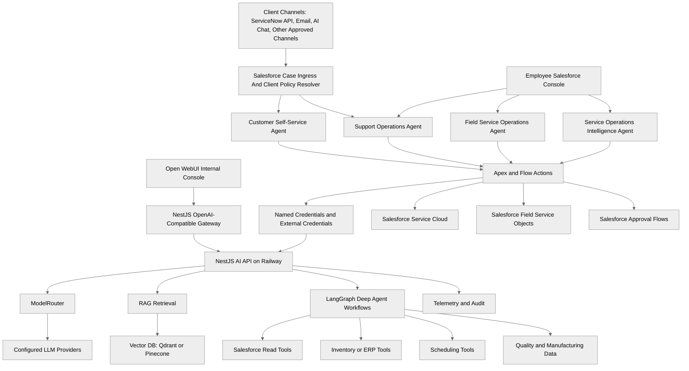

# Veda Pattern For AC Service Operations: Technical Implementation Plan

## Purpose

This document turns the Veda-inspired operating-agent pattern into an
implementation plan for an outsourced, multi-client manufacturer Service
Operations Operating System. The current business example is Aptivance
Technology Services operating support for Company X, a laptop manufacturer,
while the same architecture remains usable for AC and other device-service
domains.

The target is not to copy Veda's professional-services use cases. The target is
to copy the architecture pattern: domain-specific operational agents that reason
over enterprise data, recommend or execute governed actions, and improve the
operating system over time.

This plan is grounded in the current AgentForce monorepo:

- Salesforce Agentforce remains the runtime shell for customer and employee
  agents.
- Apex and Flow own deterministic Salesforce reads, writes, validations,
  approvals, and callouts.
- The NestJS AI API owns model routing, RAG, LangChain or LangGraph
  orchestration, backend reasoning services, telemetry, and safe provider
  integration.
- React chat remains the customer-safe web channel.
- Open WebUI remains the internal AI console through the OpenAI-compatible
  gateway.

Do not treat this document as a claim that every SOOS capability is already
built. The existing repo contains strong foundations, but the multi-client
ingress, client-policy resolution, field-service, inventory, warranty, approval,
and quality-intelligence layers are still future build work.

## Business Operating Model

Aptivance operates the support process in Salesforce CRM for manufacturer
clients. Company X is the example manufacturer; Client A, Client B, Client C,
and Client N represent supported client accounts with different purchase volume,
contract value, SLA, strategic importance, approval rules, escalation paths, and
parts policies.

Ticket creation must support at least three ingress flows:

- Client ServiceNow or another ticketing API to Salesforce Case.
- Email intake to Salesforce Case.
- AI chat or React chat to customer-safe case creation or escalation.

Every ingress path must normalize `clientId`, `clientTier`, `contractId`,
`slaPolicyId`, `entitlementId`, `sourceSystem`, `externalTicketId`,
`ingressChannel`, product context, and a client-policy snapshot before routing,
warranty, inventory, or field-service recommendations execute.

## End Goal

Build an AI-native service operations platform for outsourced manufacturer
support. The platform should support this complete workflow:

```text
Client ServiceNow / Email / AI Chat / Other Channel
  -> Normalize Case In Aptivance Salesforce CRM
  -> Resolve Client Policy, SLA, Contract, Entitlement
  -> Reason
  -> Diagnose
  -> Approve
  -> Plan Parts / Reserve / Transfer / Order / No-Parts-Needed
  -> Assign
  -> Dispatch
  -> Resolve
  -> Learn
  -> Improve Product Quality
```

The operating principle is:

```text
SOOS = Reason + Decide + Execute + Measure + Improve
```

The repo should evolve from isolated agent proofs into a governed operational
system for customers, support teams, technicians, inventory teams, warranty
teams, quality engineering, and service executives.

## Current Capability Status

| Capability                                | Current status             | Notes                                                                                                                                                         |
| ----------------------------------------- | -------------------------- | ------------------------------------------------------------------------------------------------------------------------------------------------------------- |
| Customer support intake                   | Partially built            | `Customer_Self_Service_Agent` verifies customers, reads account/case context, creates service requests, escalates, and carries temporary AI API proof topics. |
| Service intelligence                      | Partially built            | Support triage, case analysis, and Knowledge RAG exist, but the stable internal `Support_Operations_Agent` is not built yet.                                  |
| Knowledge RAG                             | Built as a foundation      | NestJS RAG, vector-store adapters, source citations, tenant filters, and Agentforce bridge exist for current knowledge-answering scope.                       |
| Customer chat channel                     | Partially built            | React chat app and NestJS chat APIs exist; the full SOOS workflow is not exposed through this channel yet.                                                    |
| ServiceNow and email ingress              | Not built                  | Needs source-specific adapters, auth, idempotency, external ticket mapping, and Case normalization.                                                           |
| Client policy and SLA resolver            | Not built                  | Needs client contract, priority tier, SLA, entitlement, approval, escalation, and parts-rule model.                                                           |
| Internal AI console                       | Built as a foundation      | Open WebUI calls the NestJS OpenAI-compatible gateway. It should not call model vendors directly.                                                             |
| Technician assignment                     | Not built                  | Needs Salesforce field-service data model, technician skill/capacity data, backend ranking service, and Agentforce actions.                                   |
| Work reallocation                         | Not built                  | Needs schedule, appointment, workload, SLA, notification, and deterministic reassignment actions.                                                             |
| Inventory intelligence                    | Not built                  | Needs part catalog, warehouse stock, reservations, transfer rules, and ERP or inventory integration.                                                          |
| Warranty intelligence                     | Not built                  | Needs entitlement/warranty data, policy rules, leakage detection, and approval paths.                                                                         |
| Approval intelligence                     | Not built                  | Needs deterministic Salesforce thresholds and optional AI recommendation service for ambiguous cases.                                                         |
| Product quality intelligence              | Not built                  | Needs failure codes, repair outcomes, manufacturing batches, supplier data, and quality investigation workflows.                                              |
| Executive service operations intelligence | Partially built by pattern | Services and revenue intelligence prove the pattern, but AC service KPIs and quality feedback loops are not built.                                            |

## Veda Pattern To AC Service Operations

| Veda-style pattern      | AC SOOS equivalent                                  | Implementation posture                                                        |
| ----------------------- | --------------------------------------------------- | ----------------------------------------------------------------------------- |
| Project Assistant Agent | Service Case Assistant / Service Intelligence Agent | Backend diagnosis and case-summary service behind `Support_Operations_Agent`. |
| Staffing Agent          | Technician Assignment Agent                         | Ranking service behind `Field_Service_Operations_Agent`.                      |
| Work Reallocation Agent | Technician Reassignment Agent                       | Governed rescheduling topic plus deterministic reassignment Flow or Apex.     |
| Resource Summary Agent  | Technician Summary Agent                            | Read-only technician workload, skill, and performance summary.                |
| Customer Success Agent  | Customer Experience Agent                           | Customer-safe support, escalation, and proactive service communication.       |
| Project Risk Agent      | Product Failure Risk Agent                          | Quality intelligence over failures, error codes, batches, and repeat visits.  |
| Financial Agent         | Warranty Cost Agent                                 | Warranty leakage, claim cost, approval thresholds, and cost trend analysis.   |
| Estimation Agent        | Repair Cost Estimation Agent                        | Cost estimate from parts, labor, warranty, visit type, and approval policy.   |

The pattern is reusable because both domains depend on operational entities,
workflow state, staffing capacity, financial exposure, customer commitments, and
management intelligence.

## Veda Research Translation Checklist

Use Veda as an architecture reference, not as a source of AC service workflows.
For each area, research the pattern and translate it into the AC SOOS domain.

| Research area                           | What to learn from Veda                                    | AC SOOS translation                                                                                                                                          |
| --------------------------------------- | ---------------------------------------------------------- | ------------------------------------------------------------------------------------------------------------------------------------------------------------ |
| Agent architecture                      | How runtime agents are scoped by domain responsibility.    | Four runtime agents: customer, support, field service, service operations intelligence.                                                                      |
| Intent routing                          | How user requests map to specialist capabilities.          | Route customer issues, diagnosis, dispatch, warranty, inventory, quality, and KPI questions to separate topics/actions.                                      |
| Agentforce integration                  | How Agentforce invokes deterministic enterprise actions.   | Use genAiFunctions, Apex, Flow, Named Credentials, and scoped auth to call NestJS.                                                                           |
| Topics                                  | How planner topics stay narrow and discoverable.           | Create focused topics such as diagnose case, route case, assign technician, plan parts, evaluate warranty.                                                   |
| Actions                                 | How actions expose safe inputs and structured outputs.     | Keep action schemas flat where helpful and separate planner-only fields from display fields.                                                                 |
| Prompt templates                        | How prompts bind business policy to a narrow task.         | Use prompts for diagnosis, ranking, summarization, and explanation, not approval authority.                                                                  |
| Planner design                          | How planner descriptions influence runtime decisions.      | Write precise topic/action descriptions with clear customer-safe and internal-only boundaries.                                                               |
| Workflow orchestration                  | How multi-step work is coordinated.                        | Put graph orchestration in NestJS LangGraph services, with Salesforce executing deterministic actions.                                                       |
| Permission model                        | How users and agents get least-privilege access.           | Scope customer, support, dispatcher, warranty, quality, and executive capabilities separately.                                                               |
| Human escalation                        | How agents stop when human judgment is required.           | Escalate safety, low confidence, unsupported answers, premium customer impact, and approval thresholds.                                                      |
| Multi-agent collaboration               | How capabilities hand off context without one giant agent. | Use four runtime agents and backend services that exchange safe IDs, summaries, and next-action keys.                                                        |
| Knowledge retrieval                     | How retrieval grounds answers.                             | Index manuals, repair guides, SOPs, service bulletins, warranty policies, and redacted historical patterns.                                                  |
| Context building                        | How enterprise records become model-ready context.         | Build context from Customer, Asset, Case, Work Order, Warranty, Technician, Inventory, and Quality records.                                                  |
| Salesforce object usage                 | How object ownership shapes agent actions.                 | Map Case, Asset, Work Order, Service Appointment, Approval Request, Knowledge, and quality records before building.                                          |
| Event-driven triggers                   | How operational events start agent workflows.              | Trigger analysis on new case, repeat visit, technician unavailable, stockout, high-cost claim, or failure cluster.                                           |
| Approval framework                      | How financial and operational decisions are governed.      | Encode thresholds in Salesforce: under INR 3,000 auto when policy-clear, INR 3,000 to INR 10,000 manager, above INR 10,000 regional.                         |
| Operational KPIs                        | How agents tie work to business outcomes.                  | Track first-time fix, MTTR, SLA, repeat visit, warranty cost, claim leakage, utilization, stockout, CSAT, quality cycle time.                                |
| Audit and governance                    | How recommendations and actions remain reviewable.         | Store safe request IDs, source IDs, tool names, approver, threshold, and outcome, not raw prompts.                                                           |
| Agent memory strategy                   | How durable context is retained safely.                    | Use Salesforce and governed operational stores for memory; avoid unrestricted conversation memory.                                                           |
| Autonomous vs human approval boundaries | How automation is limited by risk.                         | Allow low-risk customer support and source-cited answers; require approval for cost, assignment, warranty exception, quality, and customer-impact decisions. |

Research output should be architecture patterns, implementation guardrails, test
cases, and governance decisions. It should not be copied PSA behavior.

## Target Runtime Architecture



## Top-Level Runtime Agents

The system should use a small set of runtime agents. Specialist capabilities
should usually be topics, actions, or backend services, not separate top-level
Agentforce planner bundles.

| Runtime agent                           | Build status                              | Scope                                                                                                    | Primary users                                   |
| --------------------------------------- | ----------------------------------------- | -------------------------------------------------------------------------------------------------------- | ----------------------------------------------- |
| `Customer_Self_Service_Agent`           | Built and active, with partial SOOS scope | Customer verification, issue intake, case creation, escalation, customer-safe knowledge, status updates. | Customers through Agentforce and React chat.    |
| `Support_Operations_Agent`              | Recommended future build                  | Internal triage, diagnosis, case routing, warranty review, approval initiation, repair recommendation.   | Support supervisors and service desk teams.     |
| `Field_Service_Operations_Agent`        | Recommended future build                  | Parts-aware work-order planning, technician assignment, reallocation, dispatch workflow.                 | Dispatchers and field-service coordinators.     |
| `Service_Operations_Intelligence_Agent` | Recommended future build                  | Cross-case, cross-work-order, SLA, inventory, warranty, quality, and executive KPI intelligence.         | Service leaders, quality teams, and executives. |

## Eight Specialist Capability Modules

### 1. Customer Support Agent

Status: partially built through `Customer_Self_Service_Agent`.

Role: frontline AI for customer intake.

Channels:

- Salesforce Agentforce customer runtime.
- React customer chat window.
- Future WhatsApp, mobile app, email, or voice adapters.

Primary tasks:

- Identify and verify customer.
- Detect product, asset, warranty, issue type, urgency, and safety risk.
- Create or update service Case.
- Provide customer-safe Knowledge RAG answers with citations.
- Escalate when verification, safety, payment, warranty, legal, or unsupported
  conditions require human support.

Implementation:

- Keep customer-facing actions narrow and customer-safe.
- Reuse existing `Customer_Self_Service_Agent` action patterns.
- Use Apex and Flow for Case creation, verified reads, and escalation writes.
- Use NestJS only for customer-safe RAG, summarization, and chat response
  shaping.

First future slice:

- Add AC asset and warranty-safe read actions after the Salesforce object model
  is confirmed.
- Add customer-safe service appointment status only after Field Service objects
  or an approved scheduling integration exist.

### 2. Service Intelligence Agent

Status: partially built as support triage, case analysis, and Knowledge RAG.

Role: internal diagnosis and recommendation engine, equivalent to the Veda
project assistant pattern.

Analyzes:

- Error codes.
- Repair history.
- Product and installed asset history.
- Warranty claims.
- Knowledge articles.
- Product manuals.
- Service manuals.
- Prior repair success rates.
- Repeat visit patterns.

Implementation:

- Move stable internal diagnosis out of the customer planner into
  `Support_Operations_Agent`.
- Keep customer-safe summaries available to the customer agent only when the
  result has been filtered for customer exposure.
- Extend `apps/ai-api/src/agents/support-agent.controller.ts` with stable
  support-operations endpoints.

Recommended endpoints:

- Existing: `POST /agent/support/triage-case`
- Existing: `POST /agent/support/analyze-case`
- Future: `POST /agent/support/diagnose-ac-issue`
- Future: `POST /agent/support/recommend-next-action`

First future slice:

- Add an AC diagnosis DTO with product model, error code, symptoms, asset age,
  warranty status, prior repairs, and retrieved knowledge source references.

### 3. Technician Assignment Agent

Status: not built.

Role: choose the best technician for a work order.

Analyzes:

- Technician skills and certifications.
- Location and travel distance.
- Availability and shift calendar.
- Current workload.
- SLA risk.
- Customer tier.
- Required part readiness.
- Historical first-time-fix rate by issue type.

Runtime placement:

- Topic/action inside `Field_Service_Operations_Agent`.
- Backend ranking service in NestJS.
- Deterministic assignment or schedule update in Salesforce Flow or Apex.

Placement rule:

- Run inventory and parts planning before technician assignment when diagnosis,
  warranty, or client policy indicates a likely part-dependent repair. The
  field-service agent should receive `PartsPlanReady`, `NoPartsRequired`, or
  `PartsBlocked` context before dispatch planning.

Recommended endpoint:

- `POST /agent/field/assign-technician`

First future slice:

- Read candidate technicians and return ranked recommendations only.
- Delay automatic assignment until manager policy, scheduling objects, and
  rollback paths are approved.

### 4. Work Reallocation Agent

Status: not built.

Role: reassign work when a technician becomes unavailable or SLA risk changes.

Triggers:

- Technician sick or unavailable.
- Appointment delay.
- Part stockout.
- Priority customer escalation.
- Severe weather, territory disruption, or service-center overload.

Runtime placement:

- Topic/action inside `Field_Service_Operations_Agent`.
- LangGraph workflow for plan, check, approve, execute, notify.
- Salesforce Flow or Apex for deterministic reassignment and notifications.

Recommended endpoint:

- `POST /agent/field/reallocate-work`

Automation stance:

- Low-risk same-day replacement can be auto-executed only after policy approval.
- SLA-breach, premium customer, high-cost, or cross-region changes should route
  to manager approval.

### 5. Inventory Agent

Status: not built.

Role: ensure the right spare parts are available before dispatch.

Analyzes:

- Sensor, PCB, compressor, fan motor, remote, gas kit, capacitor, coil, filter,
  and other spare part availability.
- Warehouse and service-center stock.
- Reserved versus available stock.
- Transfer time.
- Repair kit requirements by error code and model.
- First-time-fix probability with and without the part.

Runtime placement:

- Pre-field-service orchestration invoked by support or the SOOS orchestrator
  before `Field_Service_Operations_Agent` assignment.
- Backend planning service in NestJS.
- Deterministic reservation or transfer in Salesforce Flow, Apex, or an ERP
  connector after source-system authority is confirmed.

Recommended endpoints:

- `POST /agent/inventory/plan-parts`
- `POST /agent/inventory/recommend-warehouse`

First future slice:

- Recommendation only: required parts, nearest stock location, stock risk, and
  dispatch readiness.

Unique operating rule:

- Add a `Do Not Dispatch Without Parts` gate for repairs whose diagnosis has a
  high-confidence required part and no confirmed inventory reservation.

### 6. Warranty And Approval Agent

Status: not built.

Role: evaluate warranty coverage, estimate cost exposure, and route approvals.

Analyzes:

- Installed asset age.
- Warranty term and exclusions.
- Claim history.
- Repeat failures.
- Part and labor cost.
- Customer tier.
- Known service bulletin coverage.
- Fraud or leakage risk indicators.

Runtime placement:

- Warranty evaluation as a topic/action in `Support_Operations_Agent`.
- Approval initiation shared by `Support_Operations_Agent` and
  `Field_Service_Operations_Agent`.
- Deterministic thresholds in Salesforce Flow or Apex.
- Optional AI explanation and ambiguity handling in NestJS.

Approval thresholds:

- Under INR 3,000: auto approve when warranty and policy checks pass.
- INR 3,000 to INR 10,000: manager approval.
- Above INR 10,000: regional approval.
- Repeated failure, safety issue, high-value customer exception, or suspected
  leakage: manager or regional approval regardless of cost.

Recommended endpoints:

- `POST /agent/warranty/evaluate`
- `POST /agent/approval/recommend`

Important boundary:

- AI can recommend and explain. Salesforce policy logic owns the final approval
  path and write operation.

### 7. Product Quality Agent

Status: not built.

Role: detect product or manufacturing issues from service operations evidence.

Analyzes:

- Error code clusters.
- Repeat repair rates.
- Part replacement frequency.
- Manufacturing batch.
- Product model and serial range.
- Supplier and component lot.
- Service bulletin history.
- Regional environmental conditions.

Runtime placement:

- Topic/actions inside `Service_Operations_Intelligence_Agent`.
- Backend pattern-detection service in NestJS.
- Salesforce quality investigation records or external quality system records as
  the system of action.

Recommended endpoints:

- `POST /agent/quality/failure-patterns`
- `POST /agent/quality/create-investigation-recommendation`

Strategic workflow:

```text
Customer Complaint
  -> Case
  -> Work Order
  -> Repair Result
  -> Failure Pattern
  -> Quality Investigation
  -> Manufacturing Feedback
  -> Product Improvement
```

First future slice:

- Read-only detection of top emerging AC failure patterns by product model,
  batch, region, part, and error code.

### 8. Service Operations Agent

Status: partially built by pattern, not built for AC SOOS.

Role: executive operating intelligence for service leaders.

Questions:

- Which region has the most failures?
- Which AC products fail most often?
- Which technicians are underperforming or overloaded?
- Which service centers lack parts?
- Which warehouses cause dispatch delay?
- Which warranty claims show leakage risk?
- Which manufacturing batches are driving repeat service visits?

Runtime placement:

- `Service_Operations_Intelligence_Agent` for internal leaders.
- Reuse the internal read-only patterns from services and revenue intelligence.
- Keep operational drilldowns read-only until action-specific governance is
  approved.

Recommended endpoints:

- `POST /agent/service-ops/kpi-summary`
- `POST /agent/service-ops/sla-risk`
- `POST /agent/service-ops/region-failure-analysis`
- `POST /agent/service-ops/technician-performance`

## LangGraph And Deep Agent Architecture

Use LangGraph or a similar graph runtime for bounded backend workflows inside
the NestJS AI API. Do not put vendor SDK calls, graph orchestration, vector DB
queries, or long-running tool plans inside Apex.

In this repository, a deep agent should mean a controlled graph workflow that:

- Builds trusted context.
- Retrieves grounded knowledge.
- Reasons over a narrow operational goal.
- Calls approved tools.
- Stops at explicit human-approval gates.
- Emits structured telemetry and audit evidence.
- Returns a deterministic response contract to Apex or the API client.

### Where Deep Agents Fit

| Workflow                              | Use LangGraph? | Reason                                                                                                                            |
| ------------------------------------- | -------------- | --------------------------------------------------------------------------------------------------------------------------------- |
| AC diagnosis                          | Yes            | Needs case, asset, error code, repair history, manuals, and ranked recommendations.                                               |
| Case routing                          | Yes, bounded   | Needs priority, queue, skill, SLA, customer tier, and explanation. Final assignment remains Salesforce-owned.                     |
| Technician assignment                 | Yes            | Needs ranking across skill, location, calendar, workload, SLA, and part readiness.                                                |
| Work reallocation                     | Yes            | Needs multi-step plan, replacement search, customer impact, approval, schedule update, and notification.                          |
| Inventory planning                    | Yes            | Needs diagnosis, likely parts, stock, reservation/order status, transfer options, and dispatch readiness before field assignment. |
| Warranty/approval                     | Partially      | Use AI for explanation and ambiguity. Deterministic Salesforce rules own thresholds and final approval routing.                   |
| Quality pattern detection             | Yes            | Needs cross-case aggregation, trend detection, source explanation, and quality-investigation recommendation.                      |
| OTP verification                      | No             | Keep deterministic in Salesforce.                                                                                                 |
| Simple account/case reads             | No             | Keep deterministic in Apex/Flow.                                                                                                  |
| Direct approval threshold enforcement | No             | Keep deterministic in Salesforce.                                                                                                 |

### Recommended Graph Nodes

```text
request_guard
  -> context_builder
  -> salesforce_context_reader
  -> rag_retriever
  -> diagnosis_or_ranking_model
  -> policy_checker
  -> candidate_action_planner
  -> approval_gate
  -> deterministic_execution_adapter
  -> response_formatter
  -> telemetry_audit_writer
```

Not every workflow needs every node. For example, a diagnosis graph may stop at
`response_formatter`, while a work-reallocation graph may proceed to
`deterministic_execution_adapter` only after approval.

### Graph State

Graph state should use safe references, not raw sensitive text:

- `requestId`
- `tenantId`
- `principalId` or safe user reference
- `channel`
- `agentSurface`
- `caseId`
- `accountId`
- `contactId`
- `assetId`
- `productModel`
- `serialNumberHash` when needed
- `warrantyId`
- `workOrderId`
- `serviceAppointmentId`
- `symptomSummary`
- `errorCodes`
- `retrievalIds`
- `sourceIds`
- `candidateActions`
- `approvalRequirement`
- `executionStatus`
- `telemetryOutcome`

Do not store raw customer prompts, secrets, full transcripts, raw retrieved
chunks, payment data, private keys, API tokens, or unnecessary PII in graph
state, checkpointers, logs, or telemetry.

### Tool Registry

The NestJS graph layer should expose tools through explicit interfaces:

- Salesforce read tool: read Case, Asset, Warranty, Work Order, Service
  Appointment, and approved summary fields.
- Salesforce action tool: call deterministic Apex or Flow actions for approved
  mutations.
- RAG tool: retrieve source-cited manuals, SOPs, service bulletins, warranty
  policies, and repair guidance.
- Inventory tool: read stock, reservations, warehouse distance, and transfer
  options.
- Scheduling tool: read technician availability, territory, capacity, and shift
  constraints.
- Policy tool: evaluate warranty and approval thresholds.
- Telemetry tool: emit safe workflow, model, retrieval, tool, and outcome
  metrics.

Each tool must have input validation, tenant enforcement, timeout handling,
structured errors, and safe logging.

### Approval Interrupts

Use graph interrupts for human approval gates:

- Manager approval for INR 3,000 to INR 10,000.
- Regional approval above INR 10,000.
- Cross-region work reallocation.
- Customer-impacting schedule changes above policy threshold.
- Warranty exceptions and suspected leakage.
- Safety, legal, regulatory, or executive-customer escalations.

The graph should return an `APPROVAL_REQUIRED` response with a safe summary,
recommended approver role, cost estimate, reason codes, and next action key.
Salesforce owns the actual approval record and approver routing.

## Canonical Data Model Roadmap

Start with DTOs under `apps/ai-api/src/agents/dto`. Move stable shared
contracts to `packages/shared-contracts` only when multiple apps need them.

| Entity                    | Purpose                                                                    | Important relationships                                                            |
| ------------------------- | -------------------------------------------------------------------------- | ---------------------------------------------------------------------------------- |
| Client                    | Manufacturer client or supported account.                                  | Links to contracts, SLA policies, source channels, entitlements, and Cases.        |
| External Ticket           | Ticket or issue from ServiceNow, email, chat, or another source.           | Links to source system, external ticket ID, idempotency key, Case, and sync state. |
| Client Policy             | Snapshot of tier, SLA, entitlement, approval, escalation, and parts rules. | Links to Client, Case, Work Order, Approval Request, and inventory plan.           |
| Customer                  | Buyer or service recipient.                                                | Owns Contacts, Assets, Cases, Warranties, Service Appointments.                    |
| Product                   | AC model or product family.                                                | Links to manuals, parts, failure codes, service bulletins, manufacturing batches.  |
| Asset / Installed AC Unit | Specific installed unit by serial number.                                  | Belongs to Customer, Product, Warranty, Cases, Work Orders, Service Visits.        |
| Warranty                  | Coverage contract for asset or product.                                    | Links to Asset, Customer, Claims, Approval Requests, policy rules.                 |
| Case                      | Customer complaint or service request.                                     | Links to Customer, Asset, Work Order, Knowledge, Warranty, Failure Code.           |
| Work Order                | Field-service job to resolve the case.                                     | Links to Case, Service Appointment, Technician, Parts, Repair Result.              |
| Service Appointment       | Scheduled visit.                                                           | Links to Work Order, Technician, customer location, SLA window.                    |
| Technician                | Field resource.                                                            | Links to skills, territory, calendar, appointments, performance metrics.           |
| Inventory Item            | Stocked SKU instance or stock ledger item.                                 | Links to Spare Part, Warehouse, reservations, transfers.                           |
| Spare Part                | Replaceable component such as PCB or sensor.                               | Links to Product, repair guides, stock, warranty costs, failure patterns.          |
| Warehouse                 | Stock location or service center.                                          | Holds Inventory Items and supports reservations or transfers.                      |
| Approval Request          | Governed decision record.                                                  | Links to Case, Work Order, Warranty, cost estimate, approver, outcome.             |
| Failure Code              | Standardized failure taxonomy.                                             | Links to Product, Case, Work Order, Service Visit, Quality Investigation.          |
| Service Visit             | Actual technician visit result.                                            | Links to Work Order, Technician, parts used, failure code, repair outcome.         |
| Quality Investigation     | Manufacturing or quality review.                                           | Links to failure patterns, batches, suppliers, service bulletins.                  |
| Manufacturing Batch       | Production batch or serial range.                                          | Links to Product, Assets, Supplier lots, quality issues.                           |
| Supplier                  | Vendor or component source.                                                | Links to parts, batches, failure patterns, quality actions.                        |
| Knowledge Article         | Approved support or troubleshooting content.                               | Links to products, symptoms, cases, RAG sources, access roles.                     |
| Service Bulletin          | Official product/service guidance.                                         | Links to product models, serial ranges, failure codes, warranty exceptions.        |

## Recommended API Surface

| Endpoint                                  | Status | Required scope                        | Owner service                    |
| ----------------------------------------- | ------ | ------------------------------------- | -------------------------------- |
| `POST /agent/support/triage-case`         | Built  | `agentforce:support-triage`           | Support triage.                  |
| `POST /agent/support/analyze-case`        | Built  | `agentforce:case-analysis`            | Case analysis.                   |
| `POST /agent/knowledge/answer`            | Built  | `agentforce:knowledge-rag`            | Knowledge RAG.                   |
| Client ticket ingress and policy resolver | Future | `agentforce:case-ingress`             | Salesforce Flow/Apex first.      |
| `POST /agent/support/diagnose-ac-issue`   | Future | `agentforce:service-diagnosis`        | AC diagnosis graph.              |
| `POST /agent/support/route-case`          | Future | `agentforce:case-routing`             | Case routing graph.              |
| `POST /agent/field/assign-technician`     | Future | `agentforce:technician-assignment`    | Technician ranking graph.        |
| `POST /agent/field/reallocate-work`       | Future | `agentforce:work-reallocation`        | Reallocation graph.              |
| `POST /agent/inventory/plan-parts`        | Future | `agentforce:inventory-intelligence`   | Parts planning graph.            |
| `POST /agent/warranty/evaluate`           | Future | `agentforce:warranty-evaluation`      | Warranty reasoning service.      |
| `POST /agent/approval/recommend`          | Future | `agentforce:approval-recommendation`  | Approval recommendation service. |
| `POST /agent/quality/failure-patterns`    | Future | `agentforce:quality-intelligence`     | Quality pattern service.         |
| `POST /agent/service-ops/kpi-summary`     | Future | `agentforce:service-ops-intelligence` | Executive KPI service.           |

## Salesforce Implementation Artifacts

For each production capability, add or update:

- `force-app/main/default/genAiPlannerBundles/<AgentApiName>` topic and
  planner metadata.
- `force-app/main/default/genAiFunctions/<ActionName>` with input and output
  schemas.
- Apex invocable action for Agentforce-to-NestJS callouts or Salesforce-side
  deterministic actions.
- Flow where Salesforce policy, approval, assignment, notification, or update
  logic is better represented declaratively.
- Permission set updates for the Agentforce runtime user.
- Named Credential and External Credential configuration for the NestJS route.
- `agent-eval/*.yaml` coverage for topic selection, action invocation, and
  multi-turn behavior.
- Runbook or proof doc under `docs/testing` after validation.

## RAG Architecture For AC Service

Knowledge sources:

- Product manuals.
- Installation manuals.
- Troubleshooting guides.
- Technician repair guides.
- Standard operating procedures.
- Warranty policies.
- Service bulletins.
- Error code catalogs.
- Historical cases after redaction and approval.
- Service visit summaries after redaction and approval.
- Quality investigation summaries after approval.

### Production RAG Pipeline

Do not treat AC service RAG as only vector search plus an LLM. Production SOOS
RAG should use a staged retrieval pipeline because AC service questions often
depend on exact identifiers such as error codes, product models, serial ranges,
part numbers, service bulletin IDs, and warranty policy names.

Recommended pipeline:

```text
request guard
  -> RAG need router
  -> query normalization
  -> query rewrite / multi-query / HyDE candidate answer when useful
  -> hybrid retrieval: vector search + keyword/exact search
  -> metadata filtering by tenant, role, product, model, language, version
  -> reranking
  -> context compression or section-level drilldown
  -> prompt with citation and no-source rules
  -> answer with source metadata
  -> faithfulness, relevance, and retrieval telemetry
```

Pipeline rules:

- Use a RAG router to decide whether the workflow needs retrieval, deterministic
  Salesforce data, both, or neither.
- Normalize AC identifiers before retrieval, including error codes like `E104`,
  part numbers, model names, serial ranges, and service bulletin IDs.
- Use hybrid search so keyword or exact-match retrieval handles identifiers
  while vector search handles semantic symptoms and natural-language questions.
- Retrieve a broader candidate set, such as 10 to 20 chunks, then rerank to the
  smallest useful set for the answer or graph workflow.
- Use query rewriting when customer or agent language differs from service
  manual language.
- Use multi-query for ambiguous symptoms, for example cooling failure, water
  leakage, compressor noise, or intermittent sensor faults.
- Use HyDE-style hypothetical answer retrieval only for internal workflows, and
  only when the generated candidate is clearly marked as search text, not
  evidence.
- Use context compression when retrieved chunks contain useful evidence mixed
  with irrelevant procedure text.
- Use hierarchical retrieval for long manuals: find the document, then section,
  then procedure or table.
- Preserve the no-source behavior: if authorized sources are missing, return
  `NO_SOURCE` instead of generating generic repair or warranty advice.

Chunking strategy:

- Use product and procedure-aware chunks for manuals and repair guides.
- Keep error-code sections intact when possible.
- Keep service bulletin applicability, affected models, affected serial ranges,
  effective dates, and warranty exceptions in the same or adjacent chunk.
- Use overlap for long procedures, but avoid mixing unrelated products or
  policy sections.
- Preserve tables as complete chunks where possible, especially warranty
  coverage matrices, part compatibility tables, fault-code tables, and service
  bulletin applicability tables.
- Store parent document and section IDs so hierarchical retrieval can move from
  matching chunk to surrounding section when context is needed.

Metadata strategy:

- `tenantId`
- `namespace`
- `sourceId`
- `sourceType`
- `title`
- `productModel`
- `serialRange`
- `failureCode`
- `partNumbers`
- `documentVersion`
- `parentDocumentId`
- `sectionId`
- `chunkStrategy`
- `exactIdentifiers`
- `effectiveFrom`
- `effectiveTo`
- `accessRoles`
- `language`
- `stale`
- `deleted`
- `ingestedAt`

Citation behavior:

- Customer-facing answers must cite customer-safe sources and avoid internal
  diagnostic-only content.
- Internal answers may cite manuals, SOPs, service bulletins, and historical
  patterns if the user has the required role.
- No-source fallback must return `NO_SOURCE` or a clearly uncertain status. Do
  not generate generic repair or warranty answers without sources.

Retrieval telemetry should record safe stage-level evidence:

- whether RAG was used or bypassed
- query rewrite and multi-query counts without raw prompt text
- retrieval mode: vector, keyword, hybrid, or hierarchical
- candidate count, reranked count, returned count, and filtered count
- source IDs, chunk IDs, parent section IDs, retrieval IDs, and source versions
- reranker model or method where applicable
- compression used or skipped
- no-source reason
- faithfulness and relevance eval scores when available

Production RAG backlog:

- Add keyword or exact-match retrieval alongside the existing vector-store path.
- Add a reranker abstraction behind the RAG service boundary.
- Add query transformation utilities for rewrite, multi-query, and internal HyDE
  search text.
- Add compression or section-drilldown support for long manuals and service
  bulletins.
- Add RAG evaluation jobs for faithfulness, answer relevance, context precision,
  context recall, and no-source correctness.

## Memory Architecture

The system should remember durable operational facts through systems of record,
not through ungoverned prompt memory.

| Memory type        | Store                                                   | Allowed examples                                                     | Must not store                                                                               |
| ------------------ | ------------------------------------------------------- | -------------------------------------------------------------------- | -------------------------------------------------------------------------------------------- |
| Customer memory    | Salesforce Customer, Contact, Case, consent fields      | Preferred language, verified contact method, open issue summary.     | Raw transcripts without policy, payment secrets, private identifiers beyond approved fields. |
| Case memory        | Salesforce Case and CaseComment                         | Symptoms, diagnosis summary, escalation reason, next action.         | Full raw prompt logs, irrelevant personal data.                                              |
| Asset memory       | Asset / Installed Unit records                          | Serial, model, install date, warranty, repair history.               | Unapproved IoT telemetry or customer private notes.                                          |
| Technician memory  | Technician/resource records                             | Skills, certifications, territory, workload, performance aggregates. | Private HR notes, health data, unapproved performance profiling.                             |
| Operational memory | Work Order, Service Appointment, inventory, SLA records | Dispatch status, part reservation, delay reason.                     | Secrets, tokens, raw model responses.                                                        |
| Quality memory     | Quality Investigation, failure pattern tables           | Failure clusters, affected batches, supplier lots.                   | Raw customer complaints with unnecessary PII.                                                |

Graph checkpoints, caches, vector metadata, and telemetry must store safe
references and short summaries only.

## Governance Framework

| Action class                     | Automation stance                                 | Approval owner                                        |
| -------------------------------- | ------------------------------------------------- | ----------------------------------------------------- |
| Customer verification            | Deterministic only                                | Salesforce identity and verification flows.           |
| Knowledge answer                 | Autonomous when source-cited and customer-safe    | Customer agent policy.                                |
| Case creation                    | Autonomous after required inputs and verification | Salesforce Case rules.                                |
| Case routing recommendation      | AI recommendation                                 | Support supervisor until routing policy is proven.    |
| Case assignment update           | Deterministic Salesforce action                   | Manager or policy-based auto-route.                   |
| Technician recommendation        | AI recommendation                                 | Dispatcher.                                           |
| Technician assignment            | Deterministic update                              | Dispatcher or manager depending on SLA/customer tier. |
| Work reallocation                | Recommendation or approval-gated execution        | Dispatcher or service manager.                        |
| Part reservation                 | Deterministic action after stock confirmation     | Inventory policy owner.                               |
| Warranty evaluation              | Deterministic policy plus AI explanation          | Warranty manager for exceptions.                      |
| Approval under INR 3,000         | Auto approve when policy checks pass              | Salesforce policy owner.                              |
| Approval INR 3,000 to INR 10,000 | Approval required                                 | Manager.                                              |
| Approval above INR 10,000        | Approval required                                 | Regional manager.                                     |
| Quality investigation creation   | Recommendation first                              | Quality engineering lead.                             |

Customer-facing agents must not expose internal cost models, technician
performance details, warranty leakage indicators, supplier quality concerns, or
manufacturing defect suspicions unless an approved customer communication or
service bulletin exists.

## Implementation Phases

### Phase 0: SOOS Contract And Data Foundation

Deliverables:

- Canonical AC service entity model.
- DTO contracts under `apps/ai-api/src/agents/dto`.
- Scope model for new endpoints.
- Source-system decision record for clients, external tickets, assets,
  warranty, inventory, field service, approvals, and quality.
- Client contract, ServiceNow, email, AI chat, source channel, SLA, entitlement,
  and external ticket context model.
- RAG source taxonomy for AC service content.

Exit criteria:

- Implementation teams can build without renaming entities or reworking auth.

### Phase 1: Support Operations Split

Deliverables:

- `Support_Operations_Agent` planner bundle.
- Internal support diagnosis and case-analysis topics.
- Stable AC diagnosis endpoint contract.
- Evals for internal support triage and diagnosis.

Exit criteria:

- Internal service intelligence is no longer treated as a temporary customer
  proof topic.

### Phase 2: Routing, Warranty, And Approval Foundations

Deliverables:

- `Route_Service_Case` action.
- `Evaluate_Warranty_Coverage` action.
- `Create_Approval_Request` action.
- NestJS route-case, warranty, and approval recommendation services.
- Deterministic approval threshold Flow or Apex.

Exit criteria:

- Support teams can ask what should happen next while Salesforce owns the
  actual mutation and approval path.

### Phase 3: Inventory Intelligence And Parts Readiness

Deliverables:

- Parts planning endpoint.
- Warehouse recommendation endpoint.
- Inventory read integration.
- Part reservation, transfer, order suggestion, and no-parts-needed outputs.
- Optional reservation action after source-system authority is approved.

Exit criteria:

- Work orders can reason about part readiness before field-service assignment.
- Parts recommendations are grounded in source-system availability and
  client-specific policy.

### Phase 4: Field Service Operations Agent

Deliverables:

- `Field_Service_Operations_Agent` planner bundle.
- Work-order, appointment, technician summary, technician assignment, and
  reallocation topics.
- Technician ranking graph that uses parts-ready context.
- Work reallocation graph with approval interrupt.

Exit criteria:

- Dispatchers get explainable technician recommendations and governed
  reassignment support.

### Phase 5: Product Quality Intelligence

Deliverables:

- Failure pattern endpoint.
- Quality investigation recommendation action.
- Service-bulletin impact analysis.
- Manufacturing batch and supplier analysis view.

Exit criteria:

- Quality teams receive early warning from service operations data.

### Phase 6: Service Operations Intelligence

Deliverables:

- `Service_Operations_Intelligence_Agent` planner bundle.
- KPI summary endpoint.
- SLA risk, regional failure, technician performance, warranty cost, and
  inventory risk topics.

Exit criteria:

- Leaders can ask operational questions grounded in Salesforce and backend
  data, with safe drilldowns and clear source references.

### Phase 7: Channel Expansion And Automation Hardening

Deliverables:

- React chat support for selected customer-safe SOOS workflows.
- WhatsApp/mobile/email adapter plan.
- Human approval queue integration.
- Full audit and rollback playbooks.

Exit criteria:

- The same backend contracts and Salesforce actions serve multiple channels
  without forking business logic.

## Unique Ideas Worth Adding

### Service Twin

Create a service twin for each installed AC unit: product model, serial range,
manufacturing batch, warranty, repair history, error codes, parts used,
customer complaints, and service bulletins. This becomes the context object for
diagnosis, warranty, quality, and proactive service.

### First-Time-Fix Kit Recommendation

Before dispatch, predict the likely repair kit from error code, model, age,
prior repairs, and service bulletins. Reserve or recommend parts before the
technician leaves the service center.

### Warranty Leakage Guard

Score claims for policy mismatch, repeat replacement, suspicious part usage,
expired warranty exceptions, and service bulletin overrides. Keep the score
internal and require human review for high-risk claims.

### Manufacturing Batch Early Warning

Detect when repeat failures cluster by serial range, manufacturing batch,
supplier lot, region, or installation condition. Recommend a quality
investigation before warranty cost becomes visible in quarterly reporting.

### Technician Skill Graph

Represent technicians by certified skills, products repaired, first-time-fix
rate, repeat visit rate, region, availability, and preferred job type. Use this
graph for assignment and training recommendations.

### Service Bulletin Impact Simulator

When quality engineering publishes a service bulletin, estimate affected open
cases, assets under warranty, required parts, expected cost, and required
technician training.

## Implementation Rules

- Do not move vendor SDK calls into Apex.
- Do not create one giant SOOS agent.
- Do not expose internal diagnostic, warranty leakage, supplier, or quality
  intelligence to customers without an approved customer-safe communication.
- Do not execute high-cost, cross-region, warranty-exception, or quality-impact
  actions without approval gates.
- Keep backend services behind DTOs, scopes, tests, telemetry, and structured
  errors.
- Keep Agentforce actions narrow and eval-covered.
- Keep RAG source-cited and tenant-filtered.
- Keep telemetry safe: IDs, counts, costs, latency, retrieval IDs, tool names,
  and outcomes, not raw prompts or sensitive chunks.

## Validation Commands

Use these repository commands as the baseline once implementation begins:

```bash
npm run ai-api:typecheck
npm run ai-api:test
npm run ai-api:test:e2e
npm run react-chat:typecheck
npm run react-chat:test
npm run react-chat:build
npm run prettier:verify
sf apex run test --test-level RunLocalTests --wait 30 --result-format human
```

For changed Salesforce metadata, use targeted deploy validation or dry-run
deployment, not a broad production deploy.

## Related Plan

The full test strategy for this implementation plan is in
[AC Service Operations Test Plan](../testing/ac-service-operations-test-plan.md).

The enterprise research dossier starts at
[SOOS Executive Summary](../research/soos/00-executive-summary.md).

The event-driven operating model, sequence flows, and lifecycle state diagrams
are in
[SOOS Event-Driven Operational Flow Design](../research/soos/10-event-driven-operational-flow-design.md).
