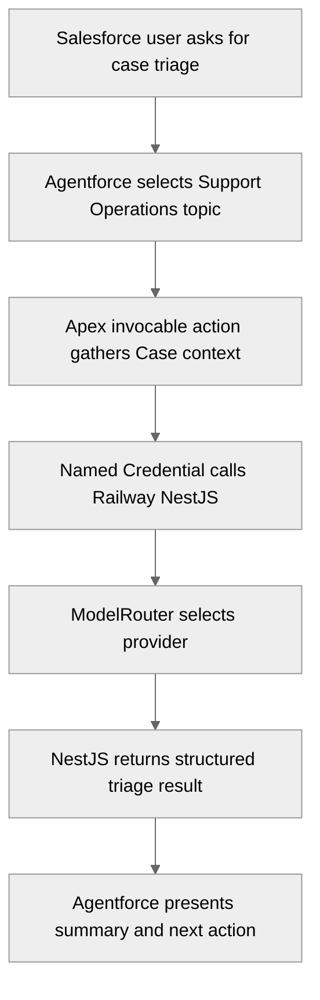

# Support Operations Agent

## Overview

Support Operations is the first production-path agent capability. It proves the narrow bridge from Salesforce Agentforce to Apex, from Apex to Railway NestJS, and from NestJS back to Agentforce with a structured response.

## Agent Flow

## Expected Output

The production action should return:

- `summary`
- `category`
- `priority`
- `confidence`
- `nextAction`
- `safeFallbackReason` when the backend cannot provide a result

## First Implementation Rule

Start with a non-LLM health/context response from NestJS. Upgrade to OpenAI through `ModelRouter` only after the Agentforce -> Apex -> Railway contract works.

## Tests

- Apex callout mock for happy path
- Apex callout mock for backend error
- Apex test for empty or missing Case context
- Agentforce eval for expected topic selection and action invocation
- REST multi-turn smoke test after the agent is active
