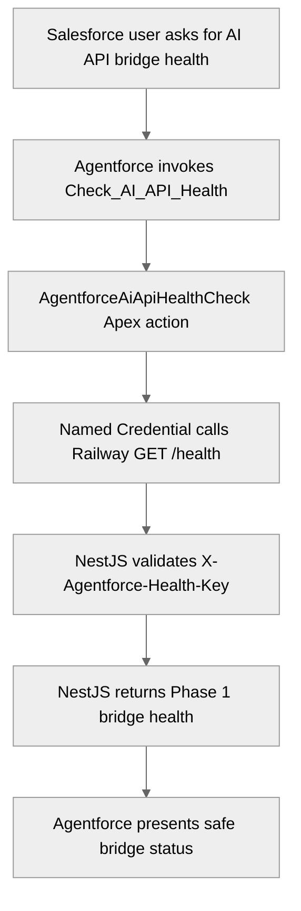

# Support Operations Agent

## Overview

Support Operations Phase 1 proves the narrow bridge from the Customer Self Service Agent to Apex, from Apex to Railway NestJS, and from NestJS back to Agentforce with a safe structured health response.

## Agent Flow

## Expected Output

The Phase 1 health action should return:

- `bridgeStatus`
- `healthStatus`
- `safeMessage`
- `serviceName`
- `serviceVersion`
- `phase`
- `httpStatusCode`
- `checkedAt`

Planner-visible fields should stay limited to `bridgeStatus`, `healthStatus`, and `safeMessage`.

## First Implementation Rule

Start with a non-LLM health/context response from NestJS. Upgrade to OpenAI through `ModelRouter` only after the Agentforce -> Apex -> Railway contract works and Phase 1 validation evidence is captured.

## Phase 1 Health Bridge

- NestJS app path: `apps/ai-api`
- Railway liveness endpoint: `GET /health/live`
- Salesforce bridge endpoint: protected `GET /health`
- Salesforce Named Credential developer name: `Agentforce_AI_API`
- Apex invocable: `AgentforceAiApiHealthCheck`
- Agentforce action metadata: `Check_AI_API_Health`

`AGENTFORCE_HEALTH_API_KEY` is required for production-like Railway deployments. The Named Credential should point to the Railway `ai-api` base URL. The Named Credential / External Credential should inject `X-Agentforce-Health-Key` with the matching value. Do not commit Railway URLs with secrets, API keys, or org-specific credential values.

Credential setup is documented in [Railway AI API Phase 1](../deployment/railway-ai-api-phase1.md). If credential metadata is not deployed from source, capture the manual setup evidence in [Phase 1 Health Bridge Smoke](../testing/phase1-health-bridge-smoke.md).

Published runtime proof for this bridge is captured in [Phase 1 Agentforce Runtime Proof](../testing/phase1-agentforce-runtime-proof.md).

Bridge status meanings:

- `CONNECTED`: Apex reached Railway and the protected Phase 1 contract matched expected values.
- `AUTH_ERROR`: Railway rejected the bridge credentials with 401 or 403.
- `BACKEND_ERROR`: Railway returned a non-success status other than auth failure.
- `CALLOUT_FAILED`: Apex could not reach the health endpoint.
- `MALFORMED_RESPONSE`: Railway returned unreadable or unexpected Phase 1 JSON.
- `UNEXPECTED_ERROR`: Apex could not complete the health check safely.
- `NOT_CHECKED`: Apex initialized a response before the call completed.

## Deferred After Phase 1

Do not claim these are implemented by the health bridge:

- case triage summaries
- `ModelRouter` provider selection
- OpenAI calls
- LangChain or Pinecone RAG
- Open WebUI integration
- React customer chat

## Temporary Production Topic

`AI_API_Health_Bridge` is a temporary published topic in `Customer_Self_Service_Agent` for Phase 1 runtime validation. It is useful now because it proves the full Customer Self Service Agent -> Apex -> Named Credential -> Railway path in the real published runtime.

The earlier `Agentforce_Service_Agent` proof was superseded after the target-agent mismatch was found. Keep the health bridge bound to Customer Self Service while Phase 1 is being accepted.

After the later production phases are live, remove this topic and its planner-local action from the customer-facing planner bundle. Do not remove the health endpoint, Apex bridge, or smoke coverage until equivalent operational monitoring exists or the bridge is moved to an internal-only ops agent.

## Manual Prompts

Use these prompts when you want to verify the published agent behavior manually:

- `Check the AI API health bridge.`
- `Invoke Check AI API Health and tell me the bridgeStatus, healthStatus, and httpStatusCode for the AI API health bridge.`

If you want runtime proof rather than only user-visible text, trace the Einstein Agent runtime user, ask one of the prompts above in preview or the published surface, and then verify the Apex log for `AgentforceAiApiHealthCheck.checkHealth` and the `callout:Agentforce_AI_API/health` request.

## Tests

- Apex callout mock for happy path
- Apex callout mock for backend error
- Apex callout mock for auth error
- Apex tests for malformed or unexpected Phase 1 backend contracts
- Apex test for empty health-check input
- Agentforce eval for expected topic selection and action invocation
- REST multi-turn smoke test after the agent is active
