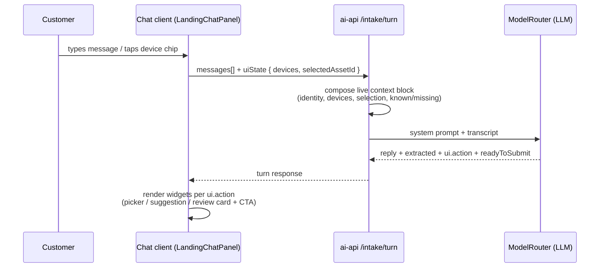

# Ably Intake Chat — Flow Analysis & Redesign

> **Date:** 2026-07-03 · **Surface:** `react-chat-window` `/landing` chat panel · **API:** `apps/ai-api/src/intake/`
> **Code state:** after pulling `2c69d30` ("enhance intake service with context handling and device selection logic") — the branch now matches the production build on Railway.

## Diagnosis

The chat UI and the LLM are **two partially disconnected systems**. The latest pull fixed half of the gap — the model now receives account and device _catalog_ context every turn — but the model still never learns the **user's device selection** or any other live UI state, and the UI widgets (device chips, submit CTA) are driven by a weak client-side heuristic instead of the model's judgment.

**The fix:** finish connecting the two systems — send live UI state to the model every turn, and let the model return **UI directives** that decide which widgets appear and when. This is the "Claude chatbot" pattern: state in, structured directives out, every turn.

---

## 1. The actual conversation, annotated

Production transcript from 3 Jul (screenshots), replayed with each failure flagged at the turn where it happens. This conversation ran the _current_ code.

> **Ably:** Hi Jason, I'm Ably — your AI service guide for Aptivance tech. What issue are you experiencing today?

✅ Good greeting — personalized from `deviceGreeting()` (`lib/intake-client.ts`), name and account from the verified context.

> **User:** The laptop screen is black but an external monitor works.
>
> **Ably:** I understand that your laptop screen is black, but the external monitor is functioning properly. Can you tell me when this issue started **and** what troubleshooting steps you've already tried?

⚠️ **Failure 1 — two questions in one turn, one of them already answered.** "What have you already tried?" ignores that the user _just said_ they tried an external monitor. The system prompt's conversation-flow list no longer contains a one-question-per-turn rule, and there is no known/missing checklist to stop re-asking.

> **User:** the issue is stsrtid form today and i told you i tryed external monitor

🔴 **User friction — visible frustration.** "i told you" — the customer is repeating themselves. Redundant questions are the fastest way to lose trust in an AI intake.

> **Ably:** Thank you for the information. Just to clarify, the issue started today, and you've tried using an external monitor, which works fine. Have you attempted any other troubleshooting steps, such as restarting the laptop or checking the display settings? **Also, which registered device is affected?**

⚠️ **Failure 2 — asks for the device in free text while the UI owns that job.** The prompt _tells_ the model to ask ("After the issue is clear, ask which registered device is affected. The chat UI will show a device picker when ready"), but the model has no way to know whether the picker has been shown or answered.

> **User:** yes i have restarted the laptop three time
>
> **Ably:** Got it, you've restarted the laptop three times, but the internal screen remains black. **Please let me know which registered device is affected**, so I can assist you further.

🔴 **Failure 3 — blind to the selection.** At this moment the chip **AeroVolt Stratos Air 13 – Exec Travel Unit** is already selected in the UI. Tapping a chip is a silent client-side `dispatch({ type: "selectDevice" })` — no message is appended, no turn is fired, and the turn request contains no `selectedAssetId`. The conversation _cannot_ know the question was answered, so it asks again. Guaranteed by construction.

Meanwhile the UI shows:

```
[AeroVolt Stratos Air 13 - Exec Travel Unit]  Change
[        Review & submit case →              ]
```

⚠️ **Failure 4 — the CTA contradicts the conversation.** "Review & submit" is enabled while the bot is still asking questions, because the gate is `issueCaptured`: any extracted description ≥ 10 chars **or** ≥ 10 total user words — satisfied on turn one ("The laptop screen is black but an external monitor works" is 10 words).

---

## 2. What the latest pull already fixed vs. what remains

### Fixed by `2c69d30` ✅

| Fix                                                                                                                                                                                                   | Where                                                    |
| ----------------------------------------------------------------------------------------------------------------------------------------------------------------------------------------------------- | -------------------------------------------------------- |
| Server injects account context into the system prompt every turn: customer name, account, contact email, ship-to, billing, device count + labels                                                      | `buildIntakeSystemPrompt()` in `intake-agent.service.ts` |
| Personalized greeting ("Hi Jason, I'm Ably…") composed from verified context                                                                                                                          | `deviceGreeting()` in `lib/intake-client.ts`             |
| Device chips gated behind issue capture, with a "Which device is affected?" header (this is why chips appear only after the first message — deliberate, but keyed to the weak `issueCaptured` signal) | `shouldShowDevicePicker()` in `lib/intake-client.ts`     |
| Case payload appends `Affected device: <label>` to the description; sends `deviceLabel` + `shipTo`                                                                                                    | `buildCaseCreatePayload()` in `lib/intake-client.ts`     |
| Submit blocked until a device is picked (when devices exist)                                                                                                                                          | `canSubmitCase()` in `lib/intake-client.ts`              |

### Still broken 🔴

| #    | Problem                                                                         | Root cause                                                                                                              | Where                                                                     |
| ---- | ------------------------------------------------------------------------------- | ----------------------------------------------------------------------------------------------------------------------- | ------------------------------------------------------------------------- |
| RC‑1 | Model never learns the device **selection** (Failure 3)                         | Turn request carries only `messages[]`; chip tap is a silent dispatch with no acknowledgment turn                       | `dto/intake-turn.dto.ts` (request), `LandingChatPanel.tsx` `selectDevice` |
| RC‑2 | Submit CTA on turn one; chips timing driven by the same weak signal (Failure 4) | `issueCaptured` = description ≥ 10 chars OR ≥ 10 user words                                                             | `intake-agent.service.ts` `nextTurn()` (~L134)                            |
| RC‑3 | Model can't cue widgets; client infers them                                     | No UI directive / readiness fields in the turn response                                                                 | `dto/intake-turn.dto.ts` (response)                                       |
| RC‑4 | Multi-question turns; re-asks answered questions (Failures 1–2)                 | No one-question-per-turn rule in the current prompt; no known/missing checklist                                         | `buildIntakeSystemPrompt()`                                               |
| RC‑5 | Review card hides the Case body                                                 | `description` is computed in the confirm phase but never rendered — user submits a Case whose main field they never saw | `LandingChatPanel.tsx` confirm phase                                      |
| RC‑6 | Done screen reads "updates at ." in bootstrap mode                              | Uses `state.email` (empty when OTP skipped) even though `context.contactEmail` is now available                         | `LandingChatPanel.tsx` done phase (~L831)                                 |
| RC‑7 | A Salesforce round-trip on every turn                                           | `nextTurn()` calls `intakeService.getContext(principal)` per message                                                    | `intake-agent.service.ts` (~L102) — cache per session/JWT TTL             |

---

## 3. Target design: the model drives the UI

"Like a Claude chatbot" is the right instinct — in Claude-style chats the model receives the full state every turn and returns **structured directives** that the client renders as widgets. The intake already uses the repo's prompt‑plus‑`JSON.parse` extraction pattern, so this is an extension of the existing contract, not a rewrite.



### The five rules

1. **Client sends UI state with every turn.** The turn request gains a `uiState` block: registered devices, the currently selected device, and whether review is open.
2. **Server injects a live state block into the system prompt.** On top of the existing context: _current selection_ and a _known/missing checklist_ — so the model can never ask for something the system already knows. (The catalog half of this already shipped in `2c69d30`.)
3. **Model replies with text + UI directives.** Alongside `reply`/`subject`/`description`/`priority`, the model returns `ui.action` and `readyToSubmit`. The model decides when the picker appears, when a device is suggested, and when the flow moves to review.
4. **Client renders widgets only when directed.** Chips, the suggestion chip, and the review card are conversation beats, not always-on furniture. Selecting a device fires an acknowledgment turn so the bot responds to it.
5. **Submit CTA appears when the model declares readiness.** `readyToSubmit: true` replaces the 10-word gate. Safety fallback so the user is never trapped: ≥ 2 user turns **and** ≥ 25 words, or JSON parse failure.

### Turn request — client → `POST /api/intake/turn`

```jsonc
{
  "messages": [
    /* LLM-visible transcript (uiOnly filtered) */
  ],
  "uiState": {
    "devices": [
      {
        "assetId": "02iXXX01",
        "label": "AeroVolt Stratos Air 13 - Exec Travel Unit"
      },
      { "assetId": "02iXXX02", "label": "AeroVolt Stratos Pro 16" }
    ],
    "selectedAssetId": "02iXXX01" // or null
  }
}
```

_(Server should still trust only JWT-scoped context for anything security-relevant; `uiState` is a conversational hint, and `assetId` is already validated server-side at case create.)_

### Live state block (appended to the system prompt each turn)

```
LIVE STATE — never ask for anything listed here:
Customer: Jason (identity verified)
Registered devices:
  1. AeroVolt Stratos Air 13 - Exec Travel Unit
  2. AeroVolt Stratos Pro 16
Currently selected device: AeroVolt Stratos Air 13 - Exec Travel Unit
Known so far: symptom ✓ · started ✓ · tried ✓ · device ✓
Ask EXACTLY ONE question per turn, only for missing items.
When nothing is missing, summarize what you have and set readyToSubmit=true.
```

### Turn response — model → client

```jsonc
{
  "reply": "Got it — your Stratos Air 13. Thanks, I have everything I need…",
  "subject": "Internal display black; external monitor works",
  "description": "Internal screen black since today. External monitor works. Restarted 3x — no change. Device: AeroVolt Stratos Air 13.",
  "priority": "High",
  "ui": { "action": "showReview", "suggestedDeviceIndex": null },
  "readyToSubmit": true
}
```

### Directive vocabulary

| `ui.action`        | Client renders                                                               | Typical moment                     |
| ------------------ | ---------------------------------------------------------------------------- | ---------------------------------- |
| `none`             | Nothing extra — plain conversational turn                                    | Clarifying questions               |
| `showDevicePicker` | Device chips under the bot message                                           | Model needs to know which device   |
| `suggestDevice`    | One pre-highlighted chip: "Sounds like your Stratos Air 13 — tap to confirm" | User named the device in free text |
| `showReview`       | Summary card + **Review & submit case** CTA                                  | With `readyToSubmit: true`         |

> **Selection becomes a conversation event.** When the user taps a chip, the client updates `uiState.selectedAssetId` and immediately fires a turn with a hidden event note (`[event] customer selected: Stratos Air 13`). The bot acknowledges it — "Got it, your Stratos Air 13" — instead of asking for it two turns later.

---

## 4. The same conversation, replayed under the new design

Same customer, same black-screen issue — with the model holding the state and cueing each widget. Six turns, zero repeated questions, CTA appears exactly once, at the end.

> **Ably:** Hi Jason — I can see 2 registered devices on your account. What issue are you experiencing today?

_Beat 1 — context up front. No widgets yet; the model hasn't asked for anything._

> **User:** The laptop screen is black but an external monitor works.
>
> **Ably:** Since the external monitor works, the laptop itself is running — that points at the internal display. Which of your devices is this happening on?
>
> `[AeroVolt Stratos Air 13 - Exec Travel Unit]` `[AeroVolt Stratos Pro 16]`

_Beat 2 — `ui.action = showDevicePicker`. One acknowledgment, one question — chips appear at the moment the question is asked, because the model asked for them._

> — _Selected: AeroVolt Stratos Air 13 - Exec Travel Unit_ —
>
> **Ably:** Got it — your Stratos Air 13. When did the screen go black?

_Beat 3 — selection acknowledged. The tap fired a turn with updated `uiState`. The bot responds to it and moves to the next missing item. It can never ask "which device?" again._

> **User:** today, it was fine yesterday
>
> **Ably:** Have you tried restarting it?
>
> **User:** yes i have restarted the laptop three time
>
> **Ably:** Thanks Jason — I have everything I need. Your Stratos Air 13's internal display went black today, the external monitor works, and three restarts didn't help. I've marked this High priority. Review the summary below and submit when you're ready.

_Beat 4 — `readyToSubmit = true` → `showReview`. The CTA appears for the first time here, cued by the model's own "I have everything I need"._

```
┌──────────────────────────────────────────────┐
│ SUMMARY                                      │
│ Internal display black; external monitor works│
│ Device:   AeroVolt Stratos Air 13            │
│ Priority: High                               │
│ ──────────────────────────────────────────── │
│ Internal screen black since today (fine      │
│ yesterday). External monitor displays        │
│ correctly, so the system boots. Customer     │
│ restarted 3x with no change.                 │
├──────────────────────────────────────────────┤
│        [ Review & submit case → ]            │
└──────────────────────────────────────────────┘
```

_The review card now shows the full description (today it shows only subject, device, priority)._

> — _Case #00001204 created · updates via email_ —

---

## 5. The full process, start to end

| Stage          | Owner            | What happens                                                                                                                                                 |
| -------------- | ---------------- | ------------------------------------------------------------------------------------------------------------------------------------------------------------ |
| 1 · Identity   | UI state machine | Email → OTP (or bootstrap skip in UAT). Mints the intake JWT. Unchanged.                                                                                     |
| 2 · Warm start | Server + context | Greeting with name + device count. Devices loaded before the input unlocks — chips are ready the moment the model calls for them.                            |
| 3 · Capture    | Customer         | Free-text issue description in their own words.                                                                                                              |
| 4 · Clarify    | **Model**        | Exactly one question per turn against the known/missing checklist: symptom → device (picker or suggestion) → when → tried. Never re-asks; 2–3 turns typical. |
| 5 · Readiness  | **Model**        | Declares "I have everything I need", returns `readyToSubmit: true` + `showReview`. CTA appears now, not before.                                              |
| 6 · Review     | Customer         | Subject, full description, device, priority — all visible, description editable. Back-to-chat stays available.                                               |
| 7 · Submit     | Server           | `POST /intake/case` → Salesforce Case (Origin=Chat, asset validated server-side). Unchanged.                                                                 |
| 8 · Done       | UI               | Case number + what happens next + "updates at `<contactEmail>`" (works in bootstrap mode too) + start-another-case.                                          |

---

## 6. Implementation checklist

> **Status: IMPLEMENTED 2026-07-03** (all items ✅). Design deviation: `uiState` carries only `selectedAssetId` — the server already holds the authoritative device catalog from `getContext()`, so client-supplied device labels never reach the prompt (smaller injection surface). The model refers to devices by 1-based index (`suggestedDeviceIndex`), resolved server-side to an assetId.

1. ✅ **Extend the turn contract** — optional `uiState.selectedAssetId` on the request; `ui: { action, suggestedAssetId? }` + `readyToSubmit` on the response.
   `apps/ai-api/src/intake/dto/intake-turn.dto.ts`
2. ✅ **Extend the live context block + tighten the prompt** — selection line ("NEVER ask which device"), EXACTLY-ONE-question rule, never-re-ask rule, `[event]` semantics, `ui`/`readyToSubmit` JSON keys; defensive parsing kept.
   `apps/ai-api/src/intake/intake-agent.service.ts` `buildIntakeSystemPrompt()` / `parseExtraction()` / `resolveUiDirective()`
3. ✅ **Replace the readiness gate** — model `readyToSubmit` primary; anti-trap fallback = ≥ 2 user turns AND ≥ 25 words (also covers JSON parse failure). The 10-word turn-one CTA is gone; `issueCaptured` remains for informational compat.
4. ✅ **Selection is a conversation event** — chip tap dispatches `selectDevice`, appends a hidden `[event]` note, and fires an acknowledgment turn with `uiState.selectedAssetId`; chips render on `showDevicePicker`/`suggestDevice` directives (sticky until picked, reopened by "Change"); suggested device gets a one-tap confirm chip.
   `LandingChatPanel.tsx`, `IntakeShell.tsx`, `intake/IntakeConversation.tsx`, `lib/intake-flow.ts`, `lib/intake-client.ts`
5. ✅ **Description visible + editable in the review card** — editable textarea in the landing panel confirm card and in `IntakeSummaryCard` (via `onDescriptionChange`); `[event]` notes excluded from transcript fallbacks.
6. ✅ **Done-screen email guard** — `state.email || context.contactEmail`, sentence hidden when neither exists.
7. ✅ **Context cached per identity** — 5-minute TTL, 200-entry cap in `IntakeAgentService`; one Salesforce round-trip per conversation instead of per message.
8. ✅ **Tests green** — ai-api: 643 tests / 73 suites pass (new: directive resolution, suggestion index → assetId, catalog validation of `selectedAssetId`, readiness fallback, cache). react-chat vitest: intake-flow (11) + intake-client (10) pass. Playwright intake mocks updated with `ui`/`readyToSubmit` (suite needs `@playwright/test` installed to run). Pre-existing failures on this branch (untouched): d3-dependent chart components + two non-intake spec type errors.
   Deploy note: intake API changes require deploying **ai-api and react-chat-window together** (`railway-quick-deploy`).

## Related docs

- Intake architecture plan: `docs/sleepy-sparking-newt.md`
- Skill: `.agents/skills/ablypro-landing-intake-chat/SKILL.md`
- OTP bypass for UAT: `.agents/skills/intake-skip-email-verification/`
