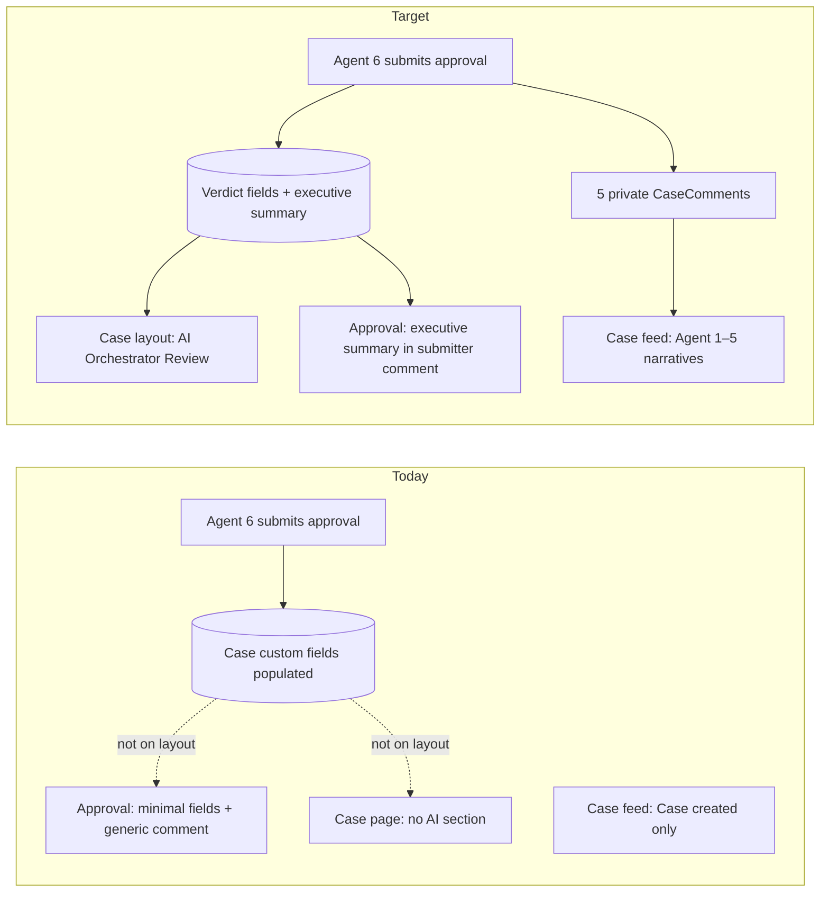

# Case Approval — Account Manager Summary & Agent Narratives Plan

> **Document type:** Phase plan — Salesforce-visible AI agent output on Case + full summary on approval.
> **Audience:** Product · Service Operations · Salesforce Architects · NestJS implementers.
> **Status:** **Planning** (2026-07-01).
> **Companions:** [`node-6-guardrail-sf-approval-phase-plan.md`](./node-6-guardrail-sf-approval-phase-plan.md) · [`case-triage-orchestrator-flow.md`](./case-triage-orchestrator-flow.md) §6 · [`new-node-phase-completion-checklist.md`](./new-node-phase-completion-checklist.md)

---

## 0. Session context — read this first

### 0.1 Problem statement

When Agent 6 (Compliance & Guardrail) submits a **Account Manager approval** in Salesforce:

1. The **Orchestrator Verdict data is written** to Case custom fields (`AI_Orchestrator_Verdict_*`) — verified on Case `00001187`.
2. **Nothing in the Salesforce UI shows it** — the Case page layout has no “AI Orchestrator Review” section, and the approval inbox shows only Case Number, Owner, Date Opened, and a generic submitter comment.
3. **Copy uses “human approval”** in several user-facing strings; the business wants **“Account Manager approval”** instead.
4. **No per-agent narrative** exists on the Case feed — approvers cannot see what each visible AI agent found without opening the external orchestration console.

### 0.2 UI agent model (canonical — do not add Agent 2 Customer History)

The **stepped orchestration console** shows **five agents**, not six. Customer History (backend Node 2) is **folded into Triage** and is **not** a separate row in the UI.

| UI stage | Visible agent name     | Backend nodes                           |
| -------- | ---------------------- | --------------------------------------- |
| **01**   | Triage                 | Node 1 Triage + Node 2 Customer History |
| **03**   | Knowledge Base         | Node 3                                  |
| **04**   | Parts & Logistics      | Node 4                                  |
| **05**   | Scheduling             | Node 5                                  |
| **06**   | Compliance & Guardrail | Node 6                                  |

Source: `apps/react-chat-window/lib/stepped-view-model.ts` — `NODE_DEFS` omits `customer_history` from the visible spine; `buildTriage()` merges `customerContext` into the Triage stage.

**Plan invariant:** Salesforce Case comments and approval copy must follow this **five-agent** model. Do **not** post a separate “Agent 2 – Customer History” comment.

### 0.3 What is already shipped

| Artifact                                                                                | Status                                                     |
| --------------------------------------------------------------------------------------- | ---------------------------------------------------------- |
| Verdict fields on Case (`AI_Orchestrator_Verdict_*`, `AI_Orchestration_Console_URL__c`) | Deployed; populated at guardrail submit                    |
| `AgentforceGuardrailApprovalService.submit()` stamps verdict + submits Approval Process | Working                                                    |
| `synthesizeOrchestratorVerdict()` at submit time                                        | Working                                                    |
| Case page layout with verdict section                                                   | **Not deployed**                                           |
| Approver read FLS beyond AI API run-as                                                  | **Incomplete** for queue members                           |
| Enriched approval submitter comments                                                    | **Generic only** (“Submitted by AI compliance guardrail…”) |
| Per-agent Case comments                                                                 | **Not implemented**                                        |
| Account Manager wording (vs “human approval”)                                           | **Not updated**                                            |

---

## 1. Business objective

When the compliance guardrail holds a case for **Account Manager approval**, the approver must be able to **review the full AI service plan inside Salesforce** — without requiring the external orchestration console — and the **Case record must show what each visible AI agent decided** as a durable, readable audit trail.

---

## 2. User stories

| ID   | As a…                      | I want…                                                                     | So that…                                                 |
| ---- | -------------------------- | --------------------------------------------------------------------------- | -------------------------------------------------------- |
| US-1 | Account Manager / approver | A **plain-language executive summary** on the approval request and Case     | I can approve or reject with full context in Salesforce  |
| US-2 | Account Manager / approver | **Five detailed agent comments** on the Case (matching the stepped console) | I see what each agent found, not only KB article titles  |
| US-3 | Case owner / service agent | AI output visible on the **Case record layout**                             | I have a Salesforce-native history without opening React |
| US-4 | Operations / audit         | Copy to say **“Account Manager approval”**, not “human approval”            | Language matches our business role and approval queue    |
| US-5 | Approver (optional)        | The **Account Owner name** when resolvable                                  | I know who is expected to approve                        |

---

## 3. Functional requirements

### FR-1 — Terminology: Account Manager, not Human

All **user-facing** text in Salesforce (Case fields, Case comments, approval submitter comments, agent narrative labels) must use:

- **“Account Manager approval”** / **“Account Manager sign-off”**

and must **not** use:

- “Human approval,” “held for human approval,” “human sign-off,” etc.

**Internal code** may retain `requireHumanApproval` as the policy outcome enum — only **display copy** changes.

**Optional:** when Salesforce can resolve the Account Owner safely, include once in the executive summary:

> Account Manager approval is required from **{Account Owner Name}** because…

**PII rule:** name may appear on Case for approvers; NestJS/API logs use role or alias only (no full names in telemetry).

Config already defaults `ORCHESTRATOR_APPROVAL_RECIPIENT_ROLE=account-manager` — display as **“Account Manager”** in all SF-facing strings.

---

### FR-2 — Executive summary paragraph

At guardrail submit (and on the Case), surface a **single plain-language paragraph** — not a bullet-clause headline alone.

**Target example** (Case 00001187 pattern):

> This is a **Normal priority** service request with **Medium business risk**. The AI recommends **transferring replacement parts** and **scheduling a provisional service visit**. **Account Manager approval** is required because the **parts transfer exceeds the configured approval policy**.

**Sources:** synthesized from `triage`, `customerContext`, `knowledgeGuidance`, `partsLogistics`, `scheduling`, and `guardrail` channels at submit time.

**Surfaces:**

| Surface                                                                             | Content                                  |
| ----------------------------------------------------------------------------------- | ---------------------------------------- |
| `AI_Orchestrator_Verdict_Summary__c` (or dedicated `AI_Account_Manager_Summary__c`) | Full executive paragraph                 |
| Approval Process submitter comment (`ProcessSubmitRequest.setComments`)             | Same paragraph (+ optional console URL)  |
| Case layout “AI Orchestrator Review” section                                        | Same paragraph as primary readable block |

The existing technical **headline** (`AI_Orchestrator_Verdict_Headline__c`) may remain for engineering console parity.

---

### FR-3 — Five agent Case comments (one per visible UI agent)

Post **private** `CaseComment` records (`IsPublished: false`) — one per visible agent — with sanitized, non-PII narratives. Idempotent per `workflowId + nodeId` (no duplicates on guardrail resume).

#### Agent 1 – Triage _(includes customer context / prior cases)_

Must cover:

- Recommended **priority** classification
- **Customer context** from Node 2: business risk, warranty, repeat failure, prior-case patterns, SLA/tier signals

**Example:**

> **Agent 1 – Triage:** Case classified as **Normal priority**. Customer context reviewed: **Medium business risk**, warranty **covered**, **no repeat failure** in the recent window. Prior service history checked; routing recommended for standard parts-and-schedule handling.

#### Agent 2 – Knowledge Base

Must cover **what the agent concluded** — not only article titles:

- Source count
- Defect / fix conclusion
- Recommended actions and part numbers (safe identifiers)
- Guidance confidence

**Example:**

> **Agent 2 – Knowledge Base:** Reviewed **3 approved sources**. Conclusion: display panel is a **hardware defect under warranty**; recommended **replace part SP-DISP-15X-FHD**; technician visit may be required. Guidance confidence: **medium**.

**Anti-pattern:** “Found articles: KB-101, KB-204” with no conclusion.

#### Agent 3 – Parts & Logistics

Must cover transfer plan, part number, warehouses, ETA, fulfillment readiness.

**Example:**

> **Agent 3 – Parts & Logistics:** Part **SP-DISP-15X-FHD** requires **inter-warehouse transfer** from **WH-SJO-002** to **WH-AUS-001**. ETA **26–46 hours**. Fulfillment status: **partial**.

#### Agent 4 – Scheduling

Must cover tentative appointment, resource reference, window, provisional vs confirmed.

**Example:**

> **Agent 4 – Scheduling:** **Tentative appointment created** for **SR-A2**, **Friday 09:00–11:00 PDT**, pending parts arrival. Status: **provisional**.

#### Agent 5 – Guardrail

Must state **Account Manager approval** and the **specific policy reason**.

**Example:**

> **Agent 5 – Guardrail:** **Account Manager approval** is required because the **parts transfer exceeds the configured approval policy**. Risk score **45 (medium)**. Workflow paused until approval in Salesforce.

#### Label convention

Use **sequential operator labels** (Agent 1–5) aligned with the five visible stages. Do **not** use “Agent 2 – Customer History.” Optionally add UI stage numbers in parentheses: `Agent 1 – Triage (01)`.

---

### FR-4 — Case layout: “AI Orchestrator Review”

Add a dedicated layout section on the active Case page with:

| Field                                   | Purpose                                                  |
| --------------------------------------- | -------------------------------------------------------- |
| `AI_Orchestrator_Verdict_Headline__c`   | Short scannable headline                                 |
| `AI_Orchestrator_Verdict_Summary__c`    | Executive Account Manager paragraph                      |
| `AI_Orchestrator_Verdict_Steps__c`      | Numbered recommended steps                               |
| `AI_Orchestrator_Verdict_Highlights__c` | Key facts (priority, risk, parts, scheduling, guardrail) |
| `AI_Orchestration_Console_URL__c`       | Deep link to orchestration console                       |
| `AI_Guardrail_Status__c`                | `pending_approval` / `approved` / `rejected` / etc.      |
| `AI_Triage_Workflow_Id__c`              | Workflow id for support                                  |

Also add **Approval History** related list.

**Layout strategy:** retrieve-then-edit the org’s active Case layout (see [`node-6-guardrail-6c-stop-ai-phase-plan.md`](./node-6-guardrail-6c-stop-ai-phase-plan.md) §4.3) — do not hand-author a layout from scratch.

---

### FR-5 — Approver field-level security

Create **`Agentforce_Guardrail_Approver`** permission set (read-only on verdict + guardrail status fields) and assign to members of queue `Agentforce_Guardrail_Approvers`.

Existing **`Agentforce_Guardrail_Node6`** remains for the AI API run-as user (read/write).

---

## 4. Non-functional requirements

| ID    | Requirement                                                                                          |
| ----- | ---------------------------------------------------------------------------------------------------- |
| NFR-1 | No PII in comments, verdict, or approval text (no customer names, emails, full case ids in API logs) |
| NFR-2 | Idempotent — resume/re-submit must not duplicate Case comments or approval submits                   |
| NFR-3 | Degrade-safe — layout/FLS/SOQL gaps must not break orchestration or `interrupt()`                    |
| NFR-4 | Parity with React stepped console **Final Verdict** and five visible agents                          |
| NFR-5 | Deterministic narratives — built from typed channels, no extra LLM call for Case comments            |
| NFR-6 | Source-controlled metadata where possible (layout retrieve-then-edit)                                |

---

## 5. Current vs target state

---

## 6. Phase breakdown

| Phase       | Scope                                                               | Exit criteria                                                                                             |
| ----------- | ------------------------------------------------------------------- | --------------------------------------------------------------------------------------------------------- |
| **Phase A** | Copy + executive summary (NestJS synthesizer + Apex submit comment) | Approval comment + summary field use Account Manager wording and plain paragraph                          |
| **Phase B** | Five agent Case comments (NestJS gateway + graph hooks)             | Case feed shows 5 agent comments; Agent 1 includes customer context; no separate Customer History comment |
| **Phase C** | Salesforce UI (layout + approver perm set + deploy)                 | Case 00001187-style record shows AI Orchestrator Review section; approver can read fields                 |
| **Phase D** | UAT + smoke                                                         | Live proof on approvable case; docs updated                                                               |

**Recommended order:** A → B → C → D (Phase A gives immediate value on approval comment even before layout deploy).

---

## 7. Technical design

### 7.1 Phase A — Executive summary + Account Manager copy

| Component                               | Path / change                                                                                                         |
| --------------------------------------- | --------------------------------------------------------------------------------------------------------------------- |
| `buildAccountManagerExecutiveSummary()` | New function in `orchestrator-verdict.synthesizer.ts` (or sibling `account-manager-summary.synthesizer.ts`)           |
| Replace “human approval” strings        | `orchestrator-verdict.synthesizer.ts`, `guardrail-approval-notification.service.ts` fallback verdict                  |
| Apex enriched submit comment            | `AgentforceGuardrailApprovalService.submit()` — `setComments()` with executive summary + Agent 5 reason + console URL |
| Optional Account Owner name             | Apex SOQL `Case → Account.Owner.Name` at submit; degrade to “Account Manager” if blank                                |
| Pass summary in submit command          | Extend `GuardrailApprovalSubmitCommand` if headline/summary split needed                                              |

### 7.2 Phase B — Agent narrative builder + Case comments

| Component                                 | Path / change                                                                 |
| ----------------------------------------- | ----------------------------------------------------------------------------- |
| `AgentCaseNarrativeBuilder`               | New module: five builders reading typed channels                              |
| `SalesforceCaseGateway.postCaseComment()` | POST `/sobjects/CaseComment` (mirror `applyWriteBack`)                        |
| Graph hooks                               | Post after each visible stage completes; Triage hook merges `customerContext` |
| Idempotency                               | In-memory or snapshot marker: `workflowId:agent:triage` etc.                  |
| Node 6 timing                             | Post Agent 5 Guardrail comment **before** SF approval submit                  |

**Comment trigger map:**

| Visible agent        | Post after graph node                   | Channels                    |
| -------------------- | --------------------------------------- | --------------------------- |
| Agent 1 – Triage     | `runTriage` + customer context complete | `triage`, `customerContext` |
| Agent 2 – Knowledge  | `knowledge` node done                   | `knowledgeGuidance`         |
| Agent 3 – Parts      | `planPartsLogistics` done               | `partsLogistics`            |
| Agent 4 – Scheduling | `planScheduling` done                   | `scheduling`                |
| Agent 5 – Guardrail  | `evaluateGuardrail` pre-interrupt       | `guardrail` + full context  |

### 7.3 Phase C — Salesforce metadata

| Artifact                                                              | Action                                                  |
| --------------------------------------------------------------------- | ------------------------------------------------------- |
| `layouts/Case-*.layout-meta.xml`                                      | Retrieve from org; add “AI Orchestrator Review” section |
| `permissionsets/Agentforce_Guardrail_Approver.permissionset-meta.xml` | New — read-only verdict fields for queue members        |
| `manifest/case-approval-summary-package.xml`                          | Deploy package for Phase C                              |
| `scripts/sf/case-approval-summary-pre-deploy.sh`                      | Optional deploy helper                                  |

---

## 8. Data model

**Option 1 (recommended for v1):** Reuse existing fields

- `AI_Orchestrator_Verdict_Summary__c` → executive Account Manager paragraph
- `AI_Orchestrator_Verdict_Headline__c` → short headline (unchanged)
- Agent narratives → CaseComment feed only (no new field)

**Option 2 (if comment feed is insufficient):** Add `AI_Agent_Narratives__c` (Long Text Area) — concatenated five blocks for layout display and approval fallback.

---

## 9. Test plan

### 9.1 Unit (NestJS)

- `buildAccountManagerExecutiveSummary()` — fixtures for Case 00001187 pattern
- Each agent narrative builder — non-PII, includes conclusions not just titles
- Agent 1 narrative includes customer context fields when present
- No narrative emitted for `customer_history` as separate agent
- Idempotent comment posting on resume

### 9.2 Apex

- Submit comment contains executive summary (not generic-only)
- Verdict fields stamped when FLS present
- Account Owner name degrade-safe when Account missing

### 9.3 Live UAT (org `AgentForce`)

1. Trigger orchestration on **approvable** case (medium risk + parts transfer; not 00001050 escalate / 00001054 autoApprove).
2. Confirm workflow reaches `waiting_approval`.
3. **Case feed:** five private comments, Agents 1–5, no Customer History label.
4. **Case layout:** AI Orchestrator Review section populated.
5. **Approval inbox:** submitter comment includes executive summary.
6. Approve in Salesforce → callback resumes; `AI_Guardrail_Status__c = approved`.

---

## 10. Acceptance checklist

### Language

- [ ] No user-facing “human approval” on Case, approval inbox, or agent comments
- [ ] Guardrail comment: “Account Manager approval is required because…”

### Executive summary

- [ ] Plain paragraph with priority, business risk, parts recommendation, scheduling recommendation, policy reason
- [ ] Present in approval submitter comment and Case summary field

### Five agent comments

- [ ] Agent 1 – Triage includes priority **and** customer context / prior-case signals
- [ ] Agent 2 – Knowledge states **conclusions**, not only article names
- [ ] Agent 3 – Parts covers transfer, part, ETA
- [ ] Agent 4 – Scheduling covers tentative appointment
- [ ] Agent 5 – Guardrail covers Account Manager approval + policy reason
- [ ] **No** separate “Agent 2 – Customer History” comment

### Salesforce UI

- [ ] Case layout section visible to approver
- [ ] Approver queue member can read verdict fields without System Admin profile

---

## 11. Open decisions

| ID  | Question                                                                             | Recommendation                                                          |
| --- | ------------------------------------------------------------------------------------ | ----------------------------------------------------------------------- |
| D1  | Comment labels: **Agent 1–5** or **Agent 01 / 03 / 04 / 05 / 06**?                   | **Agent 1–5** (operator-friendly); optional stage number in parentheses |
| D2  | Include **Account Owner real name** in summary?                                      | **Yes when resolvable**; fallback “Account Manager”                     |
| D3  | Store agent narratives in **CaseComment only** or also **`AI_Agent_Narratives__c`**? | **CaseComment only** for v1                                             |
| D4  | Replace engineering headline or keep **both** headline + executive paragraph?        | **Both**                                                                |

---

## 12. Out of scope (this plan)

- React Approve/Reject buttons on orchestration console (stays read-only per §6 of flow doc)
- Re-enabling email approval channel (`ORCHESTRATOR_GUARDRAIL_EMAIL_NOTIFICATION_ENABLED=false` stays off)
- Separate Customer History agent in UI or Salesforce comments
- LLM-generated Case comment prose (narratives are deterministic from channels)

---

## 13. One-line requirement

> When the guardrail submits Account Manager approval, Salesforce must show a plain-language executive summary and **five private agent comments** (Triage including customer context, Knowledge, Parts, Scheduling, Guardrail) on the Case, with **Account Manager approval** wording throughout, visible on the Case layout and in the approval submitter comment.

---

## 14. References

- Stepped console agent spine: `apps/react-chat-window/lib/stepped-view-model.ts`
- Verdict synthesizer: `apps/ai-api/src/orchestrator/orchestrator-verdict.synthesizer.ts`
- SF approval submit: `force-app/main/default/classes/AgentforceGuardrailApprovalService.cls`
- Guardrail notification: `apps/ai-api/src/orchestrator/guardrail-approval-notification.service.ts`
- Live proof case: Case `00001187` — verdict fields populated, layout missing (2026-07-01)
