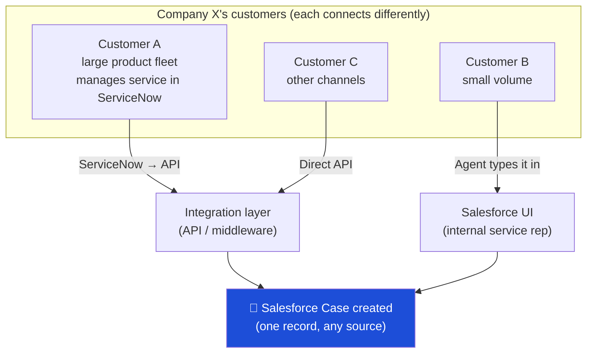
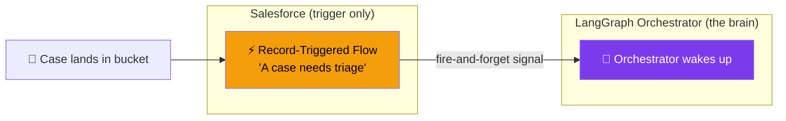
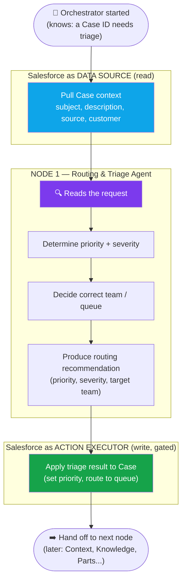
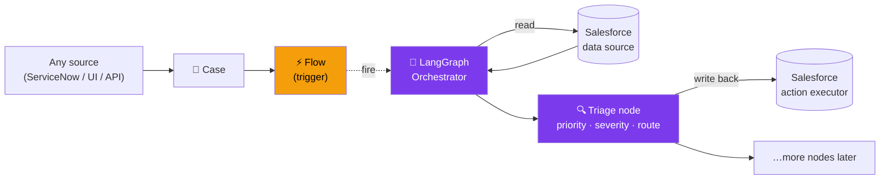
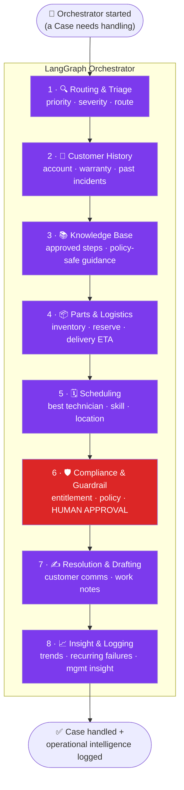
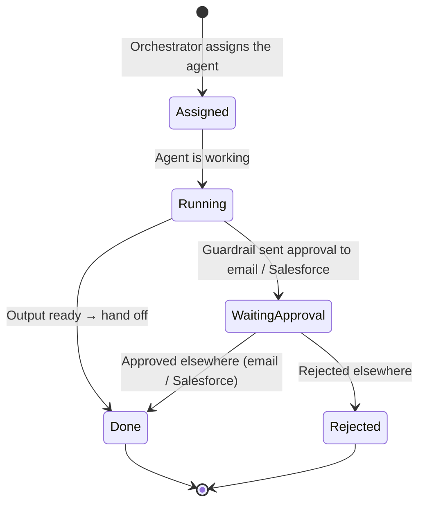
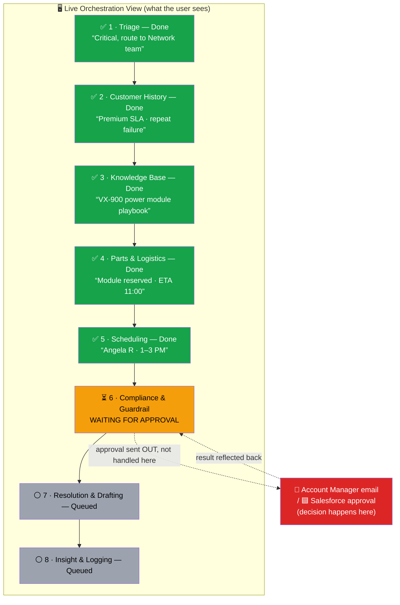
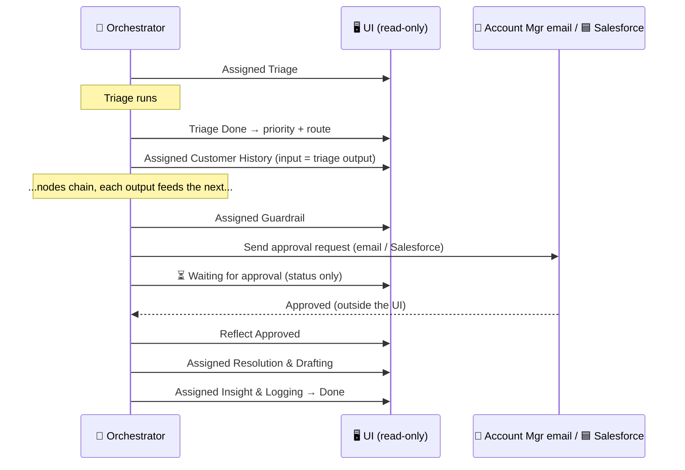

# Orchestrator — Initial Flow (Case Intake → Trigger → LangGraph → Triage)

> Conceptual only. No API shapes, no JSON, no field wiring yet.
> Goal of this diagram: agree on **who triggers**, **who orchestrates**, and **where Salesforce sits as a data source vs. an action executor**.

## Mental model

- **Salesforce = system of record + action executor.** It holds the Case and later performs approved writes.
- **LangGraph = the brain (orchestrator).** It reasons and decides; it does not own the data.
- **Flow = the trigger only.** When a Case lands in the bucket, Flow fires the starting gun and steps back.
- **Routing & Triage = the first node** of the orchestrator graph.

---

## 1. How a Case enters (multi-source, multi-customer)

Company **X** runs one Salesforce org and serves many customers. Each customer connects differently, but everything converges into **one Case record**.

**Key point:** no matter the channel, the orchestrator only cares about _one_ thing — a Case appeared in the bucket.

---

## 2. The trigger → orchestrator handoff

**Decision baked in here:** Flow does **not** wait. It signals and returns. The orchestrator pulls what it needs and writes back later. (Fire-and-forget, not synchronous.)

---

## 3. Inside the orchestrator — first node is Triage

---

## 4. The whole picture in one frame

---

## 5. The full agent team — all 8 nodes in the graph

> Each node is its own agent. The orchestrator decides the path, passes one node's
> output into the next, and pauses at the guardrail node when a human must approve.
> We'll go deep on each node in its own session — this is just the shape.

**Node 6 is special** — it is the only node that can _pause the whole graph_ and wait
for a human. Every other node hands off automatically.

---

## 6. The Screen Flow — what the USER sees live in the UI

As the orchestrator runs, the user should watch it happen: which agent is active,
what it decided, the handoff to the next agent, and any **"waiting for approval"** pause.
Each node emits a **status** the UI renders in real time.

> **Important — the UI is READ-ONLY observability.** It exists only to show the
> _thinking and the stages_: which agent picked up, what it decided, where the flow
> currently is, what it is complete / running / waiting on. **Approvals do NOT happen
> in this UI.** When the Guardrail node needs sign-off, the request goes out through
> **the account manager's email or the Salesforce system itself** — not this screen.
> The UI simply _reflects_ that an approval is pending and, once it clears elsewhere,
> shows the flow moving on.

### 6a. Node lifecycle (the status every agent reports)

Every node surfaces one of: **Assigned → Running → Done**, or for the guardrail,
**Running → Waiting for approval → Approved / Rejected**. The approve/reject decision
is made **outside this UI** (account manager email or Salesforce); the UI only
_reflects_ the state change.

### 6b. The live progress panel (what the screen actually shows)

**The story the UI tells:** "The orchestrator assigned Triage → Triage finished and
handed to Customer History → … → now the Guardrail agent is **waiting for approval**
before Resolution & Drafting can start." The approval itself was **sent to the account
manager's email / Salesforce** — not clicked on this screen. The remaining agents stay
**queued** until that approval clears, and the UI just updates to show it moved on.

### 6c. Handoff timeline (output of one node → input of the next)

---

## What this diagram is asking you to confirm

1. **Trigger = Flow, fire-and-forget.** Salesforce does not block on the graph. ✅ / change?
2. **Salesforce plays two distinct roles**: data source (read) and action executor (write). The orchestrator never _is_ Salesforce.
3. **Triage is Node 1.** Its only job: priority, severity, target team → a recommendation that gets written back to the Case.
4. **Multi-customer / multi-channel collapses into one Case** before the orchestrator ever runs — so the graph stays channel-agnostic.
5. **8 nodes, one chain.** Each node's output feeds the next. Only the **Guardrail node (6)** can pause the graph for a human.
6. **Live screen flow is READ-ONLY.** The UI only shows _thinking and stages_ — which agent picked up the case, what each decided, and where the flow currently is (running / done / waiting). **Approvals are NOT done in the UI**; they go to the **account manager's email or Salesforce**, and the UI simply reflects "waiting for approval" then moves on once it clears.

> Next step (later, not now): go deep on each node — its inputs, decision, output contract — and define what the trigger signal carries and what "read context" / "write back" actually touch.

---

## 7. Implemented Node 1 slice (walking skeleton)

> This section reflects the **shipped** thin vertical slice. Nodes 2–8 remain
> conceptual (sections 1–6 above). The slice uses the real
> `@langchain/langgraph` runtime (`StateGraph` + `interrupt` + `MemorySaver`
> checkpointer) and reuses the existing support-triage seam via `ModelRouter`.

**Graph:** `START → readContext → runTriage → gate ─approved→ writeBack → END`
with `gate ─rejected→ rejected → END`. `gate` calls `interrupt(...)` only when the
approval policy requires it; resume is idempotent.

**Four boundary contracts** (`apps/ai-api/src/orchestrator/dto/`):

1. Trigger signal — `TriggerCaseTriageDto` (`caseId`, optional `caseNumber`, `correlationId`).
2. Read context — `SalesforceCaseContext` (normalized Case the gateway reads).
3. Gated write-back — `CaseTriageWriteBackCommand` (Priority PATCH + CaseComment POST).
4. Status event — `OrchestrationStatusEvent` + `CaseTriageWorkflowSnapshot` (UI read model).
   Each event may carry safe, non-PII `details` (label/value) so the UI can show
   what happened at every step (reported priority, provider, model, latency,
   write-back outcome) — never raw Case text, names, account ids, or prompts.

**Final Verdict (observability-only):** after Nodes 1–3 settle, the orchestrator
synthesizes `CaseTriageWorkflowSnapshot.orchestratorVerdict` (`OrchestratorVerdict`)
deterministically from the typed channels — no LLM call, no PII, no
chain-of-thought. It is human-facing only; downstream automation consumes the
typed channels, never this rendered text. The UI shows it as a "Orchestrator
verdict" panel. See remediation status + deferred work in
[service-workflow-remediation-backlog.md](service-workflow-remediation-backlog.md).

**Durable persistence (restart-safe Case lookup):** the in-memory read model is
written through (best-effort) to an `OrchestrationStatusRepository`. Default
`memory` keeps the prior single-instance behaviour; `postgres` persists the full
snapshot (idempotent UPSERT by `workflowId`, ordered events as JSONB) to
`ai_api_orchestration_workflows` so `GET /cases/:caseId/latest` resolves
historical Cases deterministically (`ORDER BY updated_at DESC, created_at DESC`)
even after an AI API restart or redeploy. The Postgres repository mirrors
`TenantRegistryService` (lazy pool, `CREATE TABLE IF NOT EXISTS` auto-migrate,
pool teardown). Durable writes are best-effort and never throw into the run.

**Endpoints** (`/orchestrator/case-triage`, each scope-gated):

| Method + path               | Scope                              | Purpose                                                    |
| --------------------------- | ---------------------------------- | ---------------------------------------------------------- |
| `POST /triggers`            | `agentforce:orchestrator-triage`   | Async fire-and-forget handoff (HTTP 202).                  |
| `GET /:workflowId`          | `agentforce:orchestrator-read`     | Read-only status feed for the UI.                          |
| `GET /cases/:caseId/latest` | `agentforce:orchestrator-read`     | Latest live workflow for a Case Id.                        |
| `POST /:workflowId/resume`  | `agentforce:orchestrator-approval` | Out-of-band approval (email / Salesforce), **not** the UI. |

**Salesforce seam:** outbound `SalesforceModule` (`SalesforceCaseGateway` +
`SalesforceAuthService`, OAuth 2.0 client-credentials). Trigger handoff Apex:
`AgentforceCaseTriageOrchestratorTrigger` (Queueable callout via the
`Agentforce_AI_API_Phase2` Named Credential). UI: read-only
`/orchestration?workflowId=…` or `/orchestration?caseId=…` in
`apps/react-chat-window`. Case Id lookup reads the latest workflow from the live
read model and, on a cache miss after a restart, falls back to the durable
repository (when `postgres`) so historical Cases still resolve.

**Optional Salesforce tracking write-back (default OFF):** when
`AI_API_ORCHESTRATOR_SF_WRITEBACK_ENABLED=true`, the orchestrator best-effort
stamps the workflow id + status (and an optional UI deep link) onto Case custom
fields `AI_Triage_Workflow_Id__c`, `AI_Triage_Status__c`, `AI_Triage_Updated_At__c`,
`AI_Triage_UI_URL__c` so the history is resolvable from the Case itself. The
write is guarded (FLS / missing fields / transient errors are swallowed with a
safe log) and never blocks the Flow or the run. FLS is granted on the
`Customer_Self_Service_Agent` permission set.

**Env (AI API):** `SF_INSTANCE_URL`, `SF_OAUTH_TOKEN_URL`, `SF_OAUTH_CLIENT_ID`,
`SF_OAUTH_CLIENT_SECRET`, `SF_API_VERSION` (default `60.0`),
`ORCHESTRATOR_TRIAGE_APPROVAL_MODE` (`auto` | `always` | `high_risk`, default `auto`),
`AI_API_ORCHESTRATOR_PERSISTENCE_PROVIDER` (`memory` | `postgres`, default `memory`),
`AI_API_ORCHESTRATOR_DATABASE_URL` (or `DATABASE_URL`, required for `postgres`),
`AI_API_ORCHESTRATOR_AUTO_MIGRATE` (default `true`),
`AI_API_ORCHESTRATOR_DATABASE_SSL` (default `false`),
`AI_API_ORCHESTRATOR_MAX_POOL_SIZE` (default `5`),
`AI_API_ORCHESTRATOR_SF_WRITEBACK_ENABLED` (default `false`),
`AI_API_ORCHESTRATOR_UI_BASE_URL` (optional, for the Case deep link).

### Live-org proof prerequisites (blockers to a real Case E2E)

The in-process E2E (`apps/ai-api/test/orchestrator.e2e-spec.ts`) proves the full
contract with Salesforce mocked at the gateway. A **real Case** proof additionally needs:

1. Deploy the orchestrator code to the Railway AI API (the route is currently absent there — `POST /orchestrator/case-triage/triggers` returns 404).
2. A Salesforce **connected app with the OAuth 2.0 client-credentials flow** + run-as user, and the four `SF_OAUTH_*` / `SF_INSTANCE_URL` vars set on the AI API.
3. Grant `agentforce:orchestrator-triage` / `-read` / `-approval` to the inbound service bearer (`AGENTFORCE_SERVICE_BEARERS`).
4. Deploy `AgentforceCaseTriageOrchestratorTrigger` and wire a Case record-triggered Flow to call it; set `AI_API_ORCHESTRATOR_VIEW_TOKEN` on the React app.

### Durable historical lookup validation (Case creation → restart-safe lookup)

Proves the long-term lookup goal end to end. Requires `postgres` persistence:
provision a Railway Postgres service and set `AI_API_ORCHESTRATOR_PERSISTENCE_PROVIDER=postgres`
plus `DATABASE_URL` (or `AI_API_ORCHESTRATOR_DATABASE_URL`) on the AI API.

1. In Agentforce, drive `Customer_Self_Service_Agent` to **Create Service Request**
   (Apex `CustomerSelfServiceCreateRequest`). Capture the returned **Case Id** (`500…`).
2. Confirm the after-save `Case_Triage_Orchestrator_Handoff` Flow auto-fires and
   `AgentforceCaseTriageOrchestratorTrigger` posts `POST /orchestrator/case-triage/triggers`
   (fire-and-forget; the Flow does not wait).
3. Confirm the AI API persisted the workflow: a row in `ai_api_orchestration_workflows`
   for that `case_id`, and `GET /orchestrator/case-triage/cases/<caseId>/latest` returns it.
4. **Restart / redeploy the AI API** (clears the in-memory store).
5. Open `/orchestration?caseId=<caseId>` — the historical workflow still loads,
   served from the durable repository via the cache-miss fallback.
6. If `AI_API_ORCHESTRATOR_SF_WRITEBACK_ENABLED=true`, confirm the Case shows
   `AI_Triage_Workflow_Id__c` / `AI_Triage_Status__c` / `AI_Triage_Updated_At__c`
   (and `AI_Triage_UI_URL__c` when `AI_API_ORCHESTRATOR_UI_BASE_URL` is set).

The mocked equivalents already ship as unit/e2e coverage: the repository,
store, and service specs simulate a restart (a fresh store over the same
repository still resolves the Case) and assert the deterministic latest-by-Case
ordering; the React `lib/orchestration` and `OrchestrationView` specs cover the
sanitized per-step `details`.
