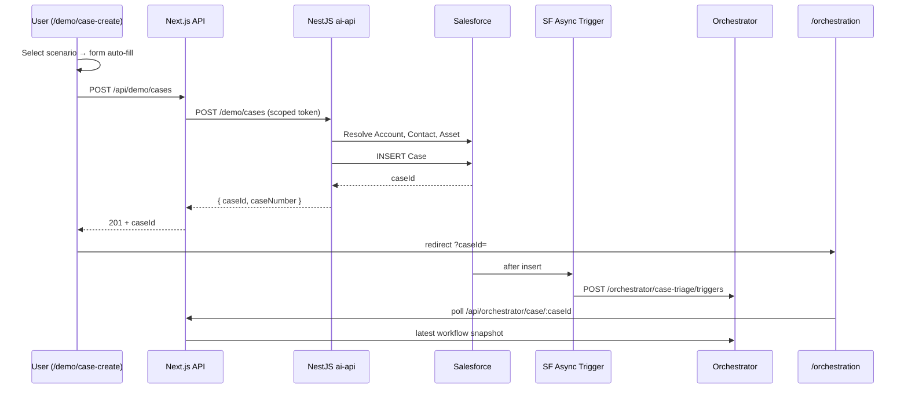

# Demo Case Create — Phase Plan

> **Document type:** Phase plan — React chat demo Case creation form, Salesforce write path, scenario catalog, and orchestration redirect.
> **Audience:** Frontend engineers · NestJS platform engineers · Demo operators · QA.
> **Status:** **PLANNING COMPLETE** — scenario JSON generated from live `AgentForce` org snapshot (2026-06-23).
> **Companions:** [`demo-case-scenarios.json`](../../apps/react-chat-window/data/demo-case-scenarios.json) · [`salesforce-case-create`](../../.agents/skills/salesforce-case-create/SKILL.md) · [`node4-orchestrator-case-scenarios.md`](../testing/node4-orchestrator-case-scenarios.md) · [`case-triage-orchestrator-flow.md`](./case-triage-orchestrator-flow.md) §6

---

## 1. Executive summary

Operators and stakeholders need a **one-click demo path** from “pick a scenario” → **create a real Salesforce Case** → **watch the orchestrator live** — without running `sf` CLI commands or hand-copying Case descriptions.

This plan adds:

1. A rich public page at **`/demo/case-create`** in the React chat window app.
2. A **scenario catalog JSON** grounded in live org inventory, technician skills, warehouse mappings, and proven Case recipes.
3. A **server-side Case create API** (NestJS write gateway + Next.js proxy) that resolves Account/Contact/Asset lookups and inserts a Case.
4. **Immediate redirect** to `/orchestration/stepped?workflowId={wf-id}` after successful create (stepped run auto-started).

Salesforce remains the system of record. The async Case trigger continues to hand off to the NestJS orchestrator. The demo form is **not** the customer chat escalation path — it is a dedicated engineering/demo surface.

### 1.1 Explicit boundaries

| Surface                               | Role                                                      |
| ------------------------------------- | --------------------------------------------------------- |
| `/demo/case-create`                   | Create Case + redirect to **stepped** console (this plan) |
| `/orchestration/stepped?workflowId=…` | Manual per-node demo console (stepped run)                |
| `/orchestration?caseId=…`             | Read-only engineering workflow observability (existing)   |
| `/` customer chat                     | RAG chat + escalation acknowledgement only (unchanged)    |
| `EscalationDialog`                    | Does not write to Salesforce (unchanged)                  |

---

## 2. User goals

1. Select a **pre-built scenario** from a dropdown; form auto-fills with realistic subject, description, ship-to, and lookups.
2. See **what will happen** (parts path, scheduling, guardrail) before submit via scenario cards/badges.
3. Submit → Case created in Salesforce → **instant redirect** to orchestration console for that Case Id.
4. Optionally use **Custom case** for manual exploratory input.
5. Re-run demos without CLI — suitable for stakeholder walkthroughs.

---

## 3. Scenario catalog (shipped JSON)

**Source of truth:** `apps/react-chat-window/data/demo-case-scenarios.json`

Generated from live `AgentForce` org queries on 2026-06-23:

- 4 warehouses (`WH-AUS-001` … `WH-FRA-004`)
- 12 `ProductItem` rows + `SP-TEST-OOS` (zero stock)
- 2 active `ServiceResource` technicians with Field Service skills
- 2 active `ServiceTerritory` records

| Scenario id                    | Label                               | Primary path                                             |
| ------------------------------ | ----------------------------------- | -------------------------------------------------------- |
| `same-day-battery-fix`         | Same-day battery fix                | Local stock → book → **autoApprove** (ref Case 00001054) |
| `display-transfer`             | Display repair — warehouse transfer | SJO → AUS transfer                                       |
| `manager-approval-mixed-parts` | Mixed parts — manager approval      | Partial → **requireHumanApproval** (ref 00001060 recipe) |
| `backorder-critical-part`      | Critical part — backorder           | `SP-TEST-OOS` → backorder                                |
| `eu-thermal-repair`            | EU thermal repair                   | Frankfurt fulfillment                                    |
| `high-risk-escalate`           | High-risk display — escalate        | **escalate** terminal (ref Case 00001050)                |
| `incompatible-keyboard`        | Wrong keyboard for laptop model     | Compatibility friction                                   |
| `custom`                       | Custom case                         | Blank form                                               |

**Refresh script:** `./scripts/sf/generate-demo-case-scenarios.sh AgentForce` updates `inventorySnapshot` + `generatedAt` from SOQL. Curated scenario templates are preserved unless `REGENERATE_ALL=1` (future).

**Critical Node 4 rule (carried from skill):** only list `SP-*` codes in the description that you intend the planner to act on. Extra codes change fulfillment from `ready` → `partial`.

---

## 4. End-to-end flow



---

## 5. Architecture

### 5.1 Frontend (`apps/react-chat-window`)

| Artifact                            | Purpose                                     |
| ----------------------------------- | ------------------------------------------- |
| `app/demo/case-create/page.tsx`     | Server page shell; loads catalog            |
| `components/DemoCaseCreateForm.tsx` | Scenario select, preview card, form, submit |
| `lib/demo-case-scenarios.ts`        | Types + `loadScenarioCatalog()`             |
| `data/demo-case-scenarios.json`     | Catalog (committed)                         |

**UX requirements (rich design):**

- Hero section with short product story (“Test the full AI service workflow”).
- Scenario dropdown with searchable select or card grid on desktop.
- Preview panel: badges (Parts / Scheduling / Guardrail), `expectedOutcome.summary`, `inventoryBasis` chips.
- Editable fields: subject, description, priority, ship-to (city/state/country), read-only lookup summary (account, asset serial).
- Primary CTA: **Create case & watch workflow →**
- Loading state during create; error toast with safe message (no SF stack traces).
- Link to orchestration console in header.
- Responsive: stacked on mobile, two-column on `lg+`.
- Use existing shadcn/ui primitives (`Button`, `Input`, `Textarea`, `Select`, `Card`, `Badge`, `Alert`).

**Post-create:** `router.push(\`/orchestration?caseId=${caseId}\`)` — no intermediate confirmation screen.

### 5.2 Next.js API proxy

| Route                         | Method | Behavior                                                 |
| ----------------------------- | ------ | -------------------------------------------------------- |
| `app/api/demo/cases/route.ts` | POST   | Validate DTO; attach server-only bearer; proxy to NestJS |

Optional read route:

| Route                             | Method | Behavior                                    |
| --------------------------------- | ------ | ------------------------------------------- |
| `app/api/demo/scenarios/route.ts` | GET    | Return catalog JSON (or import static file) |

**Auth model (pick one in implementation — recommended: A):**

- **A (recommended):** No customer login required. Gate create behind env `DEMO_CASE_CREATE_ENABLED=true` on Railway. Rate-limit at Next.js layer. Acceptable for demo org.
- **B:** Reuse operator orchestration session cookie (RC-8a) if demo create should be operator-only.

Document chosen model in `apps/react-chat-window/README.md`.

### 5.3 NestJS (`apps/ai-api`)

| Artifact                                      | Purpose                                       |
| --------------------------------------------- | --------------------------------------------- |
| `salesforce/salesforce-case-write.gateway.ts` | Resolve lookups + `createCase` via REST       |
| `demo/demo-case-create.service.ts`            | Map DTO → SF fields; validate part-code hints |
| `demo/demo-case-create.controller.ts`         | `POST /demo/cases`                            |
| `demo/dto/demo-case-create.dto.ts`            | Request/response validation                   |

**Lookup resolution (never trust client Ids):**

```text
accountLookup.name     → SOQL Account LIMIT 1
contactLookup.email    → SOQL Contact on Account LIMIT 1 (optional)
assetLookup.serialNumber → SOQL Asset LIMIT 1
```

**Case insert fields (minimum):**

- `Subject`, `Description`, `Status`, `Origin`, `Priority`
- `AccountId`, `ContactId` (when resolved), `AssetId`
- `SuppliedName`, `SuppliedEmail`
- `Service_Ship_To_City__c`, `Service_Ship_To_State__c`, `Service_Ship_To_Country__c`

Mirror [`salesforce-case-create` SKILL](../../.agents/skills/salesforce-case-create/SKILL.md). Do not invent unsupported fields.

**Response:**

```json
{
  "caseId": "500…",
  "caseNumber": "00001234",
  "orchestrationUrl": "/orchestration?caseId=500…"
}
```

**Scopes:** New scope `agentforce:demo-case-create` on a dedicated server token (`AI_API_DEMO_CASE_CREATE_TOKEN`) — never exposed to browser; only Next.js proxy holds it.

---

## 6. Phase breakdown

| Phase    | Scope                                                 | Exit criteria                                                              |
| -------- | ----------------------------------------------------- | -------------------------------------------------------------------------- |
| **DC-0** | Plan + JSON catalog + refresh script                  | This doc + `demo-case-scenarios.json` committed                            |
| **DC-1** | NestJS write gateway + `POST /demo/cases` + DTO tests | Unit tests green; mocked SF insert                                         |
| **DC-2** | Next.js proxy + env wiring                            | Proxy tests; 503 when token unset                                          |
| **DC-3** | `/demo/case-create` UI                                | Scenario select, form fill, submit, redirect                               |
| **DC-4** | Live proof                                            | Create each preset scenario → orchestration loads; assert node progression |
| **DC-5** | Docs + skill update                                   | Update `salesforce-case-create` SKILL with UI path; README section         |

**Recommended order:** DC-0 → DC-1 → DC-2 → DC-3 → DC-4 → DC-5.

---

## 7. Testing plan

### 7.1 Unit / contract

- DTO validation: required subject/description/ship-to; priority enum; lookup shapes.
- Gateway: mock SF composite — resolve + insert; degrade on missing Account/Asset.
- Next.js proxy: forwards body; strips secrets; maps 4xx/5xx safely.

### 7.2 UI

- Select each scenario → form fields match catalog `form`.
- Custom scenario → empty subject/description.
- Submit success → `router.push` called with returned `caseId`.
- Submit failure → inline error, no redirect.

### 7.3 Live smoke (org `AgentForce`)

```bash
# After deploy
curl -sS -X POST "${REACT_CHAT_URL}/api/demo/cases" \
  -H "content-type: application/json" \
  -d '{"scenarioId":"same-day-battery-fix"}' | jq .

# Poll orchestration
curl -sS "${REACT_CHAT_URL}/api/orchestrator/case/<CASE_ID>" | jq '.status'
```

Assert:

1. Case insert returns 18-char Id.
2. Within 60s, orchestration snapshot `status` leaves `pending`/`running`.
3. `same-day-battery-fix` → `partsLogistics.fulfillmentReadiness` = `ready` (when inventory unchanged).
4. `manager-approval-mixed-parts` → `waiting_approval` when guardrail SF approval enabled.

---

## 8. Security and observability

- **No Salesforce credentials in the browser.** All writes server-side.
- **No raw PII in logs** — log `scenarioId`, `caseId`, lookup hashes only.
- **Rate limit** `POST /api/demo/cases` (e.g. 10/min/IP) — demo surface is public.
- **Feature flag** `DEMO_CASE_CREATE_ENABLED` — default `false` in production until approved.
- **Do not** reuse customer chat JWT for SF writes.

---

## 9. Files to create / touch (implementation checklist)

| Path                                                          | Action        |
| ------------------------------------------------------------- | ------------- |
| `apps/react-chat-window/data/demo-case-scenarios.json`        | ✅ Created    |
| `apps/react-chat-window/data/demo-case-scenarios.schema.json` | ✅ Created    |
| `scripts/sf/generate-demo-case-scenarios.sh`                  | ✅ Created    |
| `apps/react-chat-window/app/demo/case-create/page.tsx`        | Create        |
| `apps/react-chat-window/components/DemoCaseCreateForm.tsx`    | Create        |
| `apps/react-chat-window/lib/demo-case-scenarios.ts`           | Create        |
| `apps/react-chat-window/app/api/demo/cases/route.ts`          | Create        |
| `apps/ai-api/src/demo/*`                                      | Create module |
| `apps/ai-api/src/salesforce/salesforce-case-write.gateway.ts` | Create        |
| `.github/prompts/implement-demo-case-create.prompt.md`        | ✅ Created    |
| `.claude/commands/implement-demo-case-create.md`              | ✅ Created    |

---

## 10. Out of scope (this phase)

- Auto-running seed scripts from the UI (inventory is already aligned for current scenarios).
- Customer chat Case creation (Phase 0 UAT path remains separate).
- Approve/Reject controls on orchestration console (read-only + Stop AI only).
- Multi-org scenario catalogs (single `AgentForce` catalog v1).

---

## 11. Success criteria

1. A non-engineer can open `/demo/case-create`, pick **Same-day battery fix**, submit, and land on a live orchestration view within seconds.
2. All 7 curated scenarios (excluding custom) match documented `expectedOutcome` when org inventory is unchanged.
3. `npm run react-chat:typecheck` and `npm run ai-api:test` pass for touched layers.
4. Catalog refresh script updates inventory snapshot without hand-editing JSON.

---

## 12. Implementation harness

Use **`.github/prompts/implement-demo-case-create.prompt.md`** (slash command: `/implement-demo-case-create`).

Do not replan in the implementation session unless a blocker requires a spike.
