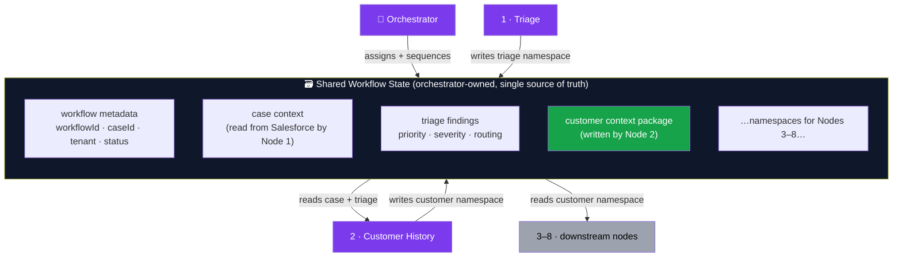
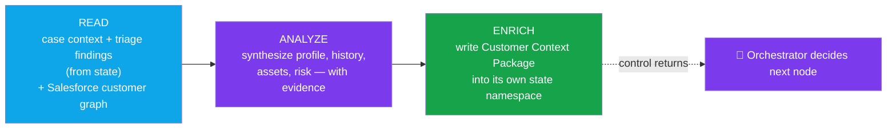
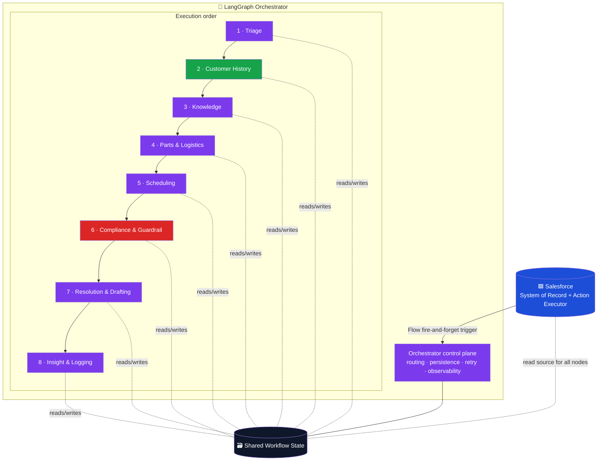
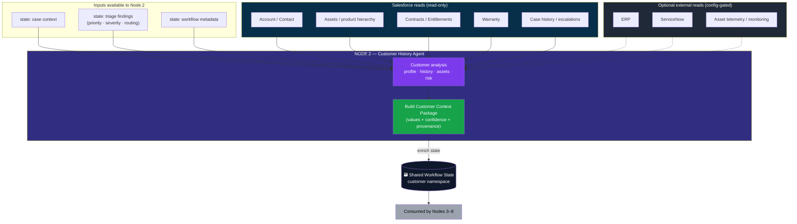
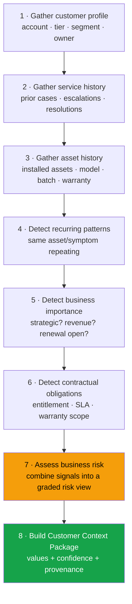
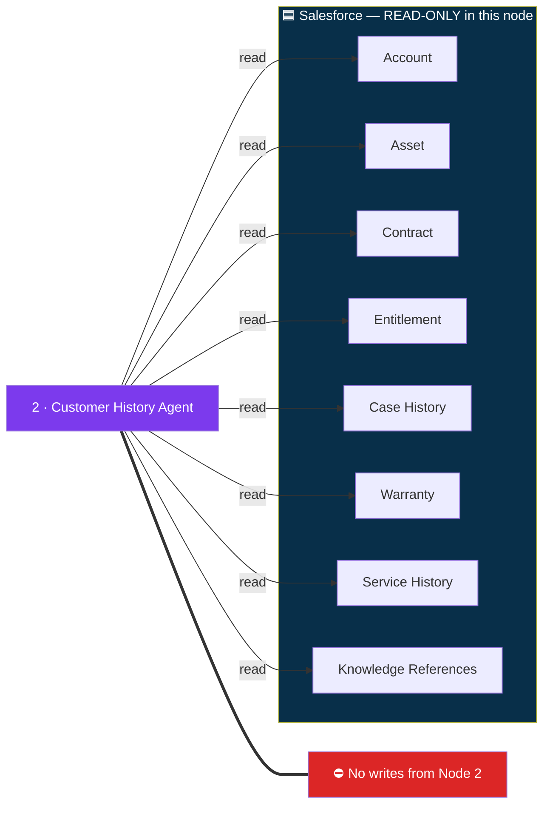
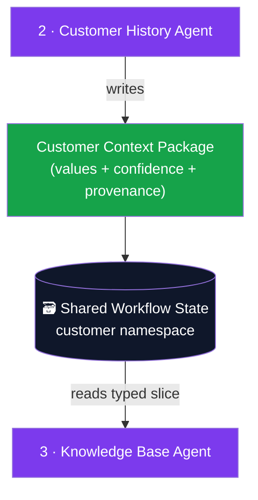
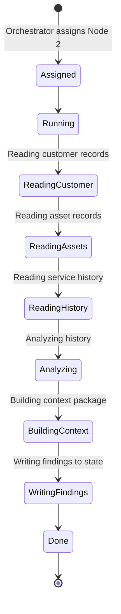
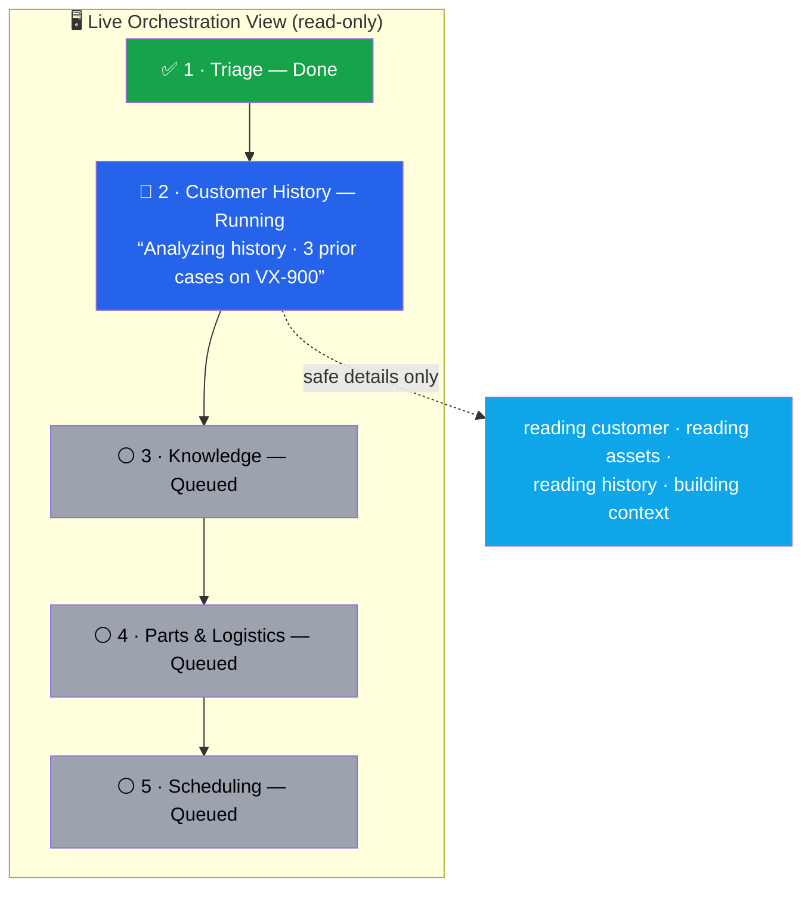

# Node 2 — Customer History Agent — Architecture & Design

> **Document type:** Formal enterprise architecture & design specification.
> **Audience:** Salesforce Architects · AI Architects · Platform Engineers · Service Operations Leadership · Enterprise Architecture Review Board.
> **Status:** Conceptual design. No DTOs, no API schemas, no implementation code. This document defines _what_ Node 2 is, _where_ it sits, _what_ it reads and writes into shared workflow state, and _how_ it would eventually ship as a thin slice consistent with the already-shipped Node 1 walking skeleton.
> **Companion:** [`case-triage-orchestrator-flow.md`](./case-triage-orchestrator-flow.md) — the initial flow plus the shipped Node 1 slice. This document is to Node 2 what §3 (inside the orchestrator) and §7 (implemented slice) of that file are to Node 1.

**Program invariants (unchanged across all nodes):**

- **Salesforce** = System of Record **+** Action Executor.
- **LangGraph** = Orchestrator / Brain. Owns control flow; nodes never own it.
- **Flow** = fire-and-forget trigger only. It never waits on model work.
- **Each node** = a narrow specialist that reads shared state, does exactly one job, enriches shared state, and returns control to the orchestrator.

---

## 1. Executive Summary

Node 2 — the **Customer History Agent** — is the orchestrator's **context-enrichment stage**. After Node 1 classifies the incoming Case (priority, severity, routing queue), the orchestrator advances to Node 2 to answer one question before any _operational_ node acts:

> **"Who is this customer, what has happened before, what equipment is involved, and what is at stake?"**

Node 2 turns a bare Case into a **situated** Case. It assembles a **Customer Context Package** — account profile, entitlement and SLA class, warranty posture, installed-asset summary, prior-incident and escalation history, repeat-failure signals, and a business-risk assessment — and writes that package into the **shared workflow state**.

Node 2 makes **no operational commitments**. It schedules nothing, reserves nothing, promises nothing, and **writes nothing back to Salesforce**. Its entire value is _context made explicit, structured, and trustworthy_ so that every later node reasons from the same grounded picture instead of starting blind.

**Position in the graph:** Node 2 is the second stage in the linear chain
`Triage → Customer History → Knowledge → Parts & Logistics → Scheduling → Compliance & Guardrail → Resolution & Drafting → Insight & Logging`.
Unlike Node 6, it is a **non-interrupting** node: it always auto-hands-off and never pauses for human approval.

**Why customer context is critical:** a P1 from a strategic, premium, repeat-failure account is a fundamentally different operational reality than a P1 from a small, transactional, first-time reporter — yet triage labels them identically. Node 2 supplies the difference that downstream nodes need to act correctly.

**How downstream nodes consume its outputs:**

| Node                       | Consumes from Node 2                                          |
| -------------------------- | ------------------------------------------------------------- |
| 3 · Knowledge Base         | Product family, warranty status, prior fixes                  |
| 4 · Parts & Logistics      | Installed asset model, entitlement, warranty                  |
| 5 · Scheduling             | SLA class, business risk, geography signals                   |
| 6 · Compliance & Guardrail | Entitlement, contract limits, strategic-account flag          |
| 7 · Resolution & Drafting  | Customer tier, history, sentiment evidence                    |
| 8 · Insight & Logging      | Repeat-failure indicators, account importance, renewal signal |

Because the orchestrator owns state and sequencing, Node 2 **never calls another node directly**. It reads what Node 1 left in state, **independently** reads the authoritative customer data from Salesforce, enriches state, and returns control. This keeps the customer-context capability replaceable, unit-testable, and independently observable — the same discipline that governs the shipped Node 1 slice.

---

## 2. Mental Model

**Why Customer History exists.** Triage tells you _how urgent_ and _where to route_. It does not tell you _who you are dealing with_. Without context, agents start blind, re-ask customers for facts the company already knows, treat chronic problems as isolated tickets, and make downstream decisions (parts, scheduling, communication) with no entitlement grounding. Node 2 is the cure for "blind start."

**Why it runs after Triage, not before.** Triage's cheap classification _narrows the context that matters_. A networking outage makes installed networking assets and prior router incidents the relevant history; running context first would spend reads on dimensions triage may render irrelevant. Triage decides the lane; **context decides how the lane is driven.**

**What business problem it solves.** It converts scattered, system-of-record truth into a single, structured, decision-ready picture — so the organization responds to the _customer_, not just the _ticket_.

**What decisions later nodes depend on.** Entitlement gates parts and dispatch. SLA class gates scheduling urgency. Warranty status gates cost handling. Repeat-failure and strategic-account signals gate escalation and proactive outreach. Every one of these is a Node 2 output.

**Why Salesforce acts primarily as a data source here.** The authoritative customer graph — Account, Contact, Asset, Contract, Entitlement, Case history — lives in Salesforce. Node 2's job is to **read and synthesize**, never to mutate. The only Salesforce write in the program's early slices is the Node 1 triage write-back, and that is approval-gated. Node 2 deliberately performs **zero** Salesforce writes.

**Why this node avoids operational decisions.** Separation of concerns. If Node 2 both _assessed_ risk and _acted_ on it (auto-escalation, auto-dispatch), it would couple analysis to action and make the Guardrail node redundant. Node 2 produces **signals**; Nodes 5 and 6 decide what to **do** with them.

**Why it enriches state rather than controlling workflow.** The orchestrator owns control flow. A node that tried to redirect the graph would fracture the single source of sequencing truth and defeat replay and observability. Node 2 contributes **facts with confidence and provenance**; the orchestrator and its conditional edges decide routing.

> **One-line mental model:** _Node 1 says "this is a critical networking outage, route to the Network team." Node 2 says "and it is RetailCo — premium SLA, 420 routers installed, two identical failures in 30 days, renewal open." It states the situation; it does not act on it._

---

## 3. Orchestrator & State Model

### 3.1 What the orchestrator owns

| Concern               | Owned by orchestrator                                        |
| --------------------- | ------------------------------------------------------------ |
| Workflow state        | The single shared object every node reads from and writes to |
| Routing               | Which node runs next, including conditional edges            |
| Conditional execution | Skip a node when its required inputs are absent              |
| Parallelization       | Fan out independent reads, then join                         |
| Persistence           | Checkpointer + durable snapshot; restart-safe                |
| Pause / resume        | Interrupts at approval gates (Node 6) — **never** Node 2     |
| Retry handling        | Per-node retry with idempotent, side-effect-free reads       |
| Observability         | Status events + telemetry spans for every node transition    |

### 3.2 What Node 2 owns

- **Customer analysis** — synthesizing many reads into one coherent picture.
- **Customer context generation** — producing the Customer Context Package.
- **State enrichment** — writing that package into its **own namespace** in shared state.

Node 2 owns _analysis_, not _control_ and not _action_.

### 3.3 Shared Workflow State — the contract surface

**How nodes read state.** Each node reads a **typed slice** — Node 2 reads the `case context` and `triage findings` slices. It does not receive a free-text "handoff note."

**How nodes write state.** Each node writes its **own typed slice** — Node 2 writes only the `customer context package` namespace. It never edits another node's slice.

**Why not textual summaries.** A prose summary ("premium customer with repeat issues") is lossy, unparseable, and unverifiable. It cannot be filtered, thresholded, or audited. A structured `customerTier`, `repeatIncidentCount`, and `slaClass` — each with **confidence** and **provenance** — can be branched on by downstream logic and inspected by a reviewer. **Downstream nodes must branch on values, not parse English.**

**Why shared state over direct agent-to-agent coupling.** If Node 2 called Node 3 directly it would (a) hard-wire execution order, (b) prevent the orchestrator from parallelizing or skipping, (c) bypass the central checkpoint/replay, and (d) make each node impossible to test without its neighbors. Shared state keeps nodes **independent** and the orchestrator **authoritative**.

### 3.4 Read → Analyze → Enrich (Node 2's internal contract with state)

> **Decoupling guarantee:** Node 2 consumes Node 1 findings **from shared state**, not from the success of Salesforce write-back. Whether the triage PATCH/CaseComment landed in Salesforce is irrelevant to Node 2 — it reads triage from state and reads the authoritative customer data itself. This is why the program treats the Salesforce triage write-back as a side effect, not a dependency edge between nodes.

---

## 4. Node Position in the Graph

### 4.1 Overall orchestration architecture (execution order + shared-state plane)

The chain shows **execution order**; the dotted lines show the **shared-state plane** every node touches. Node 6 (red) is the only interrupting node. Node 2 (green) is highlighted as the subject of this document.

### 4.2 Expanded Node 2 view

Solid arrows are **always-on** inputs; dotted arrows are **optional, config-gated** external reads that degrade gracefully when unavailable.

---

## 5. Inputs

> Conceptual only. Purpose and business value of each input — no DTOs, no schemas.

### 5.1 From Workflow State (already in shared state)

| Input             | Purpose / business value                                                             |
| ----------------- | ------------------------------------------------------------------------------------ |
| Case context      | The anchor — subject, description, origin, and the linked Account id to scope reads. |
| Priority (Node 1) | Weights risk: a high-priority Case on a strategic account elevates the risk score.   |
| Severity (Node 1) | Distinguishes business impact from urgency when assessing chronic-issue exposure.    |
| Routing decision  | Confirms the relevant product/skill domain, narrowing which history matters.         |
| Workflow metadata | `workflowId`, `caseId`, tenant, correlation id — for scoping, audit, and telemetry.  |

> **Resilience rule:** Node 2 **must not depend solely on Node 1 output.** Triage findings are _hints_ that improve the risk weighting. If they are absent (partial failure or a skipped triage), Node 2 still runs using Case context plus its own authoritative Salesforce reads — it simply omits the triage-weighted refinements rather than failing.

### 5.2 From Salesforce (authoritative customer graph — read-only)

| Input                      | Purpose / business value                                                      |
| -------------------------- | ----------------------------------------------------------------------------- |
| Account                    | Identity, tier, segment, ownership — the spine of "who is this customer."     |
| Contacts                   | Stakeholder mapping (e.g., VP Store Ops) for relationship and notification.   |
| Assets / product hierarchy | What equipment is in play, model lineage, deployment batch.                   |
| Entitlements               | Whether the customer is contractually owed this service and at what level.    |
| Contracts                  | Support agreement scope, term, and renewal posture.                           |
| Warranty                   | Cost-handling posture and RMA eligibility for the involved asset.             |
| Service history / cases    | Prior incidents, escalations, and resolutions — the basis for repeat-failure. |

### 5.3 From External Systems (optional, config-gated read adapters)

| Input                        | Purpose / business value                                                   |
| ---------------------------- | -------------------------------------------------------------------------- |
| ERP                          | Commercial truth (orders, invoices, install base) Salesforce may not hold. |
| ServiceNow                   | The originating incident record for customers who intake there.            |
| Asset telemetry / monitoring | Real-time health signals that corroborate or refute the reported symptom.  |

Each external source is **behind an adapter interface**, **off by default**, and **degrades gracefully** — its absence lowers confidence on the affected findings but never blocks the node.

---

## 6. Internal Agent Reasoning

How the Customer History Agent _thinks_ — an evidence-first pipeline, not a free-association.

**What signals matter**

- **Entitlement & SLA** are decisive — they gate every downstream operational choice.
- **Repeat failure on the same asset/model** is the strongest risk amplifier.
- **Open renewal / strategic flag** raises relationship stakes.
- **Asset warranty status** governs cost handling and RMA eligibility.

**What evidence is required**

- Every asserted value must trace to a **concrete source record** (an Account field, an Entitlement record, N prior Case records). The agent records _that_ a source exists and _which_ record class it came from — never the raw payload.
- A "repeat failure" claim requires **enumerable prior cases**, not a vibe.
- A "strategic account" claim requires an **explicit field or signal**, not an inference from spend or name.

**What must never be inferred without evidence**

- ❌ **Strategic importance** — only from an explicit account flag/segment, never guessed.
- ❌ **Warranty coverage** — only from an actual warranty/entitlement record, never assumed from product age.
- ❌ **Customer sentiment** — only from recorded signals (CSAT, escalation notes), never imagined from tone.
- ❌ **Entitlement** — only from a real Entitlement/Contract, never implied by tier name.

> **Evidence-or-abstain:** when evidence is missing, Node 2 emits the finding with **low confidence and a "not evidenced" marker** — it does **not** fabricate a confident value. Downstream nodes and the Guardrail node treat low-confidence findings conservatively.

---

## 7. Workflow State Contract

> Conceptual. Describes responsibilities over shared state — no DTOs, no code.

### 7.1 What Node 2 reads

- Case context (subject, description, origin, linked Account id).
- Triage findings — priority, severity, routing recommendation.
- Workflow metadata — workflowId, caseId, tenant, correlation id.

### 7.2 What Node 2 writes (its own namespace only)

- Customer tier.
- SLA classification.
- Warranty status (for the involved asset).
- Repeat-incident indicator (+ count and window).
- Escalation history summary (structured, not prose).
- Strategic-account indicator.
- Installed-asset summary.
- Open-incident count.
- Business-risk assessment (graded).

### 7.3 What Node 2 must never overwrite

| Protected slice             | Why it is immutable to Node 2                                       |
| --------------------------- | ------------------------------------------------------------------- |
| Original Case data          | System-of-record truth; Node 2 reads it, never edits it.            |
| Triage decisions (Node 1)   | Another node's authoritative output; overwriting breaks provenance. |
| Workflow ownership metadata | Orchestrator-owned; nodes never mutate control/sequencing fields.   |

> **Append-and-own discipline:** Node 2 writes **only** under the customer namespace. Cross-namespace writes are an architectural violation — they would let one node corrupt another's findings and defeat replay.

### 7.4 Confidence & Provenance

Every written finding carries four metadata facets so the package is **auditable**, not just present:

| Facet                    | Meaning                                                                                                           |
| ------------------------ | ----------------------------------------------------------------------------------------------------------------- |
| **Confidence**           | Graded (high / medium / low) — downgraded automatically when sources are missing.                                 |
| **Provenance**           | Which system + record _class_ supplied it (e.g., "Salesforce Entitlement"), by reference — never the raw payload. |
| **Evidence basis**       | What was actually observed (e.g., "2 prior Cases on Asset model VX-900 in 30 days").                              |
| **Asserted vs inferred** | A flag separating directly-read facts from synthesized conclusions.                                               |

This makes the Guardrail node's later job possible: it can require human approval precisely when a high-impact decision rests on a **low-confidence or inferred** customer signal.

---

## 8. Customer Context Package

The single structured output Node 2 enriches state with. Each field is a **value + confidence + provenance**, consumed by branching logic downstream.

| Output                   | What it means                                          | How later nodes use it                                               |
| ------------------------ | ------------------------------------------------------ | -------------------------------------------------------------------- |
| Customer tier            | Premium / standard / etc.                              | Scheduling urgency; Resolution tone; Guardrail communication limits. |
| SLA class                | Contractual response/restore target                    | Scheduling window selection; Guardrail SLA-risk escalation rule.     |
| Warranty status          | Covered / expired / RMA-eligible for the asset         | Parts cost handling; Knowledge RMA path; Resolution wording.         |
| Repeat-issue indicator   | Recurring failure (+ count, window)                    | Insight trend correlation; Guardrail escalation; risk weighting.     |
| Escalation history       | Structured prior-escalation record                     | Guardrail risk; Resolution context; routing sensitivity.             |
| Strategic-account flag   | Explicitly-flagged key account                         | Guardrail approval bar; Insight account-manager outreach.            |
| Installed-asset summary  | Models, counts, deployment batch                       | Knowledge product scoping; Parts compatibility; Scheduling skill.    |
| Open-incident count      | Concurrent active incidents                            | Risk amplification; Scheduling prioritization.                       |
| Business-risk assessment | Graded composite (revenue, chronic, strategic, volume) | Scheduling priority; Guardrail approval; Insight reporting.          |

> **Design rule:** the package is **descriptive, never prescriptive**. It says "premium SLA, repeat failure, renewal open, high business risk." It does **not** say "escalate" or "dispatch Angela" — those are decisions for Nodes 5/6.

---

## 9. Salesforce Read Architecture

**Data-ownership boundaries**

- **Salesforce owns the data.** Node 2 owns the _interpretation_, held in workflow state — never written back here.
- **Single seam.** All reads go through a read-only customer gateway (the Node 2 analogue of the shipped `SalesforceCaseGateway`). Nodes never touch raw HTTP or Named Credential wiring.
- **Tenant-scoped, Account-anchored.** Every read is scoped to the Case's `AccountId` and the workflow's tenant. Node 2 issues **no cross-account queries** — this is the primary defense against cross-customer contamination (§12).
- **Idempotent & retry-safe.** All reads are side-effect-free, so the orchestrator can retry the node freely.

---

## 10. Handoff to Node 3

**What Node 3 reads from state (not a narrative):**

| Node 3 needs           | Node 2 state field it reads               |
| ---------------------- | ----------------------------------------- |
| Asset information      | Installed-asset summary                   |
| Product family         | Installed-asset summary (model hierarchy) |
| Warranty status        | Warranty status                           |
| Previous fixes         | Service history / escalation summary      |
| Customer tier          | Customer tier                             |
| Repeat-incident signal | Repeat-issue indicator                    |
| Business risk          | Business-risk assessment                  |

> **Emphasis:** Node 3 reads **structured workflow state**, not a prose handoff. The orchestrator runs Node 3 _after_ Node 2 has enriched state; Node 3 pulls the exact typed fields it needs and branches on their values. There is no direct Node 2 → Node 3 call.

---

## 11. Screen Flow Visibility

> The UI is **read-only observability**, identical in philosophy to the shipped Node 1 view: it shows _thinking and stages_. **No approvals occur in Node 2** — it is a non-interrupting node.

### 11.1 Node 2 status lifecycle (fine-grained progress)

> **Consistency note:** the shipped lifecycle vocabulary is `assigned · running · done · waiting_approval · rejected · failed`. The fine-grained steps above (_Reading customer records_, _Analyzing history_, _Building context_, …) are **safe progress lines under `running`** — carried as sanitized `safeSummary` + non-PII `details`, exactly like Node 1's "Reading Case context" / "Running AI triage" events. They are **not** new lifecycle statuses. Node 2 never enters `waiting_approval`.

### 11.2 Live progress panel (what the user sees)

The panel shows the customer agent **picked up the case**, **what stage it is in**, and **what it found so far** — using only sanitized, non-PII details (counts, model names, confidence), never raw customer records.

---

## 12. Risks & Guardrails

### 12.1 Hallucination risks

| Risk                              | Architecture-level control                                                  |
| --------------------------------- | --------------------------------------------------------------------------- |
| Assuming **strategic importance** | Evidence-required: only from an explicit account flag; else low confidence. |
| Assuming **warranty coverage**    | Evidence-required: only from a real warranty/entitlement record.            |
| Assuming **customer sentiment**   | Evidence-required: only from recorded CSAT/escalation signals.              |
| Inflated **repeat-failure**       | Must enumerate concrete prior Case records; count is auditable.             |

### 12.2 Data-quality risks

| Risk                     | Architecture-level control                                                                           |
| ------------------------ | ---------------------------------------------------------------------------------------------------- |
| Missing assets           | Confidence downgrade + "incomplete asset data" marker; node still completes.                         |
| Duplicate accounts       | Account-anchored read from the Case's `AccountId`; flag potential duplicates, do not merge silently. |
| Incomplete contracts     | SLA/entitlement findings marked low confidence; Guardrail node treats conservatively.                |
| Outdated service records | Provenance + recency captured so downstream weighting can discount stale signals.                    |

### 12.3 Security risks

| Risk                             | Architecture-level control                                                                                           |
| -------------------------------- | -------------------------------------------------------------------------------------------------------------------- |
| Exposing customer-sensitive data | Status events carry only sanitized, non-PII details; raw records never leave the gateway boundary.                   |
| Unauthorized data aggregation    | Reads scoped to the workflow's tenant + the Case's Account; least-privilege service identity.                        |
| **Cross-customer contamination** | **No cross-account queries**; every read is keyed by the single resolved `AccountId`; tenant assertion on each call. |
| Over-retention in state          | State holds interpretations + references, not raw PII payloads; persisted snapshot is sanitized.                     |

### 12.4 Mitigation summary

- **Evidence-or-abstain** for every asserted value (confidence + provenance + evidence basis).
- **Single read-only gateway seam** with tenant + Account scoping; no raw HTTP in nodes.
- **PII minimization**: workflow state and status events store sanitized facts and references, never raw customer records, names, or contact details.
- **No writes** from Node 2 — eliminating an entire class of data-integrity and authorization risk.
- **Idempotent, retry-safe reads** so orchestrator retries cannot cause side effects.

---

## 13. Future Implementation Slice

> How Node 2 would eventually ship — conceptual but realistic, mirroring the shipped Node 1 slice (`@langchain/langgraph` `StateGraph` + `MemorySaver`/durable checkpointer, `ModelRouter` reuse, scope-gated endpoints, sanitized status events). **No code, no DTOs.**

**LangGraph node.** Add a `customerHistory` node to the same `StateGraph`, inserted between `runTriage` and the existing terminal path so the chain becomes
`readContext → runTriage → customerHistory → gate → …`.
It is a **non-interrupting** node — no `interrupt(...)`, always auto-hands-off. Anything it does must stay deterministic enough to survive a checkpoint replay (reads are idempotent; synthesis is pure over the reads).

**Workflow state integration.** Extend the shared state annotation with a **customer-context channel** (its own namespace) plus a small provenance/confidence sidecar. Node 2 writes only that channel; existing triage channels remain read-only to it. The broader state object evolves from the Node-1-only `CaseTriageState` toward a multi-node `ServiceWorkflowState` without breaking the Node 1 slice.

**Salesforce gateway.** Introduce a **read-only customer gateway** (the analogue of `SalesforceCaseGateway`) exposing intent-named reads — account, assets, contracts, entitlements, case history, warranty — each tenant- and Account-scoped, idempotent, and mapped into vendor-neutral shapes. **No write methods exist on this gateway.**

**External read adapters.** ERP / ServiceNow / telemetry sit behind **adapter interfaces**, each independently **config-gated and off by default**. A missing adapter lowers confidence on the affected findings; it never fails the node. Adapters are mockable for unit tests, exactly like the Node 1 graph deps.

**Status events.** Reuse the existing status-event read model with `node = "customer_history"`. Emit `running` progress lines for each stage (_reading customer_, _reading assets_, _analyzing_, _building context_, _writing findings_) carrying **sanitized, non-PII `details`** only — counts, model names, confidence — never raw customer data.

**Persistence.** Reuse the orchestration snapshot store/repository (memory | postgres) extended to hold the customer-context channel. Durable writes are **best-effort, write-through, and never throw into the run**, matching Node 1.

**Restart recovery.** The LangGraph checkpointer plus durable snapshot make Node 2 restart-safe: a mid-flight workflow resumes from its last checkpoint, and a completed Node 2's package remains resolvable by `caseId` after an AI API restart via the durable fallback.

**Observability.** A telemetry span per node and per external read, following the program's `gen_ai.*` / workflow-span conventions, no-op-safe and never workflow-breaking.

**Telemetry.** Track read latency per source, number of sources hit, cache hits, confidence distribution of written findings, and degraded-mode occurrences (which adapters were unavailable).

**Audit trail.** Persist a **provenance log** for every finding — source system + record-class reference, evidence basis, confidence, and asserted-vs-inferred flag — **without raw payloads**, so a reviewer can later answer "why did Node 2 say this account was strategic?" deterministically.

---

## 14. Final Deliverables — Summary & Confirmation Points

This document delivered, for Node 2 (Customer History Agent):

| #   | Deliverable                  | Section                  |
| --- | ---------------------------- | ------------------------ |
| 1   | Executive Summary            | §1                       |
| 2   | Mental Model                 | §2                       |
| 3   | Orchestrator & State Model   | §3                       |
| 4   | Detailed Architecture        | §3–§4                    |
| 5   | Mermaid Diagrams             | §3, §4, §6, §9, §10, §11 |
| 6   | Input Responsibilities       | §5                       |
| 7   | Output Responsibilities      | §8                       |
| 8   | Workflow State Contract      | §7                       |
| 9   | Salesforce Interaction Model | §9                       |
| 10  | UI Observability Model       | §11                      |
| 11  | Risk & Guardrail Model       | §12                      |
| 12  | Future Implementation Plan   | §13                      |

**Confirm before implementation begins:**

1. **Node 2 is read-only to Salesforce and write-only to its own state namespace** — zero Salesforce writes, zero cross-namespace writes.
2. **Node 2 is non-interrupting** — it never pauses for approval (that remains Node 6's role).
3. **Findings are structured with confidence + provenance + evidence**, never prose, and **evidence-or-abstain** governs every asserted value.
4. **Reads are tenant- and Account-scoped through a single read-only gateway seam** — the primary control against cross-customer contamination.
5. **Node 2 does not depend solely on Node 1 output** — triage findings are weighting hints; the node still runs from Case context + its own authoritative reads if triage is absent.
6. **The package is descriptive, not prescriptive** — it states the situation; Nodes 5/6 decide what to do with it.

> **Next session:** go deep on Node 3 (Knowledge Base Agent), which consumes this package as its primary input — and define the concrete customer-context state channel shape when we move from design to the implementation slice.
