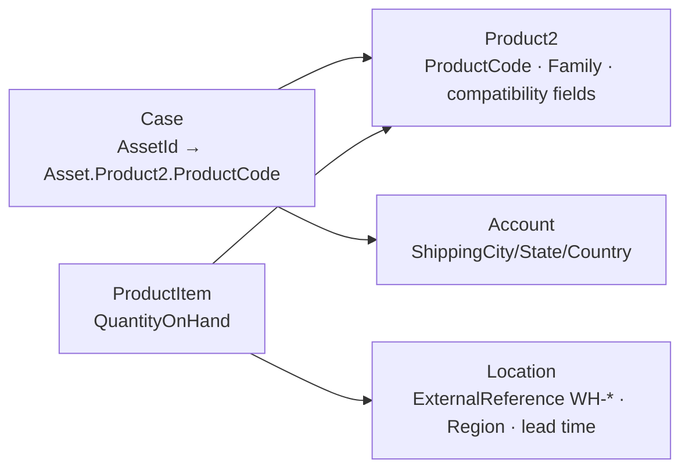
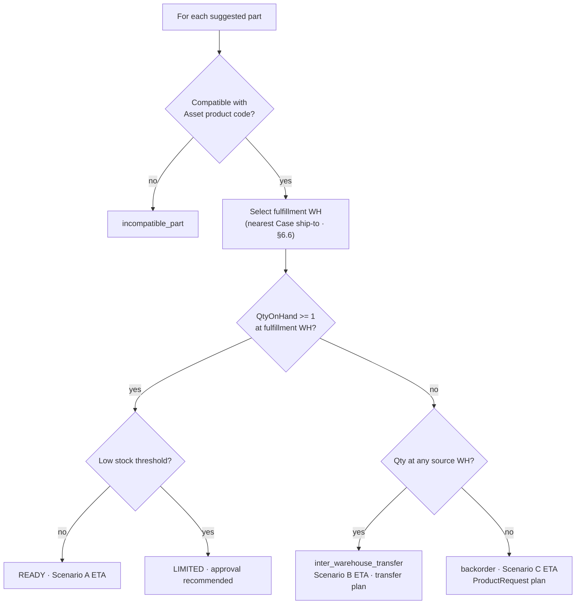

# Node 4 — Parts & Logistics — Phase Plan (Salesforce + Orchestrator)

> **Document type:** Phase 4 implementation plan — Salesforce preparation, exception handling, ETA model, and AI orchestrator contracts.
> **Audience:** Salesforce Architects · AI Architects · Platform Engineers · Service Operations.
> **Status:** **Phases 4-Pre through 4c SHIPPED** on org `AgentForce` (2026-06-15 live proof). See §0.1 and [`node-4-parts-4b-4c-plan.md`](./node-4-parts-4b-4c-plan.md).
> **Companions:** [`case-triage-orchestrator-flow.md`](./case-triage-orchestrator-flow.md) · [`node-3-knowledge-base-agent.md`](./node-3-knowledge-base-agent.md) · seed data [`data/products-and-location-data.json`](../../data/products-and-location-data.json) · skill [`.agents/skills/salesforce-node4-parts-prep/SKILL.md`](../../.agents/skills/salesforce-node4-parts-prep/SKILL.md)

**Program invariants (unchanged):**

- **Salesforce** = system of record + action executor (inventory reads now; reservations/requests after approval).
- **LangGraph** = orchestrator brain; Node 4 is non-interrupting.
- **Node 4** answers: _Are the suggested parts available, from which warehouse, when can they arrive, and what happens if they are not?_

---

## 0. Session context — what is already done (read this first)

> **For new LLM sessions:** Phases **4-Pre**, **4a**, **4b**, and **4c** are shipped on org **`AgentForce`**. Do not re-plan from scratch — extend what ships below.

### 0.1 Phase status matrix

| Phase                                | Status                                | Notes                                                                                                                         |
| ------------------------------------ | ------------------------------------- | ----------------------------------------------------------------------------------------------------------------------------- |
| **4-Pre** Salesforce metadata + data | **Done** on `AgentForce`              | Validated 2026-06-12 via `./scripts/sf/node4-pre-validation.sh`                                                               |
| **4a** AI orchestrator read/plan     | **Done** on `IMP-NODE-4`              | `partsLogistics` channel, inventory gateway, planner, graph node, verdict, UI, smoke shipped                                  |
| **4b** KB warehouse cross-check      | **Done** on `IMP-NODE-4`              | Audit-only alignment; see [`node-4-parts-4b-4c-plan.md`](./node-4-parts-4b-4c-plan.md)                                        |
| **4c** Gated ProductRequest writes   | **Done** on `AgentForce` (2026-06-15) | Live `ProductTransfer` proof workflow `wf-2ffe979b-8f1e-423a-aed9-8966fceab8a3`; deploy via `./scripts/sf/node4-4c-deploy.sh` |

### 0.2 Repo artifacts added (canonical paths)

| Artifact                        | Path                                                                                            | Purpose                                         |
| ------------------------------- | ----------------------------------------------------------------------------------------------- | ----------------------------------------------- |
| Phase plan (this doc)           | `docs/orchestrator/node-4-parts-logistics-phase-plan.md`                                        | Design + shipped-state context                  |
| Deploy manifest                 | `manifest/node4-pre-package.xml`                                                                | Metadata deploy bundle                          |
| Transit rules (AI API fallback) | `data/warehouse-transit-rules.json`                                                             | ETA rules when CMT not read from SF             |
| One-command deploy              | `scripts/sf/node4-pre-deploy.sh`                                                                | Deploy + perm set + backfill + validate         |
| Data backfill                   | `scripts/sf/node4-pre-backfill.sh`                                                              | Product2, Location, duplicate fix, Case ship-to |
| Validation                      | `scripts/sf/node4-pre-validation.sh`                                                            | Phase 4-Pre exit criteria                       |
| Project skill (Cursor)          | `.agents/skills/salesforce-node4-parts-prep/SKILL.md`                                           | Repeatable agent workflow                       |
| Copilot mirror                  | `.github/skills/salesforce-node4-parts-prep/SKILL.md`                                           | Same skill for Claude/Copilot                   |
| Permission set                  | `force-app/main/default/permissionsets/Agentforce_Parts_Logistics_Node4.permissionset-meta.xml` | **Required FLS** for all new fields             |

### 0.3 Metadata shipped to `AgentForce`

| Object                            | Custom fields / records                                                                                                                        |
| --------------------------------- | ---------------------------------------------------------------------------------------------------------------------------------------------- |
| **Product2**                      | `Compatible_Product_Code__c`, `Part_Category__c`, `Is_Universal_Part__c`                                                                       |
| **Location**                      | `Region__c`, `Outbound_Lead_Time_Hours__c`, `Supports_Expedite__c`                                                                             |
| **Case**                          | `Service_Ship_To_City__c`, `Service_Ship_To_State__c`, `Service_Ship_To_Country__c`, `Parts_Fulfillment_Status__c`, `AI_Parts_Plan_Summary__c` |
| **ProductRequestLineItem**        | `Backorder_Reason__c`, `Orchestrator_Workflow_Id__c`                                                                                           |
| **Warehouse_Transit_Rule\_\_mdt** | 5 rows: WH-SJO-002/NA, WH-JCY-003/NA, WH-AUS-001/NA, WH-FRA-004/NA, WH-FRA-004/EU                                                              |

**Product2 field metadata rule (IDE + XSD fix):** do **not** include `<trackHistory>` on Product2 custom fields — it is invalid in `salesforce_metadata_api_common.xsd` and breaks Salesforce Extension validation. Case fields use `trackTrending`; Product2 fields omit history tracking entirely.

### 0.4 Data backfill results (`AgentForce`)

| Item                          | Result                                                                                                         |
| ----------------------------- | -------------------------------------------------------------------------------------------------------------- |
| **12 `SP-*` Product2 rows**   | All have `Compatible_Product_Code__c`, `Part_Category__c`, `Is_Universal_Part__c` populated (see §5.3 mapping) |
| **4 inventory Locations**     | `Region__c` + `Outbound_Lead_Time_Hours__c` + `Supports_Expedite__c` set per §5.4                              |
| **Duplicate `AV-LP-15X-PRO`** | Legacy `01tg5000005aBq5AAE` **deactivated**; canonical **`01tg5000005c2U9AAI`**; Assets repointed              |
| **Case ship-to**              | Asset-linked Cases backfilled from Account Shipping → **Austin, TX, US** (demo account **Aptivance tech**)     |
| **`ProductRequest`**          | Object **queryable** (count 0 — no requests created yet)                                                       |

**AgentForce Location Ids** (embedded in backfill script — re-query if deploying to another org):

| ExternalReference | Location Id          |
| ----------------- | -------------------- |
| WH-AUS-001        | `131g50000004ENlAAM` |
| WH-SJO-002        | `131g50000004EPNAA2` |
| WH-JCY-003        | `131g50000004EQzAAM` |
| WH-FRA-004        | `131g50000004ESbAAM` |

### 0.5 Validation output (last known good)

```text
ProductRequest count: 0                    # object exists — OK
SP-* products: 12, missing compatibility: 0
Inventory locations: 4, incomplete ETA config: 0
AV-LP-15X-PRO active rows: 1 (expect 1)
Cases with assets: shipTo=Austin           # Cases 00001046–00001050
```

Re-run anytime: `./scripts/sf/node4-pre-validation.sh AgentForce`

### 0.6 Operational fixes discovered during 4-Pre (do not repeat mistakes)

| Issue                                    | Symptom                                                                                     | Fix                                                                                                 |
| ---------------------------------------- | ------------------------------------------------------------------------------------------- | --------------------------------------------------------------------------------------------------- |
| **Missing FLS**                          | Deploy succeeds; SOQL returns `INVALID_FIELD` on new fields; Tooling API shows field exists | Deploy + assign **`Agentforce_Parts_Logistics_Node4`** to CLI user **and** AI API OAuth run-as user |
| **`trackHistory` on Product2**           | IDE error: `There is '1' error in 'salesforce_metadata_api_common.xsd'`                     | Remove `<trackHistory>` from all Product2 field-meta.xml files                                      |
| **Bash associative arrays with SF Ids**  | Backfill script fails: `value too great for base` (Ids starting with `0` parsed as octal)   | Use heredoc line lists in `node4-pre-backfill.sh`, not `declare -A` keyed by Ids                    |
| **Deploy "Unchanged" vs missing fields** | Second deploy shows Unchanged but fields still not queryable                                | Usually FLS, not deploy failure — assign permission set first                                       |
| **Key on Product2 Id**                   | Wrong asset/part joins when duplicate catalog rows exist                                    | Always filter/join on **`ProductCode`** and **`Location.ExternalReference`**                        |

### 0.7 Remaining before Phase 4a (not done in 4-Pre)

| Item                                                                                 | Owner               | Why it matters                                                                                  |
| ------------------------------------------------------------------------------------ | ------------------- | ----------------------------------------------------------------------------------------------- |
| Assign **`Agentforce_Parts_Logistics_Node4`** to **AI API OAuth run-as user**        | Ops                 | NestJS inventory SOQL will fail at runtime without this                                         |
| _(CLI admin user already has perm set assigned — validation script passes from CLI)_ | —                   | See deploy script step 2/4                                                                      |
| **Record-triggered Flow** `Case_Default_Service_Ship_To`                             | Salesforce          | Auto-copy Account Shipping → Case ship-to on create (backfill script only fixed existing Cases) |
| **Case layout** — add `Parts_Fulfillment_Status__c`, ship-to fields                  | Salesforce UI       | Acceptance A7                                                                                   |
| **`SalesforceCaseGateway` extension** — Asset + ship-to fields                       | Phase 4a code       | Node 4 reads `assetProductCode`, `serviceShipTo*`                                               |
| **Flow** `Case_Parts_Backorder_Notification`                                         | Phase 4-Pre E2      | Not built                                                                                       |
| **Apex** `AgentforcePartsFulfillmentService`                                         | Phase 4c            | Not built                                                                                       |
| Optional **OOS test SKU** `SP-TEST-OOS` with qty 0                                   | Sandbox             | Exception-path demo (§4.3 D5)                                                                   |
| **Inter-WH transit CMT** + `Destination_Warehouse_Ref__c`                            | Salesforce / AI API | Scenario B ETA (§6.3, §6.7)                                                                     |
| **`Part_Replenishment_Lead_Time__c`** on Product2                                    | Salesforce          | Scenario C backorder ETA (§6.7)                                                                 |
| **Approval Flow** on `ProductRequest` Submitted                                      | Salesforce          | Inventory manager queue (§7.5)                                                                  |

### 0.8 How to re-run 4-Pre on a fresh org

```bash
# Read skill first
# .agents/skills/salesforce-node4-parts-prep/SKILL.md

./scripts/sf/node4-pre-deploy.sh <org-alias>
```

For orgs other than `AgentForce`, update Ids in `scripts/sf/node4-pre-backfill.sh` (Product2, Location, canonical laptop Product2) after querying live records.

---

## 1. Executive summary

Node 4 — **Parts & Logistics** — sits after Knowledge and before Scheduling. It consumes typed outputs from Nodes 1–3 (`suggestedParts[]`, `replace_part` actions, asset product code, SLA/priority) and reads **live inventory** from Salesforce (`ProductItem` + `Location` + `Product2`).

Today the **AgentForce** org has (after Phase 4-Pre, 2026-06-12):

| Ready (shipped)                                                             | Still open                                                                 |
| --------------------------------------------------------------------------- | -------------------------------------------------------------------------- |
| 4 `Location` rows with `ExternalReference`, `Region__c`, lead time          | AI API OAuth run-as user needs `Agentforce_Parts_Logistics_Node4` perm set |
| 12 `ProductItem` rows + 12 `SP-*` Product2 compatibility fields backfilled  | Case defaulting Flow (`Case_Default_Service_Ship_To`) not built            |
| `ProductRequest` queryable; `ProductRequestLineItem` custom fields deployed | `ProductTransfer` / `Shipment` not exercised yet (Phase 4c)                |
| Single active `AV-LP-15X-PRO` Product2 (`01tg5000005c2U9AAI`)               | Case layout not updated for new fields                                     |
| Cases with Asset + `Service_Ship_To_*` (Austin, TX)                         | **`SalesforceCaseGateway` still missing Asset/ship-to reads** (Phase 4a)   |
| `Warehouse_Transit_Rule__mdt` + `data/warehouse-transit-rules.json`         | Phase 4a orchestrator code not started                                     |

**Phase 4 is split into two gates:**

1. **Phase 4-Pre — Salesforce flush & configure** (this document §4–§9): metadata, data cleanup, Field Service inventory, transit rules, exception objects. **Nothing in Node 4 AI code until this passes validation.**
2. **Phase 4a — AI orchestrator slice** (§10–§12): `SalesforceInventoryGateway`, `partsLogistics` channel, deterministic planner, UI observability.

**Delivery ETA in v1 is multi-segment and rule-based** (no carrier API): source processing + inter-warehouse transit (when needed) + destination processing + last mile + priority/SLA modifiers. See **§6.5**. When **Shipment** exists (Phase 4c), ETA upgrades to `Shipment.ExpectedDeliveryDate`.

**Out-of-stock is not a hard failure.** Node 4 degrades gracefully and classifies a **fulfillment plan** — not merely “stock exists elsewhere.” Stock at another warehouse triggers an **inter-warehouse transfer plan to the fulfillment location nearest the Case**, not direct shipment from a random WH. True network shortage → **ProductRequest** (replenishment) after Node 6 approval. See **§7**. Salesforce does **not** use a standard Purchase Order object for Field Service parts; **`ProductRequest` + `ProductRequestLineItem`** are the in-org system-of-record, linkable to **Case** via `CaseId`. ERP supplier PO is Phase 5+.

---

## 2. Live org baseline (verified)

Verified against org alias **AgentForce** (Developer Edition, API 66.0).

### 2.1 Inventory graph (authoritative read path)



**Stable keys (use everywhere — KB, seed JSON, orchestrator):**

| Key               | Salesforce field             | Example         |
| ----------------- | ---------------------------- | --------------- |
| Part number       | `Product2.ProductCode`       | `SP-BATT-15X`   |
| Warehouse code    | `Location.ExternalReference` | `WH-SJO-002`    |
| Installed product | `Asset.Product2.ProductCode` | `AV-LP-15X-PRO` |

**Never key on `Product2.Id`** — duplicate catalog rows exist for the same `ProductCode`.

### 2.2 Seed ↔ org alignment

All 12 spare parts in [`data/products-and-location-data.json`](../../data/products-and-location-data.json) match live `ProductItem` quantities and warehouse assignments. KB articles use the same `inventoryReferences` and `locationReferences`.

### 2.3 Field Service logistics objects

| Object                      | Status on `AgentForce`        | Purpose in Node 4+                                                       |
| --------------------------- | ----------------------------- | ------------------------------------------------------------------------ |
| `ProductItem`               | **Live** — 12 spare-part rows | Stock read (`QuantityOnHand`)                                            |
| `ProductRequest`            | **Queryable** (0 records)     | Backorder/replenish header; `CaseId` supported                           |
| `ProductRequestLineItem`    | **Custom fields deployed**    | Line-level request; `Backorder_Reason__c`, `Orchestrator_Workflow_Id__c` |
| `ProductRequired`           | Not yet used                  | Reservation intent on Work Order (Phase 4c)                              |
| `ProductTransfer`           | Not yet used                  | Inter-warehouse move (Phase 4c)                                          |
| `Shipment` / `ShipmentItem` | Not yet used                  | Real ETA via `ExpectedDeliveryDate` (Phase 4c)                           |
| `ReturnOrder`               | Not yet used                  | RMA (later phases)                                                       |

Reference: [Salesforce Field Service Inventory Management data model](https://developer.salesforce.com/docs/platform/data-models/guide/field-service-inventory-management.html).

---

## 3. Node 4 role in the orchestrator

### 3.1 Question Node 4 answers

> **“For each part the playbook suggests, is it compatible, in stock, at which warehouse, when can it arrive — and if not, what is the recovery path?”**

### 3.2 Inputs (read-only from shared state)

| Channel             | Fields used                                                                                              |
| ------------------- | -------------------------------------------------------------------------------------------------------- |
| `context`           | `accountId`, subject/description (fallback part codes), **`assetProductCode`** (after gateway extension) |
| `triage`            | `recommendedPriority` (expedite modifier)                                                                |
| `customerContext`   | `warrantyStatus`, `slaClass`, `installedAssets`, `businessRisk`                                          |
| `knowledgeGuidance` | `suggestedParts[]`, `recommendedActions[]` (`replace_part`), `safetyFlags[]`                             |

### 3.3 Outputs (`partsLogistics` channel — sole writer: Node 4)

See §11 for full TypeScript contract. Summary:

- Per-part plan: availability, **fulfillment WH**, **source WH** (if transfer), compatibility, **multi-segment ETA**, exception type, approval reason
- Aggregate: `fulfillmentReadiness` = `ready | partial | blocked | unknown` (see §7.6)
- **`reservationStatus`**: `none | planned | reserved | transfer_pending | backorder_requested` (v1 stops at `planned`; writes after Node 6 approval in 4c)

### 3.4 Graph placement

```
START → readContext → runTriage → customerHistory → knowledge → partsLogistics → … → gate (→ Node 6 later) → writeBack → END
```

Node 4 is **non-interrupting** — never calls `interrupt()`. Backorder / transfer **writes** happen only after Node 6 approval (Phase 4c), not during the read/plan slice.

---

## 4. Phase 4-Pre — Salesforce preparation checklist

Complete every item before Phase 4a coding starts.

### 4.1 Platform enablement

| Step | Action                                                                                         | Validation                                                                | Status (`AgentForce`)                       |
| ---- | ---------------------------------------------------------------------------------------------- | ------------------------------------------------------------------------- | ------------------------------------------- |
| P1   | Enable **Field Service** (Setup → Field Service Settings → Enable Field Service)               | `ProductRequest` object queryable                                         | **Done**                                    |
| P2   | Assign **Field Service** permission set licenses to AI API run-as user + service admins        | SOQL on `ProductItem` (already works), `ProductRequest` insert in sandbox | **Partial** — CLI user OK; AI API user TODO |
| P3   | Add **Product Requests**, **Product Transfers**, **Shipments** to Service Console / agent apps | Ops can view Case-related requests                                        | Not done                                    |
| P4   | Confirm **Inventory Location** checked on all four warehouse `Location` records                | `IsInventoryLocation = true` (already set)                                | **Done**                                    |

### 4.2 Metadata deploy (repo)

**Automated path:** use skill `.agents/skills/salesforce-node4-parts-prep/SKILL.md` and run:

```bash
./scripts/sf/node4-pre-deploy.sh AgentForce
```

Deploy custom fields from `force-app/main/default/objects/` (see §5):

| Object                   | Fields                                                                                                                                         |
| ------------------------ | ---------------------------------------------------------------------------------------------------------------------------------------------- |
| `Product2`               | `Compatible_Product_Code__c`, `Part_Category__c`, `Is_Universal_Part__c`                                                                       |
| `Location`               | `Region__c`, `Outbound_Lead_Time_Hours__c`, `Supports_Expedite__c`                                                                             |
| `Case`                   | `Service_Ship_To_City__c`, `Service_Ship_To_State__c`, `Service_Ship_To_Country__c`, `Parts_Fulfillment_Status__c`, `AI_Parts_Plan_Summary__c` |
| `ProductRequestLineItem` | `Backorder_Reason__c`, `Orchestrator_Workflow_Id__c` (Phase 4c)                                                                                |

Deploy transit rules custom metadata: `Warehouse_Transit_Rule__mdt` (see §6). Manifest: `manifest/node4-pre-package.xml`.

**FLS is mandatory.** Metadata deploy alone is not enough — custom fields exist in Tooling API but SOQL returns `INVALID_FIELD` until field permissions are granted. Deploy and assign permission set **`Agentforce_Parts_Logistics_Node4`** to the CLI admin **and** the AI API OAuth run-as user.

Permission set grants read/edit on: all new Product2, Location, Case, and ProductRequestLineItem fields; read on Product2, Location, ProductItem; create/edit on ProductRequest and ProductRequestLineItem (for Phase 4c writes).

### 4.3 Data remediation

| Step | Action                                                                                                                                                       | Validation                                                    | Status (`AgentForce`)                                          |
| ---- | ------------------------------------------------------------------------------------------------------------------------------------------------------------ | ------------------------------------------------------------- | -------------------------------------------------------------- |
| D1   | **Consolidate duplicate `AV-LP-15X-PRO` Product2** — keep canonical row `01tg5000005c2U9AAI`; repoint Assets from `01tg5000005aBq5AAE`; deactivate duplicate | Single active Product2 per `ProductCode` for laptops          | **Done**                                                       |
| D2   | **Backfill Product2 compatibility fields** via `node4-pre-backfill.sh` (see §5.3)                                                                            | SOQL: all `SP-*` rows have `Compatible_Product_Code__c`       | **Done** — 12/12                                               |
| D3   | **Backfill Location region + lead time** from seed `warehouseMappings`                                                                                       | Each `WH-*` has `Region__c` and `Outbound_Lead_Time_Hours__c` | **Done** — 4/4                                                 |
| D4   | **Set Case service ship-to** — default from Account Shipping; allow Case override fields for multi-site accounts                                             | Asset-linked Cases have ship-to populated                     | **Done** — 5 Cases (Austin, TX); Flow for new Cases still TODO |
| D5   | Optional: seed **one zero-qty ProductItem** (e.g. fake `SP-TEST-OOS`) in sandbox for exception testing                                                       | Node 4 exception path testable                                | Not done                                                       |

### 4.4 Exception infrastructure (Phase 4-Pre minimum)

| Step | Action                                                                                                                        | Status (`AgentForce`)     |
| ---- | ----------------------------------------------------------------------------------------------------------------------------- | ------------------------- |
| E1   | Document **Recovery policy** picklist values on `ProductRequestLineItem.Backorder_Reason__c`                                  | **Done** — field deployed |
| E2   | Create Flow **Case — Parts Backorder Notification** (fires on `ProductRequest` insert with `CaseId`)                          | Not done                  |
| E3   | Prepare Apex stub **`AgentforcePartsFulfillmentService`** (Phase 4c) for gated create of `ProductRequest` / `ProductTransfer` | Not done                  |

### 4.5 Phase 4-Pre exit criteria (must all pass)

**Preferred:** run the validation script (see §0.5):

```bash
./scripts/sf/node4-pre-validation.sh AgentForce
```

Manual equivalents:

```bash
# 1. Logistics objects exist
sf data query --target-org AgentForce --query "SELECT COUNT() FROM ProductRequest"

# 2. Compatibility fields populated (requires Agentforce_Parts_Logistics_Node4 perm set)
sf data query --target-org AgentForce --query \
  "SELECT ProductCode, Compatible_Product_Code__c, Part_Category__c FROM Product2 WHERE ProductCode LIKE 'SP-%'"

# 3. Location transit inputs
sf data query --target-org AgentForce --query \
  "SELECT ExternalReference, Region__c, Outbound_Lead_Time_Hours__c FROM Location WHERE IsInventoryLocation = true"

# 4. Single laptop Product2 per code
sf data query --target-org AgentForce --query \
  "SELECT ProductCode, COUNT(Id) c FROM Product2 WHERE ProductCode = 'AV-LP-15X-PRO' AND IsActive = true GROUP BY ProductCode"

# 5. Case + Asset product code + ship-to
sf data query --target-org AgentForce --query \
  "SELECT CaseNumber, Asset.Product2.ProductCode, Service_Ship_To_City__c FROM Case WHERE AssetId != null LIMIT 3"
```

**On `AgentForce` as of 2026-06-12:** all checks pass. See §0.5.

---

## 5. Metadata & data model resolution

### 5.1 Why structured compatibility fields

Today compatibility lives in `Product2.Description` text (`Compatible Product: AV-LP-15X-PRO`). That is fragile for SOQL and orchestrator branching. **Production requires explicit fields.**

| Field                        | Type     | Purpose                                                |
| ---------------------------- | -------- | ------------------------------------------------------ |
| `Compatible_Product_Code__c` | Text(40) | Host product code or `ALL` for universal parts         |
| `Part_Category__c`           | Picklist | Battery, Display, Cooling, … (matches seed `category`) |
| `Is_Universal_Part__c`       | Checkbox | Formula or explicit; true when compatible = ALL        |

**Repo metadata:** `force-app/main/default/objects/Product2/fields/`

**Authoring note:** Product2 `CustomField` XML must **not** include `<trackHistory>`. The Salesforce Metadata XSD rejects it on Product2 and the VS Code Salesforce extension reports `salesforce_metadata_api_common.xsd` errors. Validated via `sf project deploy start --dry-run`.

### 5.2 Duplicate Product2 remediation runbook

**Status on `AgentForce`:** **Completed** 2026-06-12 via `node4-pre-backfill.sh`.

**Problem:** Two active rows shared `ProductCode = AV-LP-15X-PRO`:

| Id                   | Usage today                                                     |
| -------------------- | --------------------------------------------------------------- |
| `01tg5000005aBq5AAE` | Was linked from Case Assets (legacy) — **now deactivated**      |
| `01tg5000005c2U9AAI` | **Canonical** — rich catalog description; Assets repointed here |

**Steps:**

1. Query all Assets and Cases referencing `01tg5000005aBq5AAE`.
2. Update `Asset.Product2Id` and any other references to `01tg5000005c2U9AAI`.
3. Deactivate (not delete) `01tg5000005aBq5AAE`.
4. Add validation rule (optional): one active Product2 per `ProductCode` for codes matching `AV-*`, `QA-*`, `SP-*`.

**Orchestrator rule:** all inventory and compatibility logic filters by **`Product2.ProductCode`**, never by Id.

### 5.3 Backfill script (run once after metadata deploy + FLS)

**Automated (preferred):**

```bash
./scripts/sf/node4-pre-backfill.sh AgentForce
```

Manual example:

```bash
sf data update record --target-org AgentForce --sobject Product2 \
  --record-id 01tg5000005cXOHAA2 \
  --values "Compatible_Product_Code__c='AV-LP-15X-PRO' Part_Category__c='Battery' Is_Universal_Part__c=false"
```

Full mapping table (seed → Product2):

| ProductCode     | Compatible_Product_Code\_\_c | Part_Category\_\_c | Is_Universal_Part\_\_c |
| --------------- | ---------------------------- | ------------------ | ---------------------- |
| SP-BATT-15X     | AV-LP-15X-PRO                | Battery            | false                  |
| SP-DISP-15X-FHD | AV-LP-15X-PRO                | Display            | false                  |
| SP-KBD-15X      | AV-LP-15X-PRO                | Keyboard           | false                  |
| SP-FAN-15X      | AV-LP-15X-PRO                | Cooling            | false                  |
| SP-HEAT-15X     | AV-LP-15X-PRO                | Cooling            | false                  |
| SP-HINGE-15X    | AV-LP-15X-PRO                | Mechanical         | false                  |
| SP-MB-15X       | AV-LP-15X-PRO                | Motherboard        | false                  |
| SP-TPAD-15X     | AV-LP-15X-PRO                | Input              | false                  |
| SP-CHG-65W      | ALL                          | Power              | true                   |
| SP-RAM-16-DDR5  | ALL                          | Memory             | true                   |
| SP-SSD-1TB-NVME | ALL                          | Storage            | true                   |
| SP-WIFI-6E      | ALL                          | Network            | true                   |

### 5.4 Location fields for ETA

| Field                         | Type     | Example                           |
| ----------------------------- | -------- | --------------------------------- |
| `Region__c`                   | Picklist | North America, Europe             |
| `Outbound_Lead_Time_Hours__c` | Number   | 4 (pick/pack at source warehouse) |
| `Supports_Expedite__c`        | Checkbox | true for WH-SJO-002, WH-JCY-003   |

Seed values:

| ExternalReference | Region\_\_c   | Outbound_Lead_Time_Hours\_\_c |
| ----------------- | ------------- | ----------------------------- |
| WH-AUS-001        | North America | 4                             |
| WH-SJO-002        | North America | 2                             |
| WH-JCY-003        | North America | 3                             |
| WH-FRA-004        | Europe        | 6                             |

### 5.5 Case service location fields

Cases must carry **where parts ship**, not only Account billing address.

| Field                         | Purpose                                                                                                      |
| ----------------------------- | ------------------------------------------------------------------------------------------------------------ |
| `Service_Ship_To_City__c`     | Destination city for ETA region routing                                                                      |
| `Service_Ship_To_State__c`    | State/province                                                                                               |
| `Service_Ship_To_Country__c`  | Country (default `US`)                                                                                       |
| `Parts_Fulfillment_Status__c` | Picklist: `Not Started`, `Planned`, `Partial`, `Blocked`, `Backorder Requested`, `Transfer Pending`, `Ready` |
| `AI_Parts_Plan_Summary__c`    | Long text (255) — safe summary written after orchestrator run (no PII)                                       |

**Defaulting Flow (record-triggered on Case create/update):** if Case service ship-to blank and Account has Shipping address, copy `Account.ShippingCity/State/Country` into Case fields.

---

## 6. Delivery time (ETA) model

> **Design review (2026-06-13):** ETA must be **multi-hop**, not a single warehouse lead time + transit row. Finding stock at a remote warehouse is the start of a **transfer plan**, not an availability confirmation. See §6.5–§6.7 and §7.

### 6.1 Design principle

**v1 (Phase 4a): deterministic multi-segment rules — no carrier API, no Shipment object required.**

**v2 (Phase 4c): when `Shipment` exists, prefer `Shipment.ExpectedDeliveryDate` / `ProductTransfer.ShipmentExpectedDeliveryDate` over rules.**

**Core rule:** ETA is computed from the **fulfillment location** (warehouse nearest Case ship-to), not from whichever warehouse happens to hold stock.

### 6.2 Inputs to ETA calculation

| Input                       | Source                                                                      |
| --------------------------- | --------------------------------------------------------------------------- |
| **Fulfillment warehouse**   | Ranked by Case ship-to region + optional KB `locationReferences` (§6.6)     |
| Source warehouse            | `ProductItem` at location with stock (may differ from fulfillment WH)       |
| Pick/pack time              | `Location.Outbound_Lead_Time_Hours__c` at source and/or fulfillment WH      |
| Case destination region     | Derived from Case service ship-to (US → `North America`; EU → `Europe`)     |
| **Last-mile transit**       | `Warehouse_Transit_Rule__mdt` — fulfillment WH → destination region         |
| **Inter-warehouse transit** | `Warehouse_Transit_Rule__mdt` — source WH → fulfillment WH (§6.3)           |
| **Replenishment lead time** | `Part_Replenishment_Lead_Time__c` on Product2 or CMT (backorder only; §6.7) |
| Priority modifier           | `triage.recommendedPriority`: critical −25%, high −10%, normal 0%, low +15% |
| SLA modifier                | `customerContext.slaClass = premium` → expedite if `Supports_Expedite__c`   |

### 6.3 Transit matrix (Custom Metadata)

**Type:** `Warehouse_Transit_Rule__mdt`

Two rule shapes are required:

| Rule type           | Fields                                                                                      | Example                    |
| ------------------- | ------------------------------------------------------------------------------------------- | -------------------------- |
| **Last mile**       | `Source_Warehouse_Ref__c`, `Destination_Region__c`, min/max hours, `Cross_Region__c`        | WH-AUS-001 → North America |
| **Inter-warehouse** | `Source_Warehouse_Ref__c`, `Destination_Warehouse_Ref__c`, min/max hours, `Cross_Region__c` | WH-FRA-004 → WH-AUS-001    |

| Field                          | Example                                       |
| ------------------------------ | --------------------------------------------- |
| `Source_Warehouse_Ref__c`      | WH-SJO-002                                    |
| `Destination_Region__c`        | North America _(last-mile rules)_             |
| `Destination_Warehouse_Ref__c` | WH-AUS-001 _(inter-WH rules — add before 4a)_ |
| `Transit_Hours_Min__c`         | 4                                             |
| `Transit_Hours_Max__c`         | 8                                             |
| `Cross_Region__c`              | false                                         |

**Last-mile rows (seeded in 4-Pre):**

| Source WH  | Dest region   | Min h | Max h | Notes                           |
| ---------- | ------------- | ----- | ----- | ------------------------------- |
| WH-SJO-002 | North America | 4     | 8     | Primary warranty depot          |
| WH-JCY-003 | North America | 6     | 12    | Power adapters / NE hub         |
| WH-AUS-001 | North America | 8     | 16    | Universal components            |
| WH-FRA-004 | North America | 24    | 48    | Cross-region; requires approval |
| WH-FRA-004 | Europe        | 4     | 8     | EU local                        |
| WH-SJO-002 | Europe        | 24    | 48    | Cross-region                    |

**Inter-warehouse rows (add before Phase 4a — not yet in org):**

| Source WH  | Dest WH    | Min h | Max h | Notes                |
| ---------- | ---------- | ----- | ----- | -------------------- |
| WH-FRA-004 | WH-AUS-001 | 24    | 48    | EU → NA cross-region |
| WH-FRA-004 | WH-JCY-003 | 24    | 48    | EU → NA cross-region |
| WH-SJO-002 | WH-JCY-003 | 8     | 16    | Same region          |
| WH-SJO-002 | WH-AUS-001 | 12    | 24    | Same region          |
| WH-JCY-003 | WH-AUS-001 | 10    | 20    | Same region          |

**Legacy single-hop formula (Scenario A only — stock already at fulfillment WH):**

```
etaMinHours = fulfillment.Outbound_Lead_Time_Hours + LastMile_Transit_Hours_Min
etaMaxHours = fulfillment.Outbound_Lead_Time_Hours + LastMile_Transit_Hours_Max
apply priorityModifier and slaModifier
estimatedArrival = now + etaMaxHours (business hours calendar optional v1.1)
displayWindow = "4–8 business hours" | "24–48 hours (cross-region)"
```

### 6.4 Location properly configured — acceptance

| Check                                                                   | Requirement                                              |
| ----------------------------------------------------------------------- | -------------------------------------------------------- |
| Every warehouse has `ExternalReference` matching seed/KB                | WH-AUS-001, WH-SJO-002, WH-JCY-003, WH-FRA-004           |
| Every warehouse has `Region__c` + `Outbound_Lead_Time_Hours__c`         | Required for ETA                                         |
| Case has service ship-to OR Account shipping fallback                   | Required for destination region                          |
| Last-mile transit rules cover fulfillment WH × destination region pairs | No silent default to 72h without flagging low confidence |
| Inter-WH transit rules cover source → fulfillment pairs used in demos   | Required before cross-WH transfer ETA (§6.5 Scenario B)  |

### 6.5 Multi-segment ETA scenarios (Phase 4a planner)

The planner selects a scenario per part and sums **segments** (stored in `etaSegments[]` on the contract — §11).

#### Scenario A — Stock at fulfillment location

Stock is on hand at the warehouse nearest the Case ship-to. No transfer.

```
ETA = fulfillment.Outbound_Lead_Time
    + LastMile_Transit(fulfillment WH → Case ship-to region)
    + priorityModifier + slaModifier
```

**Example:** Stock at WH-SJO-002, Case ship-to Austin TX → processing 2h + last mile 6h = **8h**.

#### Scenario B — Inter-warehouse transfer required

Stock exists at a **source WH** but not at the **fulfillment WH**. Plan `ProductTransfer` source → fulfillment, then last mile.

```
ETA = source.Outbound_Lead_Time
    + InterWH_Transit(source WH → fulfillment WH)
    + fulfillment.Outbound_Lead_Time
    + LastMile_Transit(fulfillment WH → Case ship-to region)
    + priorityModifier + slaModifier
```

**Example:** `SP-BATT-15X`, Case Austin TX, WH-SJO-002 qty=0, WH-FRA-004 qty=10:

| Segment                       | Hours                |
| ----------------------------- | -------------------- |
| Source processing (FRA)       | 6                    |
| Inter-WH transit FRA → AUS    | 24–48                |
| Destination processing (AUS)  | 4                    |
| Last mile AUS → Austin region | 8–16                 |
| **Total**                     | **~42–74h** (not 8h) |

Cross-region → `requiredApproval: true`, `approvalReason: cross_region_transfer`.

#### Scenario C — Network shortage (backorder)

No `ProductItem` row has qty ≥ 1 anywhere in the network.

```
ETA = Replenishment_Lead_Time
    + Inbound_Receiving_Hours (fulfillment WH)
    + fulfillment.Outbound_Lead_Time
    + LastMile_Transit
    + priorityModifier
```

`fulfillmentReadiness: blocked`. Phase 4c creates `ProductRequest` with `DestinationLocationId` = fulfillment WH after Node 6 approval.

#### Scenario D — Authoritative (Phase 4c+)

When `ProductTransfer` has linked `Shipment`:

```
ETA = Shipment.ExpectedDeliveryDate   // overrides rule-based segments
```

### 6.6 Fulfillment location selection (v1)

The planner must pick **where the part must end up** before checking stock or computing ETA.

**v1 algorithm (deterministic):**

1. Map Case `Service_Ship_To_*` → destination region (`North America` / `Europe`).
2. Rank inventory Locations in that region by static priority (CMT or config JSON):

   | Destination region              | Preferred fulfillment WH order       |
   | ------------------------------- | ------------------------------------ |
   | North America (Austin, TX demo) | WH-AUS-001 → WH-JCY-003 → WH-SJO-002 |
   | North America (NE)              | WH-JCY-003 → WH-AUS-001 → WH-SJO-002 |
   | Europe                          | WH-FRA-004                           |

3. Use KB `locationReferences` as tie-breaker when part-specific primary WH is documented.
4. **Never** treat remote stock (e.g. FRA for an Austin Case) as “available” without a transfer plan to the fulfillment WH.

**v2 (later):** geo distance, Service Territory alignment, Omnichannel Inventory proximity routing.

### 6.7 Additional metadata before Phase 4a

| Item                                                            | Purpose                    | Status                                                 |
| --------------------------------------------------------------- | -------------------------- | ------------------------------------------------------ |
| `Destination_Warehouse_Ref__c` on `Warehouse_Transit_Rule__mdt` | Inter-WH transit rows      | **Not deployed** — add in 4-Pre follow-up              |
| `Part_Replenishment_Lead_Time__c` on Product2 (or CMT)          | Backorder ETA (Scenario C) | **Not deployed**                                       |
| `Fulfillment_Priority__mdt` (optional)                          | Region → WH rank table     | **Not deployed** — v1 can use hardcoded JSON in AI API |

Update `data/warehouse-transit-rules.json` when CMT rows are extended.

---

## 7. Out-of-stock & exception handling

> **Design review (2026-06-13):** Enterprise Field Service treats **“stock exists somewhere”** and **“case can be fulfilled on time”** as different states. Node 4 outputs a **fulfillment plan** with transfer segments, approval flags, and Salesforce object _intent_ — it does not mark a remote warehouse as simply “available.”

### 7.1 How Salesforce handles this (platform reality)

Salesforce Field Service does **not** ship a “Purchase Order” object for spare parts. Standard **movement-and-request** pattern:

| Stage                                 | Salesforce object                                   | Enterprise meaning                                                                                   |
| ------------------------------------- | --------------------------------------------------- | ---------------------------------------------------------------------------------------------------- |
| Part needed for job                   | `ProductRequired`                                   | Demand signal on Work Order / job                                                                    |
| Stock insufficient at **destination** | **`ProductRequest`** + **`ProductRequestLineItem`** | Internal replenishment; **`DestinationLocationId`** = where parts are needed; **`CaseId`** supported |
| Stock at another location             | **`ProductTransfer`** (+ **`Shipment`**)            | Move stock **to fulfillment WH** — not direct-to-customer from random WH                             |
| In-transit tracking                   | **`Shipment.ExpectedDeliveryDate`**                 | Authoritative ETA via `ProductTransfer.ShipmentExpectedDeliveryDate`                                 |
| Receive and update inventory          | Mark transfer **Received**                          | Qty updates at destination `ProductItem`                                                             |
| Native “backorder” status             | **Not standard**                                    | Custom `Backorder_Reason__c` + Status automation                                                     |

**Typical enterprise flow:**

1. Detect shortfall at **fulfillment location** (WH nearest Case ship-to).
2. If another WH has stock → **ProductTransfer** to fulfillment WH (optionally peer-to-peer urgent transfer per Trailhead field-inventory patterns).
3. If no WH has stock → **ProductRequest** to replenish fulfillment WH; procurement/ERP may fulfill outside Salesforce.
4. Link **Shipment** to transfer for real delivery dates.
5. Route **approvals** via Flow Orchestration on cross-region transfers and ProductRequest submission.

References:

- [Field Service inventory data model](https://developer.salesforce.com/docs/platform/data-models/guide/field-service-inventory-management.html)
- [ProductRequest object (`DestinationLocationId`, `SourceLocationId`, `CaseId`)](https://developer.salesforce.com/docs/atlas.en-us.object_reference.meta/object_reference/sforce_api_objects_productrequest.htm)
- [ProductTransfer object (`ShipmentExpectedDeliveryDate`)](https://developer.salesforce.com/docs/atlas.en-us.field_service_dev.meta/field_service_dev/sforce_api_objects_producttransfer.htm)
- [Trailhead — Schedule Visits & Request Product Transfer](https://trailhead.salesforce.com/content/learn/modules/med-tech-surgical-case-management-visits-field-inventory-management/schedule-visits-and-request-product-transfer)

**Walking skeleton scope:** `ProductRequest` = in-org replenishment signal. **ERP supplier PO** and Omnichannel Inventory proximity routing are **Phase 5+**.

### 7.2 Node 4 decision tree (orchestrator — read/plan)



**Low stock thresholds (configurable):**

| Part            | Threshold | Reason                              |
| --------------- | --------- | ----------------------------------- |
| SP-MB-15X       | ≤10       | KB: sole stock location, high value |
| SP-DISP-15X-FHD | ≤5        | Long lead display panels            |
| Default         | 0         | Unavailable only when qty = 0       |

### 7.2.1 Fulfillment ladder (four tiers)

| Tier              | Condition                              | `exceptionType`                     | `fulfillmentReadiness`                | Phase 4c intent                           |
| ----------------- | -------------------------------------- | ----------------------------------- | ------------------------------------- | ----------------------------------------- |
| **1 — Ready**     | Stock at fulfillment WH                | `none`                              | `ready` (or `partial` if mixed parts) | Optional `ProductRequired`                |
| **2 — Transfer**  | Stock elsewhere, not at fulfillment WH | `inter_warehouse_transfer`          | `partial` or `blocked`\*              | `ProductTransfer` source → fulfillment WH |
| **3 — Backorder** | No stock in network                    | `backorder`                         | `blocked`                             | `ProductRequest` → fulfillment WH         |
| **4 — Data**      | Incompatible / missing catalog         | `incompatible_part` / `catalog_gap` | `blocked`                             | Human review                              |

\* **`partial`** = some parts ready, others transfer/backorder. A single critical part on cross-region transfer may still **`block` scheduling** even if readiness is `partial` for the Case overall.

### 7.2.2 Worked example — remote stock is not “available”

**Setup:** Case ship-to Austin, TX. Part `SP-BATT-15X`. KB primary WH `WH-SJO-002` qty=0. `WH-FRA-004` qty=10.

|                        | Wrong (old model)               | Correct (this plan)                                                  |
| ---------------------- | ------------------------------- | -------------------------------------------------------------------- |
| Interpretation         | “Available at alternate WH FRA” | Transfer plan FRA → fulfillment WH `WH-AUS-001`                      |
| `exceptionType`        | `alternate_warehouse`           | `inter_warehouse_transfer`                                           |
| `fulfillmentReadiness` | `partial`                       | `partial` or `blocked` (scheduling)                                  |
| `requiredApproval`     | Yes                             | **Yes** — cross-region                                               |
| ETA                    | ~8h (misleading)                | **~42–74h** (§6.5 Scenario B)                                        |
| Phase 4c               | ProductTransfer (vague)         | `ProductTransfer`: Source=FRA, Destination=AUS + optional `Shipment` |

### 7.3 Case visibility when part unavailable

After Node 4 run (plan phase):

| Case field                    | Value example                                                              |
| ----------------------------- | -------------------------------------------------------------------------- |
| `Parts_Fulfillment_Status__c` | `Partial` or `Blocked`                                                     |
| `AI_Parts_Plan_Summary__c`    | `SP-BATT-15X: transfer WH-FRA-004→WH-AUS-001 (~42–74h); approval required` |

After Node 6 approval (Phase 4c write):

| Record                             | Purpose                                                                                               |
| ---------------------------------- | ----------------------------------------------------------------------------------------------------- |
| `ProductTransfer`                  | Source WH ProductItem → **fulfillment** `DestinationLocationId` (not direct remote→customer)          |
| `Shipment`                         | Optional; links to transfer for `ExpectedDeliveryDate`                                                |
| `ProductRequest`                   | When **no network stock**: header with `CaseId`, `DestinationLocationId`=fulfillment WH, `NeedByDate` |
| `ProductRequestLineItem`           | Line: `Product2Id`, `QuantityRequested`, `Backorder_Reason__c`                                        |
| `Case.Parts_Fulfillment_Status__c` | `Transfer Pending` or `Backorder Requested`                                                           |

**Chatter / email Flow** notifies inventory coordinator — not the read-only orchestration UI.

### 7.4 Exception types in `partsLogistics` channel

| `exceptionType`            | Meaning                                             | Downstream                                                     |
| -------------------------- | --------------------------------------------------- | -------------------------------------------------------------- |
| `none`                     | Stock at fulfillment WH                             | Scheduling can proceed                                         |
| `inter_warehouse_transfer` | Stock at source WH; plan transfer to fulfillment WH | Node 6 approval when cross-region, high value, or expedite     |
| `backorder`                | No stock in network                                 | `ProductRequest` after approval; scheduling blocked or delayed |
| `incompatible_part`        | Wrong part for asset                                | Resolution / human review                                      |
| `catalog_gap`              | Part code not in Product2                           | Data steward task                                              |

> **Deprecated:** `alternate_warehouse` — replaced by `inter_warehouse_transfer` (2026-06-13 design review).

**Node 4 never throws** — worst case writes `fulfillmentReadiness: blocked` with degraded confidence and continues the graph.

### 7.5 Approval matrix (Node 6 gate + Phase 4c writes)

| Action                                     | Typical approver                  | Node 6 required?       | Phase 4c Salesforce write             |
| ------------------------------------------ | --------------------------------- | ---------------------- | ------------------------------------- |
| Reserve at fulfillment WH (on hand)        | Auto / dispatcher                 | Optional               | `ProductRequired`                     |
| Same-region transfer (e.g. SJO → JCY)      | Dispatcher or auto if premium SLA | Optional               | `ProductTransfer`                     |
| **Cross-region transfer** (e.g. FRA → AUS) | **Inventory / ops manager**       | **Yes**                | `ProductTransfer` + notification Flow |
| **Backorder / ProductRequest**             | **Inventory manager**             | **Yes**                | `ProductRequest` + line               |
| Expedite (`Supports_Expedite__c`)          | Ops manager                       | Yes if not premium SLA | Flag on transfer/request              |
| High-value part (e.g. `SP-MB-15X`)         | Manager regardless of stock       | Yes                    | Any write                             |
| External supplier PO                       | Procurement (outside SF v1)       | Yes                    | Manual / future ERP integration       |

Node 4 sets `requiredApproval: true` with `approvalReason`: `cross_region_transfer` | `backorder` | `high_value` | `expedite` | `none`.

**Salesforce-side (Phase 4c):** Flow Orchestration on `ProductRequest` Status = Submitted for inventory manager queue (parallel to Node 6 for human ops).

### 7.6 `fulfillmentReadiness` semantics

| Value     | Meaning                                                                            |
| --------- | ---------------------------------------------------------------------------------- |
| `ready`   | All parts fulfillable at fulfillment WH without transfer or backorder              |
| `partial` | Mixed state — some parts ready, others transfer/backorder                          |
| `blocked` | At least one critical part has no fulfillable path within SLA, or network shortage |
| `unknown` | Inventory read failed or incomplete data                                           |

**Do not** set `partial` merely because stock was found at a remote warehouse — that is a **transfer plan**, not partial availability.

---

## 8. Salesforce technical configuration guide

### 8.1 Enable Field Service inventory

1. Setup → **Field Service Settings** → Enable Field Service.
2. Assign permission set licenses: **Field Service Dispatcher** or **Field Service Admin** (admins), **Field Service Mobile** (technicians, later).
3. Ensure AI API OAuth run-as user can read `ProductItem` (already) and insert `ProductRequest` (Phase 4c).
4. Add related lists on Case layout: **Product Requests**, **Product Request Line Items** (via related lookup).

### 8.2 Warehouse setup validation

For each Location in seed data:

- `IsInventoryLocation = true`
- `ExternalReference` = WH-\* code
- `Region__c`, `Outbound_Lead_Time_Hours__c`, `Supports_Expedite__c` populated
- At least one `ProductItem` per spare part SKU

### 8.3 Product catalog validation

- One active `Product2` per `ProductCode` (after duplicate remediation)
- All `SP-*` parts: `Compatible_Product_Code__c`, `Part_Category__c`, `Is_Universal_Part__c`
- `ProductItem` links spare part `Product2` to correct `Location`

### 8.4 Case + Account location wiring

1. Deploy Case service ship-to fields (§5.5).
2. Create **Record-Triggered Flow** `Case_Default_Service_Ship_To`:
   - When Case created/updated and ship-to blank
   - Copy from `Account.ShippingCity/State/Country`
3. For demo account **Aptivance tech**: Shipping = Austin, TX, US → routes to North America transit rules.

### 8.5 Gated write Apex (Phase 4c — stub in Pre)

`AgentforcePartsFulfillmentService` responsibilities:

- Input: approved orchestrator payload (part codes, quantities, **fulfillment WH ref**, **source WH ref** when transfer, Case Id)
- Create **`ProductTransfer`** when `exceptionType = inter_warehouse_transfer`: source ProductItem → **fulfillment** Location (not direct remote→customer)
- Optional: create **`Shipment`** on transfer for authoritative ETA
- Create **`ProductRequest`** + lines when `exceptionType = backorder`: `DestinationLocationId` = fulfillment WH, `CaseId`, `NeedByDate` from ETA
- Update Case tracking fields
- **Idempotent** on `Orchestrator_Workflow_Id__c` + part code

Called from NestJS only after Node 6 approval — not from Node 4 read/plan slice.

---

## 9. What was blocking Node 4 — resolution map

| Blocker (from prior analysis)           | Resolution                                              | Phase      | Status on `AgentForce`                        |
| --------------------------------------- | ------------------------------------------------------- | ---------- | --------------------------------------------- |
| No `ProductRequest` / logistics objects | Field Service inventory enabled                         | 4-Pre      | **Done** — `ProductRequest` queryable         |
| Compatibility in Description text       | Deploy `Compatible_Product_Code__c` + backfill          | 4-Pre      | **Done** — 12/12 `SP-*`                       |
| Duplicate `AV-LP-15X-PRO` Product2      | Remediation §5.2 + backfill script                      | 4-Pre      | **Done** — 1 active row                       |
| Case gateway missing Asset fields       | Extend `SalesforceCaseGateway` + DTO                    | 4a         | **Open**                                      |
| No transit / ETA inputs                 | Location fields + `Warehouse_Transit_Rule__mdt`         | 4-Pre      | **Done**                                      |
| No Case ship-to                         | Case fields + backfill (Flow still TODO)                | 4-Pre      | **Partial** — backfill done                   |
| No backorder visibility on Case         | `Parts_Fulfillment_Status__c` + ProductRequest          | 4-Pre / 4c | **Partial** — fields only                     |
| Missing FLS on new fields               | `Agentforce_Parts_Logistics_Node4` perm set             | 4-Pre      | **Partial** — CLI user only; AI API user TODO |
| `trackHistory` on Product2 metadata     | Removed from field-meta.xml                             | 4-Pre      | **Done**                                      |
| Rule-based ETA only                     | §6 multi-segment model; Shipment in 4c                  | 4a / 4c    | Design updated 2026-06-13                     |
| Remote WH treated as “available”        | Fulfillment-location-first + `inter_warehouse_transfer` | 4a         | Design updated 2026-06-13                     |
| Cannot persist reservation              | `planned` in state (4a); ProductRequest/Transfer (4c)   | 4a / 4c    | Not started                                   |

---

## 10. Phase 4a — AI API implementation slice

### 10.1 New components

| Component         | Path                                                                   |
| ----------------- | ---------------------------------------------------------------------- |
| DTO               | `apps/ai-api/src/orchestrator/dto/parts-logistics.ts`                  |
| Inventory gateway | `apps/ai-api/src/salesforce/salesforce-inventory.gateway.ts`           |
| Planner service   | `apps/ai-api/src/orchestrator/parts-logistics-planner.service.ts`      |
| Graph node        | `partsLogistics` in `case-triage.graph.ts`                             |
| Config            | `AI_API_ORCHESTRATOR_PARTS_ENABLED`, transit rules JSON or SF CMT read |

### 10.2 Extend case read context

```typescript
// Add to SalesforceCaseContext (additive)
export interface SalesforceCaseContext {
  // ... existing fields ...
  assetId?: string;
  assetProductCode?: string; // e.g. AV-LP-15X-PRO
  assetSerialNumber?: string; // safe for orchestration, not for UI events
  serviceShipToCity?: string;
  serviceShipToState?: string;
  serviceShipToCountry?: string;
}
```

Gateway SOQL addition:

```sql
SELECT Id, CaseNumber, Subject, Description, Priority, Status, Origin, AccountId,
       AssetId, Asset.Product2.ProductCode, Asset.SerialNumber,
       Service_Ship_To_City__c, Service_Ship_To_State__c, Service_Ship_To_Country__c
FROM Case WHERE Id = :caseId
```

### 10.3 Inventory gateway reads

```typescript
// Primary stock lookup — keyed by ProductCode, never Product2 Id
const STOCK_SOQL = `
  SELECT Product2.ProductCode, Product2.Name, Product2.Compatible_Product_Code__c,
         Product2.Is_Universal_Part__c, QuantityOnHand,
         Location.ExternalReference, Location.Name, Location.Region__c,
         Location.Outbound_Lead_Time_Hours__c, Location.Supports_Expedite__c
  FROM ProductItem
  WHERE Product2.ProductCode IN (:partCodes)
`;
```

---

## 11. `partsLogistics` state contract (TypeScript)

```typescript
import type { EvidenceConfidence } from "./customer-context";
import type { PartRecommendation } from "./knowledge-guidance";

export const PARTS_LOGISTICS_NODE_ID = "parts_logistics" as const;

export type FulfillmentReadiness = "ready" | "partial" | "blocked" | "unknown";

export type PartAvailability =
  | "available"
  | "limited"
  | "unavailable"
  | "unknown";

export type ReservationStatus =
  | "none"
  | "planned" // Phase 4a — orchestrator plan only
  | "reserved" // Phase 4c — ProductRequired created
  | "transfer_pending" // Phase 4c — ProductTransfer created
  | "backorder_requested"; // Phase 4c — ProductRequest created

export type PartsExceptionType =
  | "none"
  | "inter_warehouse_transfer" // stock at source WH; plan transfer to fulfillment WH
  | "backorder"
  | "incompatible_part"
  | "catalog_gap";

export type PartsApprovalReason =
  | "none"
  | "cross_region_transfer"
  | "backorder"
  | "high_value"
  | "expedite";

export type EtaSegmentKind =
  | "source_processing"
  | "inter_warehouse_transit"
  | "destination_processing"
  | "last_mile"
  | "replenishment";

export interface EtaSegment {
  segment: EtaSegmentKind;
  hoursMin: number;
  hoursMax: number;
  description?: string; // e.g. "WH-FRA-004 → WH-AUS-001"
}

export interface PartLogisticsPlan {
  partNumber: string;
  partName?: string;
  requestedQuantity: number;

  compatibility: "confirmed" | "universal" | "unknown" | "incompatible";
  compatibilityEvidence: string;

  availability: PartAvailability;
  quantityOnHand?: number;

  /** Warehouse where part must be before last-mile dispatch (§6.6) */
  fulfillmentWarehouseReference?: string;
  fulfillmentWarehouseName?: string;
  fulfillmentWarehouseRegion?: string;

  /** Source WH when transfer required; undefined when stock already at fulfillment WH */
  sourceWarehouseReference?: string;
  sourceWarehouseName?: string;
  transferRequired?: boolean;

  exceptionType: PartsExceptionType;

  reservationStatus: ReservationStatus;
  estimatedDispatchHoursMin?: number;
  estimatedDispatchHoursMax?: number;
  estimatedArrivalWindow?: string; // "42–74 hours (cross-region transfer)"
  estimatedArrivalAt?: string; // ISO — upper bound
  etaSegments?: EtaSegment[]; // audit breakdown (§6.5)

  confidence: EvidenceConfidence;
  requiredApproval: boolean;
  approvalReason?: PartsApprovalReason;
  rationale: string;

  /** @deprecated Use fulfillmentWarehouseReference / sourceWarehouseReference */
  warehouseReference?: string;
  warehouseName?: string;
  warehouseRegion?: string;
  /** @deprecated Renamed to sourceWarehouseReference */
  alternateWarehouseReference?: string;
}

export interface PartsLogisticsChannel {
  eligible: boolean;
  eligibilityReason?: string;
  degraded: boolean;
  degradedSources?: string[];

  status?: "PLANNED" | "PARTIAL" | "UNAVAILABLE" | "SKIPPED";
  partPlans?: PartLogisticsPlan[];
  fulfillmentReadiness?: FulfillmentReadiness;
  fulfillmentConfidence?: EvidenceConfidence;

  /** Sources for part candidates (audit) */
  candidateSources?: Array<"knowledge" | "case_text" | "manual">;

  provider?: string;
  latencyMs?: number;
}
```

---

## 12. Node 4 acceptance criteria

### A. Salesforce (Phase 4-Pre)

| #   | Criterion                                                         |
| --- | ----------------------------------------------------------------- |
| A1  | Field Service enabled; `ProductRequest` queryable                 |
| A2  | All `SP-*` Product2 rows have compatibility metadata              |
| A3  | Single active Product2 per laptop `ProductCode`                   |
| A4  | All warehouses have `Region__c` + lead time + `ExternalReference` |
| A5  | Transit custom metadata seeded for demo paths                     |
| A6  | Case service ship-to populated (direct or Account default)        |
| A7  | Case layout shows `Parts_Fulfillment_Status__c`                   |

### B. Orchestrator (Phase 4a)

| #   | Criterion                                                                                                               |
| --- | ----------------------------------------------------------------------------------------------------------------------- |
| B1  | Node runs after `knowledge`; non-interrupting                                                                           |
| B2  | Writes only `partsLogistics`; never mutates other channels                                                              |
| B3  | Keys on `ProductCode` + `ExternalReference`                                                                             |
| B4  | Battery Case (Austin): stock at fulfillment WH → Scenario A ETA with `etaSegments`                                      |
| B5  | Cross-region transfer (FRA→AUS): `inter_warehouse_transfer`, multi-segment ETA, `approvalReason: cross_region_transfer` |
| B6  | OOS test SKU → `backorder`, Scenario C ETA, `fulfillmentReadiness: blocked`, no throw                                   |
| B7  | SF read failure → `degraded: true`, graph continues                                                                     |
| B8  | Planner selects fulfillment WH from Case ship-to before stock check (§6.6)                                              |
| B9  | Remote stock never reported as `availability: available` without `transferRequired: true`                               |

### C. Writes (Phase 4c — post Node 6 approval)

| #   | Criterion                                                                                                  |
| --- | ---------------------------------------------------------------------------------------------------------- |
| C1  | Approved backorder creates `ProductRequest` + line with `CaseId`, `DestinationLocationId` = fulfillment WH |
| C2  | Approved transfer creates `ProductTransfer` source WH → fulfillment WH (not direct remote→customer)        |
| C3  | Case `Parts_Fulfillment_Status__c` updated                                                                 |
| C4  | Idempotent on workflow id + part code                                                                      |
| C5  | Optional `Shipment` on transfer; ETA reads `ExpectedDeliveryDate` when present                             |

---

## 13. Implementation roadmap (ordered)

| Phase     | Scope            | Deliverable                                                      | Status                      |
| --------- | ---------------- | ---------------------------------------------------------------- | --------------------------- |
| **4-Pre** | Salesforce only  | Metadata, perm set, backfill, validation                         | **Shipped** on `AgentForce` |
| **4a**    | AI read/plan     | Gateway, planner, graph node, UI cards, tests — **no SF writes** | Not started                 |
| **4b**    | KB cross-check   | Compare warehouse choice vs KB `locationReferences`              | Not started                 |
| **4c**    | Gated SF actions | Apex fulfillment service, ProductRequest/Transfer after Node 6   | Not started                 |

---

## 14. Demo scenario matrix (regression)

**Case creation runbook (seed scripts + copy-paste commands):**
[`docs/testing/node4-orchestrator-case-scenarios.md`](../testing/node4-orchestrator-case-scenarios.md)

| Case type                     | Parts                                   | Expected Node 4 outcome                                                        |
| ----------------------------- | --------------------------------------- | ------------------------------------------------------------------------------ |
| Battery not charging (Austin) | SP-BATT-15X, SP-CHG-65W                 | Fulfillment WH WH-AUS-001; Scenario A if stock local; SP-CHG-65W at WH-JCY-003 |
| Display failure               | SP-DISP-15X-FHD                         | Available at fulfillment WH; limited qty → approval recommended                |
| Thermal / fan (EU Case)       | SP-FAN-15X, SP-HEAT-15X                 | Fulfillment WH WH-FRA-004; Scenario A if stock local                           |
| Cross-region transfer demo    | SP-BATT-15X, SJO=0, FRA=10, Austin Case | `inter_warehouse_transfer` FRA→AUS; ~42–74h ETA; approval required             |
| Motherboard                   | SP-MB-15X                               | Limited (qty 10); `approvalReason: high_value`                                 |
| Simulated OOS                 | SP-TEST-OOS                             | `backorder`; Scenario C ETA; `fulfillmentReadiness: blocked`                   |
| Wrong asset model             | SP-KBD-15X on Stratos asset             | `incompatible_part`                                                            |

---

## 15. References

- **Phase 4 skill:** [`.agents/skills/salesforce-node4-parts-prep/SKILL.md`](../../.agents/skills/salesforce-node4-parts-prep/SKILL.md)
- **Deploy manifest:** [`manifest/node4-pre-package.xml`](../../manifest/node4-pre-package.xml)
- **Transit rules JSON:** [`data/warehouse-transit-rules.json`](../../data/warehouse-transit-rules.json)
- **Scripts:** [`scripts/sf/node4-pre-deploy.sh`](../../scripts/sf/node4-pre-deploy.sh), [`node4-pre-backfill.sh`](../../scripts/sf/node4-pre-backfill.sh), [`node4-pre-validation.sh`](../../scripts/sf/node4-pre-validation.sh), [`node4-seed-scenario-a-local.sh`](../../scripts/sf/node4-seed-scenario-a-local.sh), [`node4-seed-oos-sku.sh`](../../scripts/sf/node4-seed-oos-sku.sh)
- **Case scenarios:** [`docs/testing/node4-orchestrator-case-scenarios.md`](../testing/node4-orchestrator-case-scenarios.md)
- Repo seed: [`data/products-and-location-data.json`](../../data/products-and-location-data.json)
- KB corpus: [`apps/ai-api/data/knowledge/kb-laptop-corpus.json`](../../apps/ai-api/data/knowledge/kb-laptop-corpus.json)
- Node 3 contract: [`apps/ai-api/src/orchestrator/dto/knowledge-guidance.ts`](../../apps/ai-api/src/orchestrator/dto/knowledge-guidance.ts)
- Customer gateway pattern: [`apps/ai-api/src/salesforce/salesforce-customer.gateway.ts`](../../apps/ai-api/src/salesforce/salesforce-customer.gateway.ts)
- Permission set: [`force-app/main/default/permissionsets/Agentforce_Parts_Logistics_Node4.permissionset-meta.xml`](../../force-app/main/default/permissionsets/Agentforce_Parts_Logistics_Node4.permissionset-meta.xml)
- [Inventory Management data model](https://developer.salesforce.com/docs/platform/data-models/guide/field-service-inventory-management.html)
- [Distributed order management / proximity routing (Trailhead)](https://trailhead.salesforce.com/content/learn/modules/om-salesforce-order-management/om-implement-distributed-order-management)
- [ProductTransfer API reference](https://developer.salesforce.com/docs/atlas.en-us.field_service_dev.meta/field_service_dev/sforce_api_objects_producttransfer.htm)

---

## 16. Confirm before Phase 4a coding

1. Read **§0** — do not redo completed 4-Pre work on `AgentForce`.
2. Read **§6.5–§7.6** — implement multi-segment ETA and fulfillment-location-first logic (design review 2026-06-13).
3. Phase 4-Pre validation passes: `./scripts/sf/node4-pre-validation.sh AgentForce`.
4. **`Agentforce_Parts_Logistics_Node4` assigned to AI API OAuth run-as user** (not just CLI admin).
5. Inter-WH transit CMT rows + replenishment lead time metadata planned (§6.7) — extend 4-Pre or hardcode JSON fallback for 4a.
6. ETA uses fulfillment WH + multi-segment model — not single-hop unless Scenario A.
7. Out-of-stock path classifies transfer vs backorder; Node 4 never marks remote WH as simply “available.”
8. Duplicate Product2 remediated; compatibility is field-based (`Compatible_Product_Code__c`), not Description parsing.
9. **`SalesforceCaseGateway` extended** with Asset + ship-to fields before Node 4 reads live Cases.
10. Approval matrix (§7.5) agreed — cross-region transfer, backorder, high-value, expedite require Node 6 gate.
11. Team agrees **`ProductRequest` = in-org replenishment**, not ERP Purchase Order (Phase 5+ for supplier PO).
