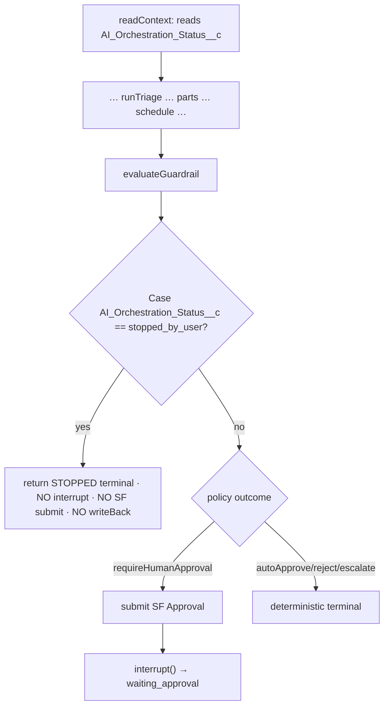
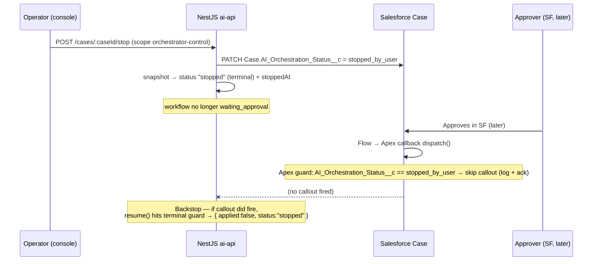
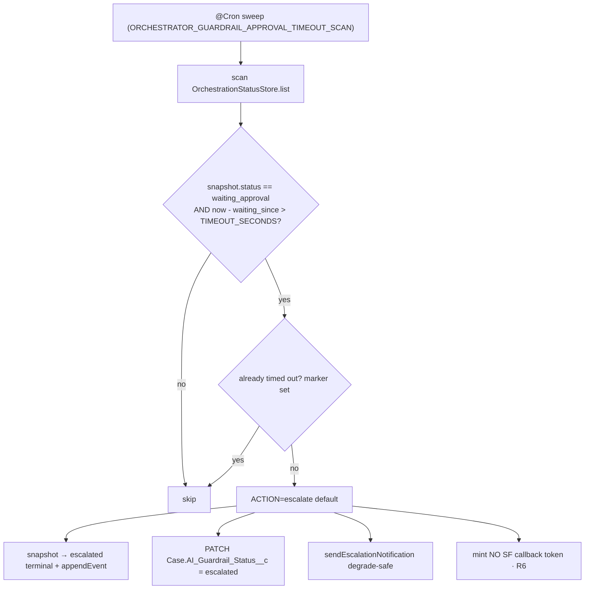

# Node 6 — Phase 6c Hardening + Stop AI Manual Takeover — Phase Plan

> **Document type:** Phase 6c planning — Stop-AI manual takeover (RC-1), approval timeout → auto-escalate (N6-R1), Stop-AI guard at the guardrail interrupt + callback (N6-R2), reconcile/long-wait interactions (N6-R3/R4), and the Salesforce approver/decision stamps + Approval History layout polish.
> **Audience:** AI Architects · Salesforce Architects · Platform Engineers · Service Operations.
> **Status:** **IMPLEMENTED — code-complete + unit-green (2026-06-22).** 6c-Pre SF metadata authored (deploy/validate + Approval History layout retrieve pending org); 6c-a/RC-1a/6c-b/RC-8a NestJS + RC-1b React shipped with focused tests green (ai-api 528, react 53). Live proof (smoke S1–S5) + Railway env flips pending. Lessons: [`node6-6c-stop-ai-lessons.md`](../context/node6-6c-stop-ai-lessons.md).
> **Builds on:** 6a `evaluateGuardrail` (**live**), 6b+ Salesforce Approval Process submit + callback resume (**LIVE PROOF COMPLETE 2026-06-22** — Case 00001059 approved, 00001060 paused), post-approval verdict rollup (**live**).
> **Companions:** [`node-6-guardrail-phase-plan.md`](./node-6-guardrail-phase-plan.md) §3.9/§15 · [`node-6-guardrail-sf-approval-phase-plan.md`](./node-6-guardrail-sf-approval-phase-plan.md) §9 · [`re-orchestration-backlog.md`](./re-orchestration-backlog.md) RC-1/RC-2/RC-8, N6-R1–R4 · [`case-triage-orchestrator-flow.md`](./case-triage-orchestrator-flow.md) §6 · [`node6-sf-approval-lessons.md`](../context/node6-sf-approval-lessons.md) · [`new-node-phase-completion-checklist.md`](./new-node-phase-completion-checklist.md)

**Program invariants (unchanged):**

- **Salesforce** = system of record; operators own Cases in the SF UI; approvers act in **native Salesforce Approval** (not React).
- **LangGraph** = orchestrator brain; Node 6 `evaluateGuardrail` is the **only** interrupting node.
- **The React console is read-only observability** ([`case-triage-orchestrator-flow.md`](./case-triage-orchestrator-flow.md) §6) — except for the **one new control action this plan adds: Stop AI**, which is explicitly **not** an approve/reject control.

---

## 1. Executive summary

Two hardening gaps remain before Node 6 is production-honest, and both stem from the same truth: **operators own Cases in Salesforce, and AI orchestration must neither fight their manual work nor hang forever.**

1. **Stop AI manual takeover (RC-1).** A service rep working a Case manually needs to stop the orchestrator so it does not keep re-planning triage/parts/scheduling over their work, and so a late guardrail approval does not resume writes after they have taken over. Today there is **no stop control anywhere** — not in the API (the orchestrator has exactly 7 routes; none is stop/cancel), not in Salesforce (`AI_Orchestration_Status__c` does not exist), and not in the console (read-only, unauthenticated).
2. **Approval timeout (N6-R1).** A `requireHumanApproval` interrupt waits **indefinitely** today. If the approver never acts, the workflow sits in `waiting_approval` forever and blocks nothing but also resolves nothing. We need a configurable SLA that auto-escalates (or rejects) a stale approval.

Plus the **Salesforce experience polish** that 6b+ deferred: stamp `AI_Guardrail_Approver__c` + `AI_Guardrail_Decision_At__c` on approve/reject (today only the status picklist updates), surface **Approval History** on the Case page during approval, and keep the approver queue in source.

### 1.1 Explicit boundary — Stop AI is NOT guardrail Approve/Reject

This is the single most important design line in 6c. They are **different control surfaces with different scopes, different audiences, and different outcomes:**

|                    | Guardrail Approve/Reject (6b+)                                          | Stop AI (6c / RC-1)                                                      |
| ------------------ | ----------------------------------------------------------------------- | ------------------------------------------------------------------------ |
| **Who**            | Approver (account manager / queue) acting **in Salesforce**             | Operator / service rep taking over a Case                                |
| **Where**          | Native SF Approval UI (Items to Approve)                                | Console **Stop AI** button (RC-1b) or `POST …/cases/:caseId/stop`        |
| **Scope**          | `agentforce:orchestrator-approval` (out-of-band only, never in browser) | **`agentforce:orchestrator-control`** (new)                              |
| **Means**          | "This AI plan is/ isn't compliant — proceed or don't"                   | "Stop the AI; I am handling this Case myself"                            |
| **Outcome status** | `approved` → writeBack · `rejected` → rejected terminal                 | `stopped` terminal + Case `AI_Orchestration_Status__c = stopped_by_user` |
| **React**          | **No** buttons (read-only)                                              | **One** button + confirm + banner (the only mutation in the console)     |

> **Design decision (diverges from `node-6-guardrail-phase-plan.md` §3.9 "skip to rejected"):** a stopped Case routes to a **dedicated `stopped` terminal**, **not** `rejected`. Reusing `rejected` would mislabel an operator takeover as a guardrail compliance rejection and imply the AI made a decision it did not. A new `stopped` lifecycle status keeps the boundary above honest in the read model, the verdict, and smoke assertions.

---

## 2. End-to-end flows (mermaid)

### Flow A — Stop AI **before** the interrupt (in-flight workflow)



The stop check runs **at the top of `evaluateGuardrail`, before the `requireHumanApproval` branch sends any notification or calls `interrupt()`** — so a stopped Case never creates a `ProcessInstance` and never pauses.

### Flow B — Stop AI **while** `waiting_approval` (late SF approve must no-op)



Two layers stop the late approve: (1) the **Apex callback guard** drops the callout (saves a round-trip), and (2) the **NestJS terminal/idempotency guard** in `resume()` no-ops if a callout slips through. Defense in depth.

### Flow C — Approval timeout → auto-escalate



> **Critical: timeout escalation does NOT go through graph `resume()`.** `escalated` is **not** a resumable decision (`APPROVAL_DECISIONS = ["approved","rejected"]`; R6), and with `MemorySaver` the paused thread's checkpoint may already be gone (process restart). The timeout handler therefore performs a **direct terminal write on the snapshot + Case** (mirroring how the deterministic `escalate` branch settles), not a `Command({ resume })`. See §5.2.

---

## 3. Phase breakdown

| Phase      | Scope                                                                                                                                                                                                                                                                                                                          | Exit criteria                      |
| ---------- | ------------------------------------------------------------------------------------------------------------------------------------------------------------------------------------------------------------------------------------------------------------------------------------------------------------------------------ | ---------------------------------- |
| **6c-Pre** | SF: **create** `AI_Orchestration_Status__c` picklist (+ optional stopped-audit fields); add to `Agentforce_Guardrail_Node6` perm set; approver/decision-at stamping (Apex/Flow); Approval History on Case layout (**retrieve-then-edit — no layout in source today**); Handoff Flow guard (RC-2); keep queue members in source | `sf project deploy validate` green |
| **6c-a**   | NestJS: thread `orchestrationStatus` through `readCaseContext` → context DTO; N6-R2 stop check at `evaluateGuardrail` before `interrupt()` (→ `stopped` terminal); `/triggers` refuse-when-stopped; callback no-op when stopped (NestJS backstop); Apex callback stop guard                                                    | Unit + graph specs                 |
| **6c-b**   | NestJS: approval timeout (`@Cron` sweep of the store; config; `escalate`/`reject` action; idempotent; no SF token on timeout-escalate)                                                                                                                                                                                         | Unit + scheduler specs             |
| **RC-1a**  | NestJS: `POST /orchestrator/case-triage/cases/:caseId/stop`; new scope `agentforce:orchestrator-control`; Case write via gateway (mirror `writeTriageTracking`); snapshot `stopped` + `stoppedAt`                                                                                                                              | API contract tests                 |
| **RC-8a**  | Operator login session: `POST /auth/operator-orchestration/session` (access code → httpOnly cookie minting short-TTL JWT with `orchestrator-read` + `orchestrator-control`); console login gate + proxy reads cookie                                                                                                           | Session mint + proxy tests         |
| **RC-1b**  | React: **Stop AI** button + confirm dialog + "stopped" banner; `stopped` status in read model; control proxy route                                                                                                                                                                                                             | UI smoke                           |
| **6c-c**   | Live proof: Case → `waiting_approval` → Stop AI → approve in SF → callback no-op; timeout proof on a short-SLA test workflow; SF stamp + layout assertions                                                                                                                                                                     | Smoke + SF field assertions        |

> **Recommended order (refined):** 6c-Pre → 6c-a → RC-1a → 6c-b → **RC-8a → RC-1b** → 6c-c.
> **Why RC-8a before RC-1b (not "if blocked"):** the console page is **unauthenticated at the Next.js layer and read-only today**. Putting a Stop button behind a static control-scoped bearer on an open page = anyone who can load `/orchestration` can stop any workflow. A control action **must** carry operator identity, so **RC-8a is a hard prerequisite for the UI**, not optional. The backend (RC-1a + 6c-a/b guards + timeout) is fully provable **headless** via the smoke harness (which mints its own scoped token), so the UI is the last slice.

---

## 4. Salesforce design

### 4.1 New / extended Case fields

> **Verified 2026-06-22:** `AI_Orchestration_Status__c` **does not exist** (zero references repo-wide — only `AI_Orchestration_Console_URL__c` shares the prefix). `AI_Guardrail_Approver__c` (Text 80) and `AI_Guardrail_Decision_At__c` (DateTime) **exist but are never written by anything**. `AI_Guardrail_Status__c` is a restricted picklist `{pending_approval, approved, rejected, escalated, auto_approved}`.

| Field                            | Type                                                                 | Purpose                                       | Status                                                                                                                                                     |
| -------------------------------- | -------------------------------------------------------------------- | --------------------------------------------- | ---------------------------------------------------------------------------------------------------------------------------------------------------------- |
| `AI_Orchestration_Status__c`     | **Picklist (restricted)**: `active`, `stopped_by_user`, `suppressed` | RC-1 master flag (`active` default)           | **CREATE** — `force-app/main/default/objects/Case/fields/AI_Orchestration_Status__c.field-meta.xml` (mirror `AI_Guardrail_Status__c.field-meta.xml` shape) |
| `AI_Orchestration_Stopped_At__c` | DateTime                                                             | Audit (optional v1)                           | CREATE (optional)                                                                                                                                          |
| `AI_Orchestration_Stopped_By__c` | Text(80)                                                             | Audit **alias/role only — no PII in logs**    | CREATE (optional)                                                                                                                                          |
| `AI_Guardrail_Approver__c`       | Text(80) — **exists**                                                | Approver **alias** (PII-safe) — wire stamping | EXISTS, never stamped                                                                                                                                      |
| `AI_Guardrail_Decision_At__c`    | DateTime — **exists**                                                | Decision timestamp — wire stamping            | EXISTS, never stamped                                                                                                                                      |

> **6c-Pre blocker:** `AI_Orchestration_Status__c` must be created **first** — the Handoff Flow guard (§4.4), the Apex callback guard (§4.5), the perm set (§4.6), and the NestJS read (§5.1) all reference it and will not deploy/compile until it exists with a `stopped_by_user` value.

### 4.2 Approver + decision-at stamping — **NOT a Workflow field update**

> **Verified constraint:** a classic **Workflow `FieldUpdate` cannot resolve the current approver** — there is no `{!ApprovalRequest.Process_Approver}`-style merge field available to field updates (those merge fields exist only in approval **email/post templates**). The harness's draft `AI_Guardrail_Approver__c = {!ApprovalRequest.Process_Approver}` is **not implementable as written.** No `{!ApprovalRequest.*}` is used anywhere in `force-app` today.

**Chosen path — stamp in Apex at callback time (cohesive + testable):** extend `AgentforceGuardrailApprovalCallback.dispatch()` (it already queries the Case after the status flips on final approve/reject) to also query the completed approval step and stamp both fields in the same transaction:

```apex
// pseudo — inside dispatch(), after status is approved|rejected
ProcessInstanceStep step = [
  SELECT Actor.Alias, StepStatus, CompletedDate
  FROM ProcessInstanceStep
  WHERE ProcessInstance.TargetObjectId = :caseId
    AND StepStatus IN ('Approved','Rejected')
  ORDER BY CompletedDate DESC NULLS LAST
  LIMIT 1
];
caseRow.AI_Guardrail_Approver__c   = step?.Actor?.Alias;        // PII-safe: alias, not full name/email
caseRow.AI_Guardrail_Decision_At__c = step?.CompletedDate;      // decision timestamp
// (single update; Approver/Decision_At added to the SELECT + perm set)
```

- **PII discipline:** store `User.Alias` (short handle), never full name or email — consistent with the field description ("role/alias only — no full names in API logs").
- **Alternative (documented, not chosen):** `AI_Guardrail_Decision_At__c` could be set by a **new Workflow field update with a `NOW()` formula** wired into `finalApprovalActions`/`finalRejectionActions`; but the **approver** still needs Apex/Flow (ProcessInstanceStep), so doing both in the one Apex dispatcher avoids splitting the logic.
- **Idempotency:** the dispatcher already runs once per status change; re-stamping the same values is harmless.

### 4.3 Case Lightning layout — **no layout exists in source**

> **Verified critical finding:** there are **zero `*.layout-meta.xml` and zero `*.flexipage-meta.xml`** anywhere in the repo. There is no demo Case layout/page in source control, and no "AI Orchestrator Review" section in source — the verdict/guardrail fields are referenced only in their own field-meta files + the Node 6 perm set.

**Decision — retrieve-then-edit (recommended) for source parity:**

1. `sf project retrieve start --metadata Layout:Case-Case\ Layout` (resolve the actual demo layout API name first via `sf org list metadata --metadata-type Layout`).
2. Add the **Approval History** related list and confirm the **AI Orchestrator Review** verdict fields are present/visible during approval.
3. Commit the retrieved layout so the change is reproducible.

**Fallback (documented):** if retrieving the org layout is impractical for the demo deadline, make the Approval History related-list addition a **manual org config step** captured in the 6c runbook with a screenshot — explicitly flagged as **not source-controlled** (debt). Do **not** hand-author a partial Case layout from scratch (high risk of clobbering org fields on deploy).

### 4.4 Handoff Flow guard (RC-2)

> **Verified:** `flows/Case_Triage_Orchestrator_Handoff.flow-meta.xml` is **Create-triggered (`RecordAfterSave`) with NO `filterFormula` today** — it fires on every Case insert.

Add a net-new `<filterFormula>` inside `<start>`:

```xml
<filterFormula
>NOT(ISPICKVAL({!$Record.AI_Orchestration_Status__c}, "stopped_by_user"))</filterFormula>
```

> **Honest scope note:** because this flow is **Create**-triggered, the guard only bites a Case that is created already-stopped (rare). It is **necessary but not sufficient** for "no new triggers after stop." The real enforcement of "no new orchestration for a stopped Case" lives in:
>
> - the **NestJS `/triggers` guard** (§5.1) — refuse a new workflow when the Case is `stopped_by_user` (covers direct-API and future reconcile re-triggers), and
> - the future **RC-3 reconcile API** (N6-R3) which must skip stopped Cases.
>   Add all three; the Flow guard is the SF-native first line, not the whole story.

### 4.5 Callback guard (6c-a, SF side)

> **Verified:** `AgentforceGuardrailApprovalCallback.dispatch()` queries `Case (AI_Guardrail_Status__c, AI_Triage_Workflow_Id__c, AI_Guardrail_Resume_Token__c)` and `buildPayload()` returns null (skips the callout) unless status ∈ `{approved,rejected}` + workflow id + resume token are all present.

Add `AI_Orchestration_Status__c` to that SOQL `SELECT` and add a skip condition to `buildPayload()`:

```apex
if (caseRow.AI_Orchestration_Status__c == 'stopped_by_user') return null; // operator took over → no resume callout
```

This is the **preferred** stop layer for Flow B — it prevents the callout entirely. The NestJS terminal guard (§5.1) is the backstop.

### 4.6 Perm set + queue

- Add `Case.AI_Orchestration_Status__c` (and any stopped-audit fields) to `permissionsets/Agentforce_Guardrail_Node6.permissionset-meta.xml` (`editable=true readable=true`) so the AI-API run-as user can write the stop flag. It currently grants FLS on 10 AI\_\* Case fields; `AI_Orchestration_Status__c` is **not** among them yet.
- Queue `queues/Agentforce_Guardrail_Approvers.queue-meta.xml` already has one member (`chaudhary.keshav4u@gmail.com`). Keep demo approvers (Mohit + Keshav) in source/org sync per the 6b+ deferred item.

---

## 5. NestJS design

### 5.1 Stop-AI guard (N6-R2) + context threading

**Context source (new):** extend `SalesforceCaseGateway.readCaseContext` (`apps/ai-api/src/salesforce/salesforce-case.gateway.ts`) to also read `AI_Orchestration_Status__c`, and add `orchestrationStatus?: "active" | "stopped_by_user" | "suppressed"` to the Case context DTO. **Degrade-safe:** if the field is absent (older org) or the read fails, treat as `active` (never block orchestration on a missing field). `readContext` (the graph's first node) already fans this context into state; today it reads `Id, CaseNumber, Subject, Description, Priority, Status, Origin, AccountId, AssetId, …` and **no** orchestration-status field — this adds one.

| Location                                             | Behavior                                                                                                                                   | Decision                                                                                                  |
| ---------------------------------------------------- | ------------------------------------------------------------------------------------------------------------------------------------------ | --------------------------------------------------------------------------------------------------------- |
| `triggerTriage` (`POST …/triggers`)                  | If Case `stopped_by_user` → refuse new workflow                                                                                            | **409 `orchestration_stopped`** (do not createAssigned)                                                   |
| `evaluateGuardrail` node (pre-interrupt)             | If `state.context.orchestrationStatus === "stopped_by_user"` → return **`stopped` terminal** without `interrupt()` / SF submit / writeBack | New `stopped` terminal (NOT `rejected`) — see §1.1                                                        |
| `salesforceApprovalCallback` controller + `resume()` | If snapshot terminal (incl. `stopped`) or stop marker → `{ applied:false, status:"stopped" }`, no resume                                   | Reuses existing terminal/idempotency guard in `resume()` (`processedResumeKeys` + terminal short-circuit) |

**New `stopped` lifecycle status — files to touch (verified symbol map):**

- `apps/ai-api/src/orchestrator/dto/case-triage-lifecycle.ts` — add `"stopped"` to `NODE_LIFECYCLE_STATUSES` and to `TERMINAL_LIFECYCLE_STATUSES`.
- `orchestrator-verdict.synthesizer.ts` — add `stopped` headline/summary copy ("AI orchestration stopped — manual handling"); no PII.
- `orchestration-status.store.ts` / `orchestration-status.repository.ts` — add `stoppedAt?` + `stopReason?` to the snapshot (Postgres: nullable columns or fold into existing jsonb — document the migration, mirror the 6a `guardrail` jsonb add).
- Grep `grep -rn "approvalDecision\|NodeLifecycleStatus\|case \"escalated\"" apps/ai-api/src` and add `stopped` handling to every status switch (same discipline as the 6a `escalated` rollout).

### 5.2 Approval timeout (N6-R1) — **Option B: `@Cron` store sweep + direct terminal escalation**

**Decision: Option B.**

| Option                                                                                       | Verdict                                                                                                                                                                                                                                                                                                              |
| -------------------------------------------------------------------------------------------- | -------------------------------------------------------------------------------------------------------------------------------------------------------------------------------------------------------------------------------------------------------------------------------------------------------------------- |
| A — in-process `setTimeout` per `waiting_approval` workflow                                  | **Rejected.** Lost on restart; one live timer per pause leaks/duplicates; no audit trail.                                                                                                                                                                                                                            |
| **B — NestJS `@Cron` sweeps `OrchestrationStatusStore.list()` for stale `waiting_approval`** | **Chosen.** Reuses the snapshot store (which persists independently of the `MemorySaver` checkpointer and already has a `PostgresOrchestrationStatusRepository`); single-instance safe; survives restart when persistence = postgres; idempotent via a marker; one code path with the deterministic escalate settle. |
| C — SF Scheduled Flow on Case `pending_approval` age                                         | **Rejected.** Couples timeout to a Case-field poll and forks the escalation logic into Apex, duplicating the NestJS terminal + `sendEscalationNotification` path.                                                                                                                                                    |

**Mechanism (the subtle part):** the sweep **does not call `graph.resume()`**. It performs the **same terminal settle the deterministic `escalate` branch already does** — `store.update(... status:"escalated")` + `store.appendEvent(...)`, PATCH Case `AI_Guardrail_Status__c = escalated`, and degrade-safe `sendEscalationNotification`. Reasons: (a) `escalated` is not in `APPROVAL_DECISIONS` (R6), and (b) the `MemorySaver` checkpoint may be orphaned after a restart so there is nothing to resume. With persistence = postgres the snapshot row survives even when the checkpoint does not — so the snapshot store is the source of truth for the sweep.

**Config (new):**

| Env var                                                | Default                             | Purpose                                                                 |
| ------------------------------------------------------ | ----------------------------------- | ----------------------------------------------------------------------- |
| `ORCHESTRATOR_GUARDRAIL_APPROVAL_TIMEOUT_ENABLED`      | `false`                             | Master flag (off → no sweep, 6b+ parity)                                |
| `ORCHESTRATOR_GUARDRAIL_APPROVAL_TIMEOUT_SECONDS`      | `86400` (24h)                       | SLA before action; align with `ORCHESTRATOR_APPROVAL_TOKEN_TTL_SECONDS` |
| `ORCHESTRATOR_GUARDRAIL_APPROVAL_TIMEOUT_ACTION`       | `escalate` (`escalate` \| `reject`) | Terminal action on timeout                                              |
| `ORCHESTRATOR_GUARDRAIL_APPROVAL_TIMEOUT_SCAN_SECONDS` | `300`                               | `@Cron` sweep interval                                                  |

Loader: extend `loadOrchestratorGuardrailApproval` in `apps/ai-api/src/config/app-config.service.ts` (`config.orchestrator.guardrailApproval.*`). Add `@nestjs/schedule` `ScheduleModule` if not already imported.

**Requirements:**

- **Idempotent** — a `timedOutWorkflows` `Set<workflowId>` (mirror `GuardrailApprovalNotificationService.escalatedWorkflows`) + the terminal-status guard prevent double-escalation across overlapping sweeps.
- **Mint NO SF callback token** on a timeout-escalate (R6 — `escalated` is never mintable).
- When SF Approval Process was used, set Case `AI_Guardrail_Status__c = escalated`. **Residual:** v1 does **not** auto-recall the pending SF `ProcessInstance` (it stays pending in SF — a later approver action is harmless because resume no-ops on the terminal snapshot, but the SF queue shows a stale item). Auto-recall (`Approval.process` recall) is a v2 item — see §7.

### 5.3 Stop API (RC-1a)

```
POST /orchestrator/case-triage/cases/:caseId/stop
Scope: agentforce:orchestrator-control          # NEW scope
Body:  { reason?: string }                       # optional, non-PII
200:   { caseId, status: "stopped_by_user", workflowId?, stoppedAt }
```

- New route on `CaseTriageOrchestratorController` (`@Controller("orchestrator/case-triage")`), guarded by `@RequireScopes("agentforce:orchestrator-control")` via the existing `JwtAuthGuard` + `require-scopes.decorator.ts`. Reuse the `caseId` regex already in the controller.
- **Side effects:**
  1. Write Case `AI_Orchestration_Status__c = stopped_by_user` (+ optional `AI_Orchestration_Stopped_At__c`/`_By__c`) via a **new degrade-safe gateway method mirroring `SalesforceCaseGateway.writeTriageTracking`** (PATCH `Case/{caseId}`, truncate to field length, swallow/soft-fail like `trackOnSalesforce`).
  2. Mark the in-memory snapshot via `OrchestrationStatusStore`: if the latest workflow for the Case (`getLatestForCase(caseId)`) is non-terminal → `status: "stopped"` + `stoppedAt`; if already terminal (`done`/`escalated`/`rejected`) → keep status, set `stoppedAt` (drives the banner + blocks any late resume).
  3. **Do NOT auto-recall a pending `ProcessInstance`** in v1 — document manual recall vs. auto-recall tradeoff (§7). Stopping is about _future_ AI work + blocking resume, not unwinding an SF approval already in the queue.
- **Scope guard:** the static `AI_API_ORCHESTRATOR_VIEW_TOKEN` (read-only, `agentforce:orchestrator-read`) **cannot** call this — it lacks `orchestrator-control`. State this explicitly in the runbook.

### 5.4 Auth for Stop AI (RC-8 dependency)

> **Verified:** the console has **no operator login/session** — `/orchestration` is unauthenticated at the Next layer; the only credential is the server-held static `AI_API_ORCHESTRATOR_VIEW_TOKEN` (read-only). There is no operator identity to attribute a stop to.

| Phase                          | Auth                                                                                                                                                                                                                                         | Use                                                |
| ------------------------------ | -------------------------------------------------------------------------------------------------------------------------------------------------------------------------------------------------------------------------------------------- | -------------------------------------------------- |
| **Headless / smoke (now)**     | Mint a short-lived bearer with `agentforce:orchestrator-control` via `scripts/smoke/phase4-mint-jwt.mjs --scope "agentforce:orchestrator-control …"`                                                                                         | Proves RC-1a + guards + timeout **without** any UI |
| **RC-8a (required before UI)** | `POST /auth/operator-orchestration/session` (access code `ORCHESTRATOR_OPERATOR_ACCESS_CODE` → **httpOnly cookie** minting a short-TTL JWT carrying `orchestrator-read` **+** `orchestrator-control`); console proxies attach it server-side | The Stop button in the console                     |
| **RC-8b (later)**              | Salesforce SSO/OAuth for reps                                                                                                                                                                                                                | Production ops console                             |

**Mandatory:** the Stop button **must** require the RC-8a operator session — **not** the static view token, and **not** a static control token behind the currently-open page. `agentforce:orchestrator-approval` must **never** appear in the browser.

---

## 6. React console (RC-1b)

> **Verified:** the console is strictly read-only — `OrchestrationPanel` ("no fetching, no timers, no approval controls"), only `<details>` disclosures, footer "Approvals happen out of band — this console is read-only." This adds the **first** mutation.

| UI element                       | Rule                                                                                                                                                             | Symbol anchor (verified)                                                                           |
| -------------------------------- | ---------------------------------------------------------------------------------------------------------------------------------------------------------------- | -------------------------------------------------------------------------------------------------- |
| **Stop AI orchestration** button | Visible when `status ∈ {running, waiting_approval, done}` **AND** Case not `stopped_by_user`; hidden once stopped                                                | Header block of `OrchestrationPanel`, next to `<StatusBadge>` (`components/OrchestrationView.tsx`) |
| Confirm dialog                   | Plain language: "Stops future AI runs and pauses resume on this Case. Does **not** undo a Salesforce approval already pending, and does **not** close the Case." | new component                                                                                      |
| Banner                           | `AI orchestration stopped — manual handling` when Case/snapshot stopped                                                                                          | alongside the existing failed-state banner pattern in `OrchestrationPanel`                         |
| **No** Approve/Reject            | Unchanged — SF Approval only                                                                                                                                     | `GuardrailSummary` footer stays read-only                                                          |

**`stopped` status in the read model — files to touch (verified):** `lib/orchestration.ts` (`ORCHESTRATION_STATUSES`, `STATUS_META` label+tone, `isTerminalStatus`, the `isStatus` sanitizer guard, `stoppedAt` on the snapshot type) and `components/OrchestrationView.tsx` (`STATUS_ICON`, `stageStatus` logic, banner). Stop the poll on `stopped` (the `stopped.current` ref + `isTerminalStatus` already halt polling on terminal).

**Proxy route:** `POST /api/orchestrator/case/:caseId/stop` (new, in `apps/react-chat-window/app/api/orchestrator/case/[caseId]/`) → ai-api `POST …/cases/:caseId/stop`, authenticated with the **RC-8a operator session cookie** (read server-side), **not** `AI_API_ORCHESTRATOR_VIEW_TOKEN`.

---

## 7. Re-orchestration interactions (N6-R3, N6-R4, RC-7)

| ID            | Rule                                                                                                                                                                                                                                      | This plan                                                                                                                               |
| ------------- | ----------------------------------------------------------------------------------------------------------------------------------------------------------------------------------------------------------------------------------------- | --------------------------------------------------------------------------------------------------------------------------------------- |
| **N6-R3**     | Future `POST …/reconcile` (RC-3) must **refuse** threads in `waiting_approval` and **never** resume a `stopped`/terminal workflow                                                                                                         | Document the contract; RC-3 itself is out of scope (hooks only)                                                                         |
| **N6-R4**     | Escalation notice when a wait exceeds a warning threshold (before the hard timeout)                                                                                                                                                       | **Deferred** — email is off this rollout; the §5.2 hard-timeout escalate covers the SLA. Optional warning-threshold ping is a follow-up |
| **RC-7**      | `MemorySaver` → timeout + stop state on the **snapshot store** survive restart only when persistence = postgres; the **graph checkpoint** does not. Late SF approve after a restart finds no thread to resume (harmless: callback no-ops) | Call out residual risk; durable checkpointer is RC-7 (out of scope)                                                                     |
| **SF recall** | Stop AI and timeout-escalate leave a pending SF `ProcessInstance` in the approver queue (v1)                                                                                                                                              | v1 = manual recall (runbook); v2 = `Approval.process` auto-recall on stop/timeout                                                       |

---

## 8. Smoke / proof matrix

| Scenario                     | Steps                                                                                | Pass                                                                                            | Phase         |
| ---------------------------- | ------------------------------------------------------------------------------------ | ----------------------------------------------------------------------------------------------- | ------------- |
| **S1 Stop before interrupt** | Stop Case → trigger new workflow → graph reaches `stopped`, never `waiting_approval` | No `ProcessInstance` created; snapshot `status=stopped`; `/triggers` returns 409                | 6c-a          |
| **S2 Stop during wait**      | Reach `waiting_approval` → Stop AI → approve in SF → callback                        | Apex skips callout; `resume()` (if hit) `applied:false`; snapshot stays `stopped`; no writeBack | RC-1a / 6c-a  |
| **S3 Timeout**               | Short SLA test env → leave `waiting_approval` past `TIMEOUT_SECONDS`                 | `status=escalated`; Case `AI_Guardrail_Status__c=escalated`; no SF token minted                 | 6c-b          |
| **S4 SF stamps**             | Approve in Items to Approve                                                          | `AI_Guardrail_Approver__c` (alias) + `AI_Guardrail_Decision_At__c` populated                    | 6c-Pre        |
| **S5 Layout**                | Open Case during pending approval                                                    | Approval History visible + AI Orchestrator Review section                                       | 6c-Pre / 6c-c |

**New smoke flags** (extend `scripts/smoke/all-3-nodes-deployed.sh`, mirroring the `ASSERT_GUARDRAIL_*` block + `parse-orchestrator-snapshot.mjs --field` pattern; the poll loop already has a timeout `exit 1`):

```bash
ASSERT_STOP_AI=1        # S1/S2: stop → status=stopped, no writeBack
ASSERT_APPROVAL_TIMEOUT=1
ORCHESTRATOR_GUARDRAIL_APPROVAL_TIMEOUT_ENABLED=true
ORCHESTRATOR_GUARDRAIL_APPROVAL_TIMEOUT_SECONDS=60   # S3 only — short SLA in test env
```

> Demo-case caveats (verified, carried from 6b/6b+): Case 00001050 → escalate@70+ (no interrupt) and 00001054 → autoApprove@15 (never pauses) are **not** usable for S1/S2/S3, which need a Case that lands `requireHumanApproval` (25–79 band: high triage + partial parts on a non-strategic, non-repeat account — e.g. the 00001060 recipe).

---

## 9. Test plan

| Layer                                         | Tests                                                                                                                                                                                                                                               |
| --------------------------------------------- | --------------------------------------------------------------------------------------------------------------------------------------------------------------------------------------------------------------------------------------------------- |
| `guardrail-policy` / `case-triage.graph.spec` | Stop flag at `evaluateGuardrail` → `stopped` terminal, **no** `interrupt()`/submit; deterministic paths unchanged                                                                                                                                   |
| `case-triage-orchestrator.service` spec       | `stop` endpoint writes Case + snapshot; callback/resume no-op when stopped; `/triggers` 409 when stopped                                                                                                                                            |
| Timeout scheduler spec                        | sweep escalates only stale `waiting_approval`; idempotent across overlapping runs; no token minted; `action=reject` variant                                                                                                                         |
| Config spec                                   | new timeout keys default off; fail-closed parity with existing guardrail config                                                                                                                                                                     |
| Auth spec (RC-8a)                             | operator session mint; cookie proxy attaches control scope; view token cannot call `/stop`                                                                                                                                                          |
| Apex                                          | `AgentforceGuardrailApprovalCallbackTest` — skip callout when `AI_Orchestration_Status__c=stopped_by_user`; approver/decision-at stamped from `ProcessInstanceStep` (use `runAs(currentUser)` FLS refresh + seed status on insert — 6b+ lessons §5) |
| React                                         | Stop button visibility gate; confirm dialog; banner when stopped; `stopped` status badge/icon/sanitizer                                                                                                                                             |
| E2E (optional)                                | S2 on a Case mirroring the 00001060 recipe                                                                                                                                                                                                          |

---

## 10. Out of scope (explicit)

- Email approval rollout (`ORCHESTRATOR_GUARDRAIL_EMAIL_NOTIFICATION_ENABLED` stays off) and N6-R4 warning-threshold email.
- React Approve/Reject buttons (console stays read-only except the one Stop button).
- Full RC-3 reconcile API implementation (this plan documents N6-R3 hooks only).
- Postgres checkpointer (RC-7) — only the snapshot store persists; the graph checkpoint stays `MemorySaver`.
- Auto-recall of pending SF `ProcessInstance` on stop/timeout (v2).
- Guardrail policy matrix / scoring changes.
- RC-8b Salesforce SSO (RC-8a access-code session only).

---

## 11. Artifacts scaffolded by this planning session

| Artifact                                                      | Status                                                      |
| ------------------------------------------------------------- | ----------------------------------------------------------- |
| `docs/orchestrator/node-6-guardrail-6c-stop-ai-phase-plan.md` | **this doc**                                                |
| `manifest/node6-6c-stop-ai-pre-package.xml`                   | scaffolded (6c-Pre metadata members)                        |
| `scripts/sf/node6-6c-stop-ai-pre-deploy.sh`                   | scaffolded stub (mirrors `node6-sf-approval-pre-deploy.sh`) |
| `.github/prompts/implement-node6-hardening-stop-ai.prompt.md` | scaffolded implementation harness stub                      |
| `docs/context/node6-6c-stop-ai-lessons.md`                    | placeholder                                                 |

---

## Next

1. Review + approve this plan.
2. Implement via **[`.github/prompts/implement-node6-hardening-stop-ai.prompt.md`](../../.github/prompts/implement-node6-hardening-stop-ai.prompt.md)** in phase order: 6c-Pre → 6c-a → RC-1a → 6c-b → RC-8a → RC-1b → 6c-c.
3. On completion, add N6-R1/R2 (and stop-AI RC-1/RC-2) status updates to [`re-orchestration-backlog.md`](./re-orchestration-backlog.md), flip `node-6-guardrail-phase-plan.md` §0 to "6c shipped," and capture gotchas in [`docs/context/node6-6c-stop-ai-lessons.md`](../context/node6-6c-stop-ai-lessons.md).

## Planning session exit checklist

- [x] Phase plan doc written with mermaid flows (A/B/C) and phase table
- [x] RC-8 vs interim auth decided — **RC-8a operator session required before RC-1b UI** (open page → static control token rejected); backend provable headless
- [x] Timeout mechanism chosen — **Option B `@Cron` store sweep + direct terminal escalation** (not `resume()`; `escalated` non-resumable + checkpoint may be orphaned), with rationale
- [x] SF approver/decision-at stamping validated — **Workflow FieldUpdate cannot resolve approver; stamp in Apex via `ProcessInstanceStep` (alias, PII-safe)**
- [x] Handoff Flow guard drafted — net-new `<filterFormula>` (flow has none today) + `/triggers` + RC-3 defense-in-depth noted
- [x] Smoke S1–S5 assigned to phases
- [x] Implementation prompt stub linked from § Next
- [x] Critical corrections recorded: `AI_Orchestration_Status__c` does not exist (CREATE first); approver/decision-at fields exist but unstamped; **no layouts/flexipages in source** (retrieve-then-edit)
