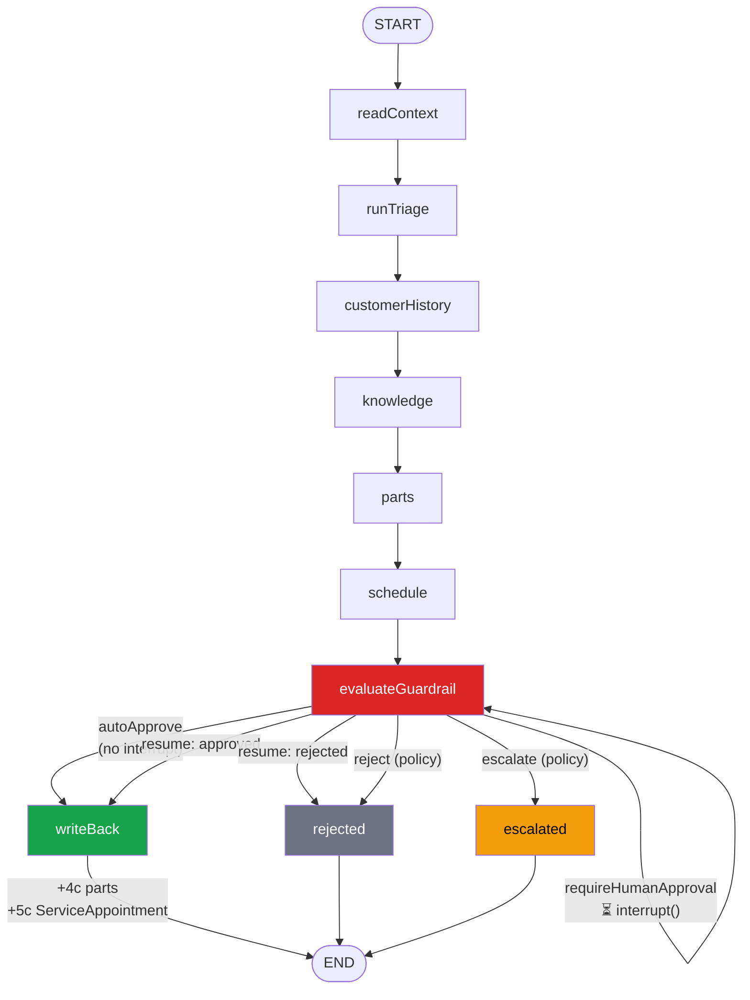

# Node 6 — Compliance & Guardrail — Phase Plan

> **Document type:** Phase 6 planning — guardrail channel contract, composite policy matrix, gate migration, approval routing, 5c unblock gate, UI, test plan.
> **Audience:** AI Architects · Salesforce Architects · Platform Engineers · Service Operations.
> **Status:** **6a SHIPPED** (2026-06-16). `evaluateGuardrail` replaces the prototype `gate`; composite policy + `escalated` terminal + verdict rollup + Node 6 UI card are live. See §0.
> **Next:** 5c `ServiceAppointment` writes (now UNBLOCKED by 6a); then 6b approval routing (email / SF Approval Process).
> **Companions:** [`case-triage-orchestrator-flow.md`](./case-triage-orchestrator-flow.md) · [`node-5-scheduling-phase-plan.md`](./node-5-scheduling-phase-plan.md) · [`re-orchestration-backlog.md`](./re-orchestration-backlog.md) · [`new-node-phase-completion-checklist.md`](./new-node-phase-completion-checklist.md) · [`service-workflow-remediation-backlog.md`](./service-workflow-remediation-backlog.md)

**Program invariants (unchanged):**

- **Salesforce** = system of record + action executor (triage Case PATCH + 4c parts + 5c scheduling appointment, all post-approval).
- **LangGraph** = orchestrator brain. **Node 6 is the ONLY interrupting node** in the graph.
- **Node 6** answers: _Given all five upstream channels, should this case be auto-approved, held for human review, rejected, or escalated — and why?_

---

## 0. Session context — read this first

### 0.1 What is shipped vs. what this plan adds

| Layer                                                              | State today (2026-06-16)                                                           | Source of truth               |
| ------------------------------------------------------------------ | ---------------------------------------------------------------------------------- | ----------------------------- |
| Nodes 1–5 (triage, customer history, knowledge, parts, scheduling) | **Shipped** on Railway (5b, deploy `e5b02949`)                                     | `case-triage.graph.ts`        |
| ~~Prototype `gate` node~~ (triage + parts only)                    | **Replaced** by `evaluateGuardrail` (6a) — removed from the graph                  | —                             |
| Scheduling `requiredApproval` / `approvalReason`                   | **Gated** by the Node 6 composite policy (6a) — `SCHEDULING_*` rules               | `dto/scheduling.ts`           |
| **Node 6 `evaluateGuardrail` node**                                | **Shipped** (6a, 2026-06-16) — composite policy, `escalated` terminal, verdict, UI | `case-triage.graph.ts`        |
| `GuardrailPolicyService` (3 hard + 18 soft rules)                  | **Shipped** (6a) — pure, deterministic; unit-covered                               | `guardrail-policy.service.ts` |
| 5c `ServiceAppointment` writes                                     | **UNBLOCKED** (6a shipped) — implement in `writeBack` per §13; not yet wired       | —                             |
| Approval routing (email / Salesforce)                              | Planned — 6b (`sendApprovalNotification` is log-only in 6a)                        | —                             |

### 0.2 What the demo proof surfaces (live as of 2026-06-16)

**Case `500g500000YpQMnAAN` / 00001050 (Austin display repair):**

| Channel          | Live output                                                                                                                 |
| ---------------- | --------------------------------------------------------------------------------------------------------------------------- |
| `partsLogistics` | `PARTIAL` · inter-warehouse transfer `SP-DISP-15X-FHD` · `requiredApproval: true` · `cross_region_transfer`                 |
| `scheduling`     | `PROVISIONAL` · `SR-A2` · Thursday 09:00–11:00 PDT · `partsEtaConstrained: true` · `requiredApproval: true` · `after_hours` |

This case must trigger `requireHumanApproval` from the Node 6 decision matrix (both channels flag approval, parts are partial, scheduling is provisional after-hours). It is the primary smoke target for 6a.

### 0.3 Current graph (prototype gate — to be replaced)

```
START → readContext → runTriage → customerHistory → knowledge → parts → schedule → gate
        gate ─approved→ writeBack (+ 4c parts writes) → END
        gate ─rejected→ rejected → END
```

`gate` today evaluates `requiresApproval(triage, partsLogistics)` only — scheduling is intentionally excluded per node-5-scheduling-phase-plan.md §3.6 / §13 R5. Phase 6a replaces `gate` with `evaluateGuardrail` and promotes scheduling signals into the composite policy.

### 0.4 Phase breakdown

| Phase     | Scope                                                                                                                                                             | Exit criteria                                               |
| --------- | ----------------------------------------------------------------------------------------------------------------------------------------------------------------- | ----------------------------------------------------------- |
| **6-Pre** | Salesforce: optional Case custom fields for approval tracking; FLS on new fields; no code if fields not needed for 6a                                             | Fields deployable; FLS on Run As user; perm set ready       |
| **6a**    | `guardrail` channel DTO; `evaluateGuardrail` node (replaces `gate`); composite decision matrix; `escalated` terminal; UI card; Final Verdict surfaces; smoke      | Decision matrix ≥8 cases pass; 5c gate cleared; smoke green |
| **6b**    | Approval routing: email notification (approve/reject links → resume); optional Salesforce Approval Process integration; idempotent `sendApprovalNotification` dep | Approval email sent on interrupt; resume works from link    |
| **6c**    | Re-orchestration: Stop AI (RC-1) guard at guardrail level; approval timeout / escalation on no-response; Reconcile API compatibility (RC-3)                       | Stop-flag respected; timeout escalates; reconcile-safe      |

### 0.5 Recommended execution order

1. Run **6-Pre** (minimal — Case fields only if needed for 6b traceability; skip if 6a-first).
2. Run **`/implement-node6-guardrail`** for 6a slice — replaces `gate`, clears 5c gate.
3. Run **5c** `ServiceAppointment` writes (now unblocked).
4. Run **6b** approval routing (email + optional SF Approval Process).
5. Defer **6c** re-orchestration per re-orchestration-backlog.md RC-1/RC-3.

---

## 1. Executive summary

Node 6 — **Compliance & Guardrail** — is the sole interrupting node in the eight-node chain. It sits between Node 5 (Scheduling) and Node 7 (Resolution & Drafting), consumes all five upstream typed channels, runs a deterministic composite policy matrix, and produces one of four outcomes: `autoApprove`, `requireHumanApproval`, `reject`, or `escalate`.

**Key design decisions:**

1. **Policy is deterministic, not LLM.** The guardrail evaluates typed channel fields only — never prose, never a model call. This makes the audit trail fully reproducible and prevents the model from reasoning around policy.
2. **`autoApprove` skips the interrupt.** When policy says low-risk, the node returns immediately without calling `interrupt()`. This eliminates unnecessary human gates on routine cases.
3. **`requireHumanApproval` is the ONLY interrupt path.** The interrupt payload is richer than the current `TriageApprovalInterrupt` — it carries all upstream approval reasons so the approver sees a complete picture without accessing raw Case text.
4. **`escalate` is a new terminal** alongside `rejected`. It routes to a supervisor path rather than blocking the case entirely.
5. **Gate replacement, not extension.** `gate` is removed; `evaluateGuardrail` takes its position. The existing resume endpoint (`POST /orchestrator/case-triage/:workflowId/resume`) is unchanged in semantics — the approver still sends `approved | rejected`.
6. **5c is blocked until 6a ships.** `ServiceAppointment` writes require the composite guardrail to have passed — not just the prototype triage+parts gate.

---

## 2. Current gate — what Node 6 replaces

The prototype gate (`case-triage.graph.ts:653–673`) is a single-node policy check:

```typescript
requiresApproval(
  triage: SanitizedTriageResult,
  partsLogistics: PartsLogisticsChannel | undefined
): boolean
```

**What it covers today:**

- Triage priority above a threshold
- Any part plan with `requiredApproval: true`

**What it does NOT cover (the Node 6 gap):**

- `scheduling.requiredApproval` / `scheduling.approvalReason` — deliberately excluded in 5a (§3.6)
- `customerContext` business risk, SLA class, strategic account, warranty signals
- `knowledgeGuidance` safety flags or required-approval actions
- Composite multi-channel risk scoring
- `reject` vs. `escalate` as distinct outcomes (today it is only approved/rejected)
- Auto-approve short-circuit (today: anything below the threshold auto-approves by returning early; approval threshold is a single binary function, not a scored model)

Node 6 replaces this binary function with a composite scored policy producing four named outcomes over all five channels.

---

## 3. Node 6 role in the orchestrator

### 3.1 Question Node 6 answers

> **"Given triage priority, customer entitlement/risk, knowledge safety signals, parts fulfillment readiness, and the proposed scheduling window — does this case require human sign-off, can it proceed automatically, should it be rejected outright, or must it be escalated to a supervisor?"**

Operator narrative: _"Parts cross-region transfer + after-hours scheduling flagged — risk score 52. Waiting for account manager approval."_

### 3.2 Inputs (read-only from all upstream typed channels)

| Channel / context   | Fields consumed                                                                                                                                                                               | Policy role                                                             |
| ------------------- | --------------------------------------------------------------------------------------------------------------------------------------------------------------------------------------------- | ----------------------------------------------------------------------- |
| `triage`            | `recommendedPriority`                                                                                                                                                                         | Base risk tier; Critical/High lift the score                            |
| `customerContext`   | `package.customerTier.value`, `package.businessRisk.value`, `package.slaClass.value`, `package.strategicAccount.value`, `package.warrantyStatus.value`, `package.repeatIncident.value.repeat` | Entitlement signals, risk modifiers, reject triggers                    |
| `knowledgeGuidance` | `answer.safetyFlags[].severity`, `answer.recommendedActions[].requiredApproval`, `guidanceConfidence`                                                                                         | Safety-critical flags, KB-required approvals                            |
| `partsLogistics`    | `status`, `fulfillmentReadiness`, `requiredApproval`, per-plan `exceptionType`                                                                                                                | Parts approval flags; partial/blocked readiness adds risk               |
| `scheduling`        | `status`, `schedulingReadiness`, `requiredApproval`, `approvalReason`                                                                                                                         | Scheduling policy flags (after_hours, sla_breach_risk, cross_territory) |
| `context` (Case)    | `accountId` (presence only)                                                                                                                                                                   | Entitlement eligibility baseline                                        |

**Critical rule:** policy reads **field values and boolean flags only** — never `safeSummary`, `displayWindow` strings, or any free-text field. This keeps the audit trail deterministic.

### 3.3 Output — `guardrail` channel (sole writer: Node 6)

See §7 for the full TypeScript contract. Summary:

- **`outcome`**: `autoApprove | requireHumanApproval | reject | escalate`
- **`riskScore`**: 0–100 composite integer
- **`riskLevel`**: `low | medium | high | critical` (derived from score bands)
- **`policyRulesTriggered`**: list of named rule IDs that fired (audit trail)
- **`channelBasis`**: which channels contributed to the decision
- **`approvalReasons`**: human-readable list of why approval is needed (non-PII labels only)
- **`approvalRouting`** (6b): method, sentAt, recipient role, external ref

### 3.4 Target graph

```
START → readContext → runTriage → customerHistory → knowledge → parts → schedule → evaluateGuardrail
evaluateGuardrail ─autoApprove / approved→ writeBack (+4c +5c) → END
evaluateGuardrail ─rejected→ rejected → END
evaluateGuardrail ─escalated→ escalated → END
```



**Node naming:** graph node `evaluateGuardrail` · channel key `guardrail` · lifecycle ID `GUARDRAIL_NODE_ID = "guardrail"`. (Same node-name ≠ channel-key pattern as `schedule` / `scheduling`.)

### 3.5 Decision matrix (composite policy — deterministic, typed fields only)

The matrix is evaluated sequentially. **Reject and escalate rules are short-circuit** — if a hard rule fires, the outcome is set and scoring stops. Soft rules accumulate a risk score.

#### Hard rules (short-circuit — no score)

| Rule ID              | Trigger condition                                                                                                                                | Outcome    |
| -------------------- | ------------------------------------------------------------------------------------------------------------------------------------------------ | ---------- |
| `ENTITLEMENT_BREACH` | `customerContext.package.warrantyStatus.value === 'out_of_warranty'` AND `partsLogistics.status === 'UNAVAILABLE'` AND `partsLogistics.eligible` | `reject`   |
| `SAFETY_CRITICAL_KB` | any `knowledgeGuidance.answer.safetyFlags` with `severity === 'critical'`                                                                        | `escalate` |
| `NO_ACCOUNT_LINKED`  | `!context.accountId` AND `triage.recommendedPriority === 'Critical'`                                                                             | `reject`   |

#### Soft rules (scored — accumulate `riskScore`)

| Rule ID                        | Trigger condition                                                                  | Risk points |
| ------------------------------ | ---------------------------------------------------------------------------------- | ----------- |
| `TRIAGE_CRITICAL`              | `triage.recommendedPriority === 'Critical'`                                        | +30         |
| `TRIAGE_HIGH`                  | `triage.recommendedPriority === 'High'`                                            | +15         |
| `CUSTOMER_RISK_CRITICAL`       | `customerContext.package?.businessRisk.value === 'critical'`                       | +25         |
| `CUSTOMER_RISK_HIGH`           | `customerContext.package?.businessRisk.value === 'high'`                           | +15         |
| `STRATEGIC_ACCOUNT`            | `customerContext.package?.strategicAccount.value === true`                         | +10         |
| `WARRANTY_OUT`                 | `customerContext.package?.warrantyStatus.value === 'out_of_warranty'`              | +10         |
| `REPEAT_INCIDENT`              | `customerContext.package?.repeatIncident.value.repeat === true`                    | +10         |
| `PARTS_APPROVAL_REQUIRED`      | `partsLogistics?.requiredApproval === true`                                        | +20         |
| `PARTS_PARTIAL`                | `partsLogistics?.status === 'PARTIAL'`                                             | +10         |
| `PARTS_UNAVAILABLE`            | `partsLogistics?.status === 'UNAVAILABLE'` AND NOT `ENTITLEMENT_BREACH`            | +15         |
| `SCHEDULING_APPROVAL_REQUIRED` | `scheduling?.requiredApproval === true`                                            | +15         |
| `SCHEDULING_SLA_BREACH`        | `scheduling?.approvalReason === 'sla_breach_risk'`                                 | +15         |
| `SCHEDULING_AFTER_HOURS`       | `scheduling?.approvalReason === 'after_hours'`                                     | +10         |
| `SCHEDULING_CROSS_TERRITORY`   | `scheduling?.approvalReason === 'cross_territory'`                                 | +10         |
| `SCHEDULING_DEFERRED`          | `scheduling?.schedulingReadiness === 'deferred'`                                   | +10         |
| `KB_REQUIRED_APPROVAL`         | any `knowledgeGuidance.answer.recommendedActions` with `requiredApproval === true` | +15         |
| `KB_SAFETY_HIGH`               | any `knowledgeGuidance.answer.safetyFlags` with `severity === 'high'`              | +20         |
| `ALL_CHANNELS_DEGRADED`        | `partsLogistics?.degraded === true` AND `scheduling?.degraded === true`            | +15         |

#### Score → outcome mapping

| Risk score | Risk level | Explicit approval flags present? | Outcome                |
| ---------- | ---------- | -------------------------------- | ---------------------- |
| 0–24       | `low`      | None                             | `autoApprove`          |
| 25–59      | `medium`   | Any OR none                      | `requireHumanApproval` |
| 60–79      | `high`     | Any OR none                      | `requireHumanApproval` |
| ≥80        | `critical` | Any OR none                      | `escalate`             |
| Any        | Any        | Hard rule fired: `reject`        | `reject`               |
| Any        | Any        | Hard rule fired: `escalate`      | `escalate`             |

**Conservative fallback:** if `partsLogistics` or `scheduling` is absent/degraded AND at least one approval flag exists anywhere, floor the outcome to `requireHumanApproval` regardless of score.

### 3.6 Migration path: prototype gate → evaluateGuardrail

| Step                                                         | File                                  | Change                                                                  |
| ------------------------------------------------------------ | ------------------------------------- | ----------------------------------------------------------------------- |
| Remove `gate` node                                           | `case-triage.graph.ts`                | Delete `.addNode("gate", …)` and `gate → writeBack/rejected` edges      |
| Add `evaluateGuardrail` node                                 | `case-triage.graph.ts`                | Add `.addNode("evaluateGuardrail", …)`                                  |
| Add `evaluateGuardrail → writeBack/rejected/escalated` edges | `case-triage.graph.ts`                | Conditional on `state.approvalDecision`                                 |
| Add `escalated` terminal node                                | `case-triage.graph.ts`                | Mirror `rejected` — sets `status: 'escalated'`                          |
| Remove `requiresApproval` dep                                | `CaseTriageGraphDeps`                 | Replaced by `evaluateGuardrailPolicy(state): GuardrailDecision`         |
| Add `GUARDRAIL_NODE_ID`                                      | `dto/case-triage-lifecycle.ts`        | `= "guardrail" as const`; add to `OrchestratorNodeId`                   |
| Add `guardrail` channel                                      | `CaseTriageState`                     | `Annotation<GuardrailChannel \| undefined>()`                           |
| Extend `ApprovalDecision`                                    | `dto/case-triage-lifecycle.ts`        | Add `\| 'escalated'` to the union                                       |
| Update resume endpoint                                       | `case-triage-orchestrator.service.ts` | Accept `'approved' \| 'rejected'` resume values (unchanged)             |
| Update `writeBack`                                           | `case-triage.graph.ts`                | Add 5c `applySchedulingWrite` call (Phase 5c, wired here when it ships) |
| Replace `TriageApprovalInterrupt`                            | `case-triage.graph.ts`                | Use `GuardrailApprovalInterrupt` (see §7)                               |

**Backward compatibility:** `approvalRequired` and `approvalDecision` remain in `CaseTriageState`. The resume endpoint contract is unchanged — callers POST `{ decision: 'approved' | 'rejected' }`. Only the interrupt payload enriches; the resume mechanism is the same `Command({ resume: decision })` call.

### 3.7 Approval routing design

#### What exists today (6a scope)

The approval mechanism already works end-to-end:

```
POST /orchestrator/case-triage/:workflowId/resume
Body: { "decision": "approved" | "rejected" }
Scope: agentforce:orchestrator-approval
```

This calls `Command({ resume: decision })` on the LangGraph graph, resuming the checkpointed thread. For 6a, this is the ONLY approval path — the guardrail interrupts, emits a log event, and waits. The approver hits the existing resume endpoint manually or via the UI (out of band — not in the UI button, per §6 of case-triage-orchestrator-flow.md).

#### What 6b adds (approval routing)

| Method                          | When used              | Implementation                                                   |
| ------------------------------- | ---------------------- | ---------------------------------------------------------------- | ----------------------------------------------------------------------------------------------------------------------------------- |
| **Email (primary)**             | `riskLevel = 'medium'  | 'high'`                                                          | `sendApprovalNotification` dep → email with approve/reject links → links call resume endpoint with bearer scoped to that workflowId |
| **Salesforce Approval Process** | `riskLevel = 'high'    | 'critical'` (optional)                                           | Trigger SF Approval Process on Case record; callback from SF Approval calls resume endpoint                                         |
| **Supervisor escalation**       | `outcome = 'escalate'` | Email to supervisor role; no interrupt (escalated is a terminal) |

**Idempotency requirement (HITL skill §idempotency-rules):** `sendApprovalNotification` must be idempotent. The `evaluateGuardrail` node re-runs its pre-interrupt code on every resume. Strategy: track `guardrail.approvalRouting.sentAt` in state; the dep checks this field before sending (`if (state.guardrail?.approvalRouting?.sentAt) return` — idempotent guard).

#### Email link flow (6b)

```
evaluateGuardrail → interrupt()
  → sendApprovalNotification(workflowId, caseId, payload)  [idempotent]
  → email with:
      "Approve: POST /orchestrator/case-triage/{workflowId}/resume?token={scoped_token}&decision=approved"
      "Reject:  POST /orchestrator/case-triage/{workflowId}/resume?token={scoped_token}&decision=rejected"
  → approver clicks link
  → resume endpoint fires → graph resumes → writeBack or rejected
```

Scoped token: short-lived JWT bound to `workflowId` + `action:approve`, signed with a separate secret (`ORCHESTRATOR_APPROVAL_TOKEN_SECRET`). Verified in the resume endpoint guard.

### 3.8 Interaction with writeBack, 4c writes, and 5c

**writeBack node** (unchanged in 6a):

1. `applyWriteBack(triage, caseId)` — Case PATCH (priority, queue)
2. `applyPartsFulfillment(workflowId, caseId, partsLogistics)` — 4c `ProductTransfer` / `ProductRequest` creates (Phase 4c — already shipped)

**5c extension (wires into writeBack post-Node-6):** 3. `applySchedulingWrite(workflowId, caseId, scheduling, partsLogistics)` — creates `ServiceAppointment` + `AssignedResource` for the approved plan. Must:

- Re-read live parts inventory (`RC-5` fresh read at write time per re-orchestration-backlog.md)
- Re-apply `earliestStart = max(partsEtaFloor, technicianAvailability, now)` gate
- Abort write (degrade, do NOT throw) if parts no longer match the stale channel
- Set `scheduling.appointmentStatus = 'booked'` on success; `appointmentStatus = 'none'` on abort with reason

**5c BLOCKER condition:** this method may NOT be written into writeBack until Node 6's `evaluateGuardrail` node has shipped (replacing the prototype gate). The prototype gate does not evaluate scheduling approval signals — merging a 5c write under the prototype gate would bypass Node 6 policy.

### 3.9 Re-orchestration + Stop AI

Node 6 operates on point-in-time channel snapshots. Channel outputs from Nodes 1–5 can become stale after the guardrail pauses:

| Stale scenario                                 | Impact on paused guardrail                           | Recommended handling                                                                             |
| ---------------------------------------------- | ---------------------------------------------------- | ------------------------------------------------------------------------------------------------ |
| Parts fulfillment changes during approval wait | `partsLogistics` channel stale vs. what was approved | 5c fresh read at write time (RC-5) handles this — 5c re-reads before SA create                   |
| Scheduling slot taken during approval wait     | `scheduling` channel stale                           | 5c re-plans window from fresh FS reads; if no slot available, degrade the SA write               |
| Case manually closed during approval wait      | Approver action voids orchestration                  | Stop AI guard (RC-1) — if Case `AI_Orchestration_Status__c = stopped_by_user`, resume is a no-op |
| Approver never responds                        | Graph paused indefinitely                            | 6c: timeout → auto-escalate; for now, manual resume required                                     |

**Stop AI (RC-1, backlog):** the guardrail node should check `context.AI_Orchestration_Status__c` (via a dep or SF read at node start) before calling `interrupt()`. If the Case is already stopped, skip to `rejected` immediately. This is a 6c item — 6a defers it.

**Re-orchestration backlog entries (add after 6a ships):**

- N6-R1: approval timeout → auto-escalate (6c)
- N6-R2: mid-approval Stop AI guard
- N6-R3: reconcile API skips interrupted threads (RC-3 must not resume stopped workflows)

---

## 4. Gap analysis

| Gap                                                        | Impact                                                                             | Resolution                                                                 | Phase |
| ---------------------------------------------------------- | ---------------------------------------------------------------------------------- | -------------------------------------------------------------------------- | ----- |
| `gate` evaluates triage + parts only — scheduling excluded | Scheduling approval signals never gate anything                                    | `evaluateGuardrail` composite matrix covers all 5 channels                 | 6a    |
| No `reject` vs. `escalate` distinction                     | All non-approved flows terminate in `rejected`; supervisor path absent             | `escalate` terminal + routing                                              | 6a    |
| No auto-approve short-circuit with rationale               | Every low-risk case still triggers the same "not requiring approval" path silently | `autoApprove` outcome with audit trace                                     | 6a    |
| No risk scoring or audit trail                             | Gate decision is a black box (`requiresApproval` returns bool)                     | `policyRulesTriggered`, `riskScore`, `channelBasis` in `guardrail` channel | 6a    |
| No `guardrail` channel in state or verdict                 | Cannot surface guardrail decision in UI or Final Verdict                           | `GuardrailChannel` + verdict rollup                                        | 6a    |
| 5c blocked — scheduling writes cannot proceed              | `ServiceAppointment` not created                                                   | 6a ships → 5c unblocked                                                    | 6a    |
| No approval notification routing                           | Approver must poll for new interrupts or be told out of band                       | Email routing with approve/reject links                                    | 6b    |
| `approvalDecision` union doesn't include `'escalated'`     | `escalated` terminal state unsupported                                             | Extend `ApprovalDecision` to `'approved' \| 'rejected' \| 'escalated'`     | 6a    |
| No Stop AI guard at guardrail                              | Case can be stopped by user but guardrail still interrupts                         | RC-1 gate check before `interrupt()`                                       | 6c    |

---

## 5. Phase 6-Pre — Salesforce preparation

6-Pre is **minimal** for the 6a AI API slice. The guardrail node is pure code — it reads no Salesforce objects and writes nothing to Salesforce in 6a.

The only 6-Pre items that unlock future phases:

| Item                                                      | Why                                       | Phase needed |
| --------------------------------------------------------- | ----------------------------------------- | ------------ | --------- | --------------- | ---------------------------------------------------------------- | ---------------------------------------------------------------------- |
| `Case.AI_Guardrail_Status__c` picklist (`pending_approval | approved                                  | rejected     | escalated | auto_approved`) | Track approval state on Case for SF reporting and trigger guards | 6b (optional SF tracking write, mirrors `AI_Triage_Status__c` pattern) |
| `Case.AI_Guardrail_Decision_At__c` DateTime               | Audit timestamp                           | 6b           |
| `Case.AI_Guardrail_Approver__c` Text                      | Role/alias of approver (no PII full name) | 6b           |
| `Agentforce_Guardrail_Node6` perm set                     | FLS on the above fields for run-as user   | 6b           |
| Salesforce Approval Process template for Case guardrail   | SF-side approval routing                  | 6b+          |

**Recommendation:** skip 6-Pre entirely for 6a. The AI API guardrail node has no Salesforce dependency. Start 6-Pre only when 6b approval routing (email + SF) is in scope.

---

## 6. Phase 6a — AI API implementation slice

### 6.1 New and modified components

| Component                                        | Path                                                             | Change                                                                               |
| ------------------------------------------------ | ---------------------------------------------------------------- | ------------------------------------------------------------------------------------ |
| `GuardrailChannel` DTO                           | `apps/ai-api/src/orchestrator/dto/guardrail.ts` (new)            | Full contract (§7)                                                                   |
| `GUARDRAIL_NODE_ID`, extended `ApprovalDecision` | `dto/case-triage-lifecycle.ts`                                   | Add `'guardrail' as const` to node id union; add `'escalated'` to `ApprovalDecision` |
| `guardrail` channel annotation                   | `case-triage.graph.ts` — `CaseTriageState`                       | `Annotation<GuardrailChannel \| undefined>()`                                        |
| `evaluateGuardrail` node                         | `case-triage.graph.ts`                                           | Replaces `gate` node                                                                 |
| `escalated` terminal node                        | `case-triage.graph.ts`                                           | New; mirrors `rejected`                                                              |
| Updated conditional edges                        | `case-triage.graph.ts`                                           | `evaluateGuardrail → writeBack/rejected/escalated`                                   |
| `GuardrailPolicyService`                         | `apps/ai-api/src/orchestrator/guardrail-policy.service.ts` (new) | Pure deterministic evaluation; no SF access                                          |
| `CaseTriageGraphDeps`                            | `case-triage.graph.ts`                                           | Remove `requiresApproval`; add `evaluateGuardrailPolicy`                             |
| Verdict synthesizer                              | `orchestrator-verdict.synthesizer.ts`                            | Node 6 four-surface rollup                                                           |
| Verdict DTO comment                              | `dto/orchestrator-verdict.ts`                                    | List all active nodes (1–6)                                                          |
| `case-triage-lifecycle.ts`                       | `dto/`                                                           | `WaitingApproval` status maps to guardrail node                                      |

### 6.2 `evaluateGuardrail` node implementation shape

```typescript
.addNode("evaluateGuardrail", (state) => {
  // Phase 1: deterministic policy evaluation (idempotent — re-runs on resume)
  const decision = deps.evaluateGuardrailPolicy(state);
  const guardrail: GuardrailChannel = {
    eligible: true,
    outcome: decision.outcome,
    riskScore: decision.riskScore,
    riskLevel: decision.riskLevel,
    policyRulesEvaluated: decision.allRules,
    policyRulesTriggered: decision.triggeredRules,
    requiresHumanApproval: decision.outcome === 'requireHumanApproval',
    approvalRequired: decision.outcome === 'requireHumanApproval',
    channelBasis: decision.channelBasis,
    approvalReasons: decision.approvalReasons,
    autoApproveReason: decision.autoApproveReason,
    degraded: false,
    latencyMs: decision.latencyMs
  };

  // Phase 2: route without interrupt for deterministic outcomes
  if (decision.outcome === 'autoApprove') {
    await deps.emitRunning(workflowId, 'Auto-approved — low risk.', details, GUARDRAIL_NODE_ID, trace);
    return { guardrail, approvalRequired: false, approvalDecision: 'approved' as ApprovalDecision };
  }
  if (decision.outcome === 'reject') {
    await deps.emitRunning(workflowId, 'Rejected — policy rule triggered.', details, GUARDRAIL_NODE_ID, trace);
    return { guardrail, approvalDecision: 'rejected' as ApprovalDecision };
  }
  if (decision.outcome === 'escalate') {
    await deps.emitRunning(workflowId, 'Escalated — critical risk signals.', details, GUARDRAIL_NODE_ID, trace);
    // 6b: send escalation notification (degrade-safe)
    return { guardrail, approvalDecision: 'escalated' as ApprovalDecision };
  }

  // Phase 3: interrupt — requireHumanApproval
  // ALL code above this line is idempotent — it re-runs on resume.
  // 6b: deps.sendApprovalNotification(state.workflowId, state.caseId, payload) — idempotent
  await deps.emitRunning(workflowId, 'Waiting for human approval.', details, GUARDRAIL_NODE_ID, trace);
  const payload: GuardrailApprovalInterrupt = buildApprovalPayload(state, guardrail);
  const decision = interrupt(payload) as 'approved' | 'rejected';
  return {
    guardrail,
    approvalRequired: true,
    approvalDecision: decision as ApprovalDecision
  };
})
```

### 6.3 Conditional edges

```typescript
.addConditionalEdges(
  'evaluateGuardrail',
  (state) => {
    if (state.approvalDecision === 'approved') return 'writeBack';
    if (state.approvalDecision === 'escalated') return 'escalated';
    return 'rejected';
  },
  { writeBack: 'writeBack', rejected: 'rejected', escalated: 'escalated' }
)
.addEdge('schedule', 'evaluateGuardrail')  // replaces: .addEdge('schedule', 'gate')
.addEdge('escalated', END)
```

### 6.4 `GuardrailPolicyService` (pure, no SF access)

```typescript
@Injectable()
export class GuardrailPolicyService {
  evaluate(state: CaseTriageStateType): GuardrailDecision {
    // 1. Hard rules (short-circuit)
    // 2. Soft rules (accumulate riskScore)
    // 3. Score → outcome mapping
    // 4. Build policyRulesEvaluated, policyRulesTriggered, approvalReasons
    // Returns: GuardrailDecision (pure, deterministic, no throws)
  }
}
```

Unit-testable with no NestJS or LangGraph coupling. Every rule is a named function — easy to add, remove, or reweight.

---

## 7. `guardrail` channel contract (TypeScript)

Path: `apps/ai-api/src/orchestrator/dto/guardrail.ts`

```typescript
export const GUARDRAIL_NODE_ID = "guardrail" as const;

/** Four named outcomes — the only machine-consumable signal from Node 6. */
export type GuardrailOutcome =
  | "autoApprove" // low risk — proceeds without interrupt
  | "requireHumanApproval" // medium/high risk — interrupt, wait for approver
  | "reject" // hard policy rule fired — block immediately
  | "escalate"; // critical risk — supervisor path, no interrupt

export type GuardrailRiskLevel = "low" | "medium" | "high" | "critical";

/** One named policy rule evaluation record. */
export interface GuardrailPolicyRule {
  ruleId: string; // e.g. "PARTS_APPROVAL_REQUIRED"
  channelSource: string; // "triage" | "customerContext" | "knowledgeGuidance" | "partsLogistics" | "scheduling"
  fieldPath: string; // e.g. "partsLogistics.requiredApproval"
  triggered: boolean;
  riskPoints: number; // contribution when triggered (0 for hard-rule rows)
  isHardRule: boolean; // true = short-circuit; false = scored
  description: string; // human-readable label for UI/audit
}

/** What the approval routing dep sent (6b+). Absent until 6b. */
export interface GuardrailApprovalRouting {
  method: "email" | "salesforce_approval" | "both" | "log_only";
  sentAt?: string; // ISO timestamp — used as idempotency guard on node re-run
  recipientRole?: string; // role label, never a full name/email
  externalRef?: string; // SF Approval Process record id
}

/** Node 6 output channel — sole writer: Node 6. */
export interface GuardrailChannel {
  eligible: boolean;
  eligibilityReason?: string;

  outcome: GuardrailOutcome;
  riskScore: number; // 0–100
  riskLevel: GuardrailRiskLevel;

  policyRulesEvaluated: GuardrailPolicyRule[]; // all rules checked
  policyRulesTriggered: GuardrailPolicyRule[]; // subset where triggered=true

  /** Which upstream channels informed the decision. */
  channelBasis: (
    | "triage"
    | "customerContext"
    | "knowledgeGuidance"
    | "partsLogistics"
    | "scheduling"
  )[];

  requiresHumanApproval: boolean; // true only when outcome = 'requireHumanApproval'
  approvalRequired: boolean; // alias for backward compat

  /** Human-readable approval reason labels (non-PII; no free-form text). */
  approvalReasons: string[];
  /** Reason outcome is autoApprove, for audit (e.g. "score 8, no flags"). */
  autoApproveReason?: string;

  /** 6b: routing metadata written before interrupt(), idempotency guard. */
  approvalRouting?: GuardrailApprovalRouting;

  degraded: boolean;
  confidence?: "high" | "medium" | "low";
  latencyMs?: number;
}

/**
 * The safe payload surfaced when the graph pauses for approval.
 * Replaces TriageApprovalInterrupt. No PII, no case text, no chain-of-thought.
 * Carries all upstream approval reasons so the approver sees a complete picture.
 */
export interface GuardrailApprovalInterrupt {
  action: "approve_case_workflow";
  workflowId: string;
  caseId: string;
  caseNumber?: string;
  guardrail: {
    riskScore: number;
    riskLevel: GuardrailRiskLevel;
    policyRulesTriggered: string[]; // ruleId strings only
    approvalReasons: string[];
  };
  /** Safe summary facts for the approver — no PII, no raw Case text. */
  context: {
    recommendedPriority: string; // e.g. "High"
    partsStatus?: string; // e.g. "PARTIAL"
    partsApprovalReasons?: string[]; // e.g. ["cross_region_transfer"]
    schedulingStatus?: string; // e.g. "PROVISIONAL"
    schedulingWindow?: string; // displayWindow e.g. "Thursday 09:00–11:00 PDT"
    schedulingApprovalReasons?: string[]; // e.g. ["after_hours", "sla_breach_risk"]
  };
}

/** Internal: what GuardrailPolicyService.evaluate() returns before channel assembly. */
export interface GuardrailDecision {
  outcome: GuardrailOutcome;
  riskScore: number;
  riskLevel: GuardrailRiskLevel;
  allRules: GuardrailPolicyRule[];
  triggeredRules: GuardrailPolicyRule[];
  channelBasis: GuardrailChannel["channelBasis"];
  approvalReasons: string[];
  autoApproveReason?: string;
  latencyMs: number;
}
```

Add to `CaseTriageState`:

```typescript
/** Node 6's own channel. Node 6 is the only writer. */
guardrail: Annotation<GuardrailChannel | undefined>(),
```

Add to `CaseTriageGraphDeps`:

```typescript
/**
 * Node 6 — composite deterministic policy evaluation over all typed channels.
 * Pure function (no Salesforce access, no LLM, no throws). Returns a
 * GuardrailDecision the evaluateGuardrail node uses to set the channel and
 * decide whether to interrupt. Injected from GuardrailPolicyService.
 */
evaluateGuardrailPolicy(
  state: CaseTriageStateType
): GuardrailDecision;

/**
 * Node 6 — optional approval notification (idempotent; 6b+). Checks
 * state.guardrail?.approvalRouting?.sentAt before sending. Degrade-safe,
 * never throws. Returns the routing record to stamp on the guardrail channel.
 * Default implementation in 6a: log only and return { method: 'log_only' }.
 */
sendApprovalNotification(
  workflowId: string,
  caseId: string,
  payload: GuardrailApprovalInterrupt
): Promise<GuardrailApprovalRouting>;
```

Remove from `CaseTriageGraphDeps`:

```typescript
requiresApproval(
  triage: SanitizedTriageResult,
  partsLogistics: PartsLogisticsChannel | undefined
): boolean;
```

---

## 8. Phase 6a — Frontend (React orchestration console)

Per `new-node-phase-completion-checklist.md`:

- **`NODE_META`** in `OrchestrationView.tsx` — add entry:
  - `id: 'guardrail'`
  - `label: "Node 6 · Compliance & Guardrail"`
  - `shortLabel: "Guardrail"`
  - `description: "Evaluates composite policy across all upstream channels and determines whether to auto-approve, pause for human sign-off, reject, or escalate."`

- **Stage card** — show:
  - Outcome badge: **Auto-Approved** (green) / **Waiting for Approval** (amber ⏳) / **Approved** (green) / **Rejected** (gray) / **Escalated** (orange)
  - Risk score and level (e.g. "Risk: 52 / HIGH")
  - List of triggered rule IDs (non-PII labels, e.g. "Parts approval required · After-hours scheduling")
  - Approval reasons list
  - Approval routing (6b: method + sentAt when available)

- **`lib/orchestration.ts`** — add `OrchestrationGuardrail` type; sanitize `guardrail` channel (strip any free-text fields defensively; `approvalReasons` are labels only so no scrubbing needed).

- **`app/orchestration/page.tsx`** — subtitle lists **all** active nodes: Triage · Customer Context · Knowledge · Parts & Logistics · Scheduling · **Compliance & Guardrail**.

- **Status mapping** in `OrchestrationView`:
  - `guardrail.outcome === 'requireHumanApproval'` AND `approvalDecision === undefined` → `WaitingApproval`
  - `guardrail.outcome === 'autoApprove'` → `Done` (with auto-approved badge)
  - `approvalDecision === 'approved'` → `Done` (approved)
  - `approvalDecision === 'rejected'` → `Rejected`
  - `approvalDecision === 'escalated'` → `Escalated`

- **Component tests** for all five status paths + Final Verdict copy.

---

## 9. Phase 6a — Final Verdict rollup (do not skip)

Update **all four** surfaces in `orchestrator-verdict.synthesizer.ts`:

| Surface            | Guardrail content                                                                                                                                                        |
| ------------------ | ------------------------------------------------------------------------------------------------------------------------------------------------------------------------ |
| `headline`         | clause e.g. `"auto-approved (low risk)"` / `"approval required"` / `"rejected (entitlement breach)"` / `"escalated (critical risk)"`                                     |
| `summary`          | one sentence: outcome + risk level + key reason — e.g. `"Guardrail: requires approval — risk score 52 (HIGH); parts cross-region transfer + after-hours scheduling."`    |
| `recommendedSteps` | e.g. `"Approve or reject via the account manager approval link."` / `"Case auto-approved — no action required."` / `"Escalated to supervisor — manual review required."` |
| `highlights`       | `Guardrail outcome`, `Risk score`, `Risk level`, `Triggered rules count`, `Approval reasons`                                                                             |
| `basis`            | push `"guardrail"` when channel present                                                                                                                                  |

Also:

- `orchestrator-verdict.synthesizer.spec.ts` — fixtures for `autoApprove`, `requireHumanApproval`, `reject`, `escalate`, `degraded`, `skipped` (flag off)
- `dto/orchestrator-verdict.ts` comment lists all active nodes: Nodes 1–6
- No PII: rule IDs and reason labels only; `riskScore` (number) is safe; never include case text, account name, technician name
- Respect `clip()` limits: headline 160, summary 400, step 240, ≤6 steps

---

## 10. Config

No feature flag for the `evaluateGuardrail` node itself — it directly replaces `gate` and is always active. Flags for optional sub-features:

| Env var                                             | Default | Purpose                              |
| --------------------------------------------------- | ------- | ------------------------------------ |
| `ORCHESTRATOR_GUARDRAIL_EMAIL_NOTIFICATION_ENABLED` | `false` | 6b: send approval email on interrupt |
| `ORCHESTRATOR_GUARDRAIL_SF_APPROVAL_ENABLED`        | `false` | 6b+: trigger SF Approval Process     |
| `ORCHESTRATOR_GUARDRAIL_ESCALATION_EMAIL_ENABLED`   | `false` | 6b: send escalation email            |
| `ORCHESTRATOR_APPROVAL_TOKEN_SECRET`                | —       | 6b: sign approve/reject link tokens  |

The `ORCHESTRATOR_TRIAGE_APPROVAL_MODE` env var (`auto | always | high_risk`) in the existing config service provided a mode hint for the prototype gate. In Node 6 it becomes an optional risk-threshold override:

- `auto` (default): use the score matrix as described in §3.5
- `always`: force `requireHumanApproval` regardless of score (testing/demo)
- `high_risk`: autoApprove only when riskScore < 10 (more conservative)

---

## 11. Risk assessment

| #   | Risk                                                                                                                             | Severity | Mitigation                                                                                                                                                      |
| --- | -------------------------------------------------------------------------------------------------------------------------------- | -------- | --------------------------------------------------------------------------------------------------------------------------------------------------------------- | ---------------------------------------------------------------------------- |
| R1  | **Pre-interrupt re-execution:** `evaluateGuardrailPolicy` re-runs on every resume; if not pure/deterministic, outcome may differ | High     | Policy service is pure (no I/O, no randomness); all dep methods are side-effect free before `interrupt()`; spec fixtures prove idempotency                      |
| R2  | **6b `sendApprovalNotification` idempotency:** email sent twice if node re-executes before `sentAt` is in state                  | High     | Check `state.guardrail?.approvalRouting?.sentAt` before sending; if set, skip. State carries `sentAt` from first run.                                           |
| R3  | **`escalated` state not handled in UI** — falls through to unknown                                                               | Medium   | Add `escalated` to status mapping in `OrchestrationView` before 6a ships; smoke test asserts UI renders the card                                                |
| R4  | **Final Verdict gap repeat** (Node 4 lesson): guardrail channel wired but only `basis` updated                                   | Medium   | Four-surface update required in checklist; spec fixtures per outcome                                                                                            |
| R5  | **`ApprovalDecision` breaking change:** adding `'escalated'` to the union may break switch exhaustiveness in downstream code     | Medium   | `grep -r "approvalDecision"` before shipping; add `escalated` handling to all switch statements                                                                 |
| R6  | **Resume endpoint accepts `'escalated'` from human** — escalated was intended as a policy outcome only                           | Low      | Resume endpoint validates `decision` against `'approved'                                                                                                        | 'rejected'`only;`'escalated'` is set by the node, not submitted by approvers |
| R7  | **Policy rules too aggressive on degraded channels** — every degraded run triggers approval                                      | Medium   | `ALL_CHANNELS_DEGRADED` rule is +15 (medium tier); single-channel degradation does not exceed threshold alone                                                   |
| R8  | **5c write under stale guardrail** — parts change between approval and SA create                                                 | High     | RC-5 fresh read at write time in `applySchedulingWrite`; abort SA create if ETA no longer valid                                                                 |
| R9  | **Stop AI not respected at guardrail** — Case stopped by user but interrupt fires anyway                                         | Medium   | 6c guards; 6a documents this as known gap and adds N6-R2 to re-orchestration-backlog.md                                                                         |
| R10 | **Score inflation** — multiple overlapping rules for the same signal                                                             | Low      | Rules are designed to not double-count (e.g. `SCHEDULING_AFTER_HOURS` and `SCHEDULING_APPROVAL_REQUIRED` can both fire but cover different signals); cap at 100 |

---

## 12. Test plan + demo matrix

### 12.1 Unit / integration

- **`guardrail-policy.service.spec.ts`** (new): one spec per matrix scenario (§12.2); assert `outcome`, `riskScore`, `riskLevel`, `policyRulesTriggered[].ruleId`, `approvalReasons`
- **`case-triage.graph.spec.ts`**: `schedule → evaluateGuardrail` replaces `schedule → gate`; `evaluateGuardrail` writes only `guardrail` channel; no interrupt on `autoApprove`; interrupt fires on `requireHumanApproval`; `escalated` edge routes to new terminal
- **`orchestrator-verdict.synthesizer.spec.ts`**: fixtures for all four outcomes + degraded + skipped
- **`OrchestrationView.test.tsx`**: five status paths; correct badge per outcome; subtitle lists Node 6

### 12.2 Decision matrix test cases (≥8 scenarios)

| #   | Name                                     | Inputs (key fields)                                                                                                                           | Expected outcome                                       | Risk score        |
| --- | ---------------------------------------- | --------------------------------------------------------------------------------------------------------------------------------------------- | ------------------------------------------------------ | ----------------- |
| 1   | Low-risk auto-approve                    | P=Medium, parts=PLANNED(ready), scheduling=PLANNED(schedulable), all no-flags, standard customer                                              | `autoApprove` / `low`                                  | ~5                |
| 2   | Critical triage + partial parts          | P=Critical, parts=PARTIAL(`cross_region_transfer`, `requiredApproval`), scheduling=PLANNED                                                    | `requireHumanApproval` / `high`                        | ~55               |
| 3   | Demo case (00001050)                     | P=High, parts=PARTIAL(`requiredApproval`), scheduling=PROVISIONAL(`after_hours`, `requiredApproval`)                                          | `requireHumanApproval` / `high`                        | ~50               |
| 4   | Parts-only flag, medium priority         | P=Medium, parts=PARTIAL(`requiredApproval`), scheduling=PLANNED                                                                               | `requireHumanApproval` / `medium`                      | ~30               |
| 5   | Scheduling SLA breach                    | P=High, parts=PLANNED(ready), scheduling=PROVISIONAL(`sla_breach_risk`, `requiredApproval`)                                                   | `requireHumanApproval` / `high`                        | ~45               |
| 6   | Entitlement breach → reject              | P=Medium, warranty=`out_of_warranty`, parts=UNAVAILABLE, no-flags                                                                             | `reject` / `low`                                       | (hard rule)       |
| 7   | Safety-critical KB flag → escalate       | P=High, knowledgeGuidance.safetyFlags[0].severity=`critical`                                                                                  | `escalate` / `critical`                                | (hard rule)       |
| 8   | Full critical scenario → escalate        | P=Critical, businessRisk=`critical`, strategic=true, parts=PARTIAL(`requiredApproval`), scheduling=PROVISIONAL(`after_hours`), KB safety=high | `escalate` / `critical`                                | ~110 → capped 100 |
| 9   | Repeat-incident premium SLA              | P=High, repeat=true, SLA=premium, businessRisk=high, parts=PLANNED, scheduling=PLANNED                                                        | `requireHumanApproval` / `medium`                      | ~40               |
| 10  | All channels degraded                    | parts.degraded=true, scheduling.degraded=true, no explicit flags, P=Medium                                                                    | `requireHumanApproval` / `medium`                      | ~25               |
| 11  | Scheduling cross-territory + high triage | P=High, scheduling.approvalReason=`cross_territory`, parts=PLANNED                                                                            | `requireHumanApproval` / `medium`                      | ~40               |
| 12  | Flag off (node skipped)                  | `AI_API_ORCHESTRATOR_GUARDRAIL_ENABLED=false` (if we add this later)                                                                          | `guardrail.eligible=false`, auto-approved pass-through | —                 |

### 12.3 Smoke assertions (`ASSERT_GUARDRAIL=1`)

Add to `scripts/smoke/all-3-nodes-deployed.sh` (or successor):

```bash
# Assert Node 6 guardrail fired on demo Case
GUARDRAIL_OUTCOME=$(jq -r '.orchestratorVerdict.highlights[] | select(.label == "Guardrail outcome") | .value' <<< "$WORKFLOW_SNAPSHOT")
assert_equals "$GUARDRAIL_OUTCOME" "Approval required" "Node 6 guardrail outcome"

# Assert risk score present
RISK_SCORE=$(jq -r '.scheduling_channel.guardrail.riskScore // empty' <<< "$WORKFLOW_SNAPSHOT")
assert_not_empty "$RISK_SCORE" "Node 6 risk score present"

# Assert interrupt fired (workflow in waiting_approval state, not done)
WORKFLOW_STATUS=$(jq -r '.status' <<< "$WORKFLOW_SNAPSHOT")
assert_equals "$WORKFLOW_STATUS" "waiting_approval" "Node 6 interrupt fired"

# POST resume approved → assert writeBack applied
RESUME_RESP=$(curl -s -X POST "$AI_API_URL/orchestrator/case-triage/$WORKFLOW_ID/resume" \
  -H "Authorization: Bearer $APPROVAL_BEARER" \
  -H "Content-Type: application/json" \
  -d '{"decision":"approved"}')
assert_json_field "$RESUME_RESP" ".writeBackApplied" "true" "writeBack after approval"
```

### 12.4 Demo matrix

| Case scenario                                  | Parts                        | Scheduling                                   | Expected Node 6 outcome                        |
| ---------------------------------------------- | ---------------------------- | -------------------------------------------- | ---------------------------------------------- |
| Display repair Austin — demo Case 00001050     | PARTIAL (`requiredApproval`) | PROVISIONAL after-hours (`requiredApproval`) | `requireHumanApproval`, risk ~50               |
| Battery repair Austin — parts local, no flags  | PLANNED (ready)              | PLANNED (schedulable)                        | `autoApprove`, risk ~5                         |
| Motherboard, high-value, strategic account     | PARTIAL                      | PROVISIONAL                                  | `requireHumanApproval`, risk ~55               |
| OOS backorder, warranty expired                | UNAVAILABLE                  | DEFERRED                                     | `reject` (entitlement breach)                  |
| Safety-critical KB article found               | any                          | any                                          | `escalate`                                     |
| Critical triage, repeat customer, cross-region | PARTIAL                      | PROVISIONAL cross_territory                  | `requireHumanApproval` / `escalate`, risk ~80+ |

---

## 13. What 5c needs from Node 6 (scheduling write gate)

Node 5c can start implementation **only after 6a ships**. These are the concrete dependencies:

| Requirement                                        | Why                                                                                                                      | How                                                                                        |
| -------------------------------------------------- | ------------------------------------------------------------------------------------------------------------------------ | ------------------------------------------------------------------------------------------ |
| `evaluateGuardrail` node shipped (replaces `gate`) | 5c hooks into `writeBack` which only executes post-approval; the composite policy must have evaluated scheduling signals | 6a ships → unblocked                                                                       |
| `guardrail.outcome` accessible in state            | 5c checks `state.guardrail?.outcome` to confirm the composite guardrail (not just the prototype gate) approved           | 6a ships `guardrail` channel                                                               |
| `applySchedulingWrite` dep wired in `writeBack`    | Post-approval SA create runs alongside 4c parts writes                                                                   | 5c adds this dep to `CaseTriageGraphDeps` and wires it in `writeBack`                      |
| Fresh parts re-read before SA create (RC-5)        | 5c must not book a window on stale parts ETA                                                                             | 5c adds a fresh `planPartsLogistics` read at write time; aborts SA if ETA changed          |
| `scheduling.approvalReason` evaluated in matrix    | Scheduling approval signals must have passed through the composite policy                                                | 6a decision matrix includes `SCHEDULING_APPROVAL_REQUIRED`, `SCHEDULING_AFTER_HOURS`, etc. |

**5c implementation seam (add in `writeBack` node after 6a):**

```typescript
// 5c — gated ServiceAppointment create (wired when 5c ships)
const updatedScheduling = await deps.applySchedulingWrite(
  state.workflowId,
  state.caseId,
  state.scheduling,
  state.partsLogistics // 5c re-reads parts at write time
);
```

---

## 14. Harness scaffolding list (create before implementation)

Following the Node 5 pattern — create these before `/implement-node6-guardrail`:

### 14.1 Skill — `.agents/skills/langgraph-node6-guardrail/SKILL.md`

Content: guardrail channel contract (§7), decision matrix (§3.5), interrupt/resume idempotency rules, migration from `gate`, 5c gate semantics, approval routing dep interface, common pitfalls.

### 14.2 Agent — `.claude/agents/node6-guardrail-implementer.md`

Implementation persona: knows the guardrail channel DTO, policy service shape, idempotency rules for pre-interrupt code, conditional edge wiring, verdict surfaces, and the `escalated` terminal. Uses the HITL skill. Runs tests before marking done.

### 14.3 Command — `/implement-node6-guardrail`

File: `.claude/commands/implement-node6-guardrail.md`

Steps:

1. Read this phase plan (§6–§7) and `langgraph-human-in-the-loop` skill
2. Implement `dto/guardrail.ts`
3. Implement `GuardrailPolicyService` (all matrix rules as named pure functions)
4. Add `GUARDRAIL_NODE_ID`, extend `ApprovalDecision`
5. Wire `evaluateGuardrail` node in graph; remove `gate`; add `escalated` terminal
6. Update `CaseTriageGraphDeps` (remove `requiresApproval`, add `evaluateGuardrailPolicy`, `sendApprovalNotification`)
7. Update `CaseTriageOrchestratorService` to inject `GuardrailPolicyService`
8. Update verdict synthesizer (four surfaces for Node 6)
9. Update React `OrchestrationView` (NODE_META, stage card, status mapping, subtitle)
10. Run `npm run ai-api:test`, `npm run react-chat:typecheck`
11. Assert smoke demo case triggers `requireHumanApproval`

### 14.4 Prompt — `.github/prompts/implement-node6-guardrail.prompt.md`

Used by the `node6-guardrail-implementer` agent. Contains references to this doc, the HITL skill, the `node-4-parts-logistics-phase-plan.md` migration pattern, and the phase completion checklist.

---

## 15. Risk / re-orchestration backlog entries (add after 6a)

Add to `re-orchestration-backlog.md`:

| ID    | Item                                                                                           | Phase |
| ----- | ---------------------------------------------------------------------------------------------- | ----- |
| N6-R1 | Approval timeout → auto-escalate (configurable SLA)                                            | 6c    |
| N6-R2 | Stop AI guard at `evaluateGuardrail` — check `AI_Orchestration_Status__c` before `interrupt()` | 6c    |
| N6-R3 | Reconcile API (RC-3) must skip threads in `waiting_approval` status                            | 6c    |
| N6-R4 | Channel staleness on long-running approvals — escalation notice if approval wait > threshold   | 6c    |

---

## 16. References

- Orchestrator flow: [`case-triage-orchestrator-flow.md`](./case-triage-orchestrator-flow.md) — §5 (Node 6 only interrupting), §6 (UI read-only), §6a–6c (lifecycle)
- Node 5 pattern: [`node-5-scheduling-phase-plan.md`](./node-5-scheduling-phase-plan.md) — §3.6, §3.7, §13 R5 (5c blocked on Node 6)
- Phase completion checklist: [`new-node-phase-completion-checklist.md`](./new-node-phase-completion-checklist.md)
- Re-orchestration backlog: [`re-orchestration-backlog.md`](./re-orchestration-backlog.md) — RC-1, RC-3, RC-5
- Service workflow remediation: [`service-workflow-remediation-backlog.md`](./service-workflow-remediation-backlog.md) — "Composite Node 6 guardrail"
- HITL skill: [`.agents/skills/langgraph-human-in-the-loop/SKILL.md`](../../.agents/skills/langgraph-human-in-the-loop/SKILL.md)
- Current gate implementation: [`../../apps/ai-api/src/orchestrator/case-triage.graph.ts`](../../apps/ai-api/src/orchestrator/case-triage.graph.ts) lines 653–673
- Scheduling channel (upstream gate input): [`../../apps/ai-api/src/orchestrator/dto/scheduling.ts`](../../apps/ai-api/src/orchestrator/dto/scheduling.ts)
- Parts channel (upstream gate input): [`../../apps/ai-api/src/orchestrator/dto/parts-logistics.ts`](../../apps/ai-api/src/orchestrator/dto/parts-logistics.ts)
- Verdict synthesizer: [`../../apps/ai-api/src/orchestrator/orchestrator-verdict.synthesizer.ts`](../../apps/ai-api/src/orchestrator/orchestrator-verdict.synthesizer.ts)
- `CaseTriageLifecycle` + `ApprovalDecision`: [`../../apps/ai-api/src/orchestrator/dto/case-triage-lifecycle.ts`](../../apps/ai-api/src/orchestrator/dto/case-triage-lifecycle.ts)

---

## Appendix A — Target graph state annotation (6a)

```typescript
export const CaseTriageState = Annotation.Root({
  workflowId: Annotation<string>(),
  caseId: Annotation<string>(),
  caseNumber: Annotation<string | undefined>(),
  tenantId: Annotation<string | undefined>(),
  principalSubject: Annotation<string>(),
  context: Annotation<SalesforceCaseContext | undefined>(),
  triage: Annotation<SanitizedTriageResult | undefined>(),
  customerContext: Annotation<CustomerContextChannel | undefined>(),
  knowledgeGuidance: Annotation<KnowledgeGuidanceChannel | undefined>(),
  partsLogistics: Annotation<PartsLogisticsChannel | undefined>(),
  scheduling: Annotation<SchedulingChannel | undefined>(),
  /** Node 6's own channel. Node 6 is the only writer. */
  guardrail: Annotation<GuardrailChannel | undefined>(),
  approvalRequired: Annotation<boolean>(),
  approvalDecision: Annotation<ApprovalDecision | undefined>(), // 'approved' | 'rejected' | 'escalated'
  writeBackApplied: Annotation<boolean>(),
  status: Annotation<NodeLifecycleStatus>()
});
```

## Appendix B — Recommended next prompt

```
/implement-node6-guardrail
```

This will:

1. Read this phase plan (§6–§7), the HITL skill, and the phase completion checklist
2. Implement the 6a slice: `dto/guardrail.ts`, `GuardrailPolicyService`, `evaluateGuardrail` node, `escalated` terminal, verdict rollup, React Node 6 card
3. Run `npm run ai-api:test` and `npm run react-chat:typecheck` before done
4. Assert demo Case 00001050 triggers `requireHumanApproval`
5. Confirm 5c gate is cleared (document in §0.1 of this file when done)
