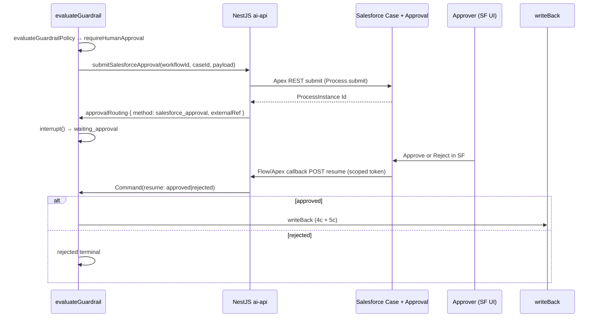

# Node 6 — Phase 6b+ Salesforce Approval Process — Phase Plan

> **Document type:** Phase 6b+ planning — Salesforce-native approval routing for the guardrail interrupt, callback resume, metadata, smoke, and test plan.
> **Audience:** AI Architects · Salesforce Architects · Platform Engineers · Service Operations.
> **Status:** **CODE-COMPLETE + VALIDATED** (2026-06-18). 6b+-Pre/a/b implemented; ai-api focused tests + Apex tests green, `sf project deploy validate` succeeds for the full package (fields + perm set + Apex + workflow + approval process + flow). **Deploy + live approver-in-SF proof + Railway flag flip pending** (operator chose not to run `sf project deploy quick` yet). Lessons: [`node6-sf-approval-lessons.md`](../context/node6-sf-approval-lessons.md).
> **Next:** `sf project deploy quick` to org `AgentForce` → set adhoc→real approver → enable `ORCHESTRATOR_GUARDRAIL_SF_APPROVAL_ENABLED` + token secret on Railway → live proof (`ASSERT_GUARDRAIL_SF=1`).
> **Companions:** [`node-6-guardrail-phase-plan.md`](./node-6-guardrail-phase-plan.md) · [`node6-6b-approval-routing-lessons.md`](../context/node6-6b-approval-routing-lessons.md) · [`case-triage-orchestrator-flow.md`](./case-triage-orchestrator-flow.md) §6 · [`re-orchestration-backlog.md`](./re-orchestration-backlog.md)

**Program invariants (unchanged):**

- **Salesforce** = system of record; approvers act in **native Salesforce Approval** UI (not React).
- **LangGraph** = orchestrator brain; Node 6 is the **only** interrupting node.
- **Email** = optional alternate channel; stays **off** for this rollout (`ORCHESTRATOR_GUARDRAIL_EMAIL_NOTIFICATION_ENABLED=false`).

---

## 0. Session context — read this first

### 0.1 Scope decision

| Channel                                   | Status                                            | This plan                                                       |
| ----------------------------------------- | ------------------------------------------------- | --------------------------------------------------------------- |
| 6a `evaluateGuardrail` + composite policy | **Shipped**                                       | Unchanged — no scoring matrix edits                             |
| 6b email + public approve links           | **Code-complete**; live Resend/inbox **deferred** | Reuse token service + resume contract; do not enable email flag |
| **6b+ SF Approval Process**               | **Not started**                                   | **In scope** — primary out-of-band approval                     |

### 0.2 What is shipped that 6b+ builds on

| Artifact                       | Path                                                | Reuse                                                                   |
| ------------------------------ | --------------------------------------------------- | ----------------------------------------------------------------------- |
| `evaluateGuardrail` interrupt  | `case-triage.graph.ts`                              | Same pause/resume lifecycle                                             |
| `GuardrailApprovalRouting` DTO | `dto/guardrail.ts`                                  | `method: "salesforce_approval"`, `externalRef` = ProcessInstance Id     |
| `sendApprovalNotification` dep | graph + orchestrator service                        | Extend to route SF when flag on (or sibling `submitSalesforceApproval`) |
| Idempotency Map (R2 lesson)    | `guardrail-approval-notification.service.ts`        | Same pattern for SF submit — in-memory Map + graph `sentAt` guard       |
| Scoped approval JWT            | `guardrail-approval-token.service.ts`               | Callback auth — mint at submit, verify on resume                        |
| Resume endpoint                | `POST /orchestrator/case-triage/:workflowId/resume` | SF Flow/Apex calls same contract                                        |
| 5c scheduling writes           | `writeBack` + `AgentforceSchedulingService`         | Run after SF approval → `approved`                                      |
| Named Credential pattern       | `Agentforce_AI_API_Phase2`                          | SF → NestJS callout for callback                                        |

### 0.3 Demo case matrix (critical)

| Case                                   | Id                   | Guardrail outcome                      | Use for 6b+                                              |
| -------------------------------------- | -------------------- | -------------------------------------- | -------------------------------------------------------- |
| 00001050 display repair                | `500g500000YpQMnAAN` | **escalate @ 100**                     | Guardrail smoke only — **no SF Approval** (no interrupt) |
| 00001054 routine battery               | `500g500000axxLtAAI` | **autoApprove @ 15**                   | 5c booking smoke — **no pause**                          |
| 00001052 mixed partial                 | `500g500000aBxPpAAK` | Probe — likely medium band             | **Candidate** for `requireHumanApproval`                 |
| **Approvable Case (create if needed)** | TBD                  | **requireHumanApproval** (score 25–79) | **6b+ SF smoke**                                         |

**Approvable Case recipe** (from policy spec + lessons):

- Non-strategic, non-repeat account (avoid escalate @ ≥80 from strategic/repeat/KB signals).
- High triage priority + partial parts (`SP-BATT-15X` + `SP-CHG-65W` on Aptivance) → score in medium band.
- **Avoid** Case 00001050 pattern (display + strategic signals → escalate).

See [`node4-orchestrator-case-scenarios.md`](../testing/node4-orchestrator-case-scenarios.md) Scenario B′ + [`salesforce-case-create`](../../.agents/skills/salesforce-case-create/SKILL.md).

---

## 1. Executive summary

Operators who live in Salesforce should approve orchestrated case work **in Salesforce**, not via an external email inbox. Phase 6b+ wires the existing guardrail `requireHumanApproval` interrupt to:

1. **Submit** a Case Approval Process (programmatic, idempotent).
2. **Pause** the LangGraph thread (`waiting_approval`).
3. **Resume** when the approver acts in Salesforce — via a secured HTTP callback to the NestJS resume endpoint.

The React orchestration console remains **read-only** per [`case-triage-orchestrator-flow.md`](./case-triage-orchestrator-flow.md) §6: it shows "waiting for approval" but does not host Approve/Reject buttons.

---

## 2. End-to-end flow



---

## 3. Phase breakdown

| Phase       | Scope                                                                                                                                               | Exit criteria                                        |
| ----------- | --------------------------------------------------------------------------------------------------------------------------------------------------- | ---------------------------------------------------- |
| **6b+-Pre** | Case fields, perm set, Approval Process definition, approver queue                                                                                  | `sf project deploy validate` + FLS on run-as user    |
| **6b+-a**   | NestJS: `SalesforceGuardrailApprovalGateway` + extend notification/routing service; flag `ORCHESTRATOR_GUARDRAIL_SF_APPROVAL_ENABLED`; graph wiring | Unit + graph specs green                             |
| **6b+-b**   | SF: Apex REST submit + Flow on approval completion → Named Credential callout                                                                       | Apex tests + HttpCalloutMock                         |
| **6b+-c**   | Live org proof + smoke `ASSERT_GUARDRAIL_SF=1`                                                                                                      | Approver acts in SF; workflow `done`; optional 5c SA |

**Recommended order:** 6b+-Pre → 6b+-a (flag off) → 6b+-b → enable flag → 6b+-c live proof.

---

## 4. Phase 6b+-Pre — Salesforce preparation

### 4.1 Case tracking + approver summary fields

**Status / audit** (mirror `AI_Triage_Status__c` pattern):

| Field                             | Type     | Values / purpose                                                         |
| --------------------------------- | -------- | ------------------------------------------------------------------------ |
| `AI_Guardrail_Status__c`          | Picklist | `pending_approval`, `approved`, `rejected`, `escalated`, `auto_approved` |
| `AI_Guardrail_Decision_At__c`     | DateTime | Audit timestamp on decision                                              |
| `AI_Guardrail_Approver__c`        | Text(80) | Role/alias only — **no full names in API logs**                          |
| `AI_Orchestration_Workflow_Id__c` | Text(64) | Idempotency key for submit (reuse triage field if present)               |

**Orchestrator Verdict on Case** — same content as the React **Orchestrator verdict** panel (headline, summary, highlights, recommended steps). Written at SF submit time from `synthesizeOrchestratorVerdict({ status: "waiting_approval", …all channels })` so the approver sees the full AI story without opening the console.

| Field                                   | Type                 | Maps to verdict                                                   |
| --------------------------------------- | -------------------- | ----------------------------------------------------------------- |
| `AI_Orchestrator_Verdict_Headline__c`   | Text(255)            | e.g. `Normal priority case · … · approval required (medium risk)` |
| `AI_Orchestrator_Verdict_Summary__c`    | Long Text Area (32k) | Narrative paragraph (triage, KB, parts, scheduling, guardrail)    |
| `AI_Orchestrator_Verdict_Steps__c`      | Long Text Area       | Numbered `recommendedSteps` (newline-separated)                   |
| `AI_Orchestrator_Verdict_Highlights__c` | Long Text Area       | `label: value` chips, one per line                                |
| `AI_Orchestration_Console_URL__c`       | URL                  | Deep link `…/orchestration?caseId={id}` for full stage UI         |

Place verdict fields in a **“AI Orchestrator Review”** section on the Case page layout shown during approval. Standard SF Approval inbox shows the Case record — these fields give parity with the screenshot verdict panel.

Existing: `AI_Triage_Status__c`, `AI_Triage_Workflow_Id__c` — confirm reuse vs. new field.

### 4.2 Permission set

- **`Agentforce_Guardrail_Node6`** — FLS read/write on guardrail fields for AI API run-as user + approver visibility as needed.

### 4.3 Approval Process definition

| Item                      | Recommendation                                                                                |
| ------------------------- | --------------------------------------------------------------------------------------------- |
| Object                    | `Case`                                                                                        |
| Developer name            | `Agentforce_Guardrail_Approval` (configurable)                                                |
| Entry                     | **Programmatic submit only** — no broad entry criteria (orchestrator controls when to submit) |
| Approver                  | Queue `Agentforce_Guardrail_Approvers` or designated user for demo org                        |
| Actions on approve/reject | Invoke Flow `Agentforce_Guardrail_Approval_Callback`                                          |

**Note:** Standard Approval Processes require approver assignment. Document demo org approver for UAT (likely the connected user or a queue member).

### 4.4 Deploy artifacts

```
force-app/main/default/objects/Case/fields/AI_Guardrail_*.field-meta.xml
force-app/main/default/permissionsets/Agentforce_Guardrail_Node6.permissionset-meta.xml
force-app/main/default/approvalProcesses/Case.Agentforce_Guardrail_Approval.approvalProcess-meta.xml
force-app/main/default/flows/Agentforce_Guardrail_Approval_Callback.flow-meta.xml
force-app/main/default/classes/AgentforceGuardrailApprovalService.cls
force-app/main/default/classes/AgentforceGuardrailApprovalRest.cls
scripts/sf/node6-sf-approval-pre-deploy.sh
manifest/node6-sf-approval-pre-package.xml
```

---

## 5. Phase 6b+-a — NestJS submit seam

### 5.1 New components

| Component                                     | Path                                                                  | Role                                                                      |
| --------------------------------------------- | --------------------------------------------------------------------- | ------------------------------------------------------------------------- |
| `SalesforceGuardrailApprovalGateway`          | `apps/ai-api/src/salesforce/salesforce-guardrail-approval.gateway.ts` | POST to Apex REST submit; degrade-safe                                    |
| Extend `GuardrailApprovalNotificationService` | existing                                                              | When `sfApprovalEnabled` && !email: route `method: "salesforce_approval"` |
| Config                                        | `app-config.service.ts`                                               | `ORCHESTRATOR_GUARDRAIL_SF_APPROVAL_ENABLED`, process dev name            |

### 5.2 Submit contract (NestJS → Salesforce)

```typescript
// POST /services/apexrest/agentforce/guardrail-approval/submit
{
  workflowId: string;
  caseId: string;
  riskScore: number;
  riskLevel: string;
  policyRulesTriggered: string[];
  approvalReasons: string[];
  resumeToken: string;
  // Full Orchestrator Verdict — same as orchestration console panel
  verdict: {
    headline: string;
    summary: string;
    recommendedSteps: string[];
    highlights: { label: string; value: string }[];
  };
  orchestrationConsoleUrl: string;
}
```

NestJS builds `verdict` by calling `synthesizeOrchestratorVerdict` with `status: "waiting_approval"` and all typed channels from graph state **before** `interrupt()`. Apex stamps the Case verdict fields, then submits the Approval Process.

Response:

```typescript
{
  submitted: boolean;
  processInstanceId?: string;
  alreadyPending?: boolean;  // idempotent resubmit
  degraded?: boolean;
}
```

### 5.3 Graph wiring (same R2 idempotency as email)

```text
if (!state.guardrail?.approvalRouting?.sentAt) {
  routing = await deps.sendApprovalNotification(...)
  guardrail.approvalRouting = routing
}
interrupt(...)
```

Service-level `Map<workflowId, GuardrailApprovalRouting>` prevents duplicate **submit** on first resume (lesson from 6b email).

### 5.4 Degrade-safe

- SF submit failure → `{ method: "salesforce_approval", degraded: true, sentAt }` — graph still reaches `interrupt()`.
- Operator fallback: manual `POST …/resume` with `agentforce:orchestrator-approval` bearer (existing path).

---

## 6. Phase 6b+-b — Salesforce callback

### 6.1 Callback auth — **recommended: Option A (scoped resume token)**

| Option | Mechanism                                                                                                                                                    | Verdict                                                                   |
| ------ | ------------------------------------------------------------------------------------------------------------------------------------------------------------ | ------------------------------------------------------------------------- |
| **A**  | Mint JWT at submit (`ORCHESTRATOR_APPROVAL_TOKEN_SECRET`); store on Case `AI_Guardrail_Resume_Token__c` or pass via Flow input; callback POST includes token | **Recommended** — reuses 6b token service; no long-lived API secret in SF |
| B      | Dedicated HMAC endpoint with `workflowId + processInstanceId + decision`                                                                                     | Viable; more custom code                                                  |
| C      | Reuse `agentforce:orchestrator-approval` service bearer in SF                                                                                                | **Discouraged** — long-lived credential in SF metadata                    |

### 6.2 Callback flow (Apex / Flow)

On Approval Process **final approve** or **final reject**:

1. Read `AI_Orchestration_Workflow_Id__c` + resume token from Case.
2. `Http.callout` via `callout:Agentforce_AI_API_Phase2/orchestrator/case-triage/{workflowId}/resume`
3. Body: `{ "decision": "approved" | "rejected", "token": "...", "idempotencyKey": "{processInstanceId}" }`
4. Update `AI_Guardrail_Status__c`, `AI_Guardrail_Decision_At__c`, `AI_Guardrail_Approver__c`.

**Idempotency:** duplicate callback (SF retry) must not double-resume — NestJS checks `idempotencyKey` / token `jti`.

### 6.3 Security notes

- Callback endpoint: rate-limited (reuse `ORCHESTRATOR_APPROVAL_RATE_LIMIT_*`).
- Token TTL: default 86400s — align with expected approval SLA; 6c timeout is separate.
- Never log token, Case description, or approver email.
- `escalated` not mintable on callback (R6 — same as email tokens).

---

## 7. Interaction with email (6b)

| Flag                                                | This rollout           |
| --------------------------------------------------- | ---------------------- |
| `ORCHESTRATOR_GUARDRAIL_EMAIL_NOTIFICATION_ENABLED` | **false**              |
| `ORCHESTRATOR_GUARDRAIL_SF_APPROVAL_ENABLED`        | **true** (after 6b+-b) |

Future dual-channel policy (document only, not implemented now):

| riskLevel | Suggested routing                         |
| --------- | ----------------------------------------- |
| medium    | SF Approval only                          |
| high      | SF Approval (+ optional email copy later) |
| critical  | SF Approval                               |

`GuardrailApprovalRouting.method` already supports `"both"` — wire only when product asks.

---

## 8. Config

| Env var                                             | Default                         | Purpose                         |
| --------------------------------------------------- | ------------------------------- | ------------------------------- |
| `ORCHESTRATOR_GUARDRAIL_SF_APPROVAL_ENABLED`        | `false`                         | Master flag for SF submit       |
| `ORCHESTRATOR_GUARDRAIL_SF_APPROVAL_PROCESS`        | `Agentforce_Guardrail_Approval` | Approval Process developer name |
| `ORCHESTRATOR_APPROVAL_TOKEN_SECRET`                | — (required when SF on)         | Sign callback/resume tokens     |
| `ORCHESTRATOR_APPROVAL_TOKEN_TTL_SECONDS`           | `86400`                         | Token lifetime                  |
| `ORCHESTRATOR_GUARDRAIL_EMAIL_NOTIFICATION_ENABLED` | `false`                         | Stays off                       |

Config **fails closed:** when SF approval enabled, token secret required at startup.

---

## 9. Re-orchestration + 6c hooks

| Scenario                              | Handling                                                                                |
| ------------------------------------- | --------------------------------------------------------------------------------------- |
| Parts/scheduling stale during SF wait | 5c RC-5 fresh read at `writeBack` — unchanged                                           |
| Case stopped by user (Stop AI)        | **6c (N6-R2):** callback should no-op if `AI_Orchestration_Status__c = stopped_by_user` |
| Approver never responds               | **6c (N6-R1):** timeout → auto-escalate; manual for now                                 |
| Process restart (MemorySaver)         | Paused thread lost — same as email lesson; Postgres checkpointer future                 |

---

## 10. Test plan

### 10.1 Unit / graph (NestJS)

- `SalesforceGuardrailApprovalGateway` — success, 401 retry, degrade
- `GuardrailApprovalNotificationService` — SF path, idempotent resubmit, flag off → `log_only`
- `case-triage.graph.spec.ts` — `requireHumanApproval` calls submit once; resume → `writeBack`
- Token verify on callback — reject expired, wrong workflow, `escalated`

### 10.2 Apex

- `AgentforceGuardrailApprovalServiceTest` — submit, idempotent, FLS
- `AgentforceGuardrailApprovalRestTest` — HttpCalloutMock for callback
- Approval Process assignment smoke in scratch/org

### 10.3 Live proof (org `AgentForce`)

1. Create/find approvable Case → orchestrator runs to Node 6 pause.
2. Verify Case Approval pending + `AI_Guardrail_Status__c = pending_approval`.
3. Approve in Salesforce UI.
4. Assert workflow `status=done`, `approvalDecision=approved`, `guardrail.approvalRouting.method=salesforce_approval`.
5. Optional: `ASSERT_SCHEDULING_WRITES=1` if scheduling plan present.

### 10.4 Smoke flag

```bash
ASSERT_GUARDRAIL_SF=1 SF_CASE_ID=<approvable-case-id> ./scripts/smoke/all-3-nodes-deployed.sh
```

Assertions:

- `guardrail.outcome = requireHumanApproval` (before manual SF approve in smoke — or poll after scripted approve)
- `guardrail.approvalRouting.method = salesforce_approval`
- `guardrail.approvalRouting.externalRef` set
- After SF approve (manual step or Apex script): `approvalDecision = approved`

---

## 11. Risk assessment

| #   | Risk                                         | Severity | Mitigation                                                                |
| --- | -------------------------------------------- | -------- | ------------------------------------------------------------------------- |
| R1  | Duplicate Process submit on interrupt re-run | High     | Service Map + `sentAt` guard (6b lesson)                                  |
| R2  | Callback replay                              | High     | Token `jti` + `idempotencyKey` = processInstanceId                        |
| R3  | SF submit fails but graph paused             | Medium   | Degrade-safe; manual resume fallback                                      |
| R4  | No approvable demo Case                      | Medium   | Create B′ partial Case on non-strategic account; probe score before smoke |
| R5  | Approval Process deploy blocked              | Medium   | Targeted validate; inactive agents note from Agentforce lessons           |
| R6  | Long approval wait + stale 5c slot           | Medium   | RC-5 fresh read; degrade SA write                                         |

---

## 12. Implementation harness

| Artifact                                                          | Purpose                                  |
| ----------------------------------------------------------------- | ---------------------------------------- |
| `.github/prompts/plan-node6-guardrail-sf-approval.prompt.md`      | Planning prompt (this doc)               |
| `.github/prompts/implement-node6-guardrail-sf-approval.prompt.md` | Implementation prompt                    |
| `.claude/commands/plan-node6-guardrail-sf-approval.md`            | `/plan-node6-guardrail-sf-approval`      |
| `.claude/commands/implement-node6-guardrail-sf-approval.md`       | `/implement-node6-guardrail-sf-approval` |
| `.github/agents/node6-guardrail-sf-approval-implementer.agent.md` | Reviewer persona                         |
| `scripts/sf/node6-sf-approval-pre-deploy.sh`                      | Pre deploy + validation                  |
| Update `langgraph-node6-guardrail/SKILL.md`                       | §6b+ track                               |

---

## 13. Exit criteria (6b+ complete)

- [ ] 6b+-Pre metadata deployed to org `AgentForce`
- [ ] NestJS submit + callback integrated; flags documented on Railway
- [ ] Apex tests green; ai-api focused tests green
- [ ] Live proof: SF Approval → resume → `writeBack` (and optional 5c)
- [ ] Smoke `ASSERT_GUARDRAIL_SF=1` documented and green
- [ ] `node-6-guardrail-phase-plan.md` §0 updated to **6b+ shipped**
- [ ] Lessons captured in `docs/context/node6-sf-approval-lessons.md`

---

## 14. Out of scope (this track)

- Live email / Resend rollout (`ASSERT_GUARDRAIL_EMAIL=1`)
- 6c Stop AI guard, approval timeout, reconcile API
- Guardrail policy scoring changes
- React Approve/Reject buttons
