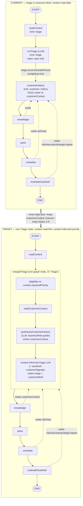

# Merge Triage + Customer History → One "Triage" Agent — Implementation-Readiness Plan

> **Status: planning only.** No code changed; nothing committed. Produced by an 8-reader code/doc survey + adversarial completeness critic over the shipped graph, orchestrator service, contracts, every `customerContext` consumer, both React consoles, docs, tests, and smoke scripts.
>
> **Constraint:** minimize churn. Do **not** renumber Nodes 3-8. Do **not** break the `customerContext` channel, Knowledge, Parts, Scheduling, or Guardrail consumers.

## 1. Executive summary

Today Triage is **customer-blind** and runs **before** Customer History: the graph spine is `readContext → runTriage → customerHistory → knowledge → …`, and `runTriage` only sees the redacted Case subject/description/reportedPriority. The `customerHistory` node runs _after_ triage, consumes `triage.recommendedPriority` as a weighting hint, and is the **sole writer** of the `customerContext` channel that Knowledge, Scheduling, Guardrail, and the Final Verdict all read. The merge inverts that data flow: one **Triage** node that reads customer context _first_, then runs a **context-informed** triage LLM, while still emitting the **byte-compatible `customerContext` channel** unchanged. The good news is the seam is clean — context read, synthesis, and eligibility already exist as independently-callable deps wired into the graph, the graph node-id (`customerHistory`) is already decoupled from the UI node-id (`customer_history`/`triage`), and the spine is strictly linear so populating `customerContext` inside the merged node (before the `knowledge` edge) keeps every downstream consumer safe. The real work is four-fold: (a) extend the triage seam to _accept_ sanitized customer signals (new optional DTO field + prompt block — the only genuine contract change), (b) re-sequence eligibility/synthesis to run on `context.reportedPriority` instead of an AI priority that no longer exists yet, (c) collapse two stepped stages into one and repoint the load-bearing `snapshot.node === 'customer_history'` UI gate to `'knowledge'`, and (d) update docs that explicitly argue for the _opposite_ ordering. The single highest-value decision is to **keep `customer_history` as an internal event/trace tag in the `OrchestratorNodeId` enum** (so persisted events, `channelBasis`, the backend lifecycle union, and `Record<OrchestratorNodeId>` exhaustiveness all stay valid) while folding its **operator-facing** stage into one Triage accordion — this is the low-churn path that honors "do not renumber Nodes 3-8." The riskiest assumption is that "populate `customerContext` unchanged" is byte-identical: it is **not**, because synthesis loses its `triagePriority` weighting hint — de-risked by passing `context.reportedPriority` as the surrogate (zero behavior change under the default permissive policy).

## 2. Current vs target



**Stepped console:** first pause moves from after `customerHistory` (`next=['customerHistory']`) to after the merged node (`next=['knowledge']`); the first operator advance after auto-run Triage becomes **"Run Knowledge Base"**, not "Run Customer Context."

## 3. The one gating decision (read this before anything else)

A genuine fork the readers split on. Resolve it explicitly:

|                    | **Decision 1 — node-id enum**                                                                                                                                                                                                                  | **Decision 2 — operator-facing stage**                                                                         |
| ------------------ | ---------------------------------------------------------------------------------------------------------------------------------------------------------------------------------------------------------------------------------------------- | -------------------------------------------------------------------------------------------------------------- |
| **Question**       | Keep `customer_history` in `OrchestratorNodeId`?                                                                                                                                                                                               | Show operator one Triage stage or two?                                                                         |
| **Recommendation** | **KEEP** as internal event/trace tag                                                                                                                                                                                                           | **ONE** Triage accordion (product goal)                                                                        |
| **Why**            | Deleting it cascades through `Record<OrchestratorNodeId>` exhaustiveness (`builders`, `payloadPresent`, `NODE_SHORT`), the backend lifecycle union, store/repository round-trip, and persisted event values — wide blast radius for no benefit | Product wants "one brief plain-English summary covering both"; customer findings render inside the Triage card |

These are **independent**, and that resolves the apparent contradiction: the merged node emits customer-read sub-steps still tagged `customer_history` and triage steps tagged `triage` — **both roll up to one operator "Triage" accordion**. Keep the enum member; just remove `customer_history` from the _visible spine array_ (`NODE_DEFS`) and `STAGE_NODES`. Records keyed by the enum keep their `customer_history` key (still exhaustive, no typecheck break); it simply isn't rendered as its own row. The visible stage count legitimately drops 6→5 (Triage + Nodes 3-6), Nodes 3-8 keep their numbers — exactly what the product goal authorizes.

## 4. Current-state gap analysis (validated against shipped code)

- **Where triage runs vs where context is read:** `readContext` (`case-triage.graph.ts:308-324`) → `runTriage` (`:325-340`, LLM, case-only) → `customerHistory` (`:341-447`, sole writer of `customerContext`). Data flow is the **reverse** of the target — triage informs customer-history, not vice-versa.
- **Triage receives NO customer signals today:** `SupportTriageService.triage` (`support-triage.service.ts:27-71`) builds its prompt from subject + description + optional reportedPriority only. `TriageCaseRequestDto` (`triage-case.dto.ts:15-40`) has no customer field. **Confirmed customer-blind.**
- **Every `customerContext` consumer (exhaustive, all run AFTER the customerHistory position → ordering is safe):**
  - **Knowledge** query builder (`case-triage.graph.ts:496-506` → `knowledge-query.builder.ts:35-97`): reads `customerTier`, `installedAssets.primaryModel`, `warrantyStatus`, `repeatIncident.count`. (Knowledge _eligibility_ `isKnowledgeEligible` receives `customerContext` but **never reads it** — dead param.)
  - **Scheduling** planner (`scheduling-planner.service.ts:204-207` → `scheduling-rules.ts:242-252`): reads `slaClass` only; optional, defaults `unknown`→48h.
  - **Guardrail** policy (`guardrail-policy.service.ts:156-181,230-238,275-314`): reads `businessRisk`, `warrantyStatus`, `strategicAccount`, `repeatIncident.repeat`; all null-safe; `deriveChannelBasis` pushes `'customerContext'` when the channel object is **truthy**.
  - **Final Verdict** synthesizer (`orchestrator-verdict.synthesizer.ts:27-43,470-473,688-700`): reads `businessRisk`/`warrantyStatus`/`repeatIncident` for headline/summary/recommendedSteps/highlights. **No** "Customer History"/"Node 2"/"customer_history" stage string anywhere — so the stage disappearing does not break verdict text.
  - **Parts** logistics planner does **not** read `customerContext` (confirmed).
- **UI surfaces naming Node 1/Node 2:** `NODE_DEFS`/`NODE_SHORT` (`stepped-view-model.ts:118-171`), `NODE_META`/`STAGE_NODES` (`OrchestrationView.tsx:61-101,406-420`), `ORCHESTRATION_NODE_IDS` enum (`orchestration.ts:26-34`), page subtitle (`app/orchestration/page.tsx:31`), stepped header `'6 nodes'` (`SteppedOrchestrationView.tsx:476`).
- **Stepped pause nodes:** `STEP_PAUSE_NODES = ['runTriage','customerHistory','knowledge','parts','schedule']` (`case-triage.graph.ts:917-923`); `STEP_NEXT_NODE_TO_UI` maps `customerHistory→customer_history` (`:930-936`). The load-bearing UI gate is `snapshot.node === 'customer_history'` (`SteppedOrchestrationView.tsx:237`) — it completes the triage intro animation. If `customer_history` disappears as the post-triage pause without repointing this to `'knowledge'`, **the stepped console hangs on a spinner.**

## 5. Target architecture (minimal diff)

**Graph:** `readContext → mergedTriage → knowledge → …`. Inside `mergedTriage`: eligibility (on `context.reportedPriority`) → `readCustomerContext` → `synthesizeCustomerHistory` (writes `customerContext`, incl. businessRisk grade LLM) → **context-informed** triage LLM (gets sanitized signals incl. graded risk; writes `triage` + optional `customerBrief`). Returns `{ triage, customerContext }`. Remove the `customerHistory` graph node + its two edges; drop `'customerHistory'` from `STEP_PAUSE_NODES`/`STEP_NEXT_NODE_TO_UI` so the first stepped pause lands with `next=['knowledge']`.

**Contracts (extend, don't replace):** `CustomerContextChannel`/`CustomerContextPackage` unchanged. Add **optional** `customerSignals?` to the triage request DTO and optional `customerBrief?` to the triage result. Keep `customer_history` node-id as an event tag.

**Triage prompt:** inject a sanitized signal block (tier, SLA, warranty, repeat, strategic, open-incidents, businessRisk) only when present; extend the system prompt to weigh signals; route through existing `redactSensitiveText`. Reuse the single `ModelRouter.chat()` seam via the orchestrator `runTriage()` adapter — do not duplicate.

**UI:** one **Triage** accordion (priority badge + case summary + customer brief; expandable structured findings). Drop the separate Customer Context stage; one stepped advance completes merged triage; repoint the `:237` gate to `'knowledge'`. Final Verdict still rolls up triage + customer-context highlights.

**Docs:** merge agent-1 + agent-2 briefs into `agent-triage-brief.md`; deprecate agent-2 with a pointer; rewrite flow §3 and node-2 §2/§13 to show customer read inside Triage. Do **not** renumber Nodes 3-8.

## 6. File-by-file change list (S / M / L)

### Backend — graph & orchestration (`apps/ai-api`)

| File                                                               | Change                                                                                                                                                                                                                                                                                                                                                                                                                                  | Size       |
| ------------------------------------------------------------------ | --------------------------------------------------------------------------------------------------------------------------------------------------------------------------------------------------------------------------------------------------------------------------------------------------------------------------------------------------------------------------------------------------------------------------------------- | ---------- |
| `apps/ai-api/src/orchestrator/case-triage.graph.ts`                | Fold `customerHistory` logic (`:341-447`) into the triage path **before** the triage LLM; replace edges `runTriage→customerHistory` + `customerHistory→knowledge` (`:876-877`) with `runTriage→knowledge`; drop `'customerHistory'` from `STEP_PAUSE_NODES` (`:917-923`) + `STEP_NEXT_NODE_TO_UI` (`:930-936`); merged node returns `{triage, customerContext}`; extend `CaseTriageTriageInput` (`:105-110`) to carry `customerSignals` | **L**      |
| `apps/ai-api/src/orchestrator/case-triage-orchestrator.service.ts` | `runTriage()` adapter (`:908-934`) passes `customerSignals` + derives `customerBrief`; re-sequence eligibility/read/synthesis (`:1293-1342`) before triage using `context.reportedPriority`; consolidate `stepNodeLabel` (`:841-851`); keep read + synthesis telemetry spans distinct from triage span                                                                                                                                  | **L**      |
| `apps/ai-api/src/agents/support-triage.service.ts`                 | Inject sanitized `customerSignals` block into prompt user-content (`:31-54`) when present; extend `TRIAGE_SYSTEM_PROMPT` (`:14-21`); route new content through `redactSensitiveText`; reuse single `ModelRouter.chat()` seam (`:56`)                                                                                                                                                                                                    | **M**      |
| `apps/ai-api/src/agents/dto/triage-case.dto.ts`                    | Add **optional** `customerSignals?: TriageCustomerSignals` to `TriageCaseRequestDto` (`:15-40`) with class-validator decorators; optionally `customerBrief?` on `TriageCaseResponseDto`                                                                                                                                                                                                                                                 | **M**      |
| `apps/ai-api/src/orchestrator/dto/orchestration-status-event.ts`   | Add optional `customerBrief?: string` to `SanitizedTriageResult` (`:87-95`)                                                                                                                                                                                                                                                                                                                                                             | **S**      |
| `apps/ai-api/src/orchestrator/customer-history.eligibility.ts`     | No signature change (already `triagePriority ?? context.reportedPriority` at `:37`); caller now supplies `reportedPriority`                                                                                                                                                                                                                                                                                                             | **S**      |
| `apps/ai-api/src/orchestrator/dto/customer-context.ts`             | **UNCHANGED** (the invariant); optional home for `customerBrief` only if not placed on the triage result                                                                                                                                                                                                                                                                                                                                | **S/none** |
| `apps/ai-api/src/orchestrator/dto/case-triage-lifecycle.ts`        | **KEEP** `CUSTOMER_HISTORY_NODE_ID` + union member (`:52-65`) — low churn                                                                                                                                                                                                                                                                                                                                                               | **none**   |

### Frontend — React consoles (`apps/react-chat-window`)

| File                                      | Change                                                                                                                                                                                                                                                                                                                                              | Size  |
| ----------------------------------------- | --------------------------------------------------------------------------------------------------------------------------------------------------------------------------------------------------------------------------------------------------------------------------------------------------------------------------------------------------- | ----- |
| `components/SteppedOrchestrationView.tsx` | **Repoint the load-bearing gate** `snapshot.node === 'customer_history'` (`:237`) → `'knowledge'`; `'6 nodes'` header (`:476`) → `'5 nodes'`; Run-button label is data-driven (auto-becomes "Run Knowledge Base")                                                                                                                                   | **M** |
| `lib/stepped-view-model.ts`               | Remove `customer_history` from `NODE_DEFS` spine (`:118-171`); fold `buildCustomerContext` (`:250-340`) into `buildTriage` detail; keep `builders`/`payloadPresent`/`NODE_SHORT` keys (enum retained); `computeRevealedProgress` is index-based (auto-corrects)                                                                                     | **M** |
| `components/OrchestrationView.tsx`        | Merge `NODE_META` Node 1+2 into one Triage entry (`:61-101`); drop `customer_history` from `STAGE_NODES` + `/6`→`/5` (`:406-420`, `:1858`); fold `CustomerContextSummary` (`:1461-1579`) into `TriageSummary`; single Triage card in `OrchestrationPanel` (`:1886-1904`); fix `displayNode` fallback (`:360-381`); update intro copy (`:1848-1851`) | **L** |
| `lib/orchestration.ts`                    | **KEEP** `customer_history` in `ORCHESTRATION_NODE_IDS` (`:26-34`) and the `customerContext` interface/sanitizer (`:106-116`) — only spine presentation changes                                                                                                                                                                                     | **S** |
| `app/orchestration/page.tsx`              | Reword subtitle (`:31`) — fold Node 2 into Node 1 **without** renumbering Nodes 3-6                                                                                                                                                                                                                                                                 | **S** |

### Docs & smoke

| File                                                 | Change                                                                                                                                                                                         | Size  |
| ---------------------------------------------------- | ---------------------------------------------------------------------------------------------------------------------------------------------------------------------------------------------- | ----- |
| `docs/agents/agent-triage-brief.md` (new)            | Merge agent-1 + agent-2 briefs into one Triage brief                                                                                                                                           | **M** |
| `docs/agents/agent-2-customer-history-brief.md`      | Replace with deprecation pointer                                                                                                                                                               | **S** |
| `docs/orchestrator/case-triage-orchestrator-flow.md` | Rewrite §3 (`:67-99`) to show customer read before context-informed triage; keep §5/§6b/§8 Nodes 3-8 labels + channel keys unchanged                                                           | **M** |
| `docs/orchestrator/node-2-customer-history-agent.md` | Revise §2 "Why it runs after Triage, not before" (`:52-56`) + §13 wiring (`:573-577`) — **consciously overturn** the ordering rationale; keep it as the field-level `customerContext` contract | **M** |
| `docs/orchestrator/re-orchestration-backlog.md`      | Collapse Node 1 + Node 2 stale rows into one Triage entry capturing **both** trigger sets (priority/comment **and** account/warranty/asset)                                                    | **S** |
| `scripts/smoke/all-3-nodes-deployed.sh`              | Update topology comments (`:4`, `:8`) and Node 2 label (`:737`); fix the pre-existing mislabel (line 737 reads `${knowledge_eligible}`)                                                        | **S** |

### Tests (must update — see §8)

`case-triage.graph.spec.ts` **L** · `case-triage-orchestrator.service.spec.ts` **M** · `customer-history.eligibility.spec.ts` **M** · `stepped-fixture.ts` **L** · `stepped-view-model.test.ts` **M** · `SteppedOrchestrationView.test.tsx` **M** · `OrchestrationView.test.tsx` **M**

## 7. Contract deltas (exact fields)

**Added (the only genuine contract change is on the triage side):**

- `TriageCaseRequestDto` → `customerSignals?: TriageCustomerSignals` _(optional; keeps the public `/agent/support/triage-case` endpoint and all callers intact)_. Recommended flat, sanitized sub-DTO (not the raw package): `{ customerTier, slaClass, warrantyStatus, strategicAccount: boolean, repeatIncident: {repeat, count}, openIncidentCount, escalationHistory, businessRisk, primaryModel? }` — mirrors the proven-safe `safeSignalPayload` (`customer-history.service.ts:382-403`).
- `SanitizedTriageResult` (and optionally `TriageCaseResponseDto`) → `customerBrief?: string` — plain-English, capped, redacted, **derived in the merged node** from the package (centralizes redaction; auditable in trace). _The UI can already render the brief from `customerContext.package` with zero DTO change — this field is optional polish._
- `CaseTriageTriageInput` (graph dep, `:105-110`) → carry `customerSignals`.

**Unchanged (invariants — do not touch):**

- `CustomerContextChannel` (`eligible, eligibilityReason?, degraded, degradedSources?, package?, provider?, model?, fallbackUsed?, latencyMs?`) and `CustomerContextPackage` (9 findings: `customerTier, slaClass, warrantyStatus, repeatIncident, strategicAccount, installedAssets, openIncidentCount, escalationHistory, businessRisk`).
- `OrchestratorNodeId` union incl. `customer_history` (kept as event tag — recommended).
- All Nodes 3-8 channel keys (`knowledgeGuidance`, `partsLogistics`, `scheduling`) and operator-facing numeric labels.

**Behavioral (no signature change, caller change only):**

- `evaluateCustomerHistoryEligibility(context, triagePriority, policy)` — `triagePriority` arg now sourced from `context.reportedPriority` (the surrogate). Synthesis likewise receives `reportedPriority` as the `triagePriority` input.
- **Metadata isolation:** `customerContext.provider/model/fallbackUsed/latencyMs` continue to describe the **businessRisk** model call; triage model meta stays on the triage result — the merged node must **not** cross-contaminate them.
- **Channel-object-on-skip:** the merged node must still return a `customerContext` object (even `{eligible:false, degraded:false}`) so Guardrail `deriveChannelBasis` and Verdict `basis[]` keep listing `'customerContext'`.

## 8. Test plan

**Commands (focused — no full suite):**

```bash
# Backend
npm run ai-api:typecheck
npm run ai-api:test -- --testPathPattern="case-triage.graph.spec|case-triage-orchestrator.service.spec|customer-history.eligibility.spec|support-triage|customer-history.service.spec|orchestrator-verdict.synthesizer.spec"
# Frontend
npm run react-chat:typecheck
cd apps/react-chat-window && npx vitest run lib/__tests__/stepped-view-model.test.ts components/__tests__/SteppedOrchestrationView.test.tsx components/__tests__/OrchestrationView.test.tsx
# Smoke (after label fixes) + manual stepped demo on a real Case
bash scripts/smoke/all-3-nodes-deployed.sh
```

**Scenarios that must change (encode the inverted flow):**

- Graph spec ordering title (`:219`) → `readContext → runTriage(merged) → knowledge`; stepped pause sequence (`:843-897`) → after merged node `customerContext` is **defined** and `getState().next === ['knowledge']`; advance loop count 4→3.
- `synthesize` receives `triagePriority` (`:228-258`) → now receives `context.reportedPriority` surrogate.
- Eligibility spec (`:42-57`) → semantics shift from "uses triage priority" to "uses reported priority" (no completed AI priority exists pre-triage).
- Stepped UI: "Run Customer Context" assertions (`SteppedOrchestrationView.test.tsx:94-256`) → first post-triage Run is "Run Knowledge Base"; `/6`→`/5`; spine order (`stepped-view-model.test.ts:22-29`) drops `customer_history`.

**Scenarios that must stay green (constraint guards) + new ones:**

- `customerContext.package` still present in live snapshot **and** durable store after restart (`service.spec:670-708`).
- `channelBasis` still includes `'customerContext'`; Verdict highlights still render risk/warranty/repeat.
- **New:** priority _bumps_ for strategic + repeat-failure customer; **new:** triage _abstains / falls back to reportedPriority_ when customer read degrades; **new:** triage still runs when customer read fails (degrade-safe, empty `customerSignals`); **new:** a representative case's `businessRisk`/package fields match a fixture **before and after** the merge (proves "byte-compatible enough").

## 9. Risk register

| Risk                                                                                                           | Severity | Mitigation                                                                                                              |
| -------------------------------------------------------------------------------------------------------------- | -------- | ----------------------------------------------------------------------------------------------------------------------- |
| `SteppedOrchestrationView.tsx:237` gate not repointed → triage intro spinner hangs forever                     | **High** | Repoint `'customer_history'`→`'knowledge'`; assert in component test                                                    |
| "customerContext unchanged" is **not** byte-identical (synthesis loses AI-priority hint)                       | **High** | Pass `context.reportedPriority` as surrogate (0 change under default permissive policy); before/after fixture assertion |
| `STEP_PAUSE_NODES` still lists removed `customerHistory` → `interruptAfter` references a dead node             | **High** | Edit `STEP_PAUSE_NODES` + `STEP_NEXT_NODE_TO_UI` in lockstep with the graph                                             |
| Deleting `customer_history` enum member → `Record<OrchestratorNodeId>` exhaustiveness cascade across both apps | **Med**  | **Keep** the enum member as an event tag (recommended path)                                                             |
| Priority inflation (everything Critical once signals added)                                                    | **Med**  | Deterministic guardrails in prompt; fall back to reported priority when evidence is degraded/absent                     |
| Triage model meta overwrites `customerContext.provider/model/latency`                                          | **Med**  | Keep the two model metadata sets separate                                                                               |
| Docs assert opposite ordering rationales (node-2 §2 vs merged brief)                                           | **Med**  | Consciously rewrite node-2 §2/§13; deprecate agent-2 with pointer                                                       |
| Latency: two sequential LLM calls (risk grade + triage) in one node/step                                       | **Low**  | Accept for v1; read+grade already happen today, just re-sequenced                                                       |
| Stepped checkpoint of a pre-merge thread resumes into a dead node                                              | **Low**  | In-memory `MemorySaver` is lost on restart; no durable demo threads to migrate                                          |

## 10. Non-goals

- No Salesforce metadata / Apex changes (customer read stays read-only; write-back contract unchanged unless a brief is later added to write-back — separate effort).
- No new public REST contract — `customerSignals` is an **optional** addition to the existing triage DTO; snapshot extension (`customerBrief`) suffices for the UI.
- No renumbering of Nodes 3-8 in any operator-facing copy.
- No merging Knowledge into Triage; no single mega-LLM call that drops the structured `CustomerContextPackage` (evidence-first synthesis stays).

## 11. Phased implementation plan

- **Phase A — Backend structural merge (no UI):** collapse the graph nodes, re-sequence eligibility/read/synthesis before triage on `reportedPriority`, return `{triage, customerContext}`, update `STEP_PAUSE_NODES`/`STEP_NEXT_NODE_TO_UI`. Tests: graph spec ordering + stepped pause sequence, orchestrator service spec, eligibility spec.
- **Phase B — Context-informed priority:** add `customerSignals` to the triage DTO + prompt; derive `customerBrief`; priority-bump and abstain/degrade tests.
- **Phase C — UI collapse:** one Triage accordion (engineering + stepped), repoint the `:237` gate, fold customer findings into Triage, fix counts/copy, rewrite fixtures. Tests: stepped-view-model, SteppedOrchestrationView, OrchestrationView.
- **Phase D — Docs + briefs:** merged triage brief, deprecate agent-2, rewrite flow §3 + node-2 §2/§13, smoke label fixes.
- **Phase E — Validation:** focused backend + frontend test commands, smoke script, manual stepped demo on a real Case.

## 12. Acceptance criteria

- [ ] One operator-facing **Triage** stage (not two).
- [ ] Priority reflects customer context when evidence exists; falls back to reported priority when degraded.
- [ ] Plain-English case + customer brief visible without opening a separate Node 2.
- [ ] `customerContext` channel still present in snapshot for Knowledge/Scheduling/Guardrail/Verdict.
- [ ] No renumbering of Nodes 3-8.
- [ ] Focused tests pass; no full-suite requirement.

## 13. Open questions for product owner (max 3)

1. **Priority authority:** may context-informed triage _change_ the final priority value (e.g. strategic + repeat-failure bumps Normal→High), or only annotate it? Affects the gated write-back and Guardrail rules.
2. **AI-priority weighting:** accept the simple `reportedPriority` surrogate for customer-history eligibility/synthesis (zero change under today's permissive policy), or invest in a cheap two-pass pre-triage to preserve AI-derived priority weighting (extra latency/cost)?
3. **Stepped demo cadence:** confirm the merged Triage is **one** operator advance (customer read happens inside the auto-run Triage stage; visible stage count drops 6→5, Nodes 3-6 keep their numbers) rather than retaining a separate "Run Customer Context" step for demo narrative.

## 14. Recommended implement-prompt stub (Phase A)

> **Implement the Triage + Customer History merge — Phase A (backend structural).** Read skills `langgraph-case-triage-slice`, `langgraph-fundamentals`, `langgraph-stepped-console` and this plan. In `case-triage.graph.ts`: fold the `customerHistory` node (`:341-447`) into the triage path so eligibility→readCustomerContext→synthesizeCustomerHistory run **before** the triage LLM; replace edges `runTriage→customerHistory→knowledge` (`:876-877`) with `runTriage→knowledge`; the merged node returns `{triage, customerContext}`; drop `'customerHistory'` from `STEP_PAUSE_NODES` (`:917-923`) and `STEP_NEXT_NODE_TO_UI` (`:930-936`). In `case-triage-orchestrator.service.ts`: source eligibility/synthesis `triagePriority` from `context.reportedPriority`; keep both customer-read + synthesis telemetry spans. **Keep** `CUSTOMER_HISTORY_NODE_ID` as an event tag; do **not** touch `CustomerContextChannel/Package` or Nodes 3-8. Update `case-triage.graph.spec.ts` (ordering + stepped pause `next=['knowledge']`, advance loop 4→3), `case-triage-orchestrator.service.spec.ts`, `customer-history.eligibility.spec.ts`. Run `npm run ai-api:typecheck` + the focused `--testPathPattern` set. Do not start Phase B until A is green. Then proceed B (context-informed DTO+prompt), C (UI collapse + repoint `SteppedOrchestrationView.tsx:237`→`'knowledge'`), D (docs/briefs/smoke), E (validation) per §11.
