# SOOS Event-Driven Operational Flow Design

## Purpose

This document defines the end-to-end operational flow for the Service
Operations Operating System within the current repository architecture. It uses
Salesforce Agentforce as the runtime shell, Apex and Flow as the authoritative
mutation and policy layer, and the NestJS AI API as the recommendation,
retrieval, orchestration, and telemetry layer.

The design stays explicit about ownership:

- `Agentforce` selects the active runtime agent, topic, and action.
- `Apex` and `Flow` perform deterministic reads, writes, validation, and
  approval-controlled mutations.
- `NestJS AI API` performs read-only analysis, retrieval, ranking, routing, and
  recommendation generation.
- `Human` approvers or dispatchers make final decisions when policy requires
  review.
- `Client channels` such as ServiceNow portals, email, AI chat, and other
  approved ingress paths submit issues into the shared Salesforce CRM operated
  by Aptivance Technology Services.
- `External systems` provide inventory, warehouse, ERP, or supplier state where
  that data is not mastered in Salesforce.

Status labels used below:

- `[current]` means the repo already has the capability or contract.
- `[future-state]` means the flow is intentionally designed but not yet built in
  this repo.

## Business Context

SOOS is designed for an outsourced, multi-client service operations model.
A manufacturer such as Company X can outsource customer service operations to
Aptivance Technology Services. Aptivance then operates a shared Salesforce CRM
for multiple clients such as Client A, Client B, Client C, and Client N.

Cases may enter Salesforce through several channels:

- a client-owned ServiceNow portal or other ticketing system through API
  integration
- inbound email or email-to-case style routing
- an approved AI chat window or customer web channel
- other approved customer, partner, or service-desk channels

Every case must be normalized with client context before SOOS recommendations
run. Required context includes client identifier, contract or entitlement,
priority tier, SLA policy, product information, source channel, and any
client-specific business rules.

## Primary Event Vocabulary

| Event                         | Produced by                                                   | Primary consumer                        | Status                                  |
| ----------------------------- | ------------------------------------------------------------- | --------------------------------------- | --------------------------------------- |
| `ExternalTicketReceived`      | Client ServiceNow or other ticketing API                      | Salesforce case ingress                 | Future-state                            |
| `InboundEmailIssueReceived`   | Email-to-case or approved email integration                   | Salesforce case ingress                 | Future-state                            |
| `AIChatIssueReceived`         | React chat, Agentforce customer runtime, or approved web chat | `Customer_Self_Service_Agent`           | Mixed                                   |
| `CaseNormalized`              | Salesforce integration, Apex, or Flow                         | SOOS orchestration layer                | Future-state                            |
| `ClientPolicyResolved`        | Salesforce client contract and entitlement logic              | Support routing and SLA flow            | Future-state                            |
| `CustomerVerified`            | Salesforce verification pattern                               | `Customer_Self_Service_Agent`           | Current foundation                      |
| `CaseCreated`                 | `Create_Service_Request` or external channel case ingestion   | `Support_Operations_Agent`              | Current producer, future-state consumer |
| `CaseEscalated`               | `Escalate_Service_Request`                                    | `Support_Operations_Agent`              | Current producer, future-state consumer |
| `CaseTriaged`                 | `Triage_Support_Case`                                         | Support routing and analysis flow       | Current                                 |
| `CaseAnalyzed`                | `Analyze_Support_Case`                                        | Support routing and warranty flow       | Current                                 |
| `CaseRouted`                  | `Route_Service_Case`                                          | Warranty and parts planning             | Future-state                            |
| `WarrantyEvaluated`           | `Evaluate_Warranty_Coverage`                                  | Approval or parts planning              | Future-state                            |
| `ApprovalResolved`            | Salesforce approval outcome                                   | Parts planning or work-order path       | Future-state                            |
| `PartsPlanReady`              | `/agent/inventory/plan-parts`                                 | Work-order and field-service planning   | Future-state                            |
| `PartOrderSuggested`          | Inventory planning service or external inventory system       | Inventory manager or approval flow      | Future-state                            |
| `ReservationResolved`         | Inventory reservation, transfer, or order result              | Work-order creation and dispatch flow   | Future-state                            |
| `WorkOrderCreated`            | Deterministic Salesforce Flow or Apex                         | `Field_Service_Operations_Agent`        | Future-state                            |
| `FieldServiceAssignmentReady` | Parts-aware work-order planning                               | Technician assignment flow              | Future-state                            |
| `ServiceVisitCompleted`       | Technician completion update                                  | Case closure and quality loop           | Future-state                            |
| `RepeatFailureDetected`       | `/agent/quality/failure-patterns`                             | `Service_Operations_Intelligence_Agent` | Future-state                            |

## End-To-End Operational Flow

```mermaid
%%{init: {'theme':'neutral'}}%%
flowchart TD
    classDef current fill:#e8f5e9,stroke:#2e7d32,color:#1b5e20;
    classDef future fill:#fff3e0,stroke:#ef6c00,color:#8d4e00;
    classDef event fill:#eceff1,stroke:#455a64,color:#263238;
    classDef human fill:#fce4ec,stroke:#ad1457,color:#880e4f;

    A1([Client A ServiceNow ticket<br/>ExternalTicketReceived]):::event --> B["Salesforce CRM: Aptivance case ingress [future-state]<br/>API integration creates or updates Case"]:::future
    A2([Client B/C/N ticketing system<br/>ExternalTicketReceived]):::event --> B
    A3([Inbound email<br/>InboundEmailIssueReceived]):::event --> C["Salesforce CRM: email-to-case or approved email intake [future-state]"]:::future
    A4([AI chat or web channel<br/>AIChatIssueReceived]):::event --> D["Agentforce / React chat: customer-safe intake [current/future-state]"]:::current
    A5([Other approved channel<br/>portal, phone-assisted, partner desk]):::event --> E["Salesforce CRM: assisted or partner intake [future-state]"]:::future

    D --> D1{"Customer-specific data or case mutation needed?"}
    D1 -- Yes --> D2["Apex/Flow: customer verification pattern [current]"]:::current
    D1 -- No --> D3["NestJS AI API: customer-safe knowledge answer [current]<br/>RAG router, hybrid retrieval, citations"]:::current
    D2 --> D4{"Verification passed?"}
    D4 -- Yes --> D5["Apex/Flow: Create_Service_Request [current]<br/>create customer-safe Case"]:::current
    D4 -- No --> D6["Apex/Flow: Escalate_Service_Request [current]<br/>route to verification queue"]:::current
    D3 --> D7{"Resolved without ticket?"}
    D7 -- Yes --> D8([Event: CustomerInteractionResolved]):::event
    D7 -- No --> D5

    B --> F["Apex/Flow: normalize external ticket [future-state]<br/>map client, contract, SLA, product, entitlement, source channel"]:::future
    C --> F
    E --> F
    D5 --> F
    D6 --> G([Event: CaseEscalated]):::event
    F --> H([Event: CaseNormalized]):::event
    H --> I["Apex/Flow: resolve client policy [future-state]<br/>priority tier, SLA, escalation path, approval thresholds, parts rules"]:::future
    I --> J([Event: ClientPolicyResolved]):::event
    J --> K([Event: CaseCreated]):::event
    G --> L["Agentforce: Support_Operations_Agent [future-state]<br/>accept escalation or normalized case"]:::future
    K --> L

    L --> M["Apex -> NestJS: Triage_Support_Case [current]<br/>POST /agent/support/triage-case"]:::current
    M --> N["Apex -> NestJS: Analyze_Support_Case [current]<br/>POST /agent/support/analyze-case"]:::current
    N --> O{"Routing confidence high and policy-safe?"}
    O -- Yes --> P["Apex -> NestJS: /agent/support/route-case [future-state]<br/>recommend queue, priority, SLA, required skill"]:::future
    O -- No --> Q["Human: support supervisor review"]:::human
    P --> R["Apex/Flow: Route_Service_Case [future-state]<br/>apply client-specific routing mutation"]:::future
    Q --> R

    R --> S["Apex -> NestJS: /agent/warranty/evaluate [future-state]<br/>coverage, entitlement, exception band, approval level"]:::future
    S --> T["Apex/Flow: Evaluate_Warranty_Coverage [future-state]"]:::future
    T --> U{"Approval required before parts/work?"}
    U -- Yes --> V["Apex/Flow: Create_Approval_Request [future-state]"]:::future
    V --> W{"Approval granted?"}
    W -- No --> X["Apex/Flow: hold case for client/customer decision or exception review"]:::future
    W -- Yes --> Y["Apex -> NestJS: /agent/inventory/plan-parts [future-state]<br/>part suggestion before field service"]:::future
    U -- No --> Y

    Y --> Z{"Part required or recommended?"}
    Z -- No --> AA["Apex/Flow: create work order with no-parts-needed flag [future-state]"]:::future
    Z -- Yes --> AB{"Part available in allowed location?"}
    AB -- Yes --> AC{"Reservation or order approval required?"}
    AC -- No --> AD["Apex/Flow + inventory system: reserve inventory [future-state]"]:::future
    AC -- Yes --> AE["Apex/Flow: Create_Approval_Request [future-state]<br/>scarce stock, cross-region, or client-policy exception"]:::future
    AE --> AF{"Reservation approved?"}
    AF -- Yes --> AD
    AF -- No --> AG["Human: inventory manager or support supervisor review"]:::human
    AB -- No --> AH["External inventory / ERP: suggest part order, transfer, or backorder [future-state]"]:::future
    AH --> AI{"ETA meets client SLA?"}
    AI -- Yes --> AJ["Apex/Flow: reserve inbound stock or record order commitment [future-state]"]:::future
    AI -- No --> AG
    AD --> AK([Event: ReservationResolved]):::event
    AJ --> AK
    AA --> AL([Event: PartsPlanReady]):::event
    AK --> AL

    AL --> AM["Apex/Flow: create parts-aware work order [future-state]<br/>include parts list, reservation/order status, SLA constraints"]:::future
    AM --> AN([Event: WorkOrderCreated]):::event
    AN --> AO["Agentforce: Field_Service_Operations_Agent [future-state]<br/>plan execution with parts-ready context"]:::future
    AO --> AP["Apex -> NestJS: /agent/field/assign-technician [future-state]<br/>rank by skill, location, load, SLA, parts readiness"]:::future
    AP --> AQ{"Assignable technician found?"}
    AQ -- No --> AR["Apex -> NestJS: /agent/field/reallocate-work [future-state]"]:::future
    AR --> AS{"SLA still recoverable?"}
    AS -- No --> AT["Human: dispatcher review"]:::human
    AS -- Yes --> AU["Apex/Flow: backlog or alternate queue update [future-state]"]:::future
    AQ -- Yes --> AV["Apex/Flow: apply technician assignment [future-state]"]:::future
    AT --> AV
    AU --> AV
    AV --> AW["Apex/Flow: create or update ServiceAppointment and dispatch [future-state]"]:::future
    AW --> AX([Event: ServiceVisitStarted]):::event
    AX --> AY["Apex/Flow: technician updates work execution state [future-state]"]:::future
    AY --> AZ([Event: ServiceVisitCompleted]):::event
    AZ --> BA{"Resolved on first visit?"}
    BA -- No --> BB["Apex/Flow: reopen case or create follow-up work order [future-state]"]:::future
    BB --> Y
    BA -- Yes --> BC["Apex/Flow: complete work order and resolve case [future-state]"]:::future
    BC --> BD([Event: ServiceCompletionRecorded]):::event

    BD --> BE["NestJS AI API: /agent/quality/failure-patterns [future-state]<br/>detect repeat failure, batch risk, supplier risk, client cohort risk"]:::future
    BE --> BF{"Repeat failure or product-quality signal detected?"}
    BF -- No --> BG["Agentforce: Service_Operations_Intelligence_Agent [future-state]<br/>KPI aggregation only"]:::future
    BF -- Yes --> BH["Agentforce: Service_Operations_Intelligence_Agent [future-state]<br/>create internal quality alert"]:::future
    BH --> BI["Apex/Flow: create quality investigation recommendation [future-state]"]:::future
```

## Control Boundaries

- Read-only intelligence steps: `Get_Customer_Account_Summary`,
  `Triage_Support_Case`, `Analyze_Support_Case`, `Answer_Knowledge_RAG`,
  `/agent/support/route-case`, `/agent/warranty/evaluate`,
  `/agent/inventory/plan-parts`, `/agent/field/assign-technician`,
  `/agent/field/reallocate-work`, and `/agent/quality/failure-patterns`.
- Authoritative mutation steps: `Create_Service_Request`,
  `Escalate_Service_Request`, external ticket case ingestion, client policy
  resolution, `Route_Service_Case`, warranty policy application, inventory
  reservation or part-order request, work-order creation, technician assignment
  application, service appointment dispatch, case resolution, and
  quality-investigation creation.
- Approval boundaries: `Create_Approval_Request` pauses the flow until a human
  decision resolves warranty exceptions, high-cost repair decisions, scarce
  inventory reservations, cross-region part transfers, or client-specific policy
  exceptions.
- Async handoffs happen through structured records and business events, not
  hidden agent-to-agent chat.

## Detailed Sequence Flows

### 1. Multi-Channel Case Ingress Path

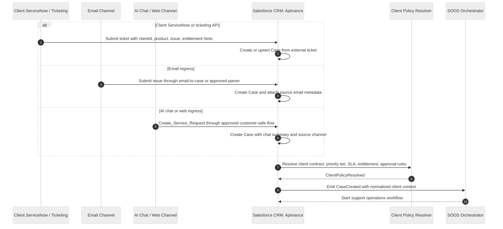

### 2. AI Chat Customer Self-Service Path

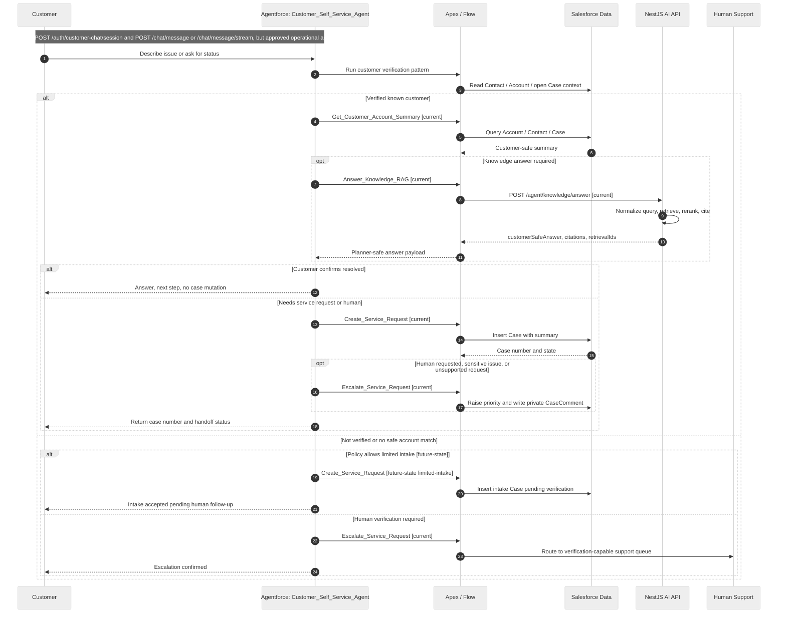

### 3. Internal Support Operations Path

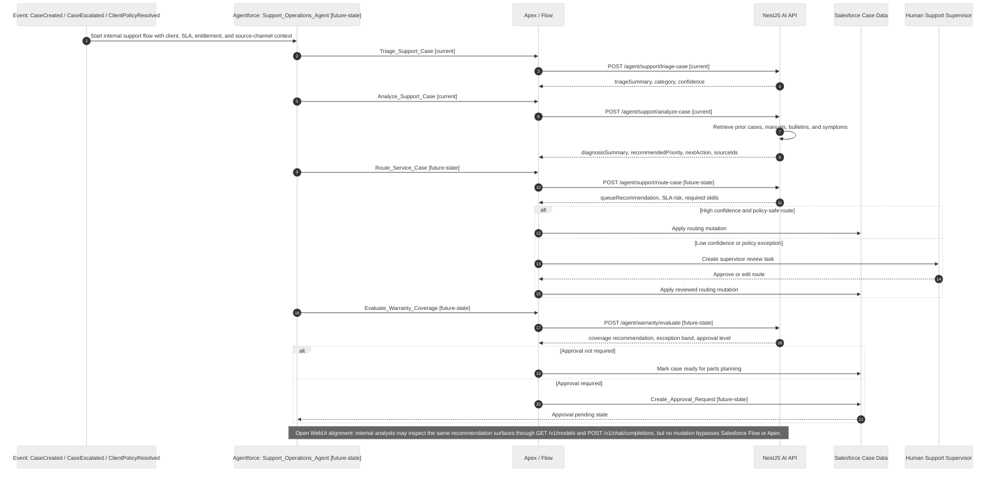

### 4. Field Service Execution Path After Parts Planning

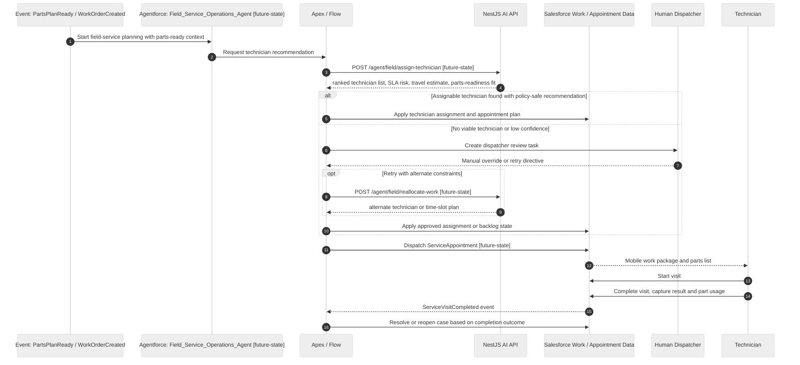

### 5. Inventory, Part Order, And Approval Path Before Field Service

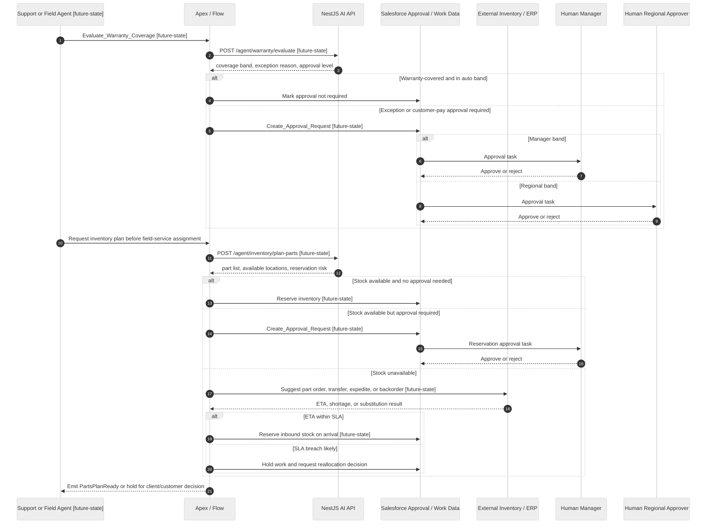

### 6. Quality Intelligence Feedback Path

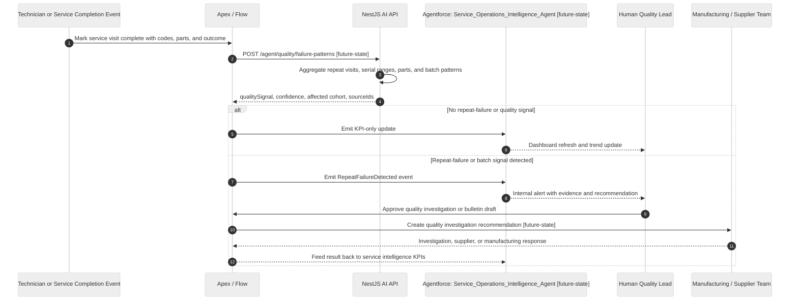

## Lifecycle State Diagrams

### Case Lifecycle

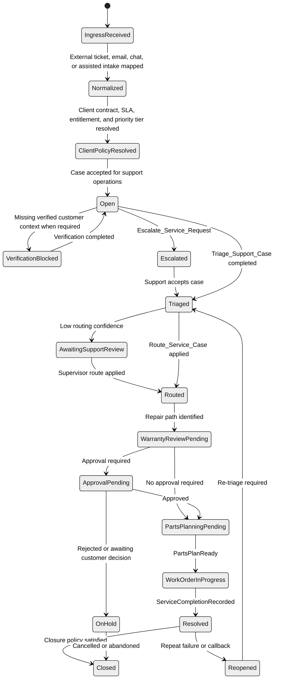

### Work Order Lifecycle

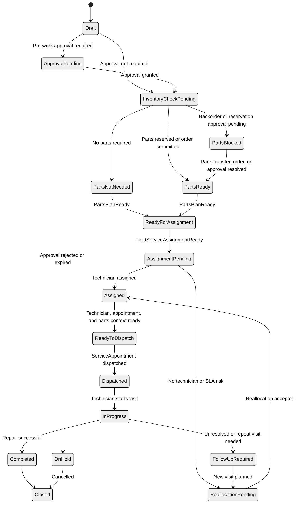

### Approval Lifecycle

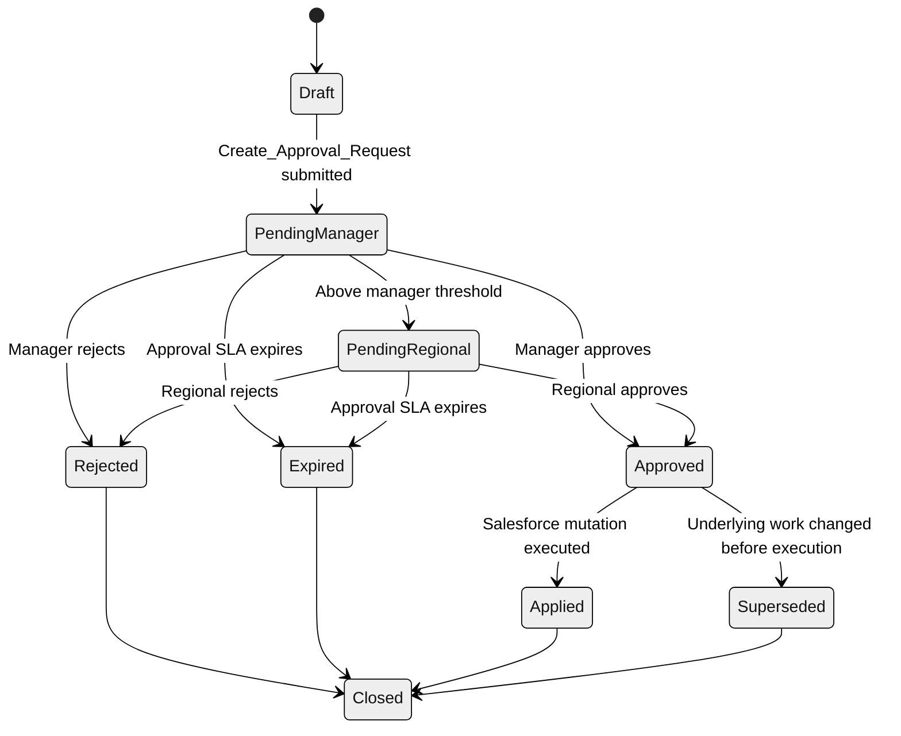

### Inventory Reservation Lifecycle

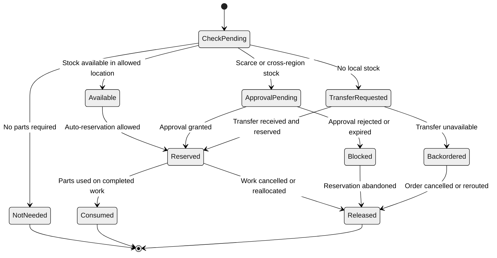

## Invocation Map

| Step  | Trigger                                 | Active agent or service                                  | Invoked tool or function                                                                                       | Owning platform                          | Condition                                                                     | Approval gate                                             | Output                                                           | Resulting state transition                                                     |
| ----- | --------------------------------------- | -------------------------------------------------------- | -------------------------------------------------------------------------------------------------------------- | ---------------------------------------- | ----------------------------------------------------------------------------- | --------------------------------------------------------- | ---------------------------------------------------------------- | ------------------------------------------------------------------------------ |
| `S01` | `ExternalTicketReceived`                | Salesforce case ingress                                  | Client ServiceNow or ticketing API integration `[future-state]`                                                | Salesforce integration layer             | Client portal submits ticket                                                  | None                                                      | Raw source ticket mapped to Case draft                           | `Case: IngressReceived -> Normalized`                                          |
| `S02` | `InboundEmailIssueReceived`             | Salesforce case ingress                                  | Email-to-case or approved email parser `[future-state]`                                                        | Salesforce integration layer             | Client or end user submits issue by email                                     | None                                                      | Email metadata and issue summary                                 | `Case: IngressReceived -> Normalized`                                          |
| `S03` | `AIChatIssueReceived`                   | `Customer_Self_Service_Agent`                            | `POST /auth/customer-chat/session`, `POST /chat/message`, `Create_Service_Request` `[current/future-state]`    | React chat, Agentforce, Apex / Flow      | Customer uses approved AI chat or web channel                                 | Verification required for customer-specific data          | Chat summary and Case number when needed                         | Conversation active or `Case: IngressReceived -> Normalized`                   |
| `S04` | Normalized case                         | Client policy resolver                                   | Client contract, entitlement, priority tier, SLA, escalation, approval, and parts-rule lookup `[future-state]` | Salesforce Flow / Apex                   | Case has client identifier or source-channel mapping                          | Human review if client cannot be resolved                 | `ClientPolicyResolved` event                                     | `Case: Normalized -> ClientPolicyResolved`                                     |
| `S05` | Customer-specific chat action           | `Customer_Self_Service_Agent`                            | Customer verification pattern `[current foundation]`                                                           | Apex / Flow                              | Customer-specific data or mutation is needed                                  | None                                                      | Verified or not-verified status                                  | Verification flag set                                                          |
| `S06` | Verified account or knowledge request   | `Customer_Self_Service_Agent`                            | `Get_Customer_Account_Summary`, `Answer_Knowledge_RAG` `[current]`                                             | Apex -> Salesforce / NestJS AI API       | Customer-safe answer can be grounded from approved data                       | None                                                      | Answer, case/account summary, citations, retrieval IDs           | No mutation or customer-visible answer                                         |
| `S07` | Unresolved issue or escalation          | `Customer_Self_Service_Agent`                            | `Create_Service_Request`, `Escalate_Service_Request` `[current]`                                               | Apex / Salesforce                        | Safe answer is insufficient or human handoff is needed                        | None                                                      | Case number, priority update, private handoff summary            | `Case: ClientPolicyResolved/Open -> Open/Escalated`                            |
| `S08` | `CaseCreated` or `CaseEscalated`        | `Support_Operations_Agent` `[future-state]`              | `Triage_Support_Case` -> `POST /agent/support/triage-case` `[current contract]`                                | Apex -> NestJS AI API                    | Internal support flow begins                                                  | None                                                      | Category, triage summary, confidence                             | `Case: Open/Escalated -> Triaged`                                              |
| `S09` | Triage completed                        | `Support_Operations_Agent` `[future-state]`              | `Analyze_Support_Case` -> `POST /agent/support/analyze-case` `[current contract]`                              | Apex -> NestJS AI API                    | Diagnosis, product, or warranty reasoning is required                         | None                                                      | Diagnosis summary, recommended priority, next action, evidence   | `Case: Triaged` enriched                                                       |
| `S10` | Route recommendation needed             | `Support_Operations_Agent` `[future-state]`              | `POST /agent/support/route-case`, `Route_Service_Case` `[future-state]`                                        | NestJS recommendation plus Apex / Flow   | Queue, skill, priority, or SLA routing decision is needed                     | Supervisor review when confidence is low                  | Queue, owner group, priority, required skill, SLA path           | `Case: Triaged -> Routed`                                                      |
| `S11` | Routed repair candidate                 | `Support_Operations_Agent` `[future-state]`              | `POST /agent/warranty/evaluate`, `Evaluate_Warranty_Coverage` `[future-state]`                                 | NestJS recommendation plus Apex / Flow   | Entitlement, contract, warranty, or exception needs evaluation                | May create approval if outside client auto band           | Coverage result, exception band, required approval level         | `Case: Routed -> WarrantyReviewPending`                                        |
| `S12` | Warranty, cost, or policy exception     | Support or approval flow                                 | `Create_Approval_Request` `[future-state]`                                                                     | Apex / Flow                              | Cost, warranty, discount, or client policy requires review                    | Manager, regional, client-specific, or inventory approver | Approval record and pending state                                | `Case/WorkOrder: * -> ApprovalPending`                                         |
| `S13` | Approval granted or not needed          | `Inventory_Intelligence` capability `[future-state]`     | `POST /agent/inventory/plan-parts` `[future-state]`                                                            | NestJS AI API                            | Repair path needs part suggestion before field assignment                     | None                                                      | Required parts, stock path, substitution, order recommendation   | `Case: WarrantyReviewPending/ApprovalPending -> PartsPlanningPending`          |
| `S14` | Parts available or order path selected  | Inventory or parts-order flow `[future-state]`           | Inventory reservation, transfer, order, or backorder Flow/Apex `[future-state, exact action name pending]`     | Apex / Flow and external inventory / ERP | Part required and client parts rule applies                                   | Inventory approval if scarce, cross-region, or expedited  | Reserved parts, inbound stock commitment, or hold reason         | `Inventory: Available/TransferRequested -> Reserved/Backordered`; `PartsReady` |
| `S15` | `PartsPlanReady`                        | Work-order creation flow `[future-state]`                | Deterministic parts-aware work-order creation Flow or Apex `[future-state, exact action name pending]`         | Apex / Flow                              | Parts path is resolved or no parts are needed                                 | Must wait for required approval or customer decision      | Work order with parts list, reservation/order state, SLA context | `Case: PartsPlanningPending -> WorkOrderInProgress`                            |
| `S16` | `WorkOrderCreated`                      | `Field_Service_Operations_Agent` `[future-state]`        | `POST /agent/field/assign-technician` `[future-state]`                                                         | NestJS AI API                            | Work order is parts-aware and ready for assignment                            | Dispatcher review if low confidence or no viable resource | Ranked technician plan with parts-readiness fit                  | `WorkOrder: ReadyForAssignment -> AssignmentPending`                           |
| `S17` | Assignment recommendation accepted      | `Field_Service_Operations_Agent` `[future-state]`        | Technician assignment Flow or Apex `[future-state, exact action name pending]`                                 | Apex / Flow                              | Technician and slot can be committed                                          | Dispatcher review for overrides                           | Assigned technician and appointment plan                         | `WorkOrder: AssignmentPending -> Assigned`                                     |
| `S18` | No technician, parts delay, or SLA risk | `Field_Service_Operations_Agent` `[future-state]`        | `POST /agent/field/reallocate-work` `[future-state]`                                                           | NestJS AI API                            | Resource or schedule plan is not viable                                       | Dispatcher review for final decision                      | Alternate technician, slot, queue, or customer update plan       | `WorkOrder: AssignmentPending/PartsBlocked -> ReallocationPending`             |
| `S19` | Dispatch ready                          | `Field_Service_Operations_Agent` `[future-state]`        | ServiceAppointment dispatch Flow or Apex `[future-state, exact action name pending]`                           | Apex / Flow                              | Technician assigned and parts path resolved                                   | None                                                      | Dispatched visit and technician work packet                      | `WorkOrder: ReadyToDispatch -> Dispatched`                                     |
| `S20` | `ServiceVisitCompleted`                 | Field-service completion flow `[future-state]`           | Work completion update plus case resolution Flow `[future-state, exact action name pending]`                   | Apex / Flow                              | Technician submits outcome                                                    | None                                                      | Completion status, used parts, resolution code                   | `WorkOrder: InProgress -> Completed`; `Case: WorkOrderInProgress -> Resolved`  |
| `S21` | `ServiceCompletionRecorded`             | `Service_Operations_Intelligence_Agent` `[future-state]` | `POST /agent/quality/failure-patterns` `[future-state]`                                                        | NestJS AI API                            | Closed or completed service event is available for analysis                   | None                                                      | Repeat-failure signal, affected client/product cohort, sources   | `Quality signal: none` or `RepeatFailureDetected` emitted                      |
| `S22` | `RepeatFailureDetected`                 | `Service_Operations_Intelligence_Agent` `[future-state]` | Quality investigation creation Flow or Apex `[future-state, exact action name pending]`                        | Apex / Flow                              | Quality threshold, batch risk, supplier pattern, or client cohort risk is met | Quality-lead approval if formal investigation is required | Investigation recommendation and KPI update                      | `Case/Quality program: alert -> investigation pending`                         |

## Assumptions

- `WorkOrder`, `ServiceAppointment`, and related dispatch objects are assumed to
  be Salesforce Field Service objects or approved custom equivalents. The flow
  shows the authoritative mutation seam, not a package-specific schema.
- Client-owned ServiceNow, email, AI chat, and other ingress channels are shown
  as normalized case sources. Exact integration names and middleware ownership
  are not defined in the current repo.
- Client-specific routing, priority, SLA, approval threshold, and parts-ordering
  rules must be resolved before SOOS recommendations are allowed to drive
  operational actions.
- Exact Salesforce action names already exist for `Get_Customer_Account_Summary`,
  `Create_Service_Request`, `Escalate_Service_Request`,
  `Triage_Support_Case`, `Analyze_Support_Case`, and
  `Answer_Knowledge_RAG`. Exact Salesforce action names for work-order
  creation, technician assignment application, inventory reservation, dispatch,
  and quality investigation are not yet defined in source, so they are shown as
  deterministic Flow or Apex seams.
- The React chat window remains a customer-safe ingress surface through the
  NestJS chat API. It should align to the same approved customer-operational
  contracts and must not bypass Salesforce-owned mutation and approval logic.
- Open WebUI remains an internal observation and experimentation surface through
  the NestJS OpenAI-compatible gateway. It can inspect or summarize internal
  state, but it must not bypass Salesforce actions for routing, approvals,
  inventory reservations, or dispatch.
- Inventory and part-order recommendation intentionally happen before field
  service assignment. The field-service agent receives a parts-aware work
  package rather than discovering part shortages after dispatch planning.
- External inventory, warehouse, ERP, supplier, ServiceNow, or email
  integrations are represented as explicit seams because the canonical source
  and integration contracts are not fully specified in the current repo.
