# SOOS High-Level Event And Agent Responsibility Flow

## Purpose

This document is the upper-layer SOOS view. It only shows:

- where issues or cases enter the system
- which high-level event group is created
- which agent or responsibility layer picks up that event
- what that owner does next

It intentionally does not show Apex, Flow, NestJS route calls, DTOs, callout
contracts, or detailed sequence logic. Those belong in the deeper event-driven
flow design.

## Simple Event-To-Agent Flow

```mermaid
%%{init: {'theme':'neutral'}}%%
flowchart LR
    classDef channel fill:#e3f2fd,stroke:#1565c0,color:#0d47a1;
    classDef platform fill:#f5f5f5,stroke:#616161,color:#212121;
    classDef queue fill:#fff8e1,stroke:#ef6c00,color:#8d4e00;
    classDef agent fill:#e8f5e9,stroke:#2e7d32,color:#1b5e20;
    classDef action fill:#f3e5f5,stroke:#6a1b9a,color:#4a148c;

    API[Client API / ServiceNow]:::channel --> CASE[Salesforce Case Intake]:::platform
    EMAIL[Email]:::channel --> CASE
    OTHER[Other Approved Channel]:::channel --> CASE

    CHAT[AI Chat / Web Channel]:::channel --> CSS[Customer_Self_Service_Agent]:::agent
    CSS --> CSSACT[Verify customer\nAnswer safe questions\nCreate or escalate case when needed]:::action
    CSSACT --> CASE

    CASE --> POLICY[Case Normalization And Client Policy Resolution]:::platform

    POLICY --> Q1{{Case Intake Events\nCaseCreated\nCaseEscalated\nClientPolicyResolved}}:::queue
    Q1 --> SUPPORT[Support_Operations_Agent]:::agent
    SUPPORT --> SACT[Triages case\nAnalyzes issue\nRoutes case\nStarts warranty and approval path]:::action

    SACT --> Q2{{Routing And Readiness Events\nCaseRouted\nWarrantyEvaluated\nApprovalResolved}}:::queue
    Q2 --> INV[Inventory And Parts Planning\ncapability]:::platform
    INV --> IACT[Checks part need\nReserves stock or suggests order\nPrepares parts-ready outcome]:::action

    IACT --> Q3{{Execution Events\nPartsPlanReady\nWorkOrderCreated\nFieldServiceAssignmentReady}}:::queue
    Q3 --> FIELD[Field_Service_Operations_Agent]:::agent
    FIELD --> FACT[Assigns technician\nPlans dispatch\nExecutes visit]:::action

    FACT --> Q4{{Completion Events\nServiceVisitCompleted\nRepeatFailureDetected}}:::queue
    Q4 --> INTEL[Service_Operations_Intelligence_Agent]:::agent
    INTEL --> ILACT[Detects repeat failures\nCreates quality signals\nUpdates service KPIs]:::action
```

## Event Ownership Map

| Event group                   | Picked up by                            | Responsibility                                                                                                     |
| ----------------------------- | --------------------------------------- | ------------------------------------------------------------------------------------------------------------------ |
| `ExternalTicketReceived`      | Salesforce case intake                  | Accept ticket from ServiceNow or another approved API source and create or update the Case.                        |
| `InboundEmailIssueReceived`   | Salesforce case intake                  | Convert inbound email into a normalized Case with source metadata.                                                 |
| `AIChatIssueReceived`         | `Customer_Self_Service_Agent`           | Verify the user when needed, answer safe questions, and create or escalate a Case when self-service is not enough. |
| `CaseCreated`                 | `Support_Operations_Agent`              | Start internal support handling for a new or normalized Case.                                                      |
| `CaseEscalated`               | `Support_Operations_Agent`              | Take over when customer self-service cannot safely complete the request.                                           |
| `ClientPolicyResolved`        | `Support_Operations_Agent`              | Use client tier, SLA, entitlement, and contract rules to guide routing and next action.                            |
| `CaseRouted`                  | Inventory and parts planning capability | Decide whether parts are needed before field-service assignment.                                                   |
| `WarrantyEvaluated`           | Inventory and parts planning capability | Use warranty and approval outcome to decide whether parts planning can proceed.                                    |
| `ApprovalResolved`            | Inventory and parts planning capability | Continue to reservation, transfer, order suggestion, or hold state.                                                |
| `PartsPlanReady`              | `Field_Service_Operations_Agent`        | Plan technician assignment and dispatch using parts-ready context.                                                 |
| `WorkOrderCreated`            | `Field_Service_Operations_Agent`        | Pick up the work package for technician assignment and visit planning.                                             |
| `FieldServiceAssignmentReady` | `Field_Service_Operations_Agent`        | Commit technician assignment and move toward dispatch.                                                             |
| `ServiceVisitCompleted`       | `Service_Operations_Intelligence_Agent` | Review completion outcome, trend signals, and operational KPIs.                                                    |
| `RepeatFailureDetected`       | `Service_Operations_Intelligence_Agent` | Raise quality signals and recommend investigation when patterns repeat.                                            |

## Responsibility Summary

| Owner                                   | Main job in the high-level flow                                                  |
| --------------------------------------- | -------------------------------------------------------------------------------- |
| Salesforce Case Intake                  | Receive issues from API, email, chat handoff, and other approved channels.       |
| Client Policy Resolution                | Resolve client contract, SLA, entitlement, priority, and special handling rules. |
| `Customer_Self_Service_Agent`           | Handle customer-safe chat interactions before internal support takes over.       |
| `Support_Operations_Agent`              | Own the first internal review of the Case and decide what should happen next.    |
| Inventory and Parts Planning capability | Make parts readiness a gate before field-service planning.                       |
| `Field_Service_Operations_Agent`        | Own technician assignment, dispatch planning, and visit execution.               |
| `Service_Operations_Intelligence_Agent` | Own repeat-failure signals, quality intelligence, and service KPI visibility.    |

## Scope Note

The inventory and parts-planning stage is shown as a capability rather than a
separate top-level runtime agent because the current SOOS target model places it
between support operations and field-service execution as a readiness gate.

Use this document as the simple starting view. Use
`10-event-driven-operational-flow-design.md` only when you want the detailed
sequence, state transitions, approvals, and deeper implementation flow.
