# SOOS Agent-To-Agent Handoff Flow

## Purpose

This document shows the simple handoff view between the main SOOS agents and
responsibility layers. It focuses on who takes over next and what kind of
context is handed off.

It intentionally does not show internal service calls, Apex, Flow, or NestJS
execution detail.

## High-Level Handoff Diagram

```mermaid
%%{init: {'theme':'neutral'}}%%
flowchart LR
    classDef channel fill:#e3f2fd,stroke:#1565c0,color:#0d47a1;
    classDef platform fill:#f5f5f5,stroke:#616161,color:#212121;
    classDef agent fill:#e8f5e9,stroke:#2e7d32,color:#1b5e20;
    classDef handoff fill:#fff8e1,stroke:#ef6c00,color:#8d4e00;
    classDef outcome fill:#f3e5f5,stroke:#6a1b9a,color:#4a148c;

    CH[API / Email / AI Chat / Other Channel]:::channel --> INTAKE[Salesforce Case Intake<br/>and Client Policy Resolution]:::platform

    INTAKE --> H1{{Normalized case<br/>client, SLA, contract,<br/>priority, source channel}}:::handoff

    H1 --> CSS[Customer_Self_Service_Agent<br/>when chat is the entry path]:::agent
    H1 --> SUPPORT[Support_Operations_Agent]:::agent

    CSS --> COUT[Verified customer summary<br/>safe answer or escalation context]:::outcome
    COUT --> SUPPORT

    SUPPORT --> H2{{Diagnosis and routing handoff<br/>issue summary, route,<br/>warranty and approval context}}:::handoff
    H2 --> INV[Inventory And Parts Planning<br/>capability]:::platform

    INV --> H3{{Parts readiness handoff<br/>parts needed, reserved,<br/>ordered, blocked, or not needed}}:::handoff
    H3 --> FIELD[Field_Service_Operations_Agent]:::agent

    FIELD --> H4{{Service execution handoff<br/>assignment, dispatch,<br/>visit result, part usage}}:::handoff
    H4 --> INTEL[Service_Operations_Intelligence_Agent]:::agent

    INTEL --> OUT[Quality signals<br/>repeat failures<br/>service KPIs]:::outcome
```

## Handoff Summary

| From                                                | To                                                  | What is handed off                                                                        |
| --------------------------------------------------- | --------------------------------------------------- | ----------------------------------------------------------------------------------------- |
| Channel intake                                      | Salesforce Case Intake and Client Policy Resolution | Raw issue, source channel, external ticket reference, client identifier, product context. |
| Salesforce Case Intake and Client Policy Resolution | `Customer_Self_Service_Agent`                       | Normalized case and customer-safe context when chat remains the active surface.           |
| Salesforce Case Intake and Client Policy Resolution | `Support_Operations_Agent`                          | Case, client tier, SLA, contract, entitlement, priority, and source-channel context.      |
| `Customer_Self_Service_Agent`                       | `Support_Operations_Agent`                          | Verified customer summary, case reason, escalation reason, and safe issue summary.        |
| `Support_Operations_Agent`                          | Inventory and Parts Planning capability             | Diagnosis, route, warranty result, approval state, and repair-readiness context.          |
| Inventory and Parts Planning capability             | `Field_Service_Operations_Agent`                    | Parts-ready, no-parts-needed, reserved, ordered, transfer, or blocked outcome.            |
| `Field_Service_Operations_Agent`                    | `Service_Operations_Intelligence_Agent`             | Visit completion result, parts used, repeat-visit risk, and operational outcome.          |

## Ownership Summary

| Owner                                               | Main responsibility in the handoff chain                                                          |
| --------------------------------------------------- | ------------------------------------------------------------------------------------------------- |
| Salesforce Case Intake and Client Policy Resolution | Normalize the issue into one Case contract and attach client rules before agent work begins.      |
| `Customer_Self_Service_Agent`                       | Handle customer-safe chat interaction and escalate into the internal flow when needed.            |
| `Support_Operations_Agent`                          | Own diagnosis, routing, warranty review, and the decision to begin parts planning.                |
| Inventory and Parts Planning capability             | Convert repair intent into a readiness outcome before field-service planning starts.              |
| `Field_Service_Operations_Agent`                    | Own technician assignment, dispatch planning, and visit execution after parts readiness is known. |
| `Service_Operations_Intelligence_Agent`             | Convert completed work into KPI, repeat-failure, and quality signals.                             |

## Scope Note

Inventory and parts planning is shown as a responsibility layer between support
operations and field-service operations because the current SOOS design treats
parts readiness as a gate before technician assignment and dispatch.
