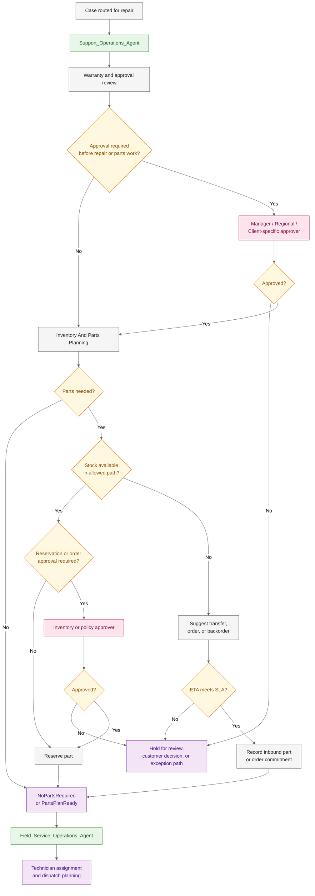

# SOOS Approval And Parts Readiness Flow

## Purpose

This document shows the simple upper-layer flow for approval and parts
readiness before field-service planning begins.

It intentionally leaves out internal implementation detail and focuses only on
the decision stages, the approval path, and the parts-readiness outcome.

## Simple Approval And Parts Readiness Diagram

## Decision Ownership Map

| Stage                             | Primary owner                                             | Main decision                                                            |
| --------------------------------- | --------------------------------------------------------- | ------------------------------------------------------------------------ |
| Warranty and approval review      | `Support_Operations_Agent` plus Salesforce policy         | Can the repair continue immediately, or does it need approval first?     |
| Cost or policy approval           | Human approver                                            | Approve, reject, or hold the repair or parts path.                       |
| Parts planning                    | Inventory and Parts Planning capability                   | Are parts needed for this repair?                                        |
| Availability check                | Inventory and Parts Planning capability                   | Can the part be reserved immediately, or is transfer or ordering needed? |
| Reservation or exception approval | Inventory or policy approver                              | Allow scarce, cross-region, or policy-exception part usage.              |
| ETA decision                      | Inventory and Parts Planning capability plus policy owner | Is the expected part arrival still acceptable for the client SLA?        |
| Field-service readiness           | `Field_Service_Operations_Agent`                          | Start technician assignment only after parts readiness is known.         |

## Outcome Summary

| Outcome           | Meaning                                                                |
| ----------------- | ---------------------------------------------------------------------- |
| `NoPartsRequired` | The repair can proceed without spare parts.                            |
| `PartsPlanReady`  | The parts path is resolved and field-service planning can start.       |
| `Reserved`        | Required stock is available and committed.                             |
| `OrderCommitted`  | Transfer, backorder, or purchase path is accepted and tracked.         |
| `HoldForReview`   | Approval, SLA, customer decision, or policy exception blocks progress. |

## Scope Note

This diagram is intentionally simple. It is the business-decision view of the
approval and parts-readiness stage, not the technical execution view.
